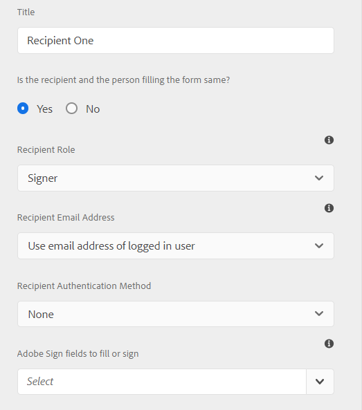

# 使用 [!DNL Adobe Sign] 在適用性表單中 {#using-adobe-sign-in-an-adaptive-form}


>[!NOTE]
>
>在適用性表單中使用Adobe Sign角色的功能於2021年8月的發行前管道提供。 此功能將於2021年9月發行。


[!DNL Adobe Sign] 啟用適用性Forms的電子簽名工作流程。 電子簽名改進了處理法律、銷售、工資、人力資源管理等領域的文檔的工作流。

在 [!DNL Adobe Sign] 和適用性Forms案例中，使用者會填入適用性表單，以申請需要一或多方簽名的服務。 例如，抵押貸款和信用卡申請要求所有借款人和共同申請人簽名。 若要針對類似的情況啟用電子簽名工作流程，您可以整合 [!DNL Adobe Sign] 搭配適用性表單。 您可以使用 [!DNL Adobe Sign] 至：

* 通過完全自動化的計畫書、報價和合同流程從任何設備處理交易。
* 更快完成人力資源流程，並為員工提供數位體驗。
* 縮短合約週期時間，並加快供應商的上線速度。
* 建立可自動化常見流程的數位工作流程。

[!DNL Adobe Sign] 整合 [!DNL AEM Forms] 支援：

* 單一和多使用者簽署工作流程
* 循序和同時簽署工作流程
* 以匿名或登入的使用者身分簽署表單
* 動態簽署程式(與 [!DNL AEM Forms] 工作流程)
* 通過知識庫、電話、社交配置檔案和政府ID進行身份驗證
* 為每個協定收件者指派角色。 Adobe Sign（適用於業務和企業服務級別）可以選擇擴展 [協定收件者的角色](#addsignerstoanadaptiveform).

<!-- * In-form and out-of-form signing experiences -->

## 必備條件 {#prerequisites}

使用前 [!DNL Adobe Sign] 在適用性表單中：

* 確保 [!DNL AEM Forms] as a Cloud Service已設定為使用Adobe Sign。 如需詳細資訊，請參閱 [將Adobe Sign與 [!DNL AEM Forms]](adobe-sign-integration-adaptive-forms.md).
* 保持收件者清單。 您至少需要每個收件者的電子郵件地址。

## 設定 [!DNL Adobe Sign] 適用於適用性表單 {#configure-adobe-sign-for-an-adaptive-form}

配置 [!DNL Adobe Sign] 適用於適用性表單：

1. [啟用 [!DNL Adobe Sign] 適用於適用性表單](#enableadobsignforanadaptiveform)
1. [新增 [!DNL Adobe Sign] 欄位至適用性表單](#addadobesignfieldstoanadaptiveform)
1. [選擇 [!DNL Adobe Sign] Cloud Service適用性表單](#select-adobe-sign-cloud-service-and-signing-order)

1. [新增 [!DNL Adobe Sign] 適用性表單的收件者](#addsignerstoanadaptiveform)
1. [選擇最適化表單的提交動作](#selectsubmitactionforanadaptiveform)


### 啟用 [!DNL Adobe Sign] 適用於適用性表單  {#enableadobesign}

您可以啟用 [!DNL Adobe Sign] 適用於現有適用性表單，或建立 [!DNL Adobe Sign] 啟用適用性表單。 選擇以下選項之一：

* [建立 [!DNL Adobe Sign] 啟用適用性表單](#create-an-adaptive-form-for-adobe-sign)
* [啟用 [!DNL Adobe Sign] 適用於現有適用性表單](#editafsign).

#### 建立適用於Adobe Sign的最適化表單 {#create-an-adaptive-form-for-adobe-sign}

若要建立啟用符號的適用性表單：

1. 導覽至 **[!UICONTROL Adobe Experience Manager]** > **[!UICONTROL Forms]** > **[!UICONTROL Forms與檔案]**.
1. 點選 **[!UICONTROL 建立]** 選取 **[!UICONTROL 適用性表單]**. 此時將顯示模板清單。 選取範本並點選 **[!UICONTROL 下一個]**.
1. 在 **[!UICONTROL 基本]** 標籤：

   1. 指定 **[!UICONTROL 名稱]** 和 **[!UICONTROL 標題]** （適用於適用性表單）。

   1. 選取 [組態容器](adobe-sign-integration-adaptive-forms.md#configure-adobe-sign-with-aem-forms) 建立時間 [整合 [!DNL Adobe Sign] with [!DNL AEM Forms]](adobe-sign-integration-adaptive-forms.md).
   設定容器包含 [!DNL Adobe Sign] Cloud Services已針對您的環境進行設定。 這些服務可在適用性表單編輯器中選取。

1. 在 **[!UICONTROL 表單模型]** 頁簽，選擇以下選項之一：

   * 如果您有自訂表單範本，並需要根據表單範本的記錄檔案，請選取 **[!UICONTROL 將表單模板與記錄文檔模板關聯]** 選項並選擇「記錄文檔」模板。 使用選項時，為簽名而發送的文檔將僅顯示基於關聯表單模板的那些欄位。 它不會顯示最適化表單的所有欄位。

   * 如果您沒有自訂表單範本，請選取 **[!UICONTROL 生成記錄文檔]** 選項。 使用選項時，為簽署而傳送的檔案會顯示最適化表單的所有欄位。

1. 點選 **[!UICONTROL 建立。]** 已建立啟用符號的適用性表單。 您可以新增 [!DNL Adobe Sign] 欄位至表單中，並傳送以供簽署。

#### 啟用 [!DNL Adobe Sign] 適用於適用性表單 {#editafsign}

使用 [!DNL Adobe Sign] 在現有適用性表單中：

1. 導覽至 **[!UICONTROL Adobe Experience Manager]** > **[!UICONTROL Forms]** > **[!UICONTROL Forms與檔案]**.
1. 選取「最適化表單」並點選 **[!UICONTROL 屬性]**.
1. 在 **[!UICONTROL 基本]** 頁簽，選擇 [組態容器](adobe-sign-integration-adaptive-forms.md#configure-adobe-sign-with-aem-forms) 在整合時建立 [!DNL Adobe Sign] with [!DNL AEM Forms].
1. 在 **[!UICONTROL 表單模式]** 頁簽，選擇以下選項之一：

   * 如果您有自訂表單範本，並需要根據表單範本的記錄檔案，請選取 **[!UICONTROL 將表單模板與記錄文檔模板關聯]** 選項並選擇「記錄文檔」模板。 使用選項時，為簽名而發送的文檔將僅顯示基於關聯表單模板的那些欄位。 它不會顯示最適化表單的所有欄位。

   * 如果您沒有自訂表單範本，請選取 **[!UICONTROL 生成記錄文檔]** 選項。 使用選項時，為簽署而傳送的檔案會顯示最適化表單的所有欄位。

1. 點選 **[!UICONTROL 儲存並關閉]**. 適用性表單已啟用 [!DNL Adobe Sign]. 現在，您可以將 [!DNL Adobe Sign] 欄位至表單中，並傳送以供簽署。

### 新增 [!DNL Adobe Sign] 欄位至適用性表單 {#addadobesignfieldstoanadaptiveform}

[!DNL Adobe Sign] 有可放置在最適化表單的各種欄位。 這些欄位接受各種類型的資料，如簽名、縮寫、公司或標題，並幫助在簽名期間收集額外資訊以及簽名。 您可以使用 [!DNL Adobe Sign] 要放置的塊元件 [!DNL Adobe Sign] 適用性表單中不同位置的欄位。

若要新增欄位至適用性表單，並自訂與這些欄位相關的各種選項：

1. 拖放 **[!UICONTROL Adobe Sign區塊]** 元件從元件瀏覽器傳送至適用性表單。 此 [!DNL Adobe Sign] 塊元件支援所有 [!DNL Adobe Sign] 欄位。 依預設，會新增 **[!UICONTROL 簽名]** 欄位至適用性表單。

   

   依預設， [!DNL Adobe Sign] 已發佈的適用性表單中不會顯示區塊。 它只會顯示在簽署檔案中。 您可以變更 [!DNL Adobe Sign] 從 [!DNL Adobe Sign] 阻止元件。

   >[!NOTE]
   >
   >  * 使用 [!DNL Adobe Sign] 塊不是強制使用 [!DNL Adobe Sign] 在適用性表單中。 如果您未使用 [!DNL Adobe Sign] 阻止並添加收件者的欄位，然後預設簽名欄位顯示在簽名文檔的底部。
   >  * 使用 [!DNL Adobe Sign] 僅針對自動產生記錄檔案的適用性Forms封鎖。 如果您使用自訂XDP來產生記錄檔案或表單範本型適用性表單， [!DNL Adobe Sign] 不支援塊。


1. 選取 **[!UICONTROL Adobe Sign區塊]** 元件並點選 **[!UICONTROL 編輯]**  表徵圖。 它顯示添加欄位和格式欄位外觀的選項。

   

   **答：** 選取並新增 [!DNL Adobe Sign] 欄位。 **B.** 展開 [!DNL Adobe Sign] 封鎖至全螢幕檢視

1. 點選 **[!UICONTROL Adobe Sign]** 欄位  表徵圖。 它會顯示選取和新增的選項 [!DNL Adobe Sign] 欄位。

   展開 **[!UICONTROL 類型]** 下拉式欄位以選取 [!DNL Adobe Sign] 欄位並點選「完成」  表徵圖，將所選欄位添加到 [!DNL Adobe Sign] 封鎖。 此 **[!UICONTROL 類型]** 下拉式欄位包含「簽名」、「收件者資訊」和「資料」欄位類型。 [!DNL Adobe Sign] 與AEM整合 [!DNL Forms] 支援欄位中列出 [!UICONTROL 類型] 僅下拉框。 如需 [!DNL Adobe Sign] 欄位，請參閱 [Adobe Sign檔案](https://helpx.adobe.com/sign/help/field-types.html).

   

   必須為欄位提供唯一名稱。 您也可以選取必要選項，將欄位標示為必填欄位。 除了 **[!UICONTROL 名稱]** 和 **[!UICONTROL 必填]** 選項，部分 [!DNL Adobe Sign] 欄位有更多選項。 例如，遮色片和多行。 此外，請為每個 [!DNL Adobe Sign] 欄位，欄位是位於相同還是不同 [!DNL Adobe Sign] 區塊。

   如果您選取 **[!UICONTROL 數位簽名]** 從下拉式清單中，您可以將數位簽名套用至適用性表單：

   * 線上使用雲簽名來使用 [數位識別碼](https://helpx.adobe.com/sign/kb/digital-certificate-providers.html) 由信任服務提供商托管。
   * 使用智慧卡、USB代號或檔案式數位ID下載含Adobe Acrobat或Reader的檔案，即可在本機下載。

### 啟用 [!DNL Adobe Sign] 適用於適用性表單 {#enableadobsignforanadaptiveform}

現成可用， [!DNL Adobe Sign] 未針對適用性表單啟用。 若要啟用：

1. 在內容瀏覽器中，點選 **[!UICONTROL 表單容器]**，然後點選 **[!UICONTROL 設定]**  表徵圖。 它會開啟屬性瀏覽器並顯示適用性表單容器屬性。
1. 在屬性瀏覽器中，展開 **[!UICONTROL 電子簽名]** 折疊式功能表，然後選取 **[!UICONTROL 啟用Adobe Sign]** 選項。 它可讓 [!DNL Adobe Sign] （適用於適用性表單）。

### 選擇 [!DNL Adobe Sign] Cloud Service和簽署順序 {#select-adobe-sign-cloud-service-and-signing-order}

您可以設定多個 [!DNL Adobe Sign] AEM例項的服務 [!DNL Forms]. 建議為每個職能（人力資源、財務等）分別提供一套服務。 它讓追蹤和報告已簽署的檔案更輕鬆。 例如，銀行有多個部門。 您可以為每個部門分別設定以更好地跟蹤文檔。

一個文檔還可以有多個收件者。 例如，信用卡申請可以有多個申請人。 銀行在開始處理申請前要求所有申請人簽名。 對於多接收方方案，您可以選擇按順序或同時順序簽名文檔。

要選擇Cloud Service和簽名順序：


1. 在內容瀏覽器中，點選 **[!UICONTROL 表單容器]**，然後點選 **[!UICONTROL 設定]**  表徵圖。 它會開啟屬性瀏覽器並顯示適用性表單容器屬性。
1. 在屬性瀏覽器中，展開 **[!UICONTROL 電子簽名]** 折疊式功能表，然後選取 **[!UICONTROL 啟用Adobe Sign]** 選項。 它可讓 [!DNL Adobe Sign] （適用於適用性表單）。
1. 從已設定的 [!DNL Adobe Sign] Cloud Services。

   若 **[!UICONTROL Adobe Sign Cloud Service]** 清單空白，請遵循 [設定 [!DNL Adobe Sign] with [!DNL AEM Forms]](adobe-sign-integration-adaptive-forms.md) 設定服務的文章。

   下拉式清單會列出 `global` 「工具」> **[!UICONTROL Cloud Services]** > **[!UICONTROL Adobe Sign]**. 此外，下拉式清單也會列出您在 **[!UICONTROL 組態容器]** 欄位。

1. 從 **[!UICONTROL 收件者可以完成]** 對話框。 收件者可簽署最適化表單 **[!UICONTROL 循序]**  — 一個接一個的收件者，或 **[!UICONTROL 同時]**  — 無論如何。

   依序，一位收件者一次會收到Adobe Sign合約。 收件者完成指派的動作後，會將合約傳送給下一個收件者，以此類推。

   同時，所有收件者都會收到Adobe Sign協定，且可以彼此並行採取行動。

1. 使用「協定ID」欄位將綁定與協定ID(agreementId)關聯。 它會將「協定ID」新增至結構表單提交資料的afBoundData區段。 所有啟用Adobe Sign的表單，已提交資料中的afSubmissionInfo區段也會新增合約ID。 您可以使用合約ID來使用自訂程式碼來追蹤合約狀態（需要自訂實作）。

1. [將收件者新增至最適化表單](working-with-adobe-sign.md#addsignerstoanadaptiveform) 並點選「完成」  圖示以儲存變更。

### 將收件者新增至最適化表單 {#addsignerstoanadaptiveform}

您可以有一或多個Adobe Sign合約的收件者。 新增收件者時，您也可以為收件者設定驗證詳細資訊，並選取表單填入者和收件者是否為同一人。 執行下列步驟來新增及提供收件者的各種詳細資訊：

1. 在內容瀏覽器中，點選 **[!UICONTROL 表單容器]**，然後點選 **[!UICONTROL 設定]**  表徵圖。 它會開啟屬性瀏覽器，其中包含適用性表單容器屬性。
1. 在屬性瀏覽器中，展開 **[!UICONTROL 電子簽名]** 折疊式功能表，然後選取 **[!UICONTROL 啟用Adobe Sign]** 選項。 它可讓 [!DNL Adobe Sign] （適用於適用性表單）。
1. 點選 **[!UICONTROL 新增收件者]**. 它會將收件者新增至最適化表單。 您可以將多個收件者新增至適用性表單。 所有收件者都會收到提交最適化表單的Adobe Sign協定。
   

1. 按一下 **[!UICONTROL 編輯]**  圖示，以指定收件者的下列資訊：

   * **[!UICONTROL 標題]:** 指定標題以唯一識別收件者。

   * **[!UICONTROL 收件者和填表人是否相同?]:** 選擇 **[!UICONTROL 是]**，如果表單填入者與第一位收件者是同一人。 <!-- If the option is set to **No,** then do not use the signature step component in the Adaptive Form. If the form contains a Signature Step component, then the field is automatically set to Yes. -->

   * **[!UICONTROL 收件者角色]:** 選取收件者的角色。 Adobe Sign（適用於業務和企業服務級別）可以選擇擴展 [協定收件者的角色](https://helpx.adobe.com/sign/using/set-up-signer-approver-roles.html)，除了 **簽署者**，以更符合其工作流程需求。

   * **[!UICONTROL 收件者電子郵件地址]:** 指定收件者的電子郵件地址。 收件者會收到指定電子郵件地址的Adobe Sign合約。 您可以選擇使用表單欄位中提供的電子郵件地址、登入使用者的Experience Manager使用者設定檔，或手動輸入電子郵件地址。 這是必要的步驟。

      >[!NOTE]
      >
      >請確定第一個收件者或唯一收件者（如果有單一收件者）的電子郵件地址與 [!DNL Adobe Sign] 用來設定AEM雲端服務的帳戶。

   * **[!UICONTROL 收件者驗證方法]:** 指定在開啟Adobe Sign協定前驗證收件者的方法。 您可以在電話、知識庫、社交身分驗證和 [政府ID](https://helpx.adobe.com/sign/using/adobesign-authentication-government-id.html).
   >[!NOTE]
   >
   >    * 依預設，社交身分驗證提供使用Facebook、Google和LinkedIn進行驗證的選項。 您可以聯絡 [!DNL Adobe Sign] 支援以啟用其他社交驗證提供者。


   * **[!DNL Adobe Sign]要填寫或簽名的欄位：** 選擇 [!DNL Adobe Sign] 收件者的欄位。 適用性表單可以有多個 [!DNL Adobe Sign] 欄位。 您可以選擇為收件者啟用特定欄位。 欄位會顯示所有可用 [!DNL Adobe Sign] 封鎖。 選取區塊時，會選取區塊的所有欄位。 您可以使用X圖示來取消選取欄位。

   

   上圖有兩個範例 [!DNL Adobe Sign] 區塊：個人資訊和辦公室詳細資訊

   點選  表徵圖。 收件者隨即新增。

### 選擇最適化表單的提交動作 {#selectsubmitactionforanadaptiveform}

在您之後，新增 [!DNL Adobe Sign] 欄位至適用性表單，啟用 [!DNL Adobe Sign] 從表單容器中，選擇 [!DNL Adobe Sign] Cloud Service，並新增Adobe Sign合約收件者，為適用性表單選取適當的提交動作。 如需適用性Forms提交動作的詳細資訊，請參閱 [設定提交動作](configuring-submit-actions.md).

簽署和提交表單是相互獨立的。 使用者提交表單後，當建立Adobe Sign合約時，就會立即提交最適化表單。 [!DNL AEM Forms] as a Cloud Service不會等待收件者簽署或完成其他動作以提交最適化表單。 當使用者按一下「提交」按鈕或「摘要」步驟時，表單即會提交。

此外， [!DNL Adobe Sign] 啟用適用性表單會內嵌Adobe Sign合約ID以提交資料。 您可以使用合約ID來使用自訂程式碼來追蹤合約狀態（需要自訂實作）。

Adobe Sign協定ID(agreementId)包含在適用性表單的提交資料中。 依預設，協定ID會顯示在 `afSubmissionInfo` 已提交資料的節點。

```xml
   <?xml version="1.0" encoding="UTF-8"?>
   <afData>
      <afUnboundData>
         <data>
            <textbox1613455050902>ff</textbox1613455050902>
         </data>
      </afUnboundData>
      <afBoundData>
         <data xmlns:xfa="http://www.xfa.org/schema/xfa-data/1.0/" />
      </afBoundData>
      <afSubmissionInfo>
         <lastFocusItem>guide[0].guide1[0].guideRootPanel[0].textbox1613455050902[0]</lastFocusItem>
         <stateOverrides />
         <signers>
            <signer0>
               <email />
            </signer0>
         </signers>
         <afPath>/content/dam/formsanddocuments/testsign</afPath>
         <afSubmissionTime>20210311031009</afSubmissionTime>
         <agreementId>xxxxxxxxxxxxxxxxxxxxxxxxxxxxxxxxxxxxxxxxxxxxx</agreementId>
      </afSubmissionInfo>
   </afData>
```

（可選）您也可以將綁定器與協定ID(agreementId)關聯。 它會將協定ID新增至已提交資料的afBoundData區段。 例如，在下列提交的資料中，合約ID系結至 `<userName>` 節點：

```xml
      <?xml version="1.0" encoding="UTF-8"?>
      <afData>
         <afUnboundData>
            <data />
         </afUnboundData>
         <afBoundData>
            <config xmlns:xfa="http://www.xfa.org/schema/xfa-data/1.0/" xmlns:xsi="http://www.w3.org/2001/XMLSchema-instance">
               <agreementID>3AAABLblqZhC2MWu7GFauKh45j_t2ih8mAtmbdIcNSl1HgQubhMJfDaDfylyN7NQiYRam_44ISKm45enIOafHqWZrdaxShf9r</agreementID>
               <dateOfBirth>0001-01-01</dateOfBirth>
            </config>
         </afBoundData>
         <afSubmissionInfo>
            <lastFocusItem>guide[0].guide1[0].guideRootPanel[0].projectDetails[0]</lastFocusItem>
            <stateOverrides />
            <signers>
               <signer0>
                  <email />
               </signer0>
            </signers>
            <afPath>/content/dam/formsanddocuments/testathon2021-1/gaurav/xsd-based</afPath>
            <afSubmissionTime>20210311095211</afSubmissionTime>
            <agreementId>xxxxxxxxxxxxxxxxxxxxxxxxxxxxxxxxxxxxxxxxxxxx</agreementId>
         </afSubmissionInfo>
      </afData>
```

<!-- Remove when forms portal goes live
>[!NOTE]
>
>Data of the Adaptive Form is stored temporarily on Forms Portal. It is recommended to use [custom storage for Forms Portal](/help/forms/using/configuring-draft-submission-storage.md). It ensures that the PII (personally identifiable information) data is not stored on AEM servers. 
-->

您的表單簽署體驗已就緒。 您可以預覽表單以驗證簽署體驗。 在已發佈的表格上， [!DNL Adobe Sign] 收件者收到透過電子郵件簽署的表單時，會顯示區塊欄位。 當 **[!UICONTROL 收件者與填寫表單的人員何時相同？]** 選項會標示為「是」且符合條件，提交後系統會將使用者重新導向至Adobe Sign合約，且使用者可以立即簽署檔案，而不需等待合約出現在電子郵件中。

## 為適用性表單設定雲端簽名 {#configure-cloud-signatures-for-an-adaptive-form}

雲端數位簽名或遠程簽名是新一代的數字簽名，可跨案頭、移動和Web工作，並滿足最高級別的合規性和接收者身份驗證保證。 您可以使用雲端數位簽名來簽署適用性表單。

之後 [編輯適用性表單屬性Adobe Sign](working-with-adobe-sign.md#enableadobesign)，請執行下列步驟，將雲端簽名欄位新增至最適化表單：

1. 拖放 **[!UICONTROL Adobe Sign區塊]** 元件從元件瀏覽器傳送至適用性表單。 此 [!UICONTROL Adobe Sign區塊] 元件包含所有支援的 [!DNL Adobe Sign] 欄位。 依預設，會新增 **[!UICONTROL 簽名]** 欄位至適用性表單。

   

1. 選取 **[!UICONTROL Adobe Sign區塊]** 元件並點選 **[!UICONTROL 編輯]**  表徵圖。 它顯示添加欄位和格式欄位外觀的選項。

   

   **答：** 選取並新增 [!DNL Adobe Sign] 欄位。 **B.** 展開 [!DNL Adobe Sign] 封鎖至全螢幕檢視

1. 點選 **[!UICONTROL Adobe Sign欄位]**  表徵圖。 它會顯示選取和新增的選項 [!DNL Adobe Sign] 欄位。

   展開 **[!UICONTROL 類型]** 要選擇的下拉欄位 **[!UICONTROL 數位簽名]** 然後點選 **[!UICONTROL 完成]** 表徵圖，將所選欄位添加到 [!DNL Adobe Sign] 封鎖。

   

   必須為欄位提供唯一名稱。

   使用下列方式將數位簽名套用至適用性表單：

   * 雲簽名：使用 [數位識別碼](https://helpx.adobe.com/sign/kb/digital-certificate-providers.html) 由信任服務提供商托管。
   * Adobe Acrobat或Reader:下載並開啟包含Adobe Acrobat或Reader的檔案，以使用智慧卡、USB令牌或基於檔案的數字ID進行簽名。

   將雲端簽名欄位新增至適用性表單後，請執行下列步驟以完成設定程式：

   * [啟用適用性表單的Adobe Sign](#enableadobsignforanadaptiveform)
   * [為適用性表單選取Adobe Sign Cloud Service](#selectadobesigncloudserviceforanadaptiveform)
   * [將收件者新增至最適化表單](#addsignerstoanadaptiveform)
   * [選擇最適化表單的提交動作](#selectsubmitactionforanadaptiveform)


### 設定感謝頁面或摘要步驟元件 {#configure-the-thank-you-page-or-summary-step-component}

此 **[!UICONTROL 摘要步驟]** 元件會自動提交表單、填入自訂「摘要」頁面中的資訊，並顯示已提交表單的摘要。 摘要步驟元件會取用表單可用的全寬度。 建議在包含摘要步驟元件的區段上不要有任何其他元件。

## 常見問題 {#frequently-asked-questions}

**問：** 您可以將適用性表單嵌入另一個適用性表單。 內嵌的最適化表單是否為 [!DNL Adobe Sign] 已啟用？
**答：** 否，Experience Manager Forms不支援使用內嵌於 [!DNL Adobe Sign] 啟用適用性表單以進行簽署

**問：** 當我使用進階範本建立適用性表單並開啟它進行編輯時，會出現「電子簽名或收件者未正確設定」錯誤訊息。 框。 如何解決錯誤訊息？
**答：** 使用進階範本建立的適用性表單已設定為使用 [!DNL Adobe Sign]. 若要解決錯誤，請建立並選取 [!DNL Adobe Sign] 雲端設定和設定 [!DNL Adobe Sign] 適用性表單的收件者。

**問：** 我可以使用 [!DNL Adobe Sign] 在最適化表單的靜態文字元件中加上文字標籤？
**答：** 是，您可以在文字元件中使用文字標籤來新增 [!DNL Adobe Sign] 欄位至「記錄檔案」（僅限「自動產生的記錄檔案」選項）已啟用「適用性表單」。 若要了解建立文字標籤的程式和規則，請參閱 [Adobe Sign檔案](https://helpx.adobe.com/sign/using/text-tag.html). 另請注意，適用性Forms對文字標籤的支援有限。 您可以使用文字標籤來僅建立那些 [Adobe Sign區塊](working-with-adobe-sign.md#configure-cloud-signatures-for-an-adaptive-form) 支援。

## 疑難排解 {#troubleshoot}

### [!DNL Adobe Sign] 協定失敗 {#adobe-sign-agreement-failures}

**問題**
當 [!DNL Adobe Sign] 為適用性表單設定服務，服務無法建立 [!DNL Adobe Sign] 基礎適用性表單的合約。

**解析度**

* 檢查 [配置Adobe Sign Cloud Service](adobe-sign-integration-adaptive-forms.md) 用於適用性表單。
* 確認API應用程式位於 [!DNL Adobe Sign] 用於配置的伺服器 [!DNL Adobe Sign] Cloud Service具有必要權限。
* 如果您使用多個 [!DNL Adobe Sign] Cloud Services，指向 **[!UICONTROL oAuth URL]** 所有服務都一樣 **[!UICONTROL Adobe Sign·沙德]**.

* 使用個別電子郵件地址進行設定 [!DNL Adobe Sign] 帳戶和第一個或單一收件者。 第一個收件者或唯一收件者（如果有單一收件者）的電子郵件地址不能與 [!DNL Adobe Sign] 用來設定AEM雲端服務的帳戶。

## 相關文章 {#related-articles}

* [整合 [!DNL Adobe Sign] with [!DNL AEM Forms]](adobe-sign-integration-adaptive-forms.md)
* [使用的最佳實務 [!DNL Adobe Sign] 搭配適用性Forms](https://medium.com/adobetech/using-adobe-sign-to-e-sign-an-adaptive-form-heres-the-best-way-to-do-it-dc3e15f9b684)
