# 產生變化版本 {#generate-variations}


>[!NOTE]
>
>建議存取[整合至 AEM 編輯器中的產生變化版本](/help/generative-ai/generate-variations-integrated-editor.md)，因為本頁面所描述的版本未來將棄用。

如果您正在尋找一種將數位管道最佳化並加速內容建立的方法，您可以使用「產生變化版本」。「產生變化版本」使用生成式人工智慧 (AI)，根據提示來建立內容變化版本；這些提示是由 Adobe 提供，或由使用者建立和管理。建立變化版本後，您可以在網站上使用這些內容，也可以使用 [Edge Delivery Services](/help/edge/overview.md) 的「[實驗](https://www.aem.live/docs/experimentation)」功能來衡量其是否成功。

您可從以下來源[存取「產生變化版本」](#access-generate-variations)：

* [在 Adobe Experience Manager (AEM) as a Cloud Service 中](#access-aemaacs)
* [AEM Edge Delivery Services 的 Sidekick](#access-aem-sidekick)
* [在內容片段編輯器中](/help/sites-cloud/administering/content-fragments/authoring.md#generate-variations-ai)

>[!NOTE]
>
>在所有情況下，若要使用「產生變化版本」，您必須確保符合[存取權先決條件](#access-prerequisites)。

然後，您可以：

* [開始使用](#get-started) Adobe 為特定使用案例建立的提示範本。
* 您可以[編輯現有提示](#edit-the-prompt)
* 或是[建立並使用您自己的提示](#create-prompt)：
   * [儲存您的提示](#save-prompt)供未來使用
   * 在整個組織內[存取和使用共用提示](#select-prompt)
* 在[產生個人化的客群特定內容](#generate-copy)時，定義要在提示中使用的[客群](#audiences)區段。
* 如有必要，請在進行修正及調整結果前預覽輸出和提示。
* 使用 [Adobe Express 根據副本變化版本產生影像](#generate-image)；這會使用 Firefly 的生成式 AI 功能。
* 選取您想要在網站或實驗中使用的內容。

## 法律和使用備註 {#legal-usage-note}

AEM 的生成式 AI 和「產生變化版本」是強大的工具，但&#x200B;**您**&#x200B;必須對輸出的用途負責。

您對服務的輸入應與情境相關聯。此情境可以是您的品牌化素材、網站內容、資料、此類資料的結構描述、範本，或其他受信任的文件。

您必須根據使用案例來評估輸出的準確性。

在使用「產生變化版本」之前，您必須同意 [Adobe 生成式 AI 使用者準則](https://www.adobe.com/tw/legal/licenses-terms/adobe-dx-gen-ai-user-guidelines.html)。

[「產生變化版本」的使用](#generative-action-usage)與生成動作的消耗緊密相關。

## 概觀 {#overview}

開啟「產生變化版本」(並展開左側面板) 時，您會看到：

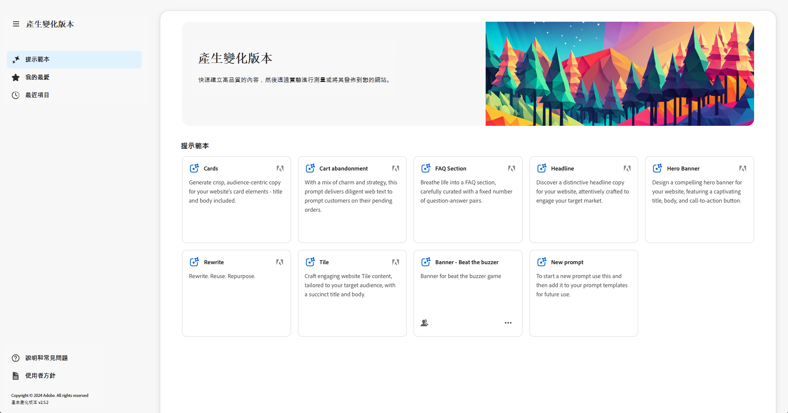

* 右側面板
   * 這取決於您在左側導覽中做的選擇。
   * 預設情況下會顯示&#x200B;**提示範本**。
* 左側導覽
   * 在「**產生變化版本**」的左側，有一個選項 (三明治選單) 可用來展開或隱藏左側導覽面板。
   * **提示範本**：
      * 會顯示各種提示的連結；可能會包含以下類型的提示：
         * 由 Adobe 提供的提示，可協助您產生內容；標有 Adobe 圖示。
         * 您自己建立的提示。
         * 在您的 IMS 組織內建立的提示；標有顯示多個頭的圖示。
      * 包含用於建立您自有提示的[新提示](#create-prompt)連結。
      * 您可以&#x200B;**刪除**&#x200B;您自己建立的提示或在您的 IMS 組織內建立的提示。這可以透過相應卡片上的橢圓形所存取的選單來完成。
   * [我的最愛](#favorites)：顯示您標記為「我的最愛」的前幾次產生結果。
   * [最近項目](#recents)：提供您最近使用過的提示及其輸入的連結。
   * **說明與常見問題**：文件的連結，包含常見問題。
   * **使用者準則**：法律準則的連結。

## 開始使用 {#get-started}

介面會引導您完成生成內容的過程。開啟介面後，第一步是選取您要使用的提示。

### 選取提示 {#select-prompt}

從主面板中，您可以選取：

* Adobe 提供的提示範本，以開始產生內容；
* [新提示](#create-prompt)，以建立您自己的提示；
* 您已建立之僅供您使用的範本，
* 您或貴組織中的某人已建立的範本。

區分方法：

* Adobe 提供的提示標有 Adobe 圖示
* 整個 IMS 組織中可用的提示標有多頭圖示。
* 您的私人提示沒有特定標記。

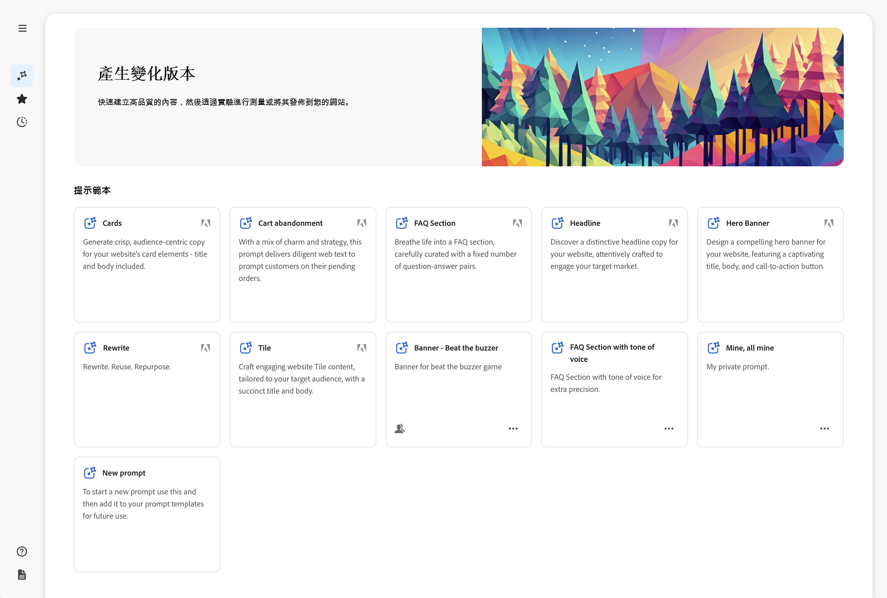

### 提供輸入 {#provide-inputs}

每個提示都需要您提供特定資訊，使其能夠從生成式 AI 中獲得適當的內容。

輸入欄位會引導您了解所需的資訊。為了提供協助，某些欄位會有預設值，您可以使用它或視需要進行修改，還會有說明要求的描述。

有幾個重要輸入欄位在多項提示中是共通的 (某些欄位不一定都可使用)：

* **計數**/**數量**
   * 您可以選取要在一次產生中建立多少個內容變化版本。
   * 依提示而定，這可能會有不同標籤之一；例如計數、變化版本數量、概念數量等等。
* **客群來源**/**目標客群**
   * 幫助針對特定客群產生個人化內容。
   * Adobe 會提供預設客群；您也可以指定其他客群；請參閱[客群](#audiences)。
* **其他內容**
   * 插入相關內容，協助生成式 AI 根據輸入製作更好的回應。例如，如果您正在為特定頁面或產品建立網頁橫幅，建議您包含有關該頁面/產品的資訊。
* **溫度**
用來修改 Adobe 生成式 AI 的溫度：
   * 溫度較高時會偏離提示，並產生更多變化版本、隨機性和創造力。
   * 溫度較低時會較具確定性，且會保持貼近提示中的內容。
   * 預設情況下，溫度設定為 1。如果產生的結果不符合您的喜好，您可以實驗不同的溫度。
* **編輯提示**
   * 基礎[提示可以編輯](#edit-the-prompt)，藉此調整產生的結果。

### 產生副本 {#generate-copy}

填寫輸入欄位和/或修改提示後，您就準備好產生內容並檢閱回應。

選取「**產生**」可查看生成式 AI 產生的回應。產生的內容變化版本會顯示在產生它們的提示下方。

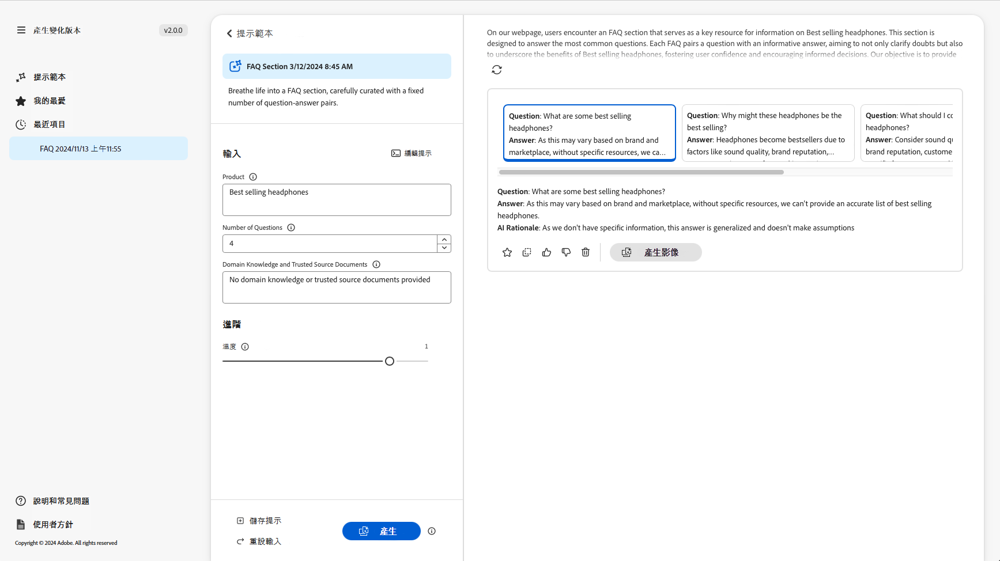

>[!NOTE]
>
>大多數的 Adobe 提示範本都會在變化版本回應中包括 **AI 原理**。這樣會讓生成式 AI 產生特定變化版本的原因透明化。

選取單一變化版本時，您可以執行以下動作：

* **我的最愛**
   * 標記為&#x200B;**我的最愛**&#x200B;以供未來使用 (會顯示在「[我的最愛](#favorites)」中)。
* 按讚/不滿意
   * 使用按讚/不滿意指標來告知 Adobe 回應的品質如何。
* **複製**
   * 複製到剪貼簿，以便在網站上製作內容時使用，或在[實驗](https://www.aem.live/docs/experimentation)中使用。
* **移除**

如果您需要調整輸入或提示，可以進行調整並再次選取「**產生**」，即可取得一組新的回應。新的提示與回應會顯示在初始提示與回應的下方；您可以上下捲動以檢視各種不同的內容組合。

每組變化版本的上方是建立它們的提示，以及「**重複使用**」選項。如果您需要重新執行提示及其輸入，請選取「**重複使用**」，在「**輸入**」中將其重新載入。

### 產生影像 {#generate-image}

產生文字變化版本後，您可以使用 Firefly 的生成式 AI 功能在 Adobe Express 中產生影像。

>[!NOTE]
>
>只有在您屬於 IMS 組織且擁有 Adobe Express 權限，並已在 Admin Console 中授予存取權給您時，您才能使用「**產生影像**」功能。

選取一個變化版本，然後選取「**產生影像**」，直接在 [Adobe Express](https://www.adobe.com/tw/express/) 中開啟「**以文字建立影像**」。該提示是根據您選取的變化版本而預先填入，並根據該提示自動產生影像。


您可以進行進一步變更：

* 透過說明您想看到的內容，[在 Adobe Express 中撰寫您自己的提示](https://helpx.adobe.com/tw/firefly/using/tips-and-tricks.html)；
* 調整「**以文字建立影像**」選項；
* 然後&#x200B;**重新整理**&#x200B;產生的影像。

您也可以選取「**探索更多**」來尋求更多可能性。

完成後，選取所需的影像並選取「**儲存**」，將 Adobe Express 關閉。此時影像會回傳，並與變化版本一併儲存。

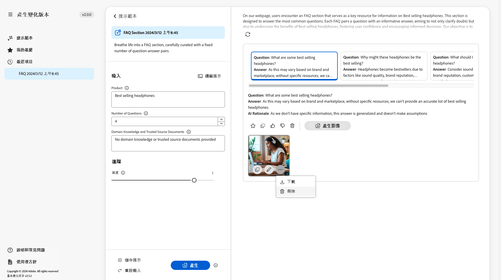

在此處，您可以將滑鼠移至影像上以顯示下列動作項目：

* **複製**：[將影像複製到剪貼簿，以便在其他地方使用](#use-content)
* **編輯**：開啟 Adobe Express，以便對影像進行變更
* **下載**：將影像下載到本機電腦
* **刪除**：將影像從變化版本中移除

>[!NOTE]
>
>[內容憑證](https://helpx.adobe.com/tw/creative-cloud/help/content-credentials.html)用於文件型製作時不會保留。

### 使用內容 {#use-content}

若要使用以生成式 AI 產生的內容，您必須將內容複製到剪貼簿，以便在其他地方使用。

使用複製圖示進即可行複製：

* 對於文字：使用在變化版本面板上顯示的複製圖示
* 對於影像：將滑鼠移至影像上即可看到複製圖示

複製到剪貼簿後，您可以貼上資訊，以便在製作網站內容時使用。您也可以執行[實驗](https://www.aem.live/docs/experimentation)。

## 我的最愛 {#favorites}

檢閱內容後，您可以將選取的變化版本儲存為我的最愛。

儲存後，它們會顯示在左側導覽的「**我的最愛**」下方。「我的最愛」內容會保留 (直到您&#x200B;**刪除**&#x200B;它們或清除瀏覽器快取)。

* 您可以將「我的最愛」和變化版本複製/貼上到剪貼簿，以便在網站內容中使用。
* 可以&#x200B;**移除**「我的最愛」。

## 最近項目 {#recents}

此區段會提供您最近活動的連結。選取「**產生**」後，會新增「**最近**」項目。該項目具有提示的名稱和時間戳記。如果您選取一個連結，它就會載入提示、適當地填寫輸入欄位，並顯示產生的變化版本。

## 編輯提示 {#edit-the-prompt}

基礎提示可以編輯。您可能會在以下情況加以編輯：

* 如果您取得之產生的結果需要進一步調整
* 您想要修改並[儲存提示](#save-prompt)以供未來使用

選取「**編輯提示**」：

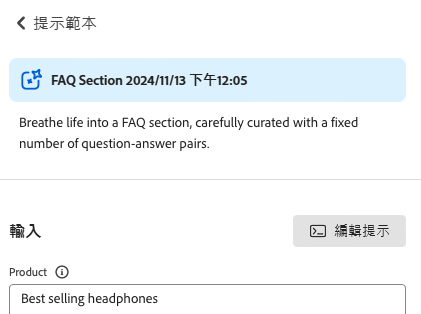

這樣會開啟提示編輯器，您可以在其中進行變更：

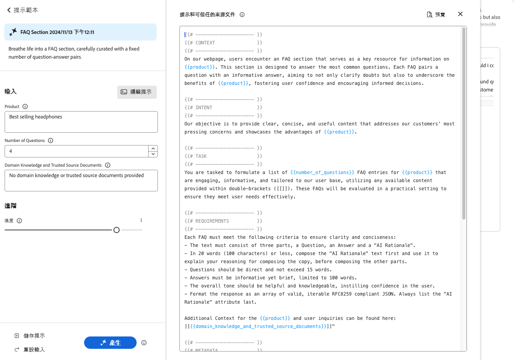

### 新增提示輸入 {#add-prompt-inputs}

建立或編輯提示時，您可能需要新增輸入欄位。輸入欄位可作為提示中的變數，並提供能在各種場景中使用相同提示的靈活性。這些欄位可讓使用者定義提示的特定元素，而無需編寫整個提示。

* 欄位是用雙捲曲括號 `{{ }}` 括住預留位置名稱來定義。
例如 `{{tone_of_voice}}`。

  >[!NOTE]
  >
  >雙捲曲括號之間不得有空格。

* 它也會定義在 `METADATA` 下方，且具有以下參數：
   * `label`
   * `description`
   * `default`
   * `type`

#### 範例：新增文字欄位 -「語氣」 {#example-add-new-text-field-tone-of-voice}

若要新增標題為&#x200B;**語氣**&#x200B;的文字欄位，請在提示中使用以下語法：

```prompt
{{@tone_of_voice, 
  label="Tone of voice",
  description="Indicate the desired tone of voice",
  default="optimistic, smart, engaging, human, and creative",
  type=text
}}
```

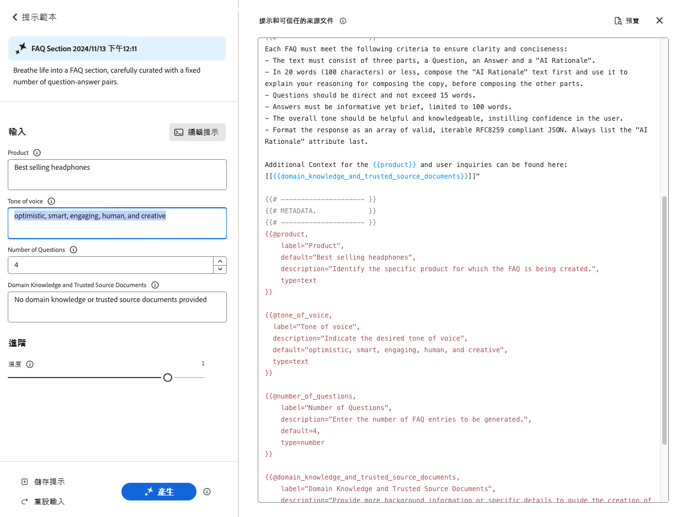

<!--
#### Example: Add new dropdown field - Page Type {#example-add-new-dropdown-field-page-type}

To create an input field Page Type providing a dropdown selection:

1. Create a spreadsheet named `pagetype.xls` in the top-level directory of your folder structure.
1. Edit the spreadsheet:

   1. Create two columns: **Key** and **Value**.
   1. In the **Key** column, enter labels that will appear in the dropdown.
   1. In the **Value** column, describe the key value so the generative AI has context.

1. In your prompt, refer to the title of the spreadsheet along with the appropriate type. 

   ```prompt
   {{@page_type, 
     label="Page Type",
     description="Describes the type of page",
     spreadsheet=pagetype
   }}
   ```
-->

## 建立提示 {#create-prompt}

您從「**提示範本**」中選取「**新提示**」時，新的面板會允許您輸入新提示。接著，您就可以指定這些內容和「**溫度**」，藉此&#x200B;**產生**&#x200B;內容。

請參閱[儲存提示](#save-prompt)以了解儲存提示供未來使用的詳細資訊。

請參閱[新增提示輸入](#add-prompt-inputs)以了解有關新增您自己的提示輸入的詳細資訊。

如果您想在使用者介面中，以及在複製並貼上到文件型製作流程中保留格式，請在提示中包含以下內容：

<!-- CHECK - are the double-quotes needed? -->

* `"Format the response as an array of valid, iterable RFC8259 compliant JSON"`

下圖呈現了這樣做的優勢：

* 在第一個範例中，`Title` 和 `Description` 組合在一起
* 而在第二個範例中，它們是個別進行格式化：透過在提示中包含 JSON 請求來完成。

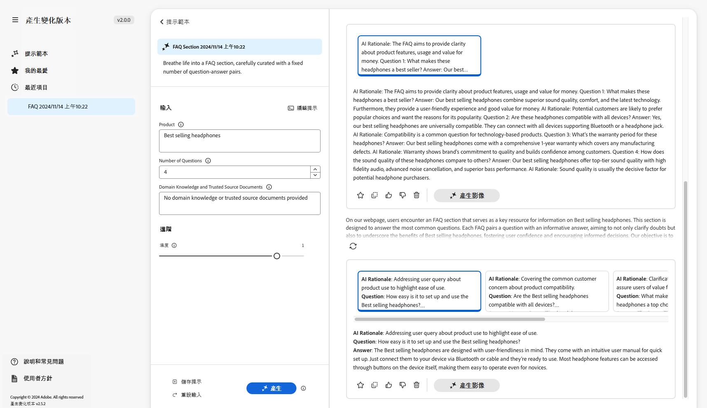

## 儲存提示 {#save-prompt}

編輯或建立提示後，您可能會希望將它們儲存起來以供未來使用；讓您的 IMS 組織或您自己使用。已儲存的提示會以&#x200B;**提示範本**&#x200B;卡片的方式呈現。

您編輯提示後，「輸入」區段底部會提供「**儲存**」選項，在「**產生**」的左邊。

選取後會開啟「**儲存提示**」對話框：

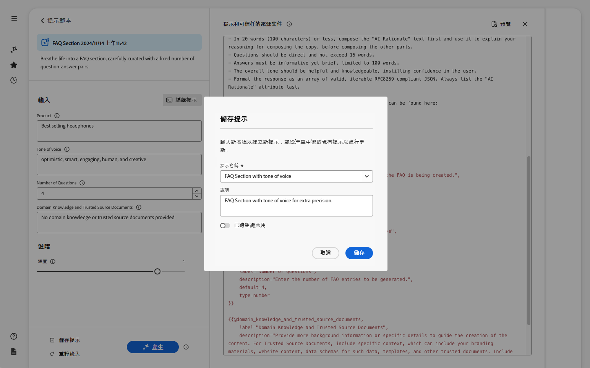

1. 新增唯一的&#x200B;**提示名稱**；這是用來在「**提示範本**」中識別提示。
   1. 新的且唯一的名稱會建立新的提示範本。
   1. 現有名稱會覆寫該提示；此時會顯示一則訊息。
1. 您可選擇是否要新增說明。
1. 視提示是否應為您私有或可在您的 IMS 組織中使用，啟用或停用「**跨組織共用**」選項。此狀態會顯示在[提示範本中顯示的結果卡片內](#select-prompt)。
1. **儲存**&#x200B;提示或&#x200B;**取消**&#x200B;動作。

>[!NOTE]
>
>如果您要覆寫/更新現有提示，系統會傳送通知給您 (警告)。

>[!NOTE]
>
>從「**提示範本**」中，您可以刪除您自己或在 IMS 組織內建立的提示 (使用透過橢圓形存取的選單)。

## 客群 {#audiences}

若要產生個人化內容，生成式 AI 必須了解客群。Adobe 提供了許多預設客群，您也可以新增自己的客群。

新增客群時，應使用自然語言來說明客群。例如：

* 若要建立客群：
   * `Student`
* 您可能會說：
   * `The audience consists of students, typically individuals who are pursuing education at various academic levels, such as primary, secondary, or tertiary education. They are engaged in learning and acquiring knowledge in diverse subjects, seeking academic growth, and preparing for future careers or personal development.`

支援兩種客群來源：

* [Adobe Target](#audience-adobe-target)
* [CSV 檔案](#audience-csv-file)

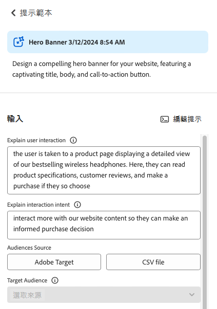

### 客群 - Adobe Target {#audience-adobe-target}

在提示中選取一個 **Adobe Target** 客群，可產生針對該客群的個人化內容。

>[!NOTE]
>
>若要使用此選項，您的 IMS 組織必須具有 Adobe Target 存取權。

1. 選取「**Adobe Target**」。
1. 然後從提供的清單中選取所需的&#x200B;**目標客群**。

   >[!NOTE]
   >
   >若要使用 **Adobe Target** 的客群，必須填寫說明欄位。若未填寫，客群會在下拉式清單中顯示為無法使用。若要新增說明，請前往 Target 並[新增客群說明](https://experienceleague.adobe.com/zh-hant/docs/target-learn/tutorials/audiences/create-audiences)。

   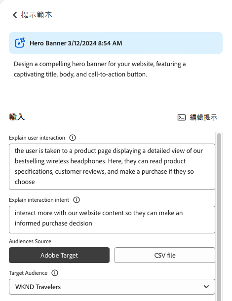

#### 新增 Adobe Target 客群 {#add-adobe-target-audience}

若要在 Adobe Target 中建立客群，請參閱[建立客群](https://experienceleague.adobe.com/zh-hant/docs/target-learn/tutorials/audiences/create-audiences)。

### 客群 - CSV 檔案 {#audience-csv-file}

在提示中選取一個 **CSV 檔案**&#x200B;客群可產生針對所選&#x200B;**目標客群**&#x200B;進行個人化的內容。

Adobe 提供許多客群可供使用。

1. 選取「**CSV 檔案**」。
1. 然後從提供的清單中選取所需的&#x200B;**目標客群**。

   

#### 新增客群 CSV 檔案 {#add-audience-csv-file}

您可以從各種平台 (例如 Google 雲端硬碟、DropBox、Sharepoint) 新增 CSV 檔案，這些平台能夠在檔案公開可用後提供該檔案的 URL。

>[!NOTE]
>
>在共用平台中，您&#x200B;*必須*&#x200B;具備使該檔案能公開存取的能力。

例如，若要從 Google 雲端硬碟上的檔案中新增客群：

1. 在 Google 雲端硬碟中，建立一個有兩欄的試算表檔案：
   1. 第一欄會顯示在下拉式清單中。
   1. 第二欄則是客群說明。
1. 發佈檔案：
   1. 檔案 -> 共用 -> 發佈到網路 -> CSV
1. 將 URL 複製到已發佈的檔案。
1. 前往「產生變化版本」。
1. 開啟提示編輯器。
1. 在中繼資料中找到 **Adobe Target** 客群，然後取代 URL。

   >[!NOTE]
   >
   >確保 URL 兩端保留雙引號 (&quot;)。

   例如：

   

## 生成式動作的使用 {#generative-action-usage}

使用量管理取決於所採取的動作：

* 產生變化版本

  產生一個副本變體就等於一次生成式動作。身為客戶，您的 AEM 授權已附帶一定數量的生成式動作。基本權益次數使用完畢後，您可以購買額外的動作次數。

  >[!NOTE]
  >
  >如需有關基本權益的其他詳細資訊，請參閱 [Adobe Experience Manager：Cloud Service | 產品說明](https://helpx.adobe.com/tw/legal/product-descriptions/aem-cloud-service.html)；如果您想購買更多生成式動作，請與您的客戶團隊聯絡。

* Adobe Express

  影像產生使用是透過 Adobe Express 權益及[生成式點數](https://helpx.adobe.com/tw/firefly/using/generative-credits-faq.html)來處理。

## 存取產生變化版本 {#access-generate-variations}

滿足先決條件後，您可以從 AEM as a Cloud Service 或 Edge Delivery Services 的 Sidekick 存取「產生變化版本」。

### 存取的先決條件 {#access-prerequisites}

若要使用「產生變化版本」，必須確保符合先決條件：

* [存取包含 Edge Delivery Services 的 Experience Manager as a Cloud Service](#access-to-aemaacs-with-edge-delivery-services)

#### 存取包含 Edge Delivery Services 的 Experience Manager as a Cloud Service{#access-to-aemaacs-with-edge-delivery-services}

需要存取「產生變化版本」的使用者，必須有權使用包含 Edge Delivery Services 的 Experience Manager as a Cloud Service 環境。

>[!NOTE]
>
>如果您的 AEM Sites as a Cloud Service 合約未包含 Edge Delivery Services，就需要簽署新合約才能獲得存取權。
>
>您應與客戶團隊聯絡，討論如何移轉至包含 Edge Delivery Services 的 AEM Sites as a Cloud Service。

若要授予存取權給特定使用者，請將他們的使用者帳戶指派至相應的產品設定檔。如需其他詳細資訊，請參閱[指派 AEM 產品設定檔](/help/journey-onboarding/assign-profiles-cloud-manager.md)。

### 從 AEM as a Cloud Service 存取 {#access-aemaacs}

您可以從 AEM as a Cloud Service 的[導覽面板](/help/sites-cloud/authoring/basic-handling.md#navigation-panel)存取「產生變化版本」：


### 從 AEM Sidekick 存取 {#access-aem-sidekick}

在您可以從 (Edge Delivery Services 的) Sidekick 存取「產生變化版本」之前，需要進行一些設定。

1. 請參閱文件：[安裝 AEM Sidekick](https://www.aem.live/docs/sidekick-extension)，以了解如何安裝和設定 Sidekick。

1. 若要在 (Edge Delivery Services 的) Sidekick 中使用「產生變化版本」，請在 Edge Delivery Services 專案中納入以下設定：

   * `tools/sidekick/config.json`

   必須將其合併到您現有的設定中，然後進行部署。

   例如：

   ```prompt
   {
     // ...
     "plugins": [
       // ...
       {
         "id": "generate-variations",
         "title": "Generate Variations",
         "url": "https://experience.adobe.com/aem/generate-variations",
         "passConfig": true,
         "environments": ["preview","live", "edit"],
         "includePaths": ["**.docx**"]
       }
       // ...
     ]
   }
   ```

1. 然後，您可能需要確保使用者能夠[存取具有 Edge Delivery Services 的 Experience Manager as a Cloud Service](#access-to-aemaacs-with-edge-delivery-services)。

1. 接著，您可以從 Sidekick 工具列中選取「**產生變化版本**」來存取該功能：

   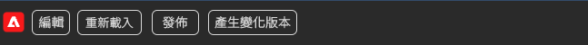

## 更多資訊 {#further-information}

如需詳細資訊，您也可以閱讀：

* [GitHub 上的 GenAI 產生變化版本](https://github.com/adobe/aem-genai-assistant#setting-up-aem-genai-assistant)
* [Edge Delivery Services 實驗](https://www.aem.live/docs/experimentation)
* [AEM as a Cloud Service 中的生成式 AI](/help/ai-in-aem/overview.md#generative-ai-in-aem)

## 常見問題 {#faqs}

### 格式化輸出 {#formatted-outpu}

**產生的回應並未提供我需要的格式化輸出。我該如何修改格式？例如：我需要一個標題和一個副標題，但是回應內只有標題**

1. 在編輯模式下開啟實際提示。
1. 前往要求。
1. 您會看到有關該輸出的要求。
   1. 例如：「文字必須由三個部分組成：標題、正文及按鈕標籤。」或是「將回應格式化為具有『標題』、『正文』和『按鈕標籤』屬性的有效物件 JSON 陣列。」
1. 將要求修改為符合您的需求。

   >[!NOTE]
   >
   >如果您對所輸入的新輸出有單字數/字元數限制，請建立要求。

   例如：「標題文字不得超過 10 個單字或 50 個字元，包含空格。」
1. 儲存提示以供未來使用。

### 回應的長度 {#length-of-response}

**產生的回應太長或太短。如何變更長度？**

1. 在編輯模式下開啟實際提示。
1. 前往要求。
1. 您會發現，每個輸出都有相應的單字數/字元限制。
   1. 例如：「標題文字不得超過 10 個單字或 50 個字元，包含空格。」
1. 將要求修改為符合您的需求。
1. 儲存提示以供未來使用。

### 改善回應 {#improve-responses}

**我得到的回應並不完全是我想要的。如何能夠改善它們？**

1. 試著變更「進階」設定下方的「溫度」。
   1. 溫度較高時會偏離提示，並產生更多變化版本、隨機性和創造力。
   1. 溫度較低時會較具確定性，且會保持貼近提示中的內容。
1. 在編輯模式下開啟實際提示並檢閱提示。請特別注意說明語氣和其他重要標準的要求區段。

### 提示中的註解 {#comments-in-prompt}

**如何在提示中使用註解？**

提示中的註解功能可用來納入不屬於實際輸出之一部分的備註、解釋或指示。這些註解會封裝在特定的語法中：它們會以雙捲曲括號開始和結束，並以雜湊開頭 (例如 `{{# Comment Here }}`)。註解有助於闡明提示的結構或意圖，但不會影響產生的回應。

### 尋找共用的提示 {#find-a-shared-prompt}

**如果我找不到別人共用的提示範本，該怎麼辦？**

在這種情況下，需要檢查多項細節：

1. 使用適合您環境的 URL。
例如 https://experience.adobe.com/#/aem/generate-variations
1. 確保所選的 IMS 組織正確無誤。
1. 確認該提示已儲存為共用。

### v2.0.0 中的自訂提示 {#custom-prompts-v200}

**在 v.2.0.0 中，我的自訂提示消失了，該怎麼辦？**

移轉到 v2.0.0 版本會導致自訂提示範本中斷，因此無法使用這些範本。

若要獲取這些範本：

1. 前往 Sharepoint 中的提示範本資料夾。
1. 複製提示。
1. 開啟「產生變化版本」應用程式。
1. 選取新提示卡片。
1. 貼上提示。
1. 驗證提示是否有效。
1. 儲存該提示。

## 發行歷史記錄 {#release-history}

有關目前和先前版本的詳細資訊，請參閱[產生變化版本的發行說明](/help/generative-ai/release-notes-generate-variations.md)
