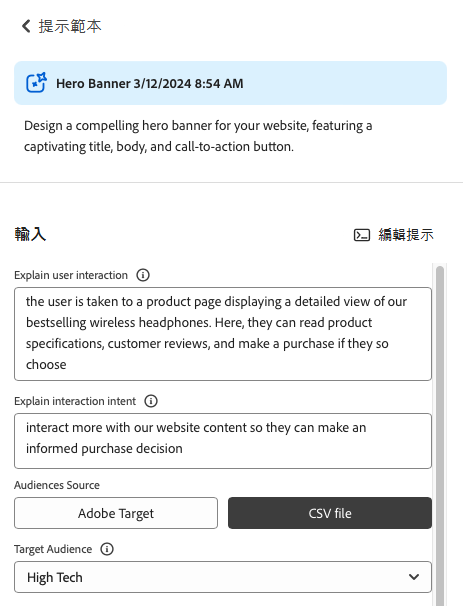

# 產生變化版本 {#generate-variations}

如果您正在尋找最佳化數位頻道和加速內容建立的方法，則可以使用「產生變化」。 「產生變化」會使用產生式人工智慧(AI)根據提示建立內容變化；這些提示是由Adobe提供，或由使用者建立和管理。 建立變化後，您可以在網站上使用該內容，也可以使用[Edge Delivery Services](/help/edge/overview.md)的[實驗](https://www.aem.live/docs/experimentation)功能來測量其成功。

您可以[存取產生變數](#access-generate-variations)，來源為：

* [在Adobe Experience Manager (AEM)as a Cloud Service中](#access-aemaacs)
* [AEMEdge Delivery Services的Sidekick](#access-aem-sidekick)
* [在內容片段編輯器內](/help/sites-cloud/administering/content-fragments/authoring.md#generate-variations-ai)

>[!NOTE]
>
>在所有情況下，若要使用「產生變化」，您必須確保符合[存取必要條件](#access-prerequisites)。

然後，您可以：

* [使用Adobe針對特定使用案例建立的提示範本開始](#get-started)。
* 您可以[編輯現有的提示](#edit-the-prompt)
* 或[建立並使用您自己的提示](#create-prompt)：
   * [儲存您的提示](#save-prompt)以供將來使用
   * [存取並使用來自您整個組織的共用提示](#select-prompt)
* 定義[產生個人化對象特定內容](#generate-copy)時提示中使用的[對象](#audiences)區段。
* 在進行修正並視需要調整結果之前，先預覽輸出與提示。
* 使用[Adobe Express根據複製變化產生影像](#generate-image)；這會使用Firefly的產生AI功能。
* 選取您要在網站上或實驗中使用的內容。

## 法律與使用注意事項 {#legal-usage-note}

AEM的Generative AI和Generate Variations是強大的工具，但&#x200B;**您**&#x200B;負責使用輸出。

您對服務的輸入應繫結至內容。 此內容可以是您的品牌推廣材料、網站內容、資料、此類資料的結構描述、範本或其他受信任檔案。

您必須根據使用案例評估任何輸出的精確度。

使用「產生變化」之前，您必須同意[Adobe產生AI使用者准則](https://www.adobe.com/legal/licenses-terms/adobe-dx-gen-ai-user-guidelines.html)。

[產生變數的使用](#generative-action-usage)繫結到產生動作的使用。

## 概觀 {#overview}

開啟「產生變數」 （並展開左側面板）時，您會看到：


* 右側面板
   * 這取決於您在左側導覽中所做的選取。
   * 預設會顯示&#x200B;**提示範本**。
* 左側導覽
   * 在&#x200B;**產生變化**&#x200B;的左側，有選項（三明治功能表）可展開或隱藏左側導覽面板。
   * **提示範本**：
      * 顯示各種提示的連結；這些可以包含提示：
         * 由Adobe提供，協助您產生內容；以Adobe圖示標幟。
         * 自行建立。
         * 在您的IMS組織內建立；以顯示多個標題的圖示標籤。
      * 包含建立您自己的提示的[新提示](#create-prompt)連結。
      * 您可以&#x200B;**刪除自己或IMS組織內建立的**&#x200B;提示。 這是使用透過適當卡片上的橢圓存取的選單完成的。
   * [我的最愛](#favorites)：顯示您標示為我的最愛的前幾代結果。
   * [最近](#recents)：提供您最近使用的提示及其輸入的連結。
   * **說明與常見問題集**：檔案連結，包括常見問題集。
   * **使用者指南**：法律指南的連結。

## 開始使用 {#get-started}

介面會引導您完成產生內容的程式。 開啟介面後，第一步是選取您要使用的提示。

### 選取提示 {#select-prompt}

從主面板中，您可以選取：

* 由Adobe提供的提示範本以開始產生內容，
* [新提示](#create-prompt)以建立您自己的提示，
* 您建立僅供您使用的範本，
* 您或您組織中的某人已建立的範本。

若要加以區分：

* Adobe提供的提示會以Adobe圖示標籤
* 您IMS組織中可用的提示會以多標題圖示標籤。
* 未特別標籤您的私人提示。


### 提供輸入 {#provide-inputs}

每個提示都需要您提供特定資訊，以便能夠從generative AI取得適當的內容。

輸入欄位會引導您瞭解所需的資訊。 為了提供協助，某些欄位具有預設值，您可以視需要使用或修改，以及說明需求的說明。

有多個提示共用的鍵輸入欄位（某些欄位並不一定都可用）：

* **的**&#x200B;計數/**的**&#x200B;數目
   * 您可以選取想要在一代中建立多少內容變體。
   * 根據提示，這可能有各種標籤之一；例如Count、Number of Variations、Number of Ideas等。
* **對象Source**/**目標對象**
   * 協助為特定對象產生個人化內容。
   * Adobe提供預設對象；或者您可以指定其他對象；請參閱[對象](#audiences)。
* **其他內容**
   * 插入相關內容，協助Generative AI根據輸入製作更好的回應。 例如，如果您要為特定頁面或產品建立網頁橫幅，您可能想要包含頁面/產品的相關資訊。
* **溫度**
用於修改Adobe生成AI的溫度：
   * 溫度越高會偏離提示，導致更多變化、隨機性和創造性。
   * 較低的溫度更具決定性，且更接近提示中的內容。
   * 依預設，溫度會設為1。 如果產生的結果不符合您的喜好，您可以使用不同的溫度進行實驗。
* **編輯提示**
   * 可以編輯基礎[提示](#edit-the-prompt)以調整產生的結果。

### 產生副本 {#generate-copy}

填寫輸入欄位和/或修改提示後，您就可以產生內容並檢閱回應。

選取&#x200B;**產生**&#x200B;以檢視產生AI產生的回應。 產生的內容變化會顯示在產生這些變化的提示下。


>[!NOTE]
>
>大多數Adobe提示範本在變數回應中包含&#x200B;**AI原理**。 如此一來，產生式AI產生該特定變數的原因就變得透明。

選取單一變數時，可使用下列動作：

* **我的最愛**
   * 標示為&#x200B;**我的最愛**&#x200B;以供未來使用（將顯示在[我的最愛](#favorites)）。
* 豎起大拇指/豎下大拇指
   * 使用拇指上/下指示器通知Adobe回應的品質。
* **複製**
   * 複製到剪貼簿，以便在網站上或[實驗](https://www.aem.live/docs/experimentation)中編寫內容時使用。
* **移除**

如果您需要調整輸入或提示，您可以進行調整，然後再次選取&#x200B;**產生**&#x200B;以取得一組新回應。 新的提示和回應會顯示在初始提示和回應下方；您可以上下捲動來檢視各種內容集。

每組變數上方是建立變數的提示，以及&#x200B;**重複使用**&#x200B;選項。 如果您需要重新執行包含其輸入的提示，請選取&#x200B;**重複使用**&#x200B;以在&#x200B;**輸入**&#x200B;中重新載入它們。

### 產生影像 {#generate-image}

產生文字變化後，您可以使用Firefly的Generative AI功能產生Adobe Express影像。

>[!NOTE]
>
>**產生影像**&#x200B;僅當您在IMS組織中擁有Adobe Express權利，並在Admin Console中授予您存取權時才可使用。

選取變數，然後選取&#x200B;**產生影像**，以在[Adobe Express](https://www.adobe.com/express/)中直接開啟&#x200B;**影像文字**。 提示會根據您的變體選擇預先填入，而影像會根據該提示自動產生。


您可以進行進一步的變更：

* [在Adobe Express](https://helpx.adobe.com/firefly/using/tips-and-tricks.html)中寫下您想要看到的提示，
* 調整&#x200B;**文字至影像**&#x200B;選項，
* 然後&#x200B;**重新整理**&#x200B;產生的影像。

您也可以使用&#x200B;**探索更多**&#x200B;以獲得更多可能性。

完成時，選取所需的影像，然後&#x200B;**儲存**&#x200B;以關閉Adobe Express。 影像會傳回並與變數一起儲存。


您可以將滑鼠移至影像上以顯示下列專案的動作專案：

* **複製**： [將影像複製到剪貼簿以用於其他地方](#use-content)
* **編輯**：開啟Adobe Express以便您可以變更影像
* **下載**：將影像下載到您的本機電腦
* **刪除**：從變化中移除影像

>[!NOTE]
>
>[Content credentials](https://helpx.adobe.com/creative-cloud/help/content-credentials.html)在檔案式編寫中使用時不會持續存在。

### 使用內容 {#use-content}

若要使用產生AI所產生的內容，您必須將內容複製到剪貼簿以供其他位置使用。

您可以使用復製圖示完成此操作：

* 針對文字：使用可在變化面板上看到的復製圖示
* 針對影像：將滑鼠移至影像上可檢視復製圖示

將資訊複製到剪貼簿後，您就可以貼上資訊，以便在為網站製作內容時使用。 您也可以執行[實驗](https://www.aem.live/docs/experimentation)。

## 我的最愛 {#favorites}

檢閱內容後，您可以將選取的變數儲存為我的最愛。

儲存後，它們會顯示在左側導覽的&#x200B;**我的最愛**&#x200B;下。 我的最愛會持續存在（直到您&#x200B;**刪除**&#x200B;它們，或清除瀏覽器快取）。

* 我的最愛和變異可以複製/貼到剪貼簿中，以用於您的網站內容。
* 我的最愛可以是&#x200B;**已移除**。

## 最近項目 {#recents}

本節提供您最近活動的連結。 在您選取&#x200B;**產生**&#x200B;之後，會新增&#x200B;**最近**&#x200B;專案。 它具有提示的名稱和時間戳記。 如果您選取連結，連結會載入提示、適當填入輸入欄位，並顯示產生的變數。

## 編輯提示 {#edit-the-prompt}

可以編輯基礎提示。 您可以執行下列動作：

* 如果您要取得的產生結果需要進一步細分
* 您想要修改並[儲存提示](#save-prompt)以供日後使用

選取&#x200B;**編輯提示**：


這會開啟提示編輯器，您可以在其中進行變更：


### 新增提示輸入 {#add-prompt-inputs}

建立或編輯提示時，您可能想要新增輸入欄位。 輸入欄位在提示中作為變數，並提供彈性以便在各種情況下使用相同的提示。 它們可讓使用者定義提示的特定元素，而無需編寫整個提示。

* 定義欄位時，會使用雙大括弧`{{ }}`括住預留位置名稱。
例如，`{{tone_of_voice}}`。

  >[!NOTE]
  >
  >雙大括弧之間不允許有空格。

* 它也在`METADATA`下定義，包含下列引數：
   * `label`
   * `description`
   * `default`
   * `type`

#### 範例：新增文字欄位 — 語調 {#example-add-new-text-field-tone-of-voice}

若要新增標題為&#x200B;**語音音調**&#x200B;的新文字欄位，請在提示中使用下列語法：

```prompt
{{@tone_of_voice, 
  label="Tone of voice",
  description="Indicate the desired tone of voice",
  default="optimistic, smart, engaging, human, and creative",
  type=text
}}
```


<!--
#### Example: Add new dropdown field - Page Type {#example-add-new-dropdown-field-page-type}

To create an input field Page Type providing a dropdown selection:

1. Create a spreadsheet named `pagetype.xls` in the top-level directory of your folder structure.
1. Edit the spreadsheet:

   1. Create two columns: **Key** and **Value**.
   1. In the **Key** column, enter labels that will appear in the dropdown.
   1. In the **Value** column, describe the key value so the generative AI has context.

1. In your prompt, refer to the title of the spreadsheet along with the appropriate type. 

   ```prompt
   {{@page_type, 
     label="Page Type",
     description="Describes the type of page",
     spreadsheet=pagetype
   }}
   ```
-->

## 建立提示 {#create-prompt}

當您從&#x200B;**提示範本**&#x200B;選取&#x200B;**新提示**&#x200B;時，新面板將允許您輸入新提示。 然後，您可以將這些專案與&#x200B;**溫度**&#x200B;一起指定給&#x200B;**產生**&#x200B;內容。

請參閱[儲存提示](#save-prompt)，以取得儲存提示以供未來使用的詳細資訊。

請參閱[新增提示輸入](#add-prompt-inputs)，以取得新增您自己的提示輸入的詳細資訊。

如果您想要在UI中保留格式，以及在複製並貼到檔案型編寫流程中時，請在提示中納入以下內容：

<!-- CHECK - are the double-quotes needed? -->

* `"Format the response as an array of valid, iterable RFC8259 compliant JSON"`

下圖顯示這樣做的優點：

* 在第一個範例中，`Title`和`Description`是結合的
* 在第二個範例中，則是分別設定其格式：做法是在提示中加入JSON要求。


## 儲存提示 {#save-prompt}

編輯或建立提示後，您可能想要儲存這些提示，以供日後使用；針對您的IMS組織或您自己。 儲存的提示將顯示為&#x200B;**提示範本**&#x200B;卡片。

當您編輯提示時，**儲存**&#x200B;選項可在&#x200B;**產生**&#x200B;左側的[輸入]區段底部使用。

選取後，**儲存提示**&#x200B;對話方塊會開啟：


1. 新增唯一的&#x200B;**提示名稱**；用於識別&#x200B;**提示範本**&#x200B;中的提示。
   1. 新的唯一名稱會建立新的提示範本。
   1. 現有的名稱會覆寫該提示；會顯示訊息。
1. 選擇性地新增說明。
1. 視提示是否為您私人，或是否可供您的IMS組織使用而定，啟用或停用選項&#x200B;**在組織間共用**。 此狀態顯示在「提示範本」](#select-prompt)中顯示的[結果卡中。
1. **儲存**&#x200B;提示；或&#x200B;**取消**&#x200B;動作。

>[!NOTE]
>
>如果您要覆寫/更新現有的提示，系統會通知您（警告）。

>[!NOTE]
>
>您可以從&#x200B;**提示範本**&#x200B;刪除提示（使用透過橢圓存取的功能表），或是在IMS組織內刪除提示。

## 對象 {#audiences}

若要產生個人化內容，產生AI必須瞭解對象。 Adobe提供一些預設受眾，或者您可以新增自己的受眾。

新增對象時，您應以自然語言描述對象。 例如：

* 若要建立對象：
   * `Student`
* 您可能會說：
   * `The audience consists of students, typically individuals who are pursuing education at various academic levels, such as primary, secondary, or tertiary education. They are engaged in learning and acquiring knowledge in diverse subjects, seeking academic growth, and preparing for future careers or personal development.`

支援兩個受眾來源：

* [Adobe Target](#audience-adobe-target)
* [CSV檔案](#audience-csv-file)


### 對象 — Adobe Target {#audience-adobe-target}

在提示中選取&#x200B;**Adobe Target**&#x200B;對象，可產生要個人化給該對象的內容。

>[!NOTE]
>
>若要使用此選項，您的IMS組織必須擁有Adobe Target的存取權。

1. 選取&#x200B;**Adobe Target**。
1. 然後從提供的清單中選取必要的&#x200B;**目標對象**。

   >[!NOTE]
   >
   >若要使用&#x200B;**Adobe Target**&#x200B;對象，必須填寫說明欄位。 如果不適用，下拉式清單中的對象會顯示為無法使用。 若要新增說明，請移至Target並[新增對象說明](https://experienceleague.adobe.com/en/docs/target-learn/tutorials/audiences/create-audiences)。

   

#### 新增Adobe Target對象 {#add-adobe-target-audience}

請參閱[建立對象](https://experienceleague.adobe.com/en/docs/target-learn/tutorials/audiences/create-audiences)以在Adobe Target中建立對象。

### 對象 — CSV檔案 {#audience-csv-file}

在提示中選取&#x200B;**CSV檔案**&#x200B;對象，可產生要個人化至所選&#x200B;**目標對象**&#x200B;的內容。

Adobe提供一些要使用的對象。

1. 選取&#x200B;**CSV檔案**。
1. 然後從提供的清單中選取必要的&#x200B;**目標對象**。

   

#### 新增對象CSV檔案 {#add-audience-csv-file}

您可以新增來自不同平台的CSV檔案(例如Google磁碟機、Dropbox、Sharepoint)，這些平台有能力在檔案公開提供後提供檔案的URL。

>[!NOTE]
>
>在共用平台中，您&#x200B;*必須*&#x200B;能夠公開存取檔案。

例如，若要從Google Drive上的檔案新增對象：

1. 在Google Drive中建立試算表檔案，內含兩欄：
   1. 第一欄將顯示在下拉式清單中。
   1. 第二欄會是對象說明。
1. Publish檔案：
   1. 檔案 — >共用 — >發佈至網頁 — > CSV
1. 將URL複製到已發佈的檔案。
1. 前往產生變數。
1. 開啟提示編輯器。
1. 在中繼資料中尋找&#x200B;**Adobe Target**&#x200B;對象並取代URL。

   >[!NOTE]
   >
   >請務必在URL的兩端加上雙引號(&quot;)。

   例如：

   

## 產生式動作使用 {#generative-action-usage}

使用管理取決於採取的動作：

* 產生變化版本

  複製變體的一代等於一個產生動作。 身為客戶，您的AEM授權會隨附特定數量的產生式動作。 消耗基本權利後，您就可以購買其他動作。

  >[!NOTE]
  >
  >請參閱[Adobe Experience Manager：Cloud Service | 產品說明](https://helpx.adobe.com/legal/product-descriptions/aem-cloud-service.html)以取得基本權益的詳細資訊，如果您想要購買更具創造性的動作，請洽詢您的客戶團隊。

* Adobe Express

  影像產生使用方式是透過Adobe Express許可權和[產生式點數](https://helpx.adobe.com/firefly/using/generative-credits-faq.html)來處理。

## 存取權產生變數 {#access-generate-variations}

先決條件達成後，您就可以存取AEM as a Cloud Service的產生變數或Edge Delivery Services的Sidekick。

### 存取必要條件 {#access-prerequisites}

若要使用「產生變化」，您必須確保先決條件已達成：

* [使用Edge Delivery Services存取Experience Manageras a Cloud Service](#access-to-aemaacs-with-edge-delivery-services)

#### 使用Edge Delivery Services存取Experience Manageras a Cloud Service{#access-to-aemaacs-with-edge-delivery-services}

需要存取「產生變數」的使用者必須有權使用具有Edge Delivery Services的Experience Manageras a Cloud Service環境。

>[!NOTE]
>
>如果您的AEM Sitesas a Cloud Service合約不包含Edge Delivery Services，您將需要簽署新合約才能取得存取權。
>
>您應該聯絡您的客戶團隊，討論如何與Edge Delivery Services一起改用AEM Sitesas a Cloud Service。

若要授與特定使用者的存取權，請將其使用者帳戶指派給個別產品設定檔。 如需詳細資訊，請參閱[指派AEM產品設定檔](/help/journey-onboarding/assign-profiles-cloud-manager.md)。

### 從AEM as a Cloud Service存取 {#access-aemaacs}

「產生變數」可從AEM as a Cloud Service的[導覽面板](/help/sites-cloud/authoring/basic-handling.md#navigation-panel)存取：


### 從AEM Sidekick存取 {#access-aem-sidekick}

在您可以從Edge Delivery ServicesSidekick存取產生變數之前，需要一些設定。

1. 請參閱檔案[安裝AEM Sidekick](https://www.aem.live/docs/sidekick-extension)，瞭解如何安裝和設定Sidekick。

1. 若要使用(Edge Delivery Services)Sidekick中的「產生變數」，請在下的Edge Delivery Services專案中納入下列設定：

   * `tools/sidekick/config.json`

   這必須合併到您現有的設定中，然後部署。

   例如：

   ```prompt
   {
     // ...
     "plugins": [
       // ...
       {
         "id": "generate-variations",
         "title": "Generate Variations",
         "url": "https://experience.adobe.com/aem/generate-variations",
         "passConfig": true,
         "environments": ["preview","live", "edit"],
         "includePaths": ["**.docx**"]
       }
       // ...
     ]
   }
   ```

1. 之後，您可能需要確保使用者具有[使用Edge Delivery ServicesExperience Manageras a Cloud Service的存取權](#access-to-aemaacs-with-edge-delivery-services)。

1. 然後，您可以存取此功能，方法是從Sidekick的工具列選取&#x200B;**產生變數**：

   存取

## 更多資訊 {#further-information}

如需詳細資訊，您也可以閱讀：

* [GenAI在GitHub上產生變數](https://github.com/adobe/aem-genai-assistant#setting-up-aem-genai-assistant)
* [Edge Delivery Services實驗](https://www.aem.live/docs/experimentation)

## 常見問題 {#faqs}

### 格式化輸出 {#formatted-outpu}

**產生的回應沒有提供我需要的格式化輸出。 如何修改格式？ 例如：我需要標題和副標題，但回應只是title**

1. 在編輯模式中開啟實際提示。
1. 前往需求。
1. 您會找到談論輸出的需求。
   1. 範例：「文字必須由三個部分組成：標題、內文和按鈕標籤。」 或&quot;將回應格式化為具有屬性&quot;Title&quot;、&quot;Body&quot;及&quot;ButtonLabel&quot;的有效JSON物件陣列。&quot;
1. 修改需求以符合您的需求。

   >[!NOTE]
   >
   >如果您輸入的新輸出有字數/字元數限制，請建立需求。

   範例：「標題文字不可超過10個字或50個字元，包括空格。」
1. 儲存提示以供日後使用。

### 回應長度 {#length-of-response}

**產生的回應太長或太短。 如何變更長度？**

1. 在編輯模式中開啟實際提示。
1. 前往需求。
1. 您會發現每個輸出都有對應的單字/字元限制。
   1. 範例：「標題文字不可超過10個字或50個字元，包括空格。」
1. 修改需求以符合您的需求。
1. 儲存提示以供日後使用。

### 改善回應 {#improve-responses}

**我得到的回應與尋找的並不完全相同。 我怎麼做才能改善這些功能？**

1. 嘗試在「進階」設定下變更「溫度」。
   1. 溫度越高會偏離提示，導致更多變化、隨機性和創造性。
   1. 溫度越低，決定性就越強，而且會遵循提示中的內容。
1. 在編輯模式中開啟實際提示並檢閱提示。 請特別留意描述語音音調和其他重要條件的需求區段。

### 提示中的註解 {#comments-in-prompt}

**如何在提示中使用註解？**

提示中的註解用於包含不是實際輸出一部分的備註、說明或指示。 這些註解會封裝在特定語法中：註解的開頭和結尾是雙大括弧，並以雜湊開頭（例如，`{{# Comment Here }}`）。 註解有助於釐清提示結構或意圖，而不會影響產生的回應。

### 尋找共用提示 {#find-a-shared-prompt}

**如果找不到某人已共用的提示範本，怎麼辦？**

在此情況下，需要檢查各種詳細資訊：

1. 使用您環境的URL。
例如， https://experience.adobe.com/#/aem/generate-variations
1. 確保選取的IMS組織正確無誤。
1. 確認提示已儲存為共用。

### v2.0.0中的自訂提示 {#custom-prompts-v200}

**在v.2.0.0中，我的自訂提示已消失 — 我該怎麼辦？**

移動至v2.0.0版本會導致自訂提示範本中斷，因此無法使用。

若要擷取它們：

1. 移至Sharepoint中的提示範本資料夾。
1. 複製提示。
1. 開啟「產生變數」應用程式。
1. 選取[新增提示]卡片。
1. 貼上提示。
1. 驗證提示是否有效。
1. 儲存提示。

## 發行版記錄 {#release-history}

如需目前和先前版本的詳細資訊，請參閱[產生變數的發行說明](/help/generative-ai/release-notes-generate-variations.md)
