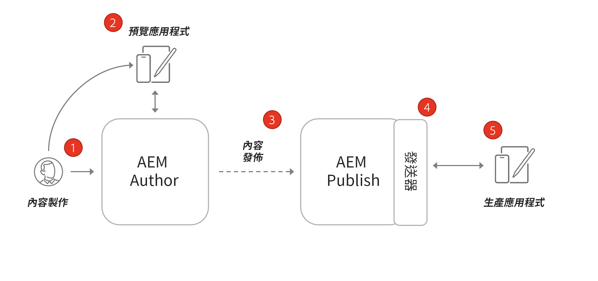
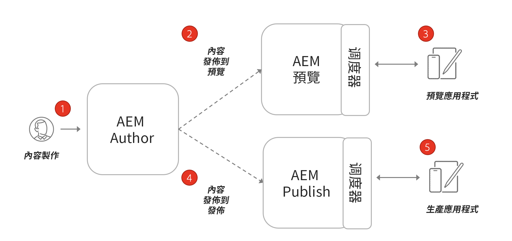

# 無頭架AEM構

典型AEM環境由作者服務、發佈服務和可選預覽服務組成。

* **作者服務** 是內部用戶建立、管理和預覽內容的位置。

* **發佈服務** 被認為是「即時」環境，通常是最終用戶與之交互的內容。 在作者服務上編輯和批准內容後，內容將分發到發佈服務。 使用無頭應用程式的最AEM常見部署模式是讓應用程式的生產版本連接到AEM發佈服務。

* **預覽服務** 在功能上與 **發佈服務**。 但是，它僅供內部用戶使用。 這使得它成為批准者在向最終用戶直播之前查看即將進行的內容更改的理想系統。

* **調度員** 是隨調度器模組增強的靜AEM態web伺服器。 它提供了快取功能和另一層安全性。 的 **調度程式** 坐在前面 **發佈** 和 **預覽** 服務。

在一個AEMas a Cloud Service程式中，可以有多個環境，即開發、階段和生產。 每個環境都有其獨特之處 **作者**。 **發佈**, **預覽** 服務。 您可以瞭解有關管理的更多資訊 [環境](/help/implementing/cloud-manager/manage-environments.md)

## 作者發佈模型

使用無頭應用程式的最AEM常見部署模式是讓應用程式的生產版本連接到AEM發佈服務。

上圖描述了此常見部署模式。

1. A **內容作者** 使用AEM作者服務建立、編輯和管理內容。
1. 的 **內容作者** 其他內部用戶可以直接在Author服務上預覽內容。 可以設定連接到作者服務的應用程式預覽版本。
1. 內容一旦獲得批准，就可以發佈到AEM發佈服務。
1. 的 **調度程式** 就是前面的一層 **發佈** 可快取特定請求並提供安全層的服務。
1. 最終用戶與應用程式的生產版本進行交互。 生產應用程式通過Dispatcher連接到發佈服務，並使用GraphQL API請求和使用內容。

## 作者預覽發佈部署

無頭部署的另一個選項是 **預AEM覽** 服務。 使用此方法，內容可先發佈到 **預覽** 無頭應用程式的預覽版可以連接到它。 這種方法的優點是 **預覽** 可以使用與 **發佈** 使模擬生產體驗更容易。

1. A **內容作者** 使用AEM作者服務建立、編輯和管理內容。
1. 內容首先發佈到預AEM覽服務。
1. 可以設定連接到預覽服務的應用程式預覽版本。
1. 內容一旦經過審核和批准，便可發佈到AEM發佈服務。
1. 最終用戶與應用程式的生產版本進行交互。 生產應用程式通過Dispatcher連接到發佈服務，並使用GraphQL API請求和使用內容。
