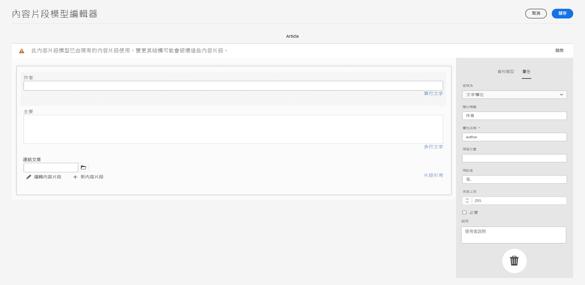
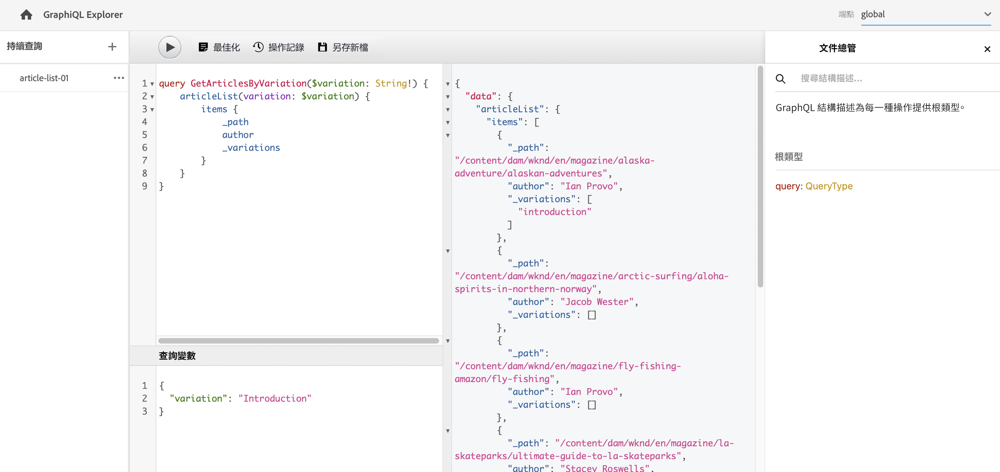
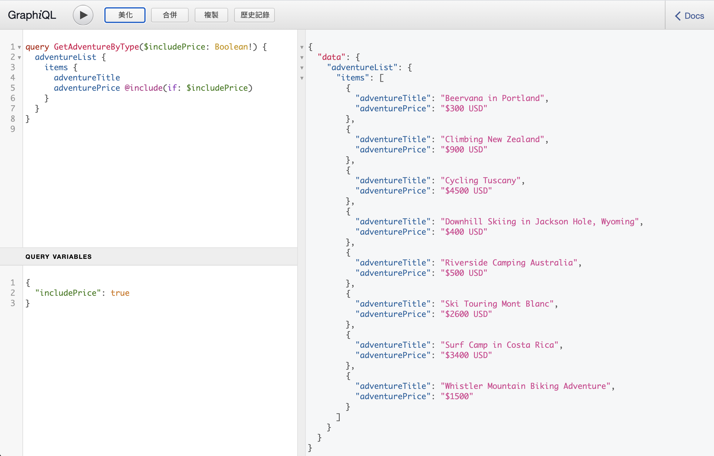

# AEM GraphQL API以搭配內容片段使用 {#graphql-api-for-use-with-content-fragments}

了解如何以AEM GraphQL APIas a Cloud Service使用Adobe Experience Manager(AEM)中的內容片段來傳送無頭內容。

AEMas a Cloud ServiceGraphQL API與內容片段搭配使用，主要是以標準的開放原始碼GraphQL API為基礎。

在AEM中使用GraphQL API，可在無頭式CMS實作中，有效率地將內容片段傳送至JavaScript用戶端：

* 避免像REST一樣迭代API請求，
* 確保傳送內容僅限於特定需求，
* 允許大量傳送要呈現為單一API查詢回應所需的內容。

>[!NOTE]
>
>GraphQL目前用於Adobe Experience Manager(AEM)的兩個（個別）案例as a Cloud Service:
>
>* [AEM商務會透過GraphQL取用來自商務平台的資料](/help/commerce-cloud/integrating/magento.md).
>* AEM內容片段可與AEM GraphQL API(以標準GraphQL為基礎的自訂實作)搭配使用，提供結構化內容以供您的應用程式使用。


## GraphQL API {#graphql-api}

GraphQL是：

* &quot;*...API的查詢語言，以及使用您現有資料完成這些查詢的執行階段。 GraphQL提供API中資料的完整且易於理解的說明，讓客戶能夠確切要求所需內容，而無需其他任何內容，更輕鬆隨時間演變API，並啟用功能強大的開發人員工具。*」。

   請參閱 [GraphQL.org](https://graphql.org)

* &quot;*...靈活API層的開放規格。 將GraphQL放在您現有的後端，以前所未有的速度建置產品…….*」。

   請參閱 [探索GraphQL](https://www.graphql.com).

* *&quot;。..由Facebook於2012年在內部開發的資料查詢語言和規格，2015年公開開放。 它提供了基於REST的體系結構的替代方案，其目的是提高開發人員的工作效率，並最大限度地減少資料傳輸量。 GraphQL被數百個規模的組織用於生產……」*

   請參閱 [GraphQL Foundation](https://foundation.graphql.org/).

<!--
"*Explore GraphQL is maintained by the Apollo team. Our goal is to give developers and technical leaders around the world all of the tools they need to understand and adopt GraphQL.*". 
-->

如需GraphQL API的詳細資訊，請參閱下列章節（以及其他許多資源）:

* At [graphql.org](https://graphql.org):

   * [GraphQL簡介](https://graphql.org/learn)

   * [GraphQL規範](https://spec.graphql.org/)

* At [graphql.com](https://graphql.com):

   * [指南](https://www.graphql.com/guides/)

   * [教學課程](https://www.graphql.com/tutorials/)

   * [案例分析](https://www.graphql.com/case-studies/)

GraphQL for AEM實作以標準GraphQL Java程式庫為基礎。 請參閱：

* [graphQL.org - Java](https://graphql.org/code/#java)

* [GraphQL Java at GitHub](https://github.com/graphql-java)

### GraphQL術語 {#graphql-terminology}

GraphQL使用下列項目：

* **[查詢](https://graphql.org/learn/queries/)**

* **[結構和類型](https://graphql.org/learn/schema/)**:

   * 結構由AEM根據內容片段模型產生。
   * GraphQL會使用您的結構，說明GraphQL for AEM實作允許的類型和操作。

* **[欄位](https://graphql.org/learn/queries/#fields)**

* **[GraphQL 端點](graphql-endpoint.md)**
   * AEM中的路徑，可回應GraphQL查詢並提供GraphQL結構的存取。

   * 請參閱 [啟用GraphQL端點](graphql-endpoint.md) 以取得詳細資訊。

請參閱 [(GraphQL.org)GraphQL簡介](https://graphql.org/learn/) 全面詳情，包括 [最佳實務](https://graphql.org/learn/best-practices/).

### GraphQL查詢類型 {#graphql-query-types}

透過GraphQL，您可以執行查詢以傳回：

* A **單次登入**

* A **[條目清單](https://graphql.org/learn/schema/#lists-and-non-null)**

AEM提供將查詢（兩種類型）轉換為 [可快取的持續查詢](/help/headless/graphql-api/persisted-queries.md) 和CDN。

### GraphQL查詢最佳作法（Dispatcher和CDN） {#graphql-query-best-practices}

此 [持續查詢](/help/headless/graphql-api/persisted-queries.md) 是用於發佈執行個體的建議方法，如下所示：

* 快取
* 由AEMas a Cloud Service集中管理

>[!NOTE]
>
>作者上通常沒有Dispatcher/CDN，因此使用持續的查詢不會帶來任何好處；除了測試它們。

不建議使用POST請求的GraphQL查詢，因為它們未進行快取，因此在預設例項上，Dispatcher會設定為封鎖這類查詢。

雖然GraphQL也支援GET要求，但這些可能會達到限制（例如URL的長度），而這些限制可以使用持續查詢來避免。

>[!NOTE]
>
>若要允許直接和/或POSTDispatcher中的查詢，您可以要求系統管理員：
>
>* 建立 [Cloud Manager環境變數](/help/implementing/cloud-manager/environment-variables.md) 呼叫 `ENABLE_GRAPHQL_ENDPOINT`
>* 值 `true`


>[!NOTE]
>
>未來某個時間點可能會淘汰執行直接查詢的功能。

### GraphiQL IDE {#graphiql-ide}

您可以使用 [GraphiQL IDE](/help/headless/graphql-api/graphiql-ide.md).

## 製作和發佈環境的使用案例 {#use-cases-author-publish-environments}

使用案例取決於AEMas a Cloud Service環境的類型：

* 發佈環境；用於：
   * JS應用程式的查詢資料（標準使用案例）

* 製作環境；用於：
   * 查詢資料以用於「內容管理目的」：
      * AEMas a Cloud Service中的GraphQL目前為唯讀API。
      * REST API可用於CR(u)D操作。

## 權限 {#permission}

權限是存取資產所需的權限。

GraphQL查詢是在基礎請求的AEM使用者權限下執行。 如果使用者沒有某些片段的讀取存取權（儲存為資產），則這些片段不會成為結果集的一部分。

此外，使用者必須擁有GraphQL端點的存取權，才能執行GraphQL查詢。

## 結構產生 {#schema-generation}

GraphQL是強制類型的API，這表示資料必須依類型清楚地建構和組織。

GraphQL規格提供一系列准則，說明如何建立強大的API，以詢問特定執行個體上的資料。 若要這麼做，用戶端必須擷取 [結構](#schema-generation)，包含查詢所需的所有類型。

針對內容片段，GraphQL結構（結構和類型）以 **已啟用** [內容片段模型](/help/sites-cloud/administering/content-fragments/content-fragments-models.md) 及其資料類型。

>[!CAUTION]
>
>所有GraphQL結構(衍生自已 **已啟用**)可透過GraphQL端點讀取。
>
>這意味著，您需要確保沒有敏感資料可用，因為這些資料可能會以這種方式洩露；例如，這包括可以在模型定義中顯示為欄位名稱的資訊。

例如，如果使用者建立的內容片段模型稱為 `Article`，則AEM會產生GraphQL類型 `ArticleModel`. 此類型中的欄位與模型中定義的欄位和資料類型相對應。 此外，它還為對此類型操作的查詢建立一些入口點，例如 `articleByPath` 或 `articleList`.

1. 內容片段模型：

   

1. 對應的GraphQL架構（GraphiQL自動檔案輸出）:
   

   這會顯示產生的類型 `ArticleModel` 包含數個 [欄位](#fields).

   * 其中三個由使用者控制： `author`, `main` 和 `referencearticle`.

   * 其他欄位是由AEM自動新增的，是提供特定內容片段相關資訊的實用方法；在此範例中， [輔助欄位](#helper-fields)) `_path`, `_metadata`, `_variations`.

1. 使用者根據文章模型建立內容片段後，就可透過GraphQL詢問。 如需範例，請參閱 [範例查詢](/help/headless/graphql-api/sample-queries.md#graphql-sample-queries) (根據 [與GraphQL搭配使用的範例內容片段結構](/help/headless/graphql-api/sample-queries.md#content-fragment-structure-graphql))。

在GraphQL for AEM中，結構是彈性的。 這表示每次建立、更新或刪除內容片段模型時，都會自動產生內容片段模型。 更新內容片段模型時，也會重新整理資料架構快取。

<!-- move the following to a separate "in depth" page -->

更新內容片段模型時，也會重新整理資料架構快取。

Sites GraphQL服務會監聽（在背景）對內容片段模型所做的任何修改。 檢測到更新時，只重新生成該架構的該部分。 此最佳化可節省時間並提供穩定性。

例如，如果您：

1. 安裝包含 `Content-Fragment-Model-1` 和 `Content-Fragment-Model-2`:

   1. GraphQL類型 `Model-1` 和 `Model-2` 即會產生。

1. 然後修改 `Content-Fragment-Model-2`:

   1. 僅 `Model-2` GraphQL類型將會更新。

   1. 而 `Model-1` 會保持不變。

>[!NOTE]
>
>請務必注意，以備您想透過REST api或其他方式，對內容片段模型執行大量更新時使用。

此結構會透過與GraphQL查詢相同的端點提供，且用戶端會處理以擴充功能呼叫結構的事實 `GQLschema`. 例如，執行簡單 `GET` 要求 `/content/cq:graphql/global/endpoint.GQLschema` 會導致輸出具有Content-type的架構： `text/x-graphql-schema;charset=iso-8859-1`.

<!-- move through to here to a separate "in depth" page -->

### 結構產生 — 取消發佈的模型 {#schema-generation-unpublished-models}

巢狀內嵌內容片段時，可能會發佈上層內容片段模型，但未發佈參考模型。

>[!NOTE]
>
>AEM UI可防止此情況發生，但如果以程式設計方式或使用內容套件進行發佈，便可能發生。

發生此情況時，AEM會產生 *不完整* 上層內容片段模型的結構。 這表示會從架構中移除片段參考（取決於未發佈的模型）。

## 欄位 {#fields}

在結構中，有兩個基本類別的個別欄位：

* 您產生的欄位。

   選取 [資料類型](#Data-types) 可用來根據您如何設定內容片段模型來建立欄位。 欄位名稱取自 **屬性名稱** 欄位 **資料類型** 標籤。

   * 還有 **呈現為** 設定以納入考量，因為使用者可以設定特定資料類型。 例如，單行文本欄位可配置為包含多個單行文本，方法是 `multifield` 中。

* GraphQL for AEM也會產生許多 [輔助欄位](#helper-fields).

### 資料類型 {#data-types}

GraphQL for AEM支援類型清單。 所有支援的內容片段模型資料類型和對應的GraphQL類型皆會呈現：

| 內容片段模型 — 資料類型 | GraphQL類型 | 說明 |
|--- |--- |--- |
| 單行文字 | 字串， [字串] | 用於簡單字串，例如作者名稱、位置名稱等。 |
| 多行文本 | 字串， [字串] | 用於輸出文本，例如物品的本體 |
| 數量 | 漂浮， [浮點數] | 用於顯示浮點數和規則數 |
| 布林值 | 布林值 | 用於顯示複選框→簡單的true/false語句 |
| 日期和時間 | 日曆 | 用於以ISO 8601格式顯示日期和時間。 根據選取的類型，AEM GraphQL中有三種可用的方式： `onlyDate`, `onlyTime`, `dateTime` |
| 列舉 | 字串 | 用於從建立模型時定義的選項清單中顯示選項 |
| 標記 | [String] | 用來顯示代表AEM中所用標籤之字串的清單 |
| 內容參考資料 | 字串， [字串] | 用於顯示AEM中其他資產的路徑 |
| 片段引用 | *模型類型* | 用於參照建立模型時定義的特定模型類型的另一個內容片段 |

### 協助欄位 {#helper-fields}

除了使用者產生欄位的資料類型，GraphQL for AEM也會產生許多 *協助者* 欄位，以協助識別內容片段，或提供有關內容片段的其他資訊。

這些 [輔助欄位](#helper-fields) 標籤有 `_` 區分使用者定義的項目和自動產生的項目。

#### 路徑 {#path}

路徑欄位是作為AEM GraphQL中的識別碼。 它代表AEM存放庫內的內容片段資產路徑。 我們選擇此作為內容片段的識別碼，因為它：

* 在AEM中是唯一的，
* 很容易被牽引。

下列程式碼會顯示根據內容片段模型建立的所有內容片段路徑 `Author`，如WKND教學課程所提供。

```graphql
{
  authorList {
    items {
      _path
    }
  }
}
```

若要擷取特定類型的單一內容片段，您也必須先判斷其路徑。 例如：

```graphql
{
  authorByPath(_path: "/content/dam/wknd-shared/en/contributors/sofia-sj-berg") {
    item {
      _path
      firstName
      lastName
    }
  }
}
```

請參閱 [範例查詢 — 單一特定城市片段](/help/headless/graphql-api/sample-queries.md#sample-single-specific-city-fragment).

#### 中繼資料 {#metadata}

透過GraphQL,AEM也會公開內容片段的中繼資料。 中繼資料是描述內容片段的資訊，例如內容片段的標題、縮圖路徑、內容片段的說明、建立日期等。

由於中繼資料是透過結構編輯器產生，因此沒有特定結構，因此， `TypedMetaData` 已實作GraphQL類型，以公開內容片段的中繼資料。 `TypedMetaData` 顯示按以下標量類型分組的資訊：

| 欄位 |
|--- |
| `stringMetadata:[StringMetadata]!` |
| `stringArrayMetadata:[StringArrayMetadata]!` |
| `intMetadata:[IntMetadata]!` |
| `intArrayMetadata:[IntArrayMetadata]!` |
| `floatMetadata:[FloatMetadata]!` |
| `floatArrayMetadata:[FloatArrayMetadata]!` |
| `booleanMetadata:[BooleanMetadata]!` |
| `booleanArrayMetadata:[booleanArrayMetadata]!` |
| `calendarMetadata:[CalendarMetadata]!` |
| `calendarArrayMetadata:[CalendarArrayMetadata]!` |

每個標量類型表示單個名稱值對或名稱值對陣列，其中該對的值屬於其分組的類型。

例如，如果您想要擷取內容片段的標題，我們知道此屬性是字串屬性，因此我們會查詢所有字串中繼資料：

要查詢元資料：

```graphql
{
  authorByPath(_path: "/content/dam/wknd-shared/en/contributors/sofia-sj-berg") {
    item {
      _metadata {
        stringMetadata {
          name
          value
        }
      }
    }
  }
}
```

如果您檢視「產生的GraphQL」結構，可以檢視所有中繼資料GraphQL類型。 所有模型類型都具有相同 `TypedMetaData`.

>[!NOTE]
>
>**一般和陣列中繼資料的差異**
>請記住 `StringMetadata` 和 `StringArrayMetadata` 兩者都指儲存在存放庫中的內容，而非擷取儲存庫的方式。
>
>例如，通過調用 `stringMetadata` 欄位中，您會收到儲存在存放庫中、作為 `String` ，若 `stringArrayMetadata` 您會收到儲存在存放庫中、儲存為 `String[]`.

請參閱 [中繼資料的範例查詢 — 列出題為GB的獎項中繼資料](/help/headless/graphql-api/sample-queries.md#sample-metadata-awards-gb).

#### 變數 {#variations}

此 `_variations` 欄位已實作，以簡化查詢內容片段所含變數的程式。 例如：

```graphql
{
  authorByPath(_path: "/content/dam/wknd-shared/en/contributors/ian-provo") {
    item {
      _variations
    }
  }
}
```

>[!NOTE]
>
>請注意， `_variations` 欄位不包含 `master` 變異，如原始資料(參考 *主版* （在UI中）不會視為明確變數。

請參閱 [範例查詢 — 具有已命名變數的所有城市](/help/headless/graphql-api/sample-queries.md#sample-cities-named-variation).

>[!NOTE]
>
>如果內容片段不存在指定的變數，則原始資料（也稱為主變數）將會傳回為（後援）預設值。

<!--
## Security Considerations {#security-considerations}
-->

## GraphQL變數 {#graphql-variables}

GraphQL允許在查詢中放置變數。 如需詳細資訊，請參閱 [GraphQL變數檔案](https://graphql.org/learn/queries/#variables).

例如，若要取得類型的所有內容片段 `Author` 在特定變數中（如果可用），您可以指定引數 `variation` 在GraphiQL中。



**查詢**:

```graphql
query($variation: String!) {
  authorList(variation: $variation) {
    items {
      _variation
      lastName
      firstName
    }
  }
}
```

**查詢變數**:

```json
{
  "variation": "another"
}
```

此查詢會傳回作者的完整清單。 沒有 `another` 變異會回復成原始資料(`_variation` 將報告 `master` 在此情況下)。

如果您想要將清單限制在提供指定變數的作者（並略過會回復成原始資料的作者），您需要套用 [篩選](#filtering):

```graphql
query($variation: String!) {
  authorList(variation: $variation, filter: {
    _variation: {
      _expressions: {
        value: $variation
      }
    }
  }) {
    items {
      _variation
      lastName
      firstName
    }
  }
}
```

## GraphQL指示 {#graphql-directives}

在GraphQL中，可以根據稱為GraphQL指示的變數變更查詢。

例如，您可以在 `adventurePrice` 欄位（在查詢中） `AdventureModels`，根據變數 `includePrice`.



**查詢**:

```graphql
query GetAdventureByType($includePrice: Boolean!) {
  adventureList {
    items {
      title
      price @include(if: $includePrice)
    }
  }
}
```

**查詢變數**:

```json
{
    "includePrice": true
}
```

## 篩選 {#filtering}

您也可以在GraphQL查詢中使用篩選來傳回特定資料。

篩選使用以邏輯運算子和運算式為基礎的語法。

原子部分最多是可套用至特定欄位內容的單一運算式。 它會比較欄位內容與指定的常數值。

例如，運算式

```graphql
{
  value: "some text"
  _op: EQUALS
}
```

會比較欄位的內容與值 `some text` 如果內容等於值，則和會成功。 否則，運算式會失敗。

此

下列運算子可用來比較欄位與特定值：

| 運算子 | 類型 | 如果……則運算式會成功。 |
|--- |--- |--- |
| `EQUALS` | `String`, `ID`, `Boolean` | ...值與欄位的內容完全相同 |
| `EQUALS_NOT` | `String`, `ID` | ...值為 *not* 與欄位的內容相同 |
| `CONTAINS` | `String` | ...欄位的內容包含值(`{ value: "mas", _op: CONTAINS }` 符合 `Christmas`, `Xmas`, `master`, ...) |
| `CONTAINS_NOT` | `String` | ...欄位的內容會 *not* 包含值 |
| `STARTS_WITH` | `ID` | ... ID以特定值開頭(`{ value: "/content/dam/", _op: STARTS_WITH` 符合 `/content/dam/path/to/fragment`，但不是 `/namespace/content/dam/something` |
| `EQUAL` | `Int`, `Float` | ...值與欄位的內容完全相同 |
| `UNEQUAL` | `Int`, `Float` | ...值為 *not* 與欄位的內容相同 |
| `GREATER` | `Int`, `Float` | ...欄位的內容大於值 |
| `GREATER_EQUAL` | `Int`, `Float` | ...欄位的內容大於或等於值 |
| `LOWER` | `Int`, `Float` | ...欄位的內容低於值 |
| `LOWER_EQUAL` | `Int`, `Float` | ...欄位的內容小於或等於值 |
| `AT` | `Calendar`, `Date`, `Time` | ...欄位的內容與值完全相同（包括時區設定） |
| `NOT_AT` | `Calendar`, `Date`, `Time` | ...欄位的內容為 *not* 與值相同 |
| `BEFORE` | `Calendar`, `Date`, `Time` | ...以值表示的時間點在以欄位內容表示的時間點之前 |
| `AT_OR_BEFORE` | `Calendar`, `Date`, `Time` | ...以值表示的時間點在欄位內容所表示的時間點之前或在同一時間點 |
| `AFTER` | `Calendar`, `Date`, `Time` | ...以值表示的時間點是在以欄位內容表示的時間點之後 |
| `AT_OR_AFTER` | `Calendar`, `Date`, `Time` | ...以值表示的時間點在時間點之後或在同一時間點以欄位的內容表示 |

某些類型也允許指定其他選項來修改運算式的評估方式：

| 選項 | 類型 | 說明 |
|--- |--- |--- |
| `_ignoreCase` | `String` | 忽略字串的大小寫，例如 `time` 符合 `TIME`, `time`, `tImE`, ... |
| `_sensitiveness` | `Float` | 允許 `float` 值應視為相同(以解決由於內部代表 `float` 值；應避免，因為此選項可能對效能造成負面影響 |

運算式可在邏輯運算子的協助下結合至集合(`_logOp`):

* `OR`  — 如果至少有一個運算式成功，則運算式集會成功
* `AND`  — 如果所有運算式都成功，則運算式集會成功（預設）

每個欄位都可依其專屬的運算式集來篩選。 篩選器引數中提及之所有欄位的運算式集，最終將由其本身的邏輯運算子結合。

篩選器定義(以 `filter` 引數)包含：

* 每個欄位的子定義(可透過其名稱存取欄位，例如有 `lastName` 欄位 `lastName` 欄位（欄位）類型)
* 每個子定義都包含 `_expressions` 陣列，提供運算式集，和 `_logOp` 定義邏輯運算子的欄位，運算式應與
* 每個運算式都由值(`value` 欄位)和運算子(`_operator` 欄位)的內容應與

請注意，您可以忽略 `_logOp` 如果要將項目與 `AND` 和 `_operator` 如果要檢查是否相等，因為這些是預設值。

下列範例示範一個完整查詢，可篩選具有 `lastName` of `Provo` 或包含 `sjö`，與情況無關：

```graphql
{
  authorList(filter: {
    lastname: {
      _logOp: OR
      _expressions: [
        {
          value: "sjö",
          _operator: CONTAINS,
          _ignoreCase: true
        },
        {
          value: "Provo"
        }
      ]
    }
  }) {
    items {
      lastName
      firstName
    }
  }
}
```

雖然您也可以篩選巢狀欄位，但不建議使用，因為這可能會導致效能問題。

如需更多範例，請參閱：

* 的 [GraphQL for AEM擴充功能](#graphql-extensions)

* [使用此範例內容和結構的範例查詢](/help/headless/graphql-api/sample-queries.md#graphql-sample-queries-sample-content-fragment-structure)

   * 而 [範例內容與結構](/help/headless/graphql-api/sample-queries.md#content-fragment-structure-graphql) 準備用於示例查詢

* [基於WKND項目的查詢示例](/help/headless/graphql-api/sample-queries.md#sample-queries-using-wknd-project)

## 排序 {#sorting}

此功能可讓您根據指定欄位來排序查詢結果。

排序標準：

* 是以逗號分隔的值清單，代表欄位路徑
   * 清單中的第一個欄位將定義主要排序順序，如果主要排序標準的兩個值相等，則使用第二個欄位，如果前兩個標準相等，則使用第三個欄位。
   * 點分標籤法，即欄位1.subfield.subfield等。
* 具有可選順序方向
   * ASC（升序）或DESC（降序）;作為預設ASC應用
   * 每個欄位可指定方向；這表示您可以依遞增順序排序一個欄位，而以遞減順序排序另一個欄位(name, firstName DESC)

例如：

```graphql
query {
  authorList(sort: "lastName, firstName") {
    items {
      firstName
      lastName
    }
  }
}
```

此外：

```graphql
{
  authorList(sort: "lastName DESC, firstName DESC") {
    items {
        lastName
        firstName
    }
  }
}
```

<!-- to be included? -->

您也可以使用 `nestedFragmentname.fieldname`.

>[!NOTE]
>
>這可能會對效能造成負面影響。

例如：

```graphql
query {
  articleList(sort: "authorFragment.lastName")  {
    items {
      title
      authorFragment {
        firstName
        lastName
        birthDay
      }
      slug
    }
  }
}
```

## 分頁 {#paging}

此功能可讓您對傳回清單的查詢類型執行分頁。 提供兩種方法：

* `offset` 和 `limit` 在 `List` 查詢
* `first` 和 `after` 在 `Paginated` 查詢

### 清單查詢 — 偏移和限制 {#list-offset-limit}

在 `...List`查詢 `offset` 和 `limit` 返回特定結果子集：

* `offset`:指定要傳回的第一個資料集
* `limit`:指定要傳回的資料集數目上限

例如，若要輸出包含最多五篇文章的結果頁面，請從 *complete* 結果清單：

```graphql
query {
   articleList(offset: 5, limit: 5) {
    items {
      authorFragment {
        lastName
        firstName
      }
    }
  }
}
```

<!-- When available link to BP and replace "JCR query level" with a more neutral term. -->

<!-- When available link to BP and replace "JCR query result set" with a more neutral term. -->

>[!NOTE]
>
>* 分頁需要穩定的排序順序才能在多個查詢中正確工作，請求同一結果集的不同頁。 預設情況下，它使用結果集中每個項的儲存庫路徑，以確保順序始終相同。 如果使用了不同的排序順序，並且無法在JCR查詢級別執行排序，則會產生負面效能影響，因為必須先將整個結果集載入到記憶體中，才能確定頁。
>
>* 偏移值越高，從完整JCR查詢結果集中跳過項目所需的時間就越長。 大型結果集的替代解決方案是搭配使用已編頁查詢 `first` 和 `after` 方法。


### 編頁查詢 — 首頁和後頁 {#paginated-first-after}

此 `...Paginated` 查詢類型會重新使用大部分 `...List` 查詢類型功能（篩選、排序），但不使用 `offset`/`limit` 引數，它使用 `first`/`after` 由定義的參數 [GraphQL游標連接規範](https://relay.dev/graphql/connections.htm). 您可以在 [GraphQL簡介](https://graphql.org/learn/pagination/#pagination-and-edges).

* `first`:此 `n` 要傳回的第一個項目。
預設為 `50`。最大值為 `100`.
* `after`:確定所請求頁面開頭的游標；請注意，由游標表示的項不包含在結果集中；項的游標由 `cursor` 欄位 `edges` 結構。

例如，輸出包含最多五個歷險的結果頁面，從 *complete* 結果清單：

```graphql
query {
    adventurePaginated(first: 5, after: "ODg1MmMyMmEtZTAzMy00MTNjLThiMzMtZGQyMzY5ZTNjN2M1") {
        edges {
          cursor
          node {
            title
          }
        }
        pageInfo {
          endCursor
          hasNextPage
        }
    }
}
```

<!-- When available link to BP -->
<!-- Due to internal technical constraints, performance will degrade if sorting and filtering is applied on nested fields. Therefore it is recommended to use filter/sort fields stored at root level. For more information, see the [Best Practices document](link). -->

>[!NOTE]
>
>* 依預設，分頁會使用存放庫節點的UUID來表示要排序的片段，以確保結果的順序一律相同。 當 `sort` ，則會以隱含方式使用UUID來確保唯一排序；即使是兩個具有相同排序鍵的項目。
>
>* 由於內部技術限制，如果對巢狀欄位套用排序和篩選，效能會降低。 因此，建議使用儲存在根層級的篩選/排序欄位。 如果要查詢大型編頁結果集，也建議使用此方法。


## GraphQL for AEM — 擴充功能摘要 {#graphql-extensions}

使用GraphQL for AEM的查詢基本操作符合標準GraphQL規格。 若為具有AEM的GraphQL查詢，有幾個擴充功能：

* 如果您希望得到結果清單：
   * 新增 `List` 至模型名稱；例如，  `cityList`
   * 請參閱 [範例查詢 — 所有城市的所有資訊](/help/headless/graphql-api/sample-queries.md#sample-all-information-all-cities)

   然後，您可以：

   * [排序結果](#sorting)

      * `ASC` : 升序
      * `DESC` : 降序
   * 使用下列任一項傳回結果頁面：

      * [具有偏移和限制的清單查詢](#list-offset-limit)
      * [具有前置和後置的編頁查詢](#paginated-first-after)
   * 請參閱 [範例查詢 — 所有城市的所有資訊](/help/headless/graphql-api/sample-queries.md#sample-all-information-all-cities)


* 如果您需要單一結果：
   * 使用模型名稱；eg city

* 如果您希望得到結果清單：
   * 新增 `List` 至模型名稱；例如，  `cityList`
   * 請參閱 [範例查詢 — 所有城市的所有資訊](/help/headless/graphql-api/sample-queries.md#sample-all-information-all-cities)

* 如果要使用邏輯OR:
   * use ` _logOp: OR`
   * 請參閱 [Sample Query — 名為「Jobs」或「Smith」的所有人員](/help/headless/graphql-api/sample-queries.md#sample-all-persons-jobs-smith)

* 邏輯AND也存在，但（通常）是隱含的

* 您可以查詢與內容片段模型內欄位對應的欄位名稱
   * 請參閱 [示例查詢 — 公司CEO和員工的完整詳細資訊](/help/headless/graphql-api/sample-queries.md#sample-full-details-company-ceos-employees)

* 除了模型中的欄位之外，還有一些系統生成的欄位（前面有下划線）:

   * 內容：

      * `_locale` :揭示語言；基於語言管理器
         * 請參閱 [指定地區的多個內容片段的查詢範例](/help/headless/graphql-api/sample-queries.md#sample-wknd-multiple-fragments-given-locale)
      * `_metadata` :顯示片段的中繼資料
         * 請參閱 [中繼資料的範例查詢 — 列出題為GB的獎項中繼資料](/help/headless/graphql-api/sample-queries.md#sample-metadata-awards-gb)
      * `_model` :允許查詢內容片段模型（路徑和標題）
         * 請參閱 [從模型中查詢內容片段模型的範例](/help/headless/graphql-api/sample-queries.md#sample-wknd-content-fragment-model-from-model)
      * `_path` :存放庫內內容片段的路徑
         * 請參閱 [範例查詢 — 單一特定城市片段](/help/headless/graphql-api/sample-queries.md#sample-single-specific-city-fragment)
      * `_reference` :顯示參照；在RTF編輯器中包含內嵌參考
         * 請參閱 [具有預先擷取的參考之多個內容片段的查詢範例](/help/headless/graphql-api/sample-queries.md#sample-wknd-multiple-fragments-prefetched-references)
      * `_variation` :顯示內容片段中的特定變體

         >[!NOTE]
         >
         >如果內容片段不存在指定的變數，則主變數會傳回為（後援）預設值。

         * 請參閱 [範例查詢 — 具有已命名變數的所有城市](#sample-cities-named-variation)
   * 操作：

      * `_operator` :應用特定運算子； `EQUALS`, `EQUALS_NOT`, `GREATER_EQUAL`, `LOWER`, `CONTAINS`, `STARTS_WITH`
         * 請參閱 [示例查詢 — 沒有「Jobs」名稱的所有人員](/help/headless/graphql-api/sample-queries.md#sample-all-persons-not-jobs)
         * 請參閱 [範例查詢 — 所有冒險，其中 `_path` 開頭為特定首碼](/help/headless/graphql-api/sample-queries.md#sample-wknd-all-adventures-cycling-path-filter)
      * `_apply` :具體條件；例如，  `AT_LEAST_ONCE`
         * 請參閱 [範例查詢 — 對項目必須至少發生一次的陣列進行篩選](/help/headless/graphql-api/sample-queries.md#sample-array-item-occur-at-least-once)
      * `_ignoreCase` :在查詢時忽略大小寫
         * 請參閱 [示例查詢 — 名稱中包含SAN的所有城市（不考慮大小寫）](/help/headless/graphql-api/sample-queries.md#sample-all-cities-san-ignore-case)


* GraphQL聯合類型受支援：

   * use `... on`
      * 請參閱 [具有內容參考之特定模型的內容片段查詢範例](/help/headless/graphql-api/sample-queries.md#sample-wknd-fragment-specific-model-content-reference)

* 查詢巢狀片段時回退：

   * 如果巢狀片段中不存在指定的變數，則 **主版** 會傳回變數。

## 從外部網站查詢GraphQL端點 {#query-graphql-endpoint-from-external-website}

若要從外部網站存取GraphQL端點，您必須設定：

* [CORS篩選器](/help/headless/deployment/cross-origin-resource-sharing.md)
* [推薦者篩選器](/help/headless/deployment/referrer-filter.md)

## 驗證 {#authentication}

請參閱 [內容片段的遠端AEM GraphQL查詢驗證](/help/headless/security/authentication.md).

## 常見問題集 {#faqs}

出現的問題：

1. **Q**:&quot;*AEM的GraphQL API與Query Builder API有何不同？*&quot;

   * **A**:&quot;*AEM GraphQL API提供JSON輸出的總計控制，且是查詢內容的業界標準。
日後AEM將計畫投資AEM GraphQL API。*&quot;

## 教學課程 — AEM Headless和GraphQL快速入門 {#tutorial}

尋找實作教學課程？ 結帳 [AEM Headless和GraphQL快速入門](https://experienceleague.adobe.com/docs/experience-manager-learn/getting-started-with-aem-headless/graphql/overview.html) 端對端教學課程，說明如何在無頭CMS情境中，使用AEM GraphQL API建置和公開內容，並供外部應用程式使用。