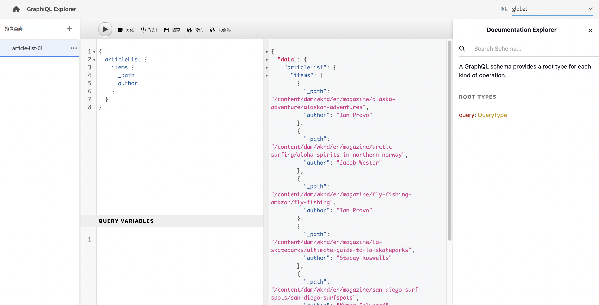

# 使用GraphiQL IDE {#graphiql-ide}

標準的實施 [圖形QL](https://graphql.org/learn/serving-over-http/#graphiql) IDE可用於AEMGraphQL。 這可以是 [已安AEM裝](#installing-graphiql-ide)。

>[!NOTE]
>
>GraphiQL已綁定全局終結點（不與特定站點配置的其他終結點一起使用）。

GraphiQL工具允許您直接輸入、test和調試查詢。 GraphiQL還提供了對文檔的輕鬆訪問，使您能夠輕鬆瞭解和瞭解可用的方法。

例如：

* `http://localhost:4502/content/graphiql.html`

這提供了語法突出顯示、自動完成、自動建議等功能，以及歷史記錄和線上文檔：

## 安裝AEMGraphiQL IDE {#installing-graphiql-ide}

GraphiQL IDE是開發工具，僅在低級環境（如開發或本地實例）上需要。 因此，它不包括在AEM項目中，而是作為單獨的包進行安裝，可以臨時安裝。

1. 導航到 **[軟體分發門戶](https://experience.adobe.com/#/downloads/content/software-distribution/en/aemcloud.html)** > **AEMas a Cloud Service**。
1. 搜索「GraphiQL」(請務必包括 **我** 在 **圖形QL**。
1. 下載最新 **GraphiQL內容包v.x.x.x**
1. 從 **開AEM始** 菜單導航 **工具** > **部署** > **包**。
1. 按一下 **上載包** 選擇上一步下載的包。 按一下 **安裝** 安裝軟體包。
