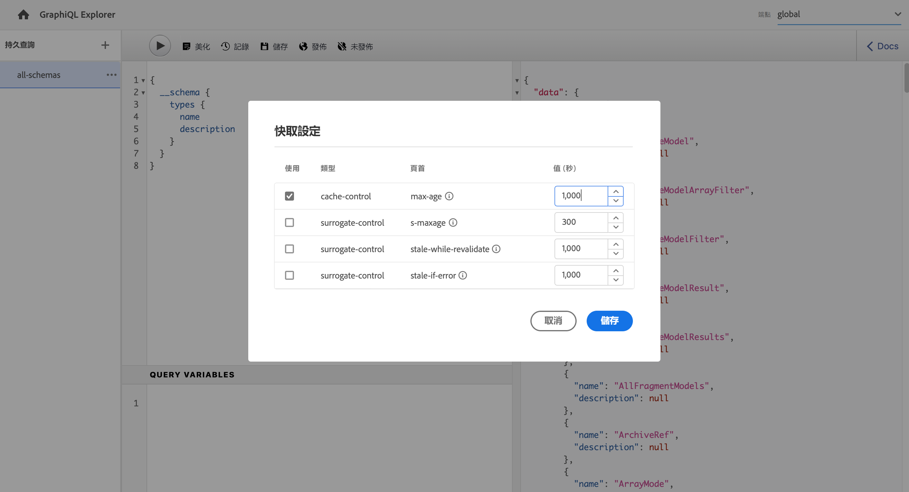

# 使用GraphiQL IDE {#graphiql-ide}

標準的實施 [圖形QL](https://graphql.org/learn/serving-over-http/#graphiql) IDE可用於Adobe Experience Manager()as a Cloud Service的GraphQL APIAEM。

>[!NOTE]
>
>GraphiQL包含在的所有環境AEM中（但只有在配置端點時才可訪問/可見）。
>
>在以前的版本中，安裝GraphiQL IDE需要軟體包。 如果已安裝此程式，則現在可以將其刪除。

>[!NOTE]
>你一定有 [已配置終端](/help/headless/graphql-api/graphql-endpoint.md) 的 [配置瀏覽器](/help/sites-cloud/administering/content-fragments/content-fragments-configuration-browser.md) 在使用GraphiQL IDE之前。

的 **圖形QL** 工具允許您test和調試GraphQL查詢，方法是：
* 選擇 **端點** 適用於要用於查詢的站點配置
* 直接輸入新查詢
* 建立和訪問， **[永續查詢](/help/headless/graphql-api/persisted-queries.md)**
* 運行查詢以立即查看結果
* 管理 **查詢變數**
* 保存和管理 **永續查詢**
* 發佈或取消發佈， **永續查詢** (例如，至/自 `dev-publish`)
* 查看 **歷史** 你以前的查詢
* 使用 **文檔資源管理器** 訪問文檔；幫助您瞭解和瞭解可用的方法。

可以從以下任一位置訪問查詢編輯器：

* **工具** -> **常規** -> **GraphQL查詢編輯器**
* 直接；比如說， `http://localhost:4502/aem/graphiql.html`

您可以在系統上使用GraphiQL，以便客戶端應用程式可以使用GET請求來請求查詢，並發佈查詢。 對於生產用途，您可以 [將查詢移至生產環境](/help/headless/graphql-api/persisted-queries.md#transfer-persisted-query-production)。 最初發送給生產作者，用於驗證帶有查詢的新創作內容，最後為即時使用發佈生產內容。

## 選擇終結點 {#selecting-endpoint}

作為第一步，您需要選擇 **[端點](/help/headless/graphql-api/graphql-endpoint.md)** 用於查詢。 終結點適用於要用於查詢的站點配置。

可從右上角的下拉清單中獲得。

## 建立新查詢並保留 {#creating-new-query}

您可以在編輯器中輸入新查詢 — 該編輯器位於中左側面板中，直接位於GraphiQL徽標下。

>[!NOTE]
>
>如果已選擇保留查詢並在編輯器面板中顯示，則選擇 `+` (下 **永續查詢**)以清空編輯器，以便為新查詢做好準備。

只要開始鍵入，編輯還會：

* 使用滑鼠移過來顯示有關元素的其他資訊
* 提供語法突出顯示、自動完成、自動建議等功能

>[!NOTE]
>
>GraphQL查詢通常以 `{` 字元。
>
>以 `#` 忽略。

使用 **另存為** 來保留新查詢。

## 正在更新您的永續查詢 {#updating-persisted-query}

從中的清單中選擇要更新的查詢 **永續查詢** 面板（左）。

查詢將顯示在編輯器面板中。 進行任何需要的更改，然後使用 **保存** 將更新提交到永續查詢。

## 運行查詢 {#running-queries}

您可以立即運行新查詢，也可以載入並運行永續查詢。 要載入永續查詢，請從清單中選擇該查詢 — 該查詢將顯示在編輯器面板中。

在兩種情況下，編輯器面板中顯示的查詢是在以下任一情況下將執行的查詢：

* 按一下/點擊 **執行查詢** 表徵圖
* 使用鍵盤組合 `Control-Enter`

## 查詢變數 {#query-variables}

<!-- more details needed here? -->

GraphiQL IDE還允許您管理 [查詢變數](/help/headless/graphql-api/content-fragments.md#graphql-variables)。

例如：

## 管理永續查詢的快取 {#managing-cache}

[永續查詢](/help/headless/graphql-api/persisted-queries.md) 建議在分發程式和CDN層快取這些應用程式，從而最終提高請求客戶端應用程式的效能。 預設AEM情況下，內容傳遞網路(CDN)快取將基於預設生存時間(TTL)失效。

使用GraphQL可以配置HTTP快取標頭，以控制單個永續查詢的這些參數。

1. 的 **標題** 選項可通過永續查詢名稱右側的三個垂直點（左側面板）訪問：

   

1. 選擇此項將開啟 **快取配置** 對話框：

   

1. 選擇相應的參數，然後根據需要調整值：

   * **快取控制** - **最大年齡**
快取可以將此內容儲存指定的秒數。 通常是瀏覽器TTL（生存時間）。
   * **代理控制** - **S最大值**
與最大使用時間相同，但特別適用於代理快取。
   * **代理控制** - **過時重新驗證**
快取在快取響應過時後可繼續提供快取響應，最長可達指定的秒數。
   * **代理控制** - **失效 — if-error**
在出現或源錯誤時，快取可以繼續提供快取響應，最長可達指定的秒數。

1. 選擇 **保存** 來保留更改。

## 發佈永續查詢 {#publishing-persisted-queries}

從清單（左面板）中選擇永續查詢後，可以使用 **發佈** 和 **取消發佈** 操作。 這會將它們激活到發佈環境(例如， `dev-publish`)，以便應用程式在測試時輕鬆訪問。

>[!NOTE]
>
>永續查詢的快取的定義 `Time To Live` {&quot;cache-control&quot;:&quot;parameter&quot;:value}的預設值為2小時（7200秒）。

## 複製URL以直接訪問查詢 {#copy-url}

的 **複製URL** 選項允許您通過複製用於直接訪問保留的查詢並查看結果的URL來模擬查詢。 這樣就可以用於測試；例如，通過在瀏覽器中訪問：

<!--
  >[!NOTE]
  >
  >The URL will need [encoding before using programmatically](/help/headless/graphql-api/persisted-queries.md#encoding-query-url).
  >
  >The target environment might need adjusting, depending on your requirements.
-->

例如：

`http://localhost:4502/graphql/execute.json/global/article-list-01`

通過在瀏覽器中使用此URL，您可以確認結果：

的 **複製URL** 選項可通過永續查詢名稱右側的三個垂直點（左側面板）訪問：

## 刪除保留的查詢 {#deleting-persisted-queries}

的 **刪除** 也可以通過永續查詢名稱右側的三個垂直點（左側面板）訪問選項。

<!-- what happens if you try to delete something that is still published? -->

## 在生產上安裝永續查詢 {#installing-persisted-query-production}

使用GraphiQL開發和測試您的永續查詢後，最終目標是 [將其傳輸到您的生產環境](/help/headless/graphql-api/persisted-queries.md#transfer-persisted-query-production) 供應用程式使用。

## 鍵盤快捷鍵 {#keyboard-shortcuts}

在IDE中，有一些鍵盤快捷鍵提供了對操作表徵圖的直接訪問：

* 美化查詢：  `Shift-Control-P`
* 合併查詢：  `Shift-Control-M`
* 執行查詢：  `Control-Enter`
* 自動完成：  `Control-Space`

>[!NOTE]
>
>在某些鍵盤上 `Control` 鍵標籤為 `Ctrl`。
