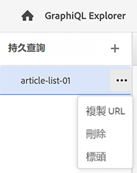

# 使用GraphiQL IDE {#graphiql-ide}

標準的實施 [GraphiQL](https://graphql.org/learn/serving-over-http/#graphiql) IDE可與Adobe Experience Manager(AEM)as a Cloud Service的GraphQL API搭配使用。

>[!NOTE]
>
>GraphiQL包含在AEM的所有環境中（但只有在配置端點時才能存取/顯示）。
>
>在以前的版本中，安裝GraphiQL IDE時需要一個包。 如果您已安裝此程式碼，現在可將其移除。

>[!NOTE]
>您必須 [已配置端點](/help/headless/graphql-api/graphql-endpoint.md) 在 [配置瀏覽器](/help/sites-cloud/administering/content-fragments/content-fragments-configuration-browser.md) ，然後再使用GraphiQL IDE。

此 **GraphiQL** 工具可讓您測試和偵錯GraphQL查詢，方法是：
* 選取 **端點** 適合您要用於查詢的Sites設定
* 直接輸入新查詢
* 建立和存取， **[持續查詢](/help/headless/graphql-api/persisted-queries.md)**
* 運行查詢以立即查看結果
* 管理 **查詢變數**
* 儲存並管理 **持續查詢**
* 發佈或取消發佈， **持續查詢** (例如，從 `dev-publish`)
* 請參閱 **歷史記錄** 您以前的查詢
* 使用 **檔案總管** 查閱檔案；可協助您了解和了解可用的方法。

您可以透過下列任一項存取查詢編輯器：

* **工具** -> **一般** -> **GraphQL查詢編輯器**
* 直接；例如， `http://localhost:4502/aem/graphiql.html`

您可以在系統上使用GraphiQL，以便客戶端應用程式可以使用GET請求來請求查詢，並發佈查詢。 就生產用途而言，您可以 [將查詢移至生產環境](/help/headless/graphql-api/persisted-queries.md#transfer-persisted-query-production). 最初供生產製作者使用以驗證含有查詢的新撰寫內容，最後供生產發佈以供即時使用。

## 選取端點 {#selecting-endpoint}

作為第一步，您需要選取 **[端點](/help/headless/graphql-api/graphql-endpoint.md)** 用於查詢。 端點適合您要用於查詢的Sites配置。

這可從右上角的下拉式清單取得。

## 建立新查詢並保留 {#creating-new-query}

您可以在編輯器中輸入新查詢，該編輯器位於中左側面板中，直接位於GraphiQL徽標下。

>[!NOTE]
>
>如果您已選取保存的查詢，並在編輯器面板中顯示，請選取 `+` (旁邊 **持續查詢**)以空白編輯器，為新查詢做好準備。

開始打字，編輯還說：

* 使用滑鼠移過來顯示有關元素的其他資訊
* 提供語法醒目提示、自動完成、自動建議等功能

>[!NOTE]
>
>GraphQL查詢通常以 `{` 字元。
>
>以 `#` 會被忽略。

使用 **另存新檔** 以保留新查詢。

## 更新保存的查詢 {#updating-persisted-query}

從 **持續查詢** 面板（最左邊）。

查詢將顯示在編輯器面板中。 進行您需要的任何變更，然後使用 **儲存** 將更新提交到持續查詢。

## 正在運行查詢 {#running-queries}

您可以立即運行新查詢，也可以載入並運行持續查詢。 若要載入持續查詢，請從清單中選取該查詢 — 該查詢將顯示在編輯器面板中。

無論是哪種情況，編輯器面板中顯示的查詢都是將在您執行下列任一操作時執行的查詢：

* 按一下/點選 **執行查詢** 圖示
* 使用鍵盤組合 `Control-Enter`

## 查詢變數 {#query-variables}

<!-- more details needed here? -->

GraphiQL IDE還允許您管理 [查詢變數](/help/headless/graphql-api/content-fragments.md#graphql-variables).

例如：

## 管理持續查詢的快取 {#managing-cache}

[持續查詢](/help/headless/graphql-api/persisted-queries.md) 建議您在dispatcher和CDN層快取這些檔案，以最終改善請求用戶端應用程式的效能。 依預設，AEM會根據預設的存留時間(TTL)，使內容傳送網路(CDN)快取失效。

使用GraphQL，您可以設定HTTP快取標題，以控制個別持續查詢的這些參數。

1. 此 **標題** 選項可透過持續查詢名稱右側的三個垂直點來存取（最左側面板）:

   

1. 選取此選項會開啟 **快取配置** 對話框：

   

1. 選取適當的參數，然後視需要調整值：

   * **快取控制** - **最大年齡**
快取可以將此內容儲存指定的秒數。 通常是瀏覽器TTL（存留時間）。
   * **替代控制** - **s-maxage**
與最大使用時間相同，但特別適用於代理快取。
   * **替代控制** - **過時重新驗證**
快取可能在快取響應過時後繼續提供快取響應，最長可以提供指定的秒數。
   * **替代控制** - **stale-if-error**
在發生或源錯誤時，快取可以在指定秒數內繼續提供快取響應。

1. 選擇 **儲存** 以保留變更。

## 發佈持續查詢 {#publishing-persisted-queries}

從清單（左側面板）中選取持續查詢後，即可使用 **發佈** 和 **取消發佈** 動作。 這會將它們啟用至您的發佈環境(例如 `dev-publish`)，讓應用程式在測試時輕鬆存取。

>[!NOTE]
>
>持續查詢快取的定義 `Time To Live` {&quot;cache-control&quot;:&quot;parameter&quot;:value}的預設值為2小時（7200秒）。

## 複製URL以直接存取查詢 {#copy-url}

此 **複製URL** 選項可讓您複製用來直接存取持續查詢並查看結果的URL，以模擬查詢。 這可用於測試；例如，透過在瀏覽器中存取：

<!--
  >[!NOTE]
  >
  >The URL will need [encoding before using programmatically](/help/headless/graphql-api/persisted-queries.md#encoding-query-url).
  >
  >The target environment might need adjusting, depending on your requirements.
-->

例如：

`http://localhost:4502/graphql/execute.json/global/article-list-01`

在瀏覽器中使用此URL可確認結果：

此 **複製URL** 選項可透過持續查詢名稱右側的三個垂直點來存取（最左側面板）:

## 刪除持續查詢 {#deleting-persisted-queries}

此 **刪除** 您也可以透過持續查詢名稱右側的三個垂直點（最左側面板）來存取選項。

<!-- what happens if you try to delete something that is still published? -->

## 在生產環境上安裝持續查詢 {#installing-persisted-query-production}

使用GraphiQL開發和測試持續存在的查詢後，最終目標是 [將其傳輸到生產環境](/help/headless/graphql-api/persisted-queries.md#transfer-persisted-query-production) 供應用程式使用。

## 鍵盤快速鍵 {#keyboard-shortcuts}

在IDE中，有一系列鍵盤快捷鍵提供了對操作表徵圖的直接訪問：

* Prettify Query:  `Shift-Control-P`
* 合併查詢：  `Shift-Control-M`
* 執行查詢：  `Control-Enter`
* 自動完成：  `Control-Space`

>[!NOTE]
>
>在一些鍵盤上， `Control` 索引鍵標示為 `Ctrl`.
