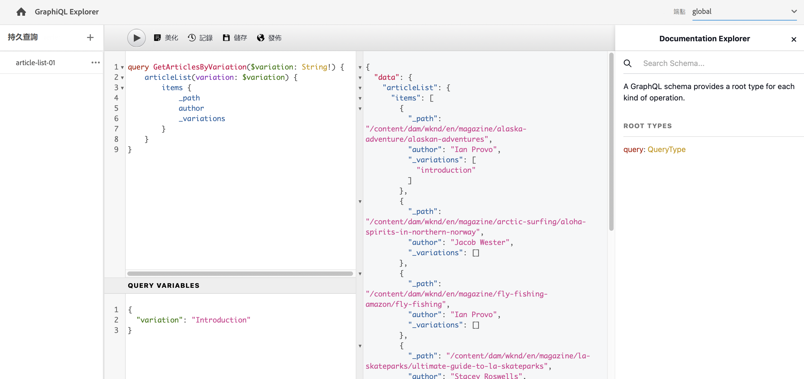

# 使用 GraphiQL IDE {#graphiql-ide}

標準 [GraphiQL](https://graphql.org/learn/serving-over-http/#graphiql) IDE 的實作可與 Adobe Experience Manager (AEM) as a Cloud Service 的 GraphQL API 搭配使用。

>[!NOTE]
>
>GraphiQL 包含在 AEM 的所有環境中 (但只有在您配定端點時才可存取/可見)。
>
>在先前版本，需要套件來安裝 GraphiQL IDE。如果您已安裝，現在可以將其移除。

>[!NOTE]
>您必須在[設定瀏覽器](/help/sites-cloud/administering/content-fragments/setup.md#enable-content-fragment-functionality-configuration-browser)中[設定您的端點](/help/headless/graphql-api/graphql-endpoint.md)，才能使用 GraphiQL IDE。

**GraphiQL** 工具可讓您透過以下方式對 GraphQL 查詢進行測試和偵錯：

* 選擇適合您要用於查詢之 Sites 設定的&#x200B;**端點**
* 直接輸入新查詢
* 建立和存取&#x200B;**[持續性查詢](/help/headless/graphql-api/persisted-queries.md)**
* 執行查詢以立即查看結果
* 管理&#x200B;**查詢變數**
* 儲存和管理&#x200B;**持續性查詢**
* 發佈或取消發佈，**持續性查詢**，至您的&#x200B;**發佈**&#x200B;或&#x200B;**預覽**&#x200B;服務；例如，至/從 `dev-publish`
* 查看您之前查詢的&#x200B;**歷史記錄**
* 使用&#x200B;**文件總管**&#x200B;以存取文件；協助您學習並了解可用的方法。

您可以從以下任一方式存取查詢編輯器：

* **工具** > **一般** > **GraphQL 查詢編輯器**
* 直接；例如 `http://localhost:4502/aem/graphiql.html`

您可以在您的系統上使用 GraphiQL，以便您的用戶端應用程式可以使用 GET 要求來要求查詢，和用於發佈查詢。如果是用於生產，您可以[將查詢移至您的生產環境](/help/headless/graphql-api/persisted-queries.md#transfer-persisted-query-production)。最初是生產編寫以使用查詢驗證新編寫的內容，最後是生產發佈以供上線取用。

## 選取您的端點 {#selecting-endpoint}

第一步，您必須選取您要用於查詢的&#x200B;**[端點](/help/headless/graphql-api/graphql-endpoint.md)**。此端點適合您要用於查詢的 Sites 設定。

這可以從右上角的下拉清單中取得。

## 建立並保留新查詢 {#creating-new-query}

您可以在編輯器中輸入新查詢 - 它位於左側中間面板，GraphiQL 標誌正下方。

>[!NOTE]
>
>如果您已經選取持續性查詢，並顯示在編輯器面板中，請選取 `+` (**持續性查詢** 旁邊) 以清空編輯器，為您的新查詢做好準備。

只要開始輸入，編輯器也會：

* 使用游標懸停以顯示有關元素的其他資訊
* 提供像是語法醒目提示、自動完成、自動建議等功能

>[!NOTE]
>
>GraphQL 查詢通常以 `{` 字元開頭。
>
>以 `#` 開頭的行將被忽略。

使用&#x200B;**另存新檔**&#x200B;保留您的新查詢。

## 更新持續性查詢 {#updating-persisted-query}

從&#x200B;**持續性查詢**&#x200B;面板 (最左側) 的清單中選取要更新的查詢。

查詢會顯示在編輯器面板中。視需要進行變更，然後使用&#x200B;**儲存**&#x200B;將更新提交到持續性查詢。

## 執行查詢 {#running-queries}

您可以立即執行新查詢，也可以載入並執行持續性查詢。若要載入持續性查詢，請從清單中選取 - 查詢會顯示在編輯器面板中。

在任何一種情況下，編輯器面板顯示的查詢，都是在您執行以下操作時會執行的查詢：

* 選取「**執行查詢**」圖示
* 使用鍵盤組合 `Control-Enter`

## 查詢變數 {#query-variables}

GraphiQL IDE 也讓您管理[查詢變數](/help/headless/graphql-api/content-fragments.md#graphql-variables)。

例如：

## 管理持續性查詢的快取 {#managing-cache}

建議使用[持續性查詢](/help/headless/graphql-api/persisted-queries.md)，因為可以在 Dispatcher 和 CDN 層進行快取，最終提升發出要求的用戶端應用程式效能。依預設，AEM 將根據預設的存留時間 (TTL) 使內容傳遞網路 (CDN) 快取失效。

>[!NOTE]
>
>請參閱「[快取持續性查詢](/help/headless/graphql-api/persisted-queries.md#caching-persisted-queries)」。

>[!NOTE]
>
>Dispatcher 上的自訂重寫規則可能會覆蓋 AEM 發佈的預設值。
>
>如果您根據位置相符模式從 Dispatcher 發送以 TTL 為主的快取控制標題，那麼，如有必要，您可能希望從相符項目中排除 `/graphql/execute.json/*`。

使用 GraphQL，您可以設定 HTTP 快取標頭來控制您個人持續性查詢的這些參數。

1. **標頭**&#x200B;選項可透過持續性查詢名稱右側的垂直三點存取 (最左側面板)：

   

1. 選取此選項會開啟&#x200B;**快取設定**&#x200B;對話框：

   

1. 選取適當的參數，然後視需要調整值：

   * **cache-control** - **max-age**
快取可以將此內容儲存達指定的秒數。通常這是瀏覽器 TTL (存留時間)。
   * **surrogate-control** - **s-maxage**
與 max-age 相同，但專門套用在 Proxy 快取。
   * **surrogate-control** - **stale-while-revalidate**
快取可能會在變得陳舊後繼續提供快取的回應服務，最長為指定的秒數。
   * **surrogate-control** - **stale-if-error**
發生來源錯誤時，快取可能會繼續提供快取的回應服務，最長為指定的秒數。

1. 選取&#x200B;**儲存**&#x200B;以保留變更。

## 發佈和預覽持續性查詢 {#publishing-previewing-persisted-queries}

從清單 (左側面板) 選取持續性查詢後，您即可使用&#x200B;**發佈**&#x200B;動作。

這會啟動對您選取的環境的查詢。您可以選擇&#x200B;**發佈**&#x200B;環境 (例如，`dev-publish`) 或是&#x200B;**預覽**&#x200B;環境，讓您的應用程式在測試時可輕鬆存取。

>[!NOTE]
>
>持續查詢的快取`Time To Live` {&quot;cache-control&quot;：&quot;parameter&quot;:value}定義的預設值為2小時（7200秒）。

## 取消發佈持續性查詢 {#unpublishing-persisted-queries}

發佈時，從清單 (左側面板) 選取持續性查詢後，您即可使用&#x200B;**發佈**&#x200B;和取消發佈動作。

這會停用您選取環境中的查詢；您的&#x200B;**發佈**&#x200B;環境，或是您的&#x200B;**預覽**&#x200B;環境。

>[!NOTE]
>
>您還應確保已對用戶端應用程式進行了必要的變更，以避免潛在的問題。

## 複製 URL 以直接存取查詢 {#copy-url}

**複製 URL** 選項可讓您複製用於直接存取持續性查詢的 URL，以模擬查詢並查看結果。然後可以將其用於測試；例如，在瀏覽器中存取：

<!--
  >[!NOTE]
  >
  >The URL needs [encoding before using programmatically](/help/headless/graphql-api/persisted-queries.md#encoding-query-url).
  >
  >The target environment might need adjusting, depending on your requirements.
-->

例如：

`http://localhost:4502/graphql/execute.json/global/article-list-01`

在瀏覽器使用此 URL，您可以確認結果：

**複製 URL**&#x200B;選項可透過持續性查詢名稱右側的垂直三點存取 (最左側面板)：

## 刪除持續性查詢 {#deleting-persisted-queries}

**刪除**&#x200B;選項也可透過持續性查詢名稱右側的垂直三點存取 (最左側面板)。

<!-- what happens if you try to delete something that is still published? -->

## 在生產環境中安裝持續性查詢 {#installing-persisted-query-production}

使用 GraphiQL 開發和測試持續性查詢後，最終目標是[將其傳送到生產環境](/help/headless/graphql-api/persisted-queries.md#transfer-persisted-query-production)以供應用程式使用。

## 鍵盤快速鍵 {#keyboard-shortcuts}

有一系列鍵盤快速鍵可用來直接存取 IDE 中的動作圖示：

* 修飾查詢：`Shift-Control-P`
* 合併查詢：`Shift-Control-M`
* 執行查詢：`Control-Enter`
* 自動完成：`Control-Space`

>[!NOTE]
>
>在某些鍵盤上，`Control` 鍵標記為 `Ctrl`。
