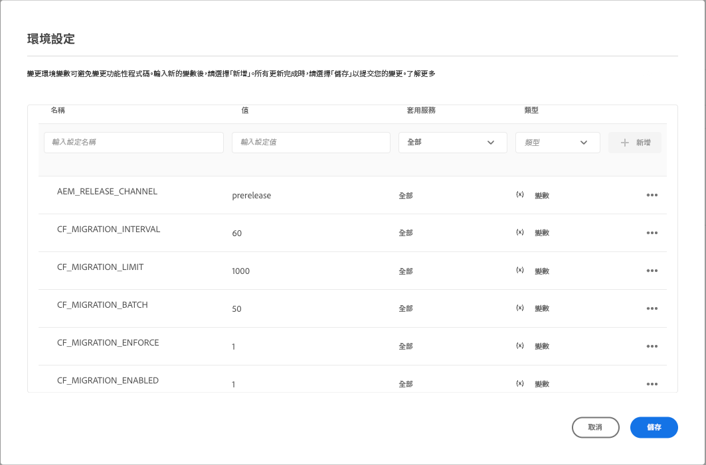

# 更新您的內容片段，以達到最佳化 GraphQL 篩選 {#updating-content-fragments-for-optimized-graphql-filtering}

若要最佳化 GraphQL 篩選器的效能，您需要運行一個程序來更新您的內容片段。

>[!NOTE]
>
>更新內容片段後，您可以依照[最佳化 GraphQL 查詢](/help/headless/graphql-api/graphql-optimization.md)的建議進行。


## 必備條件 {#prerequisites}

確保您至少擁有 2023.1.0 版本的 AEM as a Cloud Service。

## 更新您的內容片段 {#updating-content-fragments}

若要執行該程序，請使用以下步驟：

1. 透過使用 Cloud Manager UI 為您的執行個體設定以下變數來啟用更新：

   

   可用變數為：

   <table style="table-layout:auto">
    <tbody>
     <tr>
      <th> </th>
      <th>名稱</th>
      <th>值</th>
      <th>預設值</th>
      <th>服務</th>
      <th>已應用</th>
      <th>類型</th>
      <th>附註</th>
     </tr>
     <tr>
      <td>1</td>
      <td>`AEM_RELEASE_CHANNEL` </td>
      <td>`預先發佈` </td>
      <td> </td>
      <td>全部 </td>
      <td> </td>
      <td>變數 </td>
      <td>需要啟用該功能。 </td>
     </tr>
     <tr>
      <td>2</td>
      <td>`CF_MIGRATION_ENABLED` </td>
      <td>`1` </td>
      <td>`0` </td>
      <td>全部 </td>
      <td> </td>
      <td>變數 </td>
      <td>啟用(!=0) 或停用 (0) 觸發內容片段遷移作業。 </td>
     </tr>
     <tr>
      <td>3</td>
      <td>`CF_MIGRATION_ENFORCE` </td>
      <td>`1` </td>
      <td>`0` </td>
      <td>全部 </td>
      <td> </td>
      <td>變數 </td>
      <td>執行 (!=0) 內容片段的重新遷移。<br>此標幟設定為 0 將可執行 CF 的增量遷移。這表示，如果作業由於任何原因終止，則下一次執行作業將從作業被終止的那個點開始遷移。請注意，建議強制執行第一次遷移 (值=1)。 </td>
     </tr>
     <tr>
      <td>4</td>
      <td>`CF_MIGRATION_BATCH` </td>
      <td>`50` </td>
      <td>`50` </td>
      <td>全部 </td>
      <td> </td>
      <td>變數 </td>
      <td>遷移後用來儲存內容片段數量的批次大小。<br>這與多少個 CF 將在一批中儲存到存放庫有關，並且可以用來最佳化寫入存放庫的數量。 </td>
     </tr>
     <tr>
      <td>5</td>
      <td>`CF_MIGRATION_LIMIT` </td>
      <td>`1000` </td>
      <td>`1000` </td>
      <td>全部 </td>
      <td> </td>
      <td>變數 </td>
      <td>一次處理的最大數量的內容片段。<br>另請參閱 “CF_MIGRATION_INTERVAL” 的註釋。 </td>
     </tr>
     <tr>
      <td>6</td>
      <td>`CF_MIGRATION_INTERVAL` </td>
      <td>`60` </td>
      <td>`600` </td>
      <td>全部 </td>
      <td> </td>
      <td>變數 </td>
      <td>處理剩餘內容片段直到下一個限制的時間間隔 (秒)<br>此時間間隔也被視為開始作業之前的等待時間，以及處理每個後續 CF_MIGRATION_LIMIT 數量的 CF 之間的延遲。<br>(*)</td>
     </tr>
    </tbody>
   </table>

   >[!NOTE]
   >
   >(*)
   >
   >`CF_MIGRATION_INTERVAL` 值還可以幫助估計遷移作業的總執行時間。
   >
   >例如：
   >
   >* 內容片段總數 = 20,000
   >* `CF_MIGRATION_LIMIT = 1000
   >* CF_MIGRATION_INTERNAL = 60 (秒)
   >* 完成遷移所需的大約時間 = 60 + (20,000/1000 * 60) = 1260 秒 = 21 分鐘
      >  在開始時增加的額外「60」秒是由於開始作業時的初始延遲。

   >
   >您還應注意，這只是完成作業所需的&#x200B;*最短*&#x200B;時間，不包括 I/O 時間。實際花費的時間可能遠遠超過這個估計。

1. 監控更新的進度和完成情況。

   為此，請從以下位置監控作者和 golden-publish 的記錄：

   * `com.adobe.cq.dam.cfm.impl.upgrade.UpgradeJob`

      * 作者記錄；例如：

         ```shell
         23.01.2023 13:13:45.926 *INFO* [sling-threadpool-09cbdb47-4d99-4c4c-b6d5-781b635ee21b-(apache-sling-job-thread-pool)-1-Content Fragment Upgrade Job Queue Config(cfm/upgrader)] com.adobe.cq.dam.cfm.impl.upgrade.UpgradeJob This instance<dd9ffdc1-0c28-4d04-9a96-5d4d223e457e> is the leader, will schedule the upgrade schedule job.
         ...
         23.01.2023 13:13:45.941 *INFO* [sling-threadpool-09cbdb47-4d99-4c4c-b6d5-781b635ee21b-(apache-sling-job-thread-pool)-1-Content Fragment Upgrade Job Queue Config(cfm/upgrader)] com.adobe.cq.dam.cfm.impl.upgrade.UpgradeJob Scheduling content fragments upgrade from version 0 to 1, slingJobId: 2023/1/23/13/13/50e1a575-4cd7-497b-adf0-62cb5768eedb_0, enforce: true, limit: 1000, batch: 50, interval: 60s
         
         23.01.2023 13:20:40.960 *INFO* [sling-threadpool-09cbdb47-4d99-4c4c-b6d5-781b635ee21b-(apache-sling-job-thread-pool)-1-Content Fragment Upgrade Job Queue Config(cfm/upgrader)] com.adobe.cq.dam.cfm.impl.upgrade.UpgradeJob Finished content fragments upgrade in 6m, slingJobId: 2023/1/23/13/13/50e1a575-4cd7-497b-adf0-62cb5768eedb_0, status: MaintenanceJobStatus{jobState=SUCCEEDED, statusMessage='Upgrade to version '1' succeeded.', errors=[], successCount=3781, failedCount=0, skippedCount=0}
         ```
   * Golden-publish 記錄；例如：

      ```shell
      23.01.2023 12:35:05.150 *INFO* [sling-threadpool-8abcc1bb-cdcb-46d4-8565-942ad8a73209-(apache-sling-job-thread-pool)-1-Content Fragment Upgrade Job Queue Config(cfm/upgrader)] com.adobe.cq.dam.cfm.impl.upgrade.UpgradeJob This instance<ad1b399e-77be-408e-bc3f-57097498fddb> is the leader, will schedule the upgrade schedule job.
      
      23.01.2023 12:35:05.161 *INFO* [sling-threadpool-8abcc1bb-cdcb-46d4-8565-942ad8a73209-(apache-sling-job-thread-pool)-1-Content Fragment Upgrade Job Queue Config(cfm/upgrader)] com.adobe.cq.dam.cfm.impl.upgrade.UpgradeJob Scheduling content fragments upgrade from version 0 to 1, slingJobId: 2023/1/23/12/34/ad1b399e-77be-408e-bc3f-57097498fddb_0, enforce: true, limit: 1000, batch: 50, interval: 60s
      ...
      23.01.2023 12:40:45.180 *INFO* [sling-threadpool-8abcc1bb-cdcb-46d4-8565-942ad8a73209-(apache-sling-job-thread-pool)-1-Content Fragment Upgrade Job Queue Config(cfm/upgrader)] com.adobe.cq.dam.cfm.impl.upgrade.UpgradeJob Finished content fragments upgrade in 5m, slingJobId: 2023/1/23/12/34/ad1b399e-77be-408e-bc3f-57097498fddb_0, status: MaintenanceJobStatus{jobState=SUCCEEDED, statusMessage='Upgrade to version '1' succeeded.', errors=[], successCount=3781, failedCount=0, skippedCount=0}
      ```


1. 停用更新程序。

   >[!IMPORTANT]
   >
   >這是完成升級必要的步驟。

   執行更新程序後，將雲端環境變數 `CF_MIGRATION_ENABLED` 重設為 “0”，以觸發所有 pod 的回收。

   <table style="table-layout:auto">
    <tbody>
     <tr>
      <th> </th>
      <th>名稱</th>
      <th>值</th>
      <th>預設值</th>
      <th>服務</th>
      <th>已應用</th>
      <th>類型</th>
      <th>附註</th>
     </tr>
     <tr>
      <td></td>
      <td>`CF_MIGRATION_ENABLED` </td>
      <td>`0` </td>
      <td>`0` </td>
      <td>全部 </td>
      <td> </td>
      <td>變數 </td>
      <td>停用(0) (或啟用(!=0)) 觸發內容片段遷移作業。 </td>
     </tr>
    </tbody>
   </table>

   >[!NOTE]
   >
   >這對於發佈層尤為重要，因為內容更新僅在 golden-publish 上進行，並且在回收 pod 時，所有正常的 publish pod 都是以 golden-publish 為主。

1. 驗證更新程序的完成。

   您可以使用 Cloud Manager Developer Console 中的存放庫瀏覽器來驗證更新是否成功完成，以檢查內容片段資料。

   * 在第一次完整遷移之前，`cfGlobalVersion` 屬性將不存在。
因此，該屬性 (在 JCR 節點 `/content/dam` 上且值為 `1`) 的存在可確認遷移完成。

   * 您還可以查看個別內容片段的以下屬性：

      * `_strucVersion` 應具有 `1` 的值
      * `indexedData` 結構必須存在

      >[!NOTE]
      >
      >該程序將更新作者和發佈執行個體上的內容片段。
      >
      >因此，建議透過存放庫瀏覽器對&#x200B;*至少*&#x200B;一位作者&#x200B;*和*&#x200B;一個發佈執個體進行驗證。


## 限制 {#limitations}

請留意下列限制:

* GraphQL 篩選器的效能最佳化只有在完全更新所有內容片段後才有可能 (由 JCR 節點 `/content/dam` 的 `cfGlobalVersion` 屬性存在來表示)

* 如果在執行更新程序後從內容套組 (使用 `crx/de`) 匯入內容片段，則在再次執行更新程序之前，GraphQL 查詢結果中不會考慮這些內容片段。