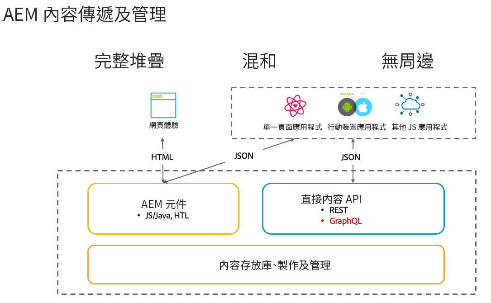

# Adobe Experience Manager無頭CMS簡介 {#introduction-aem-headless}

瞭解如何將Adobe Experience Manager(AEM)用作無頭CMS，並具有內容模型、內容片段和GraphQL API等功能，這些功能可在規模上為無頭體驗提供動力。

您可以閱讀有關各種功能的詳細文檔，並/或按照 [無頭旅程，以獲得第一步的概述](#first-steps)。

>[!NOTE]
>
>另請參閱 [什麼是無頭？](/help/headless/what-is-headless.md) 介紹無頭概念和術語。

## 概觀 {#overview}

無AEM頭是Experience Manager提供的CMS解決方案，它允許任何應用使用GraphQL通過HTTPAEM使用結構化內容（內容片段）。 無頭實施可實現跨平台和渠道的大規模體驗交付。

無頭實現與在完整堆棧和混合解決方案中的傳統方式一樣，放棄頁面和元件管理，並著重於建立內容的通道中性、可重複使用的片段及其跨通道傳送。 它是一種實現Web體驗的現代、動態的開發模式。

## 無頭功AEM能 {#aem-headless-features}

AEMas a Cloud Service是無頭實施模型的靈活工具，它提供三項強大功能：

1. **內容模型**
   * 內容模型是內容的結構化表示。
   * 「內容模型」由「內容片段模型」編輯器中AEM的資訊架構師定義。
   * 內容模型是內容片段的基礎。
1. **內容片段**
   * 基於內容模型建立內容片段。
   * 由內容作者使用內容片AEM段編輯器建立。
   * 內容片段儲存在AEM Assets，並在「資產管理」UI中進行管理。
1. **用於傳遞的內容API**
   * GraphQLAEM API支援內容片段傳遞。
   * AEM AssetsREST API支援內容片段CRUD操作。
   * 還可以通過 [內容片段核心元件的JSON導出](https://experienceleague.adobe.com/docs/experience-manager-core-components/using/components/content-fragment-component.html)。

## 無頭的第AEM一步 {#first-steps}

有幾種資源可供開始使用無AEM頭功能。 每個指南都針對不同的使用案例和受眾定制。

| 資源 | 說明 | 類型 | 對象 | 是的。 時間 |
|---|---|---|---|---|
| [無頭開發者之旅](/help/journey-headless/developer/overview.md) | **對於新來的和無AEM頭的開發人員** 從無頭理論開始，從AEM與你的第一個無頭項目一起生活開始，全面介紹其無頭特性。 | 指南 | 開發人員 **新AEM的** | 1小時 |
| [無頭設定](/help/headless/setup/introduction.md) | **對經驗豐富的AEM用戶** 需要關鍵無頭功能的AEM簡短摘要，請查看此快速入門概述。 | 引用設定 | 開發人員、管理員 **有經AEM驗** | 20分鐘 |
| [無頭動手教程](https://experienceleague.adobe.com/docs/experience-manager-learn/getting-started-with-aem-headless/graphql/multi-step/overview.html) | **如果你喜歡親力親為，並且熟AEM悉**，本教程直接介紹如何實現一個簡單的無頭應用。 | 教程 | 開發人員 | 2小時 |
| [無頭建築師之旅](/help/journey-headless/architect/overview.md) | **對於剛入行、頭AEM無腦的建築師** 技術，從此開始介紹Adobe Experience Manager as a Cloud Service強大、靈活、無頭的功能，以及如何為您的項目構建內容模型。 | 指南 | 建築師 | 1小時 |
| [無頭創作旅程](/help/journey-headless/author/overview.md) | **對於新入職和新入職的AEM業務用戶** 技術，從此開始介紹Adobe Experience Manager as a Cloud Service強大、靈活、無頭的功能，以及如何為您的項目構建內容模型。 | 指南 | 內容建立者 | 1小時 |
| [無頭翻譯之旅](/help/journey-headless/translation/overview.md) | 為那些 **對翻AEM譯方法感興趣**。 瞭解無頭技術以及如何在A到Z中建立和更新AEM翻譯項目。 | 指南 | 翻譯專家 | 1小時 |

## 比較頭和頭 {#headful-headless}

本指南重點介紹的完全無頭實施模AEM型。 不過，「頭腦」和「頭腦」不一定是二AEM選。 無頭功能可用於管理內容並將內容交付到多個觸摸點，同時還使內容作者能夠編輯單頁應用程式。 全AEM部。

>[!TIP]
>
>查看文檔 [無頭AEM](/help/implementing/developing/headful-headless.md) 的子菜單。