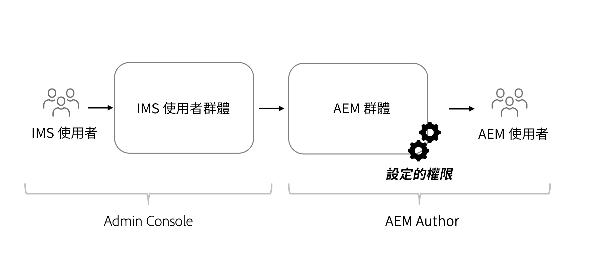

# 無頭內容的權限考量事項

透過無頭式實作，有幾個安全性和權限領域應加以處理。 權限和角色可廣泛根據AEM環境加以考量 **作者** 或 **發佈**. 每個環境包含不同的角色，且需求不同。

## 作者服務考量事項

內部使用者可在「作者」服務建立、管理和發佈內容。 權限以管理內容的不同角色為中心。

### 在群組層級管理權限

最佳作法是對AEM中的群組設定權限。 這些群組也稱為本機群組，可在AEM製作環境中管理。

要管理群組成員資格，最簡單的方式是使用AdobeIdentity Management系統(IMS)群組並指派 [IMS群組至本機AEM群組](https://experienceleague.adobe.com/docs/experience-manager-cloud-service/content/security/ims-support.html?lang=en#managing-permissions-in-aem).

從高層面講，過程是：

1. 使用將IMS使用者新增至新的或現有的IMS使用者群組 [Admin Console](https://adminconsole.adobe.com/)
1. 使用者登入時，IMS群組會與AEM同步。
1. 指派IMS群組至AEM群組。
1. 設定AEM群組的權限。
1. 當使用者登入AEM並透過IMS驗證時，將繼承AEM群組的權限。

>[!TIP]
>
> 如需管理IMS和AEM使用者及群組的詳細影片逐步說明，請參閱 [此處](https://experienceleague.adobe.com/docs/experience-manager-learn/cloud-service/accessing/overview.html).

管理 **群組** 在AEM中，導覽至 **工具** > **安全性** > **群組**.

若要在AEM中管理群組的權限，請導覽至 **工具** > **安全性** > **權限**.

### DAM使用者

在此情境中，「DAM」代表數位資產管理。 此 **DAM使用者** 是AEM中立即可用的群組，可供管理數位資產和內容片段的「日常」使用者使用。 此群組提供 **檢視**, **新增**, **更新**, **刪除**，和 **發佈** 內容片段和AEM Assets中的所有其他檔案。

如果使用IMS作為群組成員資格，請新增適當的IMS群組作為 **DAM使用者** 群組。 登入AEM環境時，IMS群組的成員會繼承DAM使用者群組的權限。

#### 自訂DAM使用者群組

最好不要直接修改現成可用群組的權限。 反之，您也可以建立以 **DAM使用者** 群組權限，並進一步限制不同存取權 **資料夾** 在AEM Assets。

如需更詳細的權限，請使用 **權限** AEM中的主控台，並從 `/content/dam` 路徑，即 `/content/dam/mycontentfragments`.

可能需要授予此使用者群組建立和編輯內容片段的權限，但不要刪除。 若要檢閱並指派權限以進行編輯，但不要刪除，請參閱 [內容片段 — 刪除考量事項](/help/sites-cloud/administering/content-fragments/content-fragments-delete.md).

### 模型編輯器

修改 **內容片段模型** 應由管理員或 **小群組** 具有提升權限的使用者。 修改內容片段模型有許多下游效果。

>[!CAUTION]
>
>修改內容片段模型會改變無周邊應用程式所依賴的基礎GraphQL API。

如果您想要建立管理內容片段模型的群組，但並非完整的管理員存取權，則可建立具有下列存取控制項目的群組：

| 路徑 | 權限 | 權限 |
|-----| -------------| ---------|
| `/conf` | **允許** | `jcr:read` |
| `/conf/<config-name>/settings/dam/cfm` | **允許** | `rep:write`, `crx:replicate` |

## 發佈服務權限

Publish服務被視為「即時」環境，通常是GraphQL API消費者與之互動的環境。 內容在Author服務上經過編輯和核准後，會發佈至Publish服務。 然後，無周邊應用程式會透過GraphQL API從發佈服務中取用已核准內容。

依預設，所有人（包括未驗證的使用者）皆可存取透過AEM Publish服務的GraphQL端點公開的內容。

### 內容權限

透過AEM GraphQL API公開的內容，可使用 [封閉用戶組(CUG)](https://experienceleague.adobe.com/docs/experience-manager-learn/assets/advanced/closed-user-groups.html) 在「資產」資料夾上設定，指定哪些AEM使用者群組（及其成員）可以存取「資產」資料夾的內容。

資產CUG的運作方式：

* 首先，拒絕對資料夾和子資料夾的所有訪問
* 然後，允許讀取CUG清單中列出的所有AEM使用者群組的資料夾和子資料夾

您可以在包含透過GraphQL API公開內容的資產資料夾上設定CUG。 AEM Publish上資產資料夾的存取權應透過使用者群組加以控制，而非直接透過使用者。 建立（或重複使用）AEM使用者群組，該群組可授予對包含GraphQL API公開內容之資產資料夾的存取權。

#### 選擇身份驗證方案{#publish-permissions-users}

此 [AEM Headless SDK](https://github.com/adobe/aem-headless-client-js#create-aemheadless-client) 支援兩種驗證類型：

* [基於令牌的驗證](/help/implementing/developing/introduction/generating-access-tokens-for-server-side-apis.md) 使用綁定到單個技術帳戶的服務憑據。
* 使用AEM使用者進行基本驗證。

### 存取GraphQL API

提供 [適當的身份驗證憑據](https://github.com/adobe/aem-headless-client-js#create-aemheadless-client) 至AEM Publish服務的GraphQL API端點包含憑證授權讀取的內容，以及可匿名存取的內容。 GraphQL API的其他使用者無法讀取受CUG保護的資料夾中的內容。
