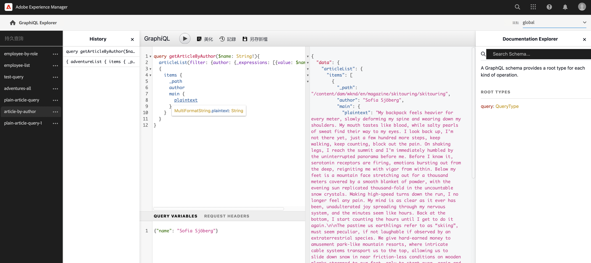

# 建立API請求 — 無頭設定 {#accessing-delivering-content-fragments}

了解如何使用GraphQL API以無周邊方式傳送內容片段內容，以及使用AEM Assets REST API管理內容片段。

## 什麼是GraphQL和Assets REST API? {#what-are-the-apis}

[既然您已建立了一些內容片段，](create-content-fragment.md) 您可以使用AEM API來無端傳送。

* [GraphQL API](/help/headless/graphql-api/content-fragments.md) 可讓您建立存取和傳送內容片段的請求。 此API提供一組最強大的功能，可用於查詢和使用內容片段內容。
   * 若要使用， [需要在AEM中定義並啟用端點](/help/headless/graphql-api/graphql-endpoint.md)，若需要，則 [已安裝GraphiQL介面](/help/headless/graphql-api/graphiql-ide.md).
* [資產REST API](/help/assets/content-fragments/assets-api-content-fragments.md) 可讓您建立和修改內容片段（和其他資產）。

本指南的其餘部分將重點介紹GraphQL訪問和內容片段交付。

## 啟用GraphQL端點 {#enable-graphql-endpoint}

必須先建立GraphQL端點，才能使用GraphQL API。

1. 導覽至 **工具**, **一般**，然後選取 **GraphQL**.
1. 選擇 **建立**。
1. 此 **建立新的GraphQL端點** 對話框將開啟。 您可以在此處指定：
   * **名稱**:端點名稱；您可以輸入任何文字。
   * **使用由提供的GraphQL架構**:使用下拉式清單來選取所需的設定。
1. 確認為 **建立**.
1. 在主控台中， **路徑** 現在會根據先前建立的設定來顯示。 這是用於執行GraphQL查詢的路徑。

   ```
   /content/cq:graphql/<configuration-name>/endpoint
   ```

有關啟用的更多詳細資訊 [可在此處找到GraphQL端點](/help/headless/graphql-api/graphql-endpoint.md).

## 使用GraphQL搭配GraphQL查詢內容

資訊架構師需要為其管道端點設計查詢，才能傳送內容。 通常，每個模型的每個端點只需考慮這些查詢一次。 為了此快速入門手冊的目的，我們只需建立指南。

GraphiQL是IDE，包含在AEM環境中；在您之後可存取/顯示 [配置端點](#enable-graphql-endpoint).

1. 登入AEMas a Cloud Service並存取GraphiQL介面：

   您可以透過下列任一項存取查詢編輯器：

   * **工具** -> **一般** -> **GraphQL查詢編輯器**
   * 直接；例如， `http://localhost:4502/aem/graphiql.html`

1. GraphiQL IDE是GraphQL的瀏覽器內查詢編輯器。 您可以使用它建立查詢來擷取內容片段，以便以JSON無頭方式傳送。
   * 右上角的下拉式清單可讓您選取端點。
   * 左側的面板會列出持續存在的查詢（若有）
   * 左中角的面板可讓您建立查詢。
   * 右中角的面板會顯示結果。
   * 查詢編輯器具有代碼完成功能和可輕鬆執行查詢的快捷鍵。

   

1. 假設我們建立的模型 `person` 使用欄位 `firstName`, `lastName`，和 `position`，我們可以建立簡單查詢來擷取內容片段的內容。

   ```text
   query 
   {
     personList {
       items {
         _path
         firstName
         lastName
         position
       }
     }
   }
   ```

1. 在左側面板中輸入查詢。
   

1. 按一下 **執行查詢** 按鈕或使用 `Ctrl-Enter` 快捷鍵和結果會在右側面板中顯示為JSON。
   

1. 按一下 **檔案** 頁面右上角的連結，以顯示內容內檔案，協助您建立可適應您自己模型的查詢。
   

GraphQL啟用結構化查詢，這些查詢不僅可以定位特定的資料集或單個資料對象，還可以提供對象的特定元素、嵌套結果、對查詢變數的支援等。

GraphQL可避免迭代API要求以及過度傳送，而可大量傳送要求，以回應單一API查詢，即可呈現所需的內容。 產生的JSON可用來傳送資料至其他網站或應用程式。

## 後續步驟 {#next-steps}

就這樣！ 您現在對AEM中無頭式內容管理有了基本的了解。 當然，您還可以透過更多資源更進一步深入了解可用功能。

* **[內容片段](/help/sites-cloud/administering/content-fragments/content-fragments.md)**  — 如需建立和管理內容片段的詳細資訊
* **[AEM Assets HTTP API中的內容片段支援](/help/assets/content-fragments/assets-api-content-fragments.md)**  — 如需透過CRUD作業（建立、讀取、更新、刪除）直接存取AEM內容的詳細資訊
* **[GraphQL API](/help/headless/graphql-api/content-fragments.md)**  — 如需如何無謂傳送內容片段的詳細資訊
