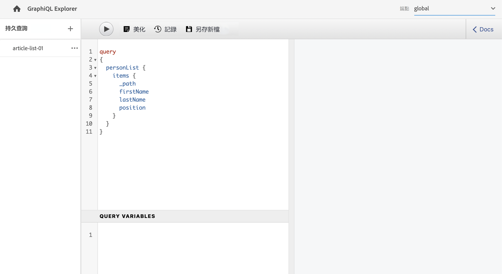

# 建立API請求 — 無頭設定 {#accessing-delivering-content-fragments}

瞭解如何使用GraphQL API來無頭地傳遞內容片段內容和資AEM產REST API來管理內容片段。

## 什麼是GraphQL和Assets REST API? {#what-are-the-apis}

[既然你已經建立了一些內容片段，](create-content-fragment.md) 你可以用AEMAPI來無端傳送它們。

* [GraphQL API](/help/headless/graphql-api/content-fragments.md) 允許您建立訪問和傳遞內容片段的請求。 此API提供了一組最強健的功能，用於查詢和使用內容片段內容。
   * 要使用它， [端點需要在中定義和啟AEM用](/help/headless/graphql-api/graphql-endpoint.md)，如果需要， [已安裝GraphiQL介面](/help/headless/graphql-api/graphiql-ide.md)。
* [資產REST API](/help/assets/content-fragments/assets-api-content-fragments.md) 允許您建立和修改內容片段（和其他資產）。

本指南的其餘部分將重點介紹GraphQL訪問和內容片段交付。

## 啟用GraphQL終結點 {#enable-graphql-endpoint}

必須先建立GraphQL終結點，然後才能使用GraphQL API。

1. 導航到 **工具**。 **常規**，然後選擇 **圖形QL**。
1. 選擇 **建立**。
1. 的 **建立新GraphQL終結點** 對話框。 您可以在此處指定：
   * **名稱**:端點名稱；可以輸入任何文本。
   * **使用由提供的GraphQL架構**:使用下拉清單選擇所需的配置。
1. 確認 **建立**。
1. 在控制台中 **路徑** 現在將基於先前建立的配置顯示。 這是用於執行GraphQL查詢的路徑。

   ```
   /content/cq:graphql/<configuration-name>/endpoint
   ```

有關啟用的詳細資訊 [可在此處找到GraphQL端點](/help/headless/graphql-api/graphql-endpoint.md)。

## 使用帶有GraphiQL的GraphQL查詢內容

資訊架構師需要為其渠道端點設計查詢，以便提供內容。 通常，每個模型的每個端點只需考慮一次這些查詢。 為了完成本入門指南的目的，我們只需建立一個。

GraphiQL是IDE，包含在您的AEM環境中；它在您之後可訪問/可見 [配置終端節點](#enable-graphql-endpoint)。

1. 登錄到AEMas a Cloud Service並訪問GraphiQL介面：

   可以從以下任一位置訪問查詢編輯器：

   * **工具** -> **常規** -> **GraphQL查詢編輯器**
   * 直接；比如說， `http://localhost:4502/aem/graphiql.html`

1. GraphiQL IDE是GraphQL的瀏覽器內查詢編輯器。 您可以使用它構建查詢以檢索內容片段，以JSON形式無頭地傳遞這些內容片段。
   * 右上下拉框允許您選擇端點。
   * 最左側的面板列出保留的查詢（如果可用）
   * 中左側面板允許您生成查詢。
   * 中右面板顯示結果。
   * 查詢編輯器具有代碼完成和熱鍵，以便輕鬆執行查詢。

   

1. 假設我們建立的模型被稱為 `person` 帶 `firstName`。 `lastName`, `position`，我們可以構建一個簡單的查詢來檢索內容片段的內容。

   ```text
   query 
   {
     personList {
       items {
         _path
         firstName
         lastName
         position
       }
     }
   }
   ```

1. 在左面板中輸入查詢。
   

1. 按一下 **執行查詢** 按鈕或 `Ctrl-Enter` 熱鍵和結果在右面板中顯示為JSON。
   

1. 按一下 **文檔** 連結到頁面右上角以顯示上下文文檔，以幫助您構建適應您自己模型的查詢。
   

GraphQL支援結構化查詢，不僅可以針對特定資料集或單個資料對象，還可以提供對象的特定元素、嵌套結果、支援查詢變數等。

GraphQL可以避免迭代API請求和過量傳遞，而是允許批量傳遞對單個API查詢的響應而進行呈現所需的內容。 生成的JSON可用於將資料傳遞到其他站點或應用。

## 後續步驟 {#next-steps}

就這樣！ 您現在對中的無頭內容管理有了基本的了AEM解。 當然，您還有更多資源可以深入瞭解可用功能。

* **[內容片段](/help/assets/content-fragments/content-fragments.md)**  — 有關建立和管理內容片段的詳細資訊
* **[AEM AssetsHTTP API中的內容片段支援](/help/assets/content-fragments/assets-api-content-fragments.md)**  — 有關通過HTTP API直接訪AEM問內容的詳細資訊，請通過CRUD操作（建立、讀取、更新、刪除）
* **[GraphQL API](/help/headless/graphql-api/content-fragments.md)**  — 有關如何無頭傳送內容片段的詳細資訊
