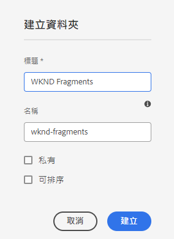

# 建立資產資料夾 — 無頭設定 {#creating-an-assets-folder}

使用AEM內容片段模型來定義內容片段的結構，內容片段是無頭內容的基礎。 然後，內容片段儲存在資產資料夾中。

## 什麼是資產資料夾？ {#what-is-an-assets-folder}

[現在您已建立內容片段模型](create-content-model.md) 定義您希望為將來的內容片段定義的結構，您可能很興奮地建立一些片段。

但是，您首先需要建立一個資產資料夾來儲存這些資產。

資產資料夾用於 [組織傳統內容資產](/help/assets/manage-digital-assets.md) 比如影像和視頻以及內容片段。

## 如何建立資產資料夾 {#how-to-create-an-assets-folder}

管理員在建立內容時只需偶爾建立資料夾即可組織內容。 為了完成本入門指南的目的，我們只需建立一個資料夾。

1. 登錄AEM到as a Cloud Service並從主菜單選擇 **導航 — >資產 — >檔案**。
1. 點擊或按一下 **建立 — >資料夾**。
1. 提供 **標題** 和 **名稱** 資料夾。
   * 的 **標題** 應該是描述性的。
   * 的 **名稱** 將成為儲存庫中的節點名稱。
      * 根據標題自動生成並根據 [命AEM名約定。](/help/implementing/developing/introduction/naming-conventions.md)
      * 必要時可進行調整。

   
1. 選擇剛才通過懸停並點擊複選標籤建立的資料夾。 然後選擇 **屬性** 的 `p` [鍵盤快捷鍵。](/help/sites-cloud/authoring/getting-started/keyboard-shortcuts.md))
1. 在 **屬性** ，選擇 **Cloud Services** 頁籤。
1. 對於 **雲配置** 選擇 [配置。](create-configuration.md)

   
1. 點擊或按一下 **保存並關閉**。
1. 點擊或按一下 **確定** 的子菜單。

   

您可以在剛剛建立的資料夾中建立其他子資料夾。 子資料夾將繼承 **雲配置** 的子菜單。 但是，如果您希望使用其他配置中的模型，則可以覆蓋此項。

如果使用本地化的站點結構，則 [建立語言根](/help/assets/translate-assets.md) 在新資料夾下。

## 後續步驟 {#next-steps}

現在，您已為「內容片段」建立了資料夾，您可以轉到入門指南的第四部分， [建立內容片段。](create-content-fragment.md)

>[!TIP]
>
>有關管理內容片段的完整詳細資訊，請參見 [內容片段文檔](/help/assets/content-fragments/content-fragments.md)
