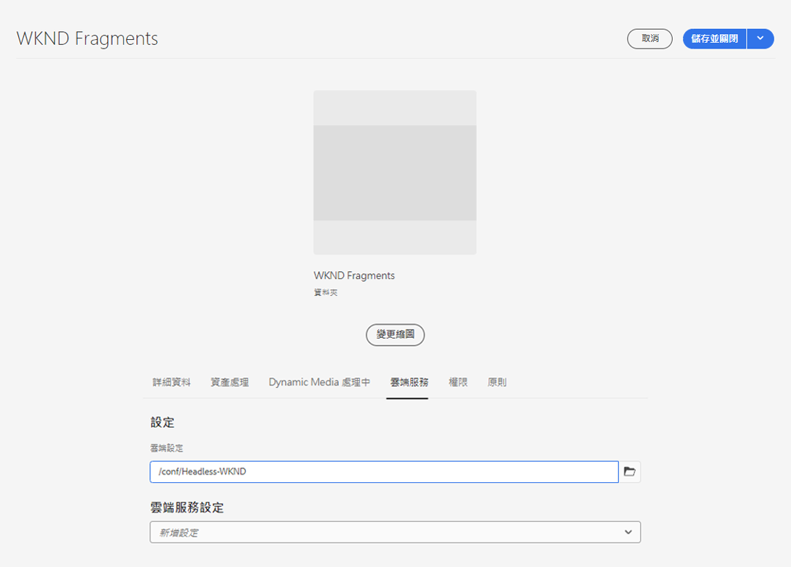

# 建立資產資料夾 — 無頭設定 {#creating-an-assets-folder}

使用AEM內容片段模型來定義內容片段的結構，這是您無頭內容的基礎。 內容片段接著會儲存在資產資料夾中。

## 什麼是資產資料夾？ {#what-is-an-assets-folder}

[現在您已建立內容片段模型](create-content-model.md) 定義您未來內容片段所需的結構，您可能很樂於建立一些片段。

不過，您首先需要建立資產資料夾，以便儲存這些資產。

資產資料夾用於 [組織傳統內容資產](/help/assets/manage-digital-assets.md) 例如影像和視訊，以及內容片段。

## 如何建立資產資料夾 {#how-to-create-an-assets-folder}

管理員只需偶爾建立資料夾，即可在建立內容時加以組織。 在本快速入門手冊中，我們只需建立一個資料夾。

1. 登入AEMas a Cloud Service，然後從主功能表選取 **導覽 — >資產 — >檔案**.
1. 點選或按一下 **建立 — >資料夾**.
1. 提供 **標題** 和 **名稱** 的URL。
   * 此 **標題** 應是描述性的。
   * 此 **名稱** 會成為存放庫中的節點名稱。
      * 根據標題自動產生並根據 [AEM命名慣例。](/help/implementing/developing/introduction/naming-conventions.md)
      * 如有需要，可加以調整。

   
1. 通過懸停和點選複選標籤來選擇剛建立的資料夾。 然後選取 **屬性** (或使用 `p` [鍵盤快速鍵。](/help/sites-cloud/authoring/getting-started/keyboard-shortcuts.md))
1. 在 **屬性** ，選擇 **Cloud Services** 標籤。
1. 若 **雲端設定** 選取 [您先前建立的設定。](create-configuration.md)

   
1. 點選或按一下 **儲存並關閉**.
1. 點選或按一下 **確定** 在確認窗口中。

   

您可以在剛建立的資料夾中建立其他子資料夾。 子資料夾將繼承 **雲端設定** 父資料夾中。 但是，如果您想使用其他配置的模型，則可以覆蓋此項。

如果您使用本地化的網站結構，您可以 [建立語言根](/help/assets/translate-assets.md) 新資料夾下。

## 後續步驟 {#next-steps}

現在您已為內容片段建立資料夾，您可以繼續前往快速入門手冊的第四部分，以及 [建立內容片段](create-content-fragment.md).

>[!TIP]
>
>如需管理內容片段的完整詳細資訊，請參閱 [內容片段檔案](/help/sites-cloud/administering/content-fragments/content-fragments.md)
