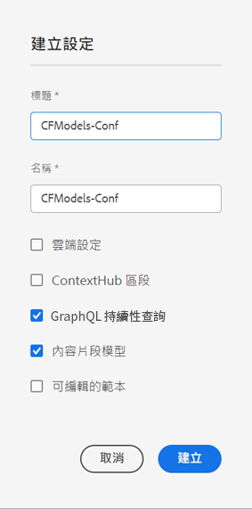

# 建立配置 — 無頭安裝 {#creating-configuration}

作為as a Cloud Service中無頭入門的第一AEM步，您需要建立配置。

## 什麼是配置？ {#what-is-a-configuration}

「配置瀏覽器」為中的配置提供了通用配置API、內容結構、解析機AEM制。

在中的無頭內容管理上下AEM文中，請將配置視為一個工作區AEM，您可以在其中建立內容模型，該模型定義將來內容和內容片段的結構。 您可以有多種配置來分隔這些模型。

如果你熟悉 [全棧實現中的頁面AEM模板，](/help/sites-cloud/authoring/features/templates.md) 在管理內容模型時，配置的使用方式相似。

## 如何建立配置 {#how-to-create-a-configuration}

管理員只需建立一次配置，或在組織內容模型需要新工作區時非常自行地建立一次配置。 為了本入門指南的目的，我們只需建立一個配置。

1. 登錄AEM到as a Cloud Service並從主菜單選擇 **工具 — >常規 — >配置瀏覽器**。
1. 提供 **標題** 和 **名稱** 的下界。
   * 的 **標題** 應該是描述性的。
   * 的 **名稱** 將成為儲存庫中的節點名稱。
      * 根據標題自動生成並根據 [命AEM名約定。](/help/implementing/developing/introduction/naming-conventions.md)
      * 必要時可進行調整。
1. 檢查以下選項：
   * **內容片段模型**
   * **GraphQL永續查詢**

   

1. 點擊或按一下 **建立**

如果需要，可以建立多個配置。 配置也可嵌套。

>[!NOTE]
>
>除了 **內容片段模型** 和 **GraphQL永續查詢** 可能是必要的，具體取決於您的實施要求。

## 後續步驟 {#next-steps}

使用此配置，您現在可以轉到入門指南的第二部分， [建立內容片段模型。](create-content-model.md)

>[!TIP]
>
>有關配置瀏覽器的完整詳細資訊， [請參閱配置瀏覽器文檔。](/help/implementing/developing/introduction/configurations.md)
