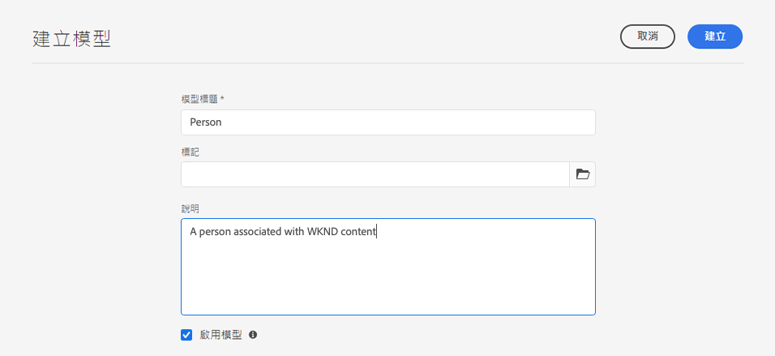

# 建立內容片段模型 - Headless 設定 {#creating-content-fragment-models}

針對您將建立並使用 AEM Headless 功能提供的內容，使用內容片段模型來定義該內容的結構。

## 什麼是內容片段模型？ {#what-are-content-fragment-models}

[現在您已經建立設定，](create-configuration.md)您可以使用它來建立內容片段模型。

內容片段模型定義您在 AEM 中建立和管理之資料和內容的結構。它們做為您內容的支架。選擇建立內容時，您的作者會從您定義的內容片段模型中進行選擇，這會引導他們建立內容。

## 如何建立內容片段模型 {#how-to-create-a-content-fragment-model}

資訊架構師只會在需要新模型時偶爾執行這些任務。基於本快速入門指南的目的，我們只需要建立一個模型。

1. 登入 AEM as a Cloud Service 並從主選單選取&#x200B;**工具**、**一般**、**內容片段模型**。
1. 選取透過建立您的設定所建立的資料夾。

   
1. 選擇 **建立**。
1. 提供&#x200B;**模型標題**、**標記**&#x200B;和&#x200B;**描述**。您也可以選擇/取消選擇&#x200B;**啟用模型** 以控制模型是否在建立時立即啟用。

   
1. 在確認視窗中，選取 **開啟** 以設定您的模型。

   
1. 使用&#x200B;**內容片段模型編輯器**，從&#x200B;**資料類型**&#x200B;欄拖放欄位，來建立您的內容片段模型。

   

1. 放入欄位後，您必須設定其屬性。編輯器將自動切換到新增之欄位的&#x200B;**屬性**&#x200B;索引標籤，您可在其中提供必要欄位。

   

1. 當您完成模型建立後，選取 **儲存**.

1. 新建立之模型的模式取決於在建立模型時是否選取&#x200B;**啟用模型**：
   * 選取 - 新模型已&#x200B;**啟用**
   * 未選取 - 新模型會以&#x200B;**草稿**&#x200B;模式建立

1. 如果尚未啟用，模型必須&#x200B;**啟用**&#x200B;才能使用。
   1. 選取您剛建立的模型，然後選取 **啟用**.

      
   1. 點選或按一下確認對話框中的&#x200B;**啟用**&#x200B;以確認要啟用模型。

      
1. 該模型現已啟用並可以使用。

   

**內容片段模型編輯器**&#x200B;支援許多不同的資料類型，例如簡單文字欄位、資產參考、對其他模型的參考和 JSON 資料。

您可以建立多個模型。模型可以參考其他內容片段。使用[設定](create-configuration.md)來組織您的模型。

## 後續步驟 {#next-steps}

現在您已經透過建立模型來定義內容片段的結構，您可以繼續此快速入門指南的第三部分，並[建立用於儲存片段的資料夾。](create-assets-folder.md)

>[!TIP]
>
>如需內容片段模型的完整詳細資訊，請參閱[內容片段模型文件](/help/sites-cloud/administering/content-fragments/content-fragment-models.md)
