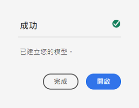
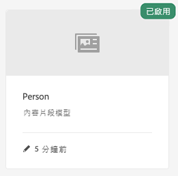

# 建立內容片段模型 — 無頭設定 {#creating-content-fragment-models}

使用「內容片段模型」，定義您要使用AEM無頭功能建立和提供的內容結構。

## 什麼是內容片段模型？ {#what-are-content-fragment-models}

[既然您已建立設定，](create-configuration.md) 您可以使用它建立內容片段模型。

內容片段模型會定義您要在AEM中建立和管理的資料和內容的結構。 它們可以充當內容的支架。 選擇建立內容時，作者將從您定義的內容片段模型中選取，以引導他們建立內容。

## 如何建立內容片段模型 {#how-to-create-a-content-fragment-model}

資訊架構師只會偶爾執行這些工作，因為需要新模型。 在本快速入門手冊中，我們只需建立一個模型。

1. 登入AEMas a Cloud Service，然後從主功能表選取 **工具**, **一般**, **內容片段模型**.
1. 點選或按一下建立設定所建立的資料夾。

   
1. 點選或按一下 **建立**.
1. 提供 **模型標題**, **標籤** 和 **說明**. 您也可以選取/取消選取 **啟用模型** 以控制建立時是否立即啟用模型。

   
1. 在確認視窗中，點選或按一下 **開啟** 來設定模型。

   
1. 使用 **內容片段模型編輯器**，請拖放欄位至 **資料類型** 欄。

   

1. 放置欄位後，必須配置其屬性。 編輯器會自動切換至 **屬性** 索引標籤，用於新增的欄位，您可在其中提供必填欄位。

   

1. 完成模型構建後，點選或按一下 **儲存**.

1. 新建立模型的模式取決於您是否選取 **啟用模型** 建立模型時：
   * 已選取 — 新模型將已 **已啟用**
   * 未選取 — 將在中建立新模型 **草稿** 模式

1. 如果尚未啟用，則模型必須 **已啟用** 才能使用。
   1. 選取剛建立的模型，然後點選或按一下 **啟用**.

      
   1. 點選或按一下以確認啟用模型 **啟用** 在確認對話方塊中。

      
1. 模型現已啟用並可供使用。

   

此 **內容片段模型編輯器** 支援許多不同的資料類型，例如簡單文字欄位、資產參考、其他模型的參考，以及JSON資料。

您可以建立多個模型。 模型可參考其他內容片段。 使用 [配置](create-configuration.md) 來組織模型。

## 後續步驟 {#next-steps}

現在您已透過建立模型來定義內容片段的結構，您可以繼續前往快速入門手冊的第三部分，以及 [建立資料夾，供您自行儲存片段。](create-assets-folder.md)

>[!TIP]
>
>如需內容片段模型的完整詳細資訊，請參閱 [內容片段模型檔案](/help/sites-cloud/administering/content-fragments/content-fragments-models.md)
