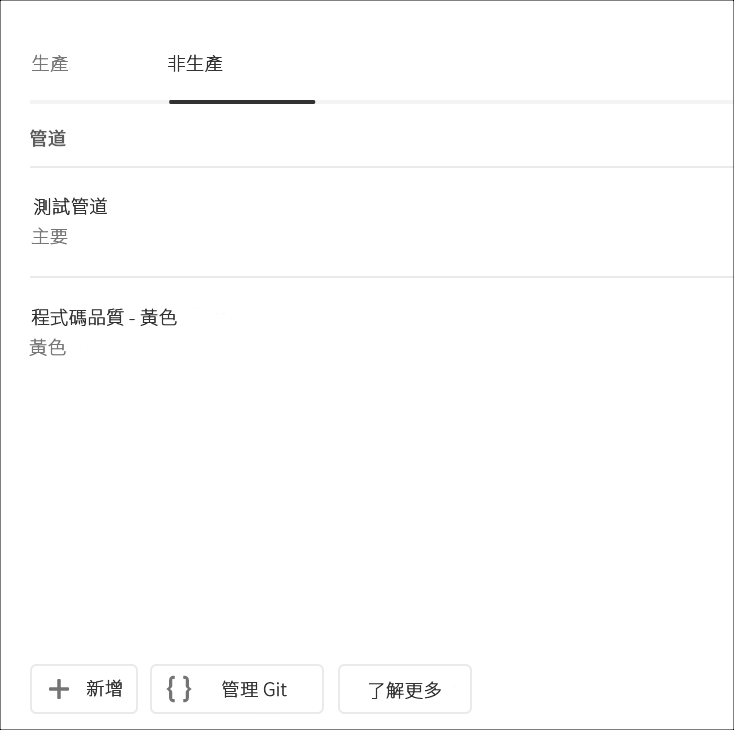
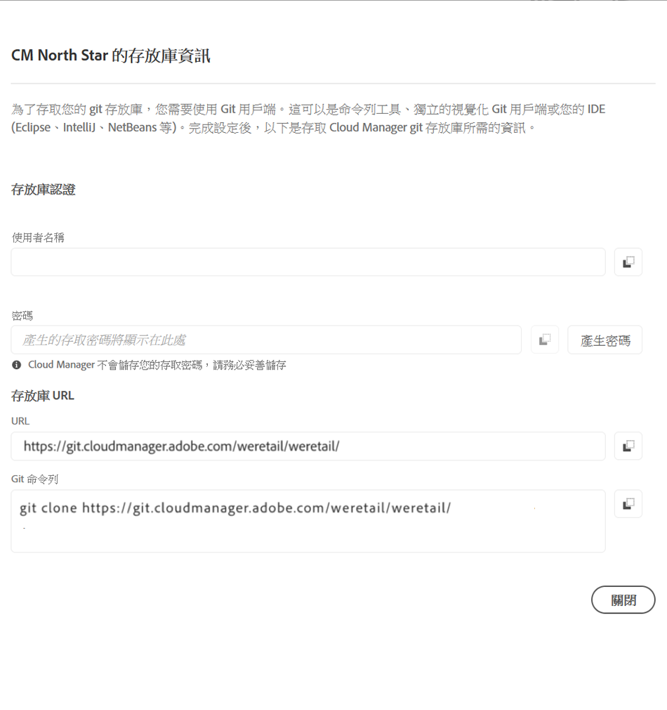

# 存取 Git {#accessing-git}

您可以使用Cloud Manager UI中的自助服務Git帳戶管理來存取和管理您的Git儲存庫。

## 使用自助服務Git帳戶管理{#self-service-git}

使用Cloud Manager UI中提供的&#x200B;**管理Git**&#x200B;按鈕，最顯眼的位置在管道卡上。

1. 導航至&#x200B;*程式的「概述」(Overview)*&#x200B;頁面和「管線」(Pipelines)卡。

1. 您將查看&#x200B;**管理Git**&#x200B;選項以訪問和管理Git儲存庫。

   

   此外，如果您選擇「**非生產**」管線標籤，您也會在此處檢視「管理Git **」選項。**

   

>[!NOTE]
>「開發人員」或「部署管理員」角色中的使用者可看到「管理Git」選項。 ****&#x200B;按一下此按鈕會開啟對話方塊，讓使用者可以找到其Cloud Manager Git儲存庫的URL，以及其使用者名稱和密碼。

在Cloud Manager中管理Git的重要考量事項包括：

* **URL**:儲存庫URL
* **使用者名稱**:用戶名
* **密碼**:按一下「生成密碼」 **按鈕時顯示** 的值。

>[!NOTE]
>
>使用者可以取出其程式碼的副本，並在本機程式碼儲存庫中進行變更。 當使用者準備就緒後，就可以將其程式碼變更提交回Cloud Manager的遠端程式碼儲存庫。

