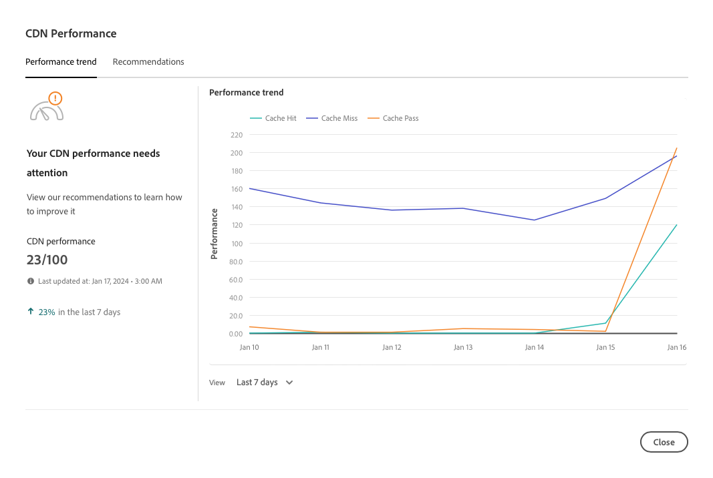

# CDN效能儀表板 {#cdn-performance}

瞭解Cloud Manager如何評估內容傳遞網路(CDN)效能，以及您可以從儀表板瞭解哪些內容。

## 概觀 {#overview}

每個Cloud Manager方案都有一個CDN效能儀表板。 此儀表板提供CDN效能的整體分數，以及趨勢、警報和必要的改善建議。


## 存取控制面板 {#accessing}

CDN控制面板可在每個計畫的概觀頁面上取得。

1. 在 [my.cloudmanager.adobe.com](https://my.cloudmanager.adobe.com/) 登入 Cloud Manager 並選取適當的組織。

1. 在&#x200B;**[我的計畫](/help/implementing/cloud-manager/navigation.md#my-programs)**&#x200B;主控台上，按一下您要檢視其CDN儀表板的計畫。

   

1. 在您的方案的&#x200B;**方案總覽**&#x200B;頁面上，向下捲動至&#x200B;**環境**&#x200B;和&#x200B;**管道**&#x200B;卡片下方，檢視&#x200B;**效能**&#x200B;卡。

   

## 使用控制面板 {#using}

儀表板會提供CDN效能的整體分數，以及趨勢、警報和必要的改善建議。


如需CDN效能的詳細資訊及改善建議，請按一下&#x200B;**檢視趨勢**。



按一下圖表下方的&#x200B;**檢視**&#x200B;以變更圖表的時間範圍。

如需如何改善CDN效能的建議，請選取&#x200B;**建議**&#x200B;索引標籤。


按一下清單中任何建議旁的>形箭號，以檢視關於採取哪些步驟改善及問題原因的詳細資訊。

## 快取點選定義 {#cache-hit}

快取命中率是測量快取可成功填入多少內容要求，以及接收多少要求。 快取命中率越高，CDN的執行效能就越好。

>[!TIP]
>
>Adobe建議使用者將快取命中率設為99%。

```text
Cache Hit Ratio = Cache Hits / (Hits + Misses + Passes + Other)
```

* **點選** — 從快取要求資料，但找到資料。
* **未命中** — 已從快取要求資料，但找不到資料。
* **傳遞** — 要求快取中的資料，而且已設定為在任何情況下都不會快取此資料。
* **Other** — 快取中不符合任何其他大小寫的所有資料要求。

快取量度每24小時更新一次。

>[!TIP]
>
>如需Cloud Manager和CDN如何與Dispatcher互動的詳細資訊，請參閱[在AEM as a Cloud Service中快取](/help/implementing/dispatcher/caching.md)。
