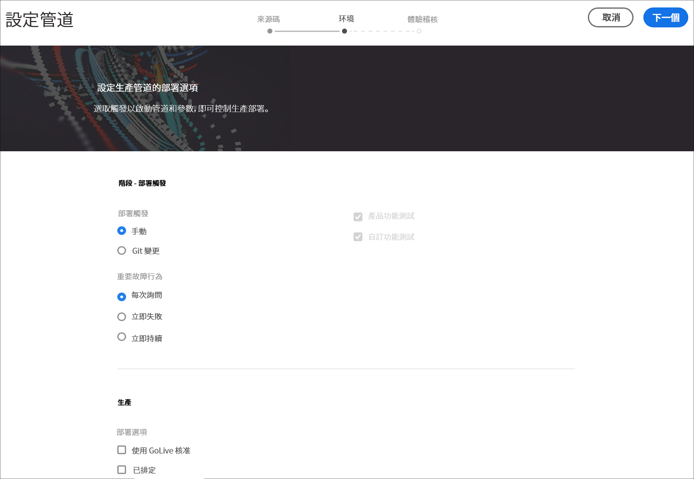

# 設定 CI-CD 管線 {#configure-ci-cd-pipeline}

在Cloud Manager中，有兩種類型的管道：

* **生產管道**:

   只有建立生產和舞台環境集後，才可添加生產管線。

   如需詳細 [資訊，請參閱「設定生產管道](configure-pipeline.md#setting-up-the-pipeline) 」。

* **非生產管道**:

   您可從Cloud Manager的使用者介面，從「 **概述** 」頁面新增非生產管道。

   如需詳 [細資訊，請參閱非生產與程式碼僅品質管道](configure-pipeline.md#non-production-pipelines) 。

>[!NOTE]
>要配置管線，您必須：
> * 定義將啟動管線的觸發器。
> * 定義控制生產部署的參數。
> * 配置效能測試參數。

## 設定生產管線 {#setting-up-production-pipeline}

部署管理員負責設定生產管道。

>[!NOTE]
>在程式建立完成、Git儲存庫至少具有一個分支並且建立了「生產」和「階段」環境集之前，不能設定「生產管線」。

在開始部署程式碼之前，您必須從 [!UICONTROL Cloud Manager設定管道設定]。

>[!NOTE]
>
>可在初始設定後更改管線設定。

## 從 [!UICONTROL Cloud Manager配置管線設定] {#configuring-the-pipeline-settings-from-cloud-manager}

一旦您設定了程式，並且使用 [!UICONTROL Cloud Manager] UI至少擁有一個環境，您就可以準備好設定部署管道。

請依照下列步驟來設定管道的行為和偏好設定：

1. 按一下「 **設定管線** 」(Setup Pipeline)以設定和配置管線。

   

1. 將顯 **示「設定管線** 」螢幕。 選擇分支，然後按一下「下 **一步」**。

   

1. 設定您的部署選項。

   

   可定義觸發器以啟動管線：

   * **手動** -使用UI手動啟動管線。
   * **On Git Changes** —— 每當有提交添加到配置的git分支時，啟動CI/CD管線。 即使選取此選項，也始終可以手動啟動管線。

   在管線設定或編輯期間，「部署管理器」(Deployment Manager)可以選擇在任何質量門中遇到重要故障時定義管線的行為。

   這對希望實現更自動化流程的客戶非常有用。 可用的選項包括：

   * **每次詢問** -這是預設設定，需要手動干預任何重要故障。
   * **立即失敗** -如果選中此選項，當出現「重要」(Impertient)故障時，管線將被取消。 這實際上是模擬使用者手動拒絕每個失敗。
   * **立即繼續** -如果選中此選項，則每當出現「重要」(Impertient)故障時，管線將自動繼續。 這實際上是在模擬用戶手動批准每個故障。

1. 生產管線設定包含標示為「體驗稽核」的第 **三個標籤**。

   

   此選項提供應一律包含在「體驗稽核」中的URL路徑表格。 使用者可以手動輸入要包含的URL路徑。 最多可包含25列。 如果使用者在此區段中未提交任何頁面，預設會將網站的首頁納入體驗稽核。

   >[!NOTE]
   > 設定的頁面會提交至服務，並根據效能、協助工具、搜尋引擎最佳化(SEO)、最佳實務和PWA（漸進式網頁應用程式）測試進行評估。

   如需詳細 [資訊，請參閱瞭解體驗稽核結果](/help/implementing/cloud-manager/experience-audit-testing.md) 。

   按一 **下「新增頁面覆寫** 」，提供要包含在「體驗稽核」中的URL路徑。 新增路徑後，按一下「 **儲存**」。

   

1. 從「編 **輯管線** 」(Edit Pipeline **** )螢幕中按一下「保存」(Save)。 「概 **述」頁** ，現在會顯示「 **部署您的計畫** 」卡。 按一 **下「部署** 」按鈕以部署您的程式。

   

## 非生產和代碼純質量管道 {#non-production-pipelines}

除了部署到生產階段的主管道外，客戶還可以設定額外的管道，即非生 **產管道**。 這些管線始終執行構建和代碼質量步驟。 他們也可以選擇性地部署至Adobe Managed Services環境。

在主螢幕上，新卡中列出了以下管線：

1. 從Cloud Manager **主畫面存取「非生產管道** 」圖格。

   

1. 按一下「添 **加** 」(Add)按鈕，指定「管線名稱」(Pipeline Name)、「管線類型」(Pipeline Type)和「Git分支」(Git Branch)。

   此外，還可以從Pipeline Options中設定部署觸發器和重要故障行為。

   

1. 按一 **下「儲存** 」(Save)，主畫面上的資訊卡上會顯示管線，並有三個動作，如下所示：

   

   * **編輯** -允許編輯管線設定
   * **Build** —— 導航到執行頁，可從中執行管線
   * **管理Git** —— 允許用戶獲取訪問Cloud Manager Git儲存庫所需的資訊

## 後續步驟 {#the-next-steps}

在設定管道後，您需要部署程式碼。

如需詳細 [資訊，請參閱](deploy-code.md) 「部署程式碼」。
