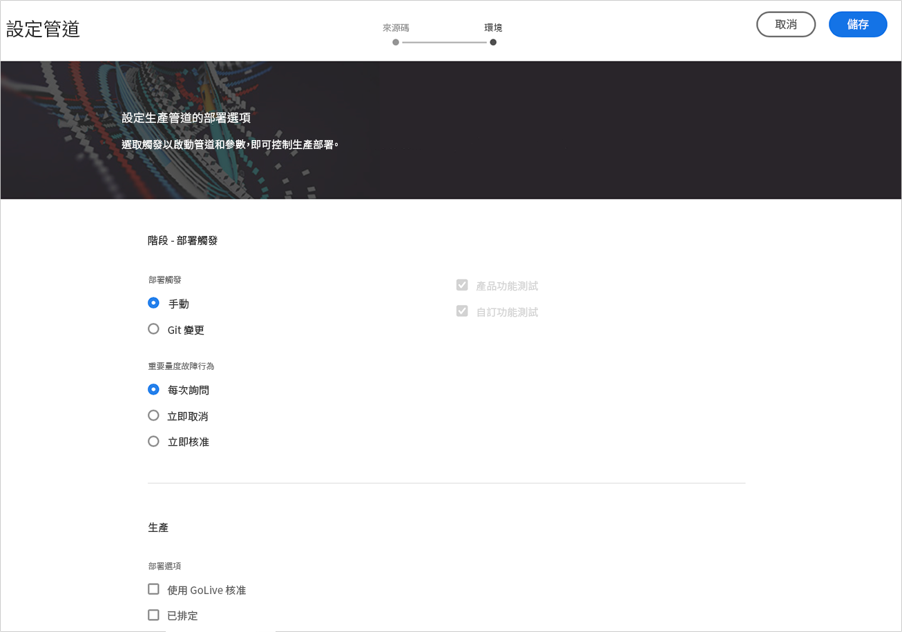
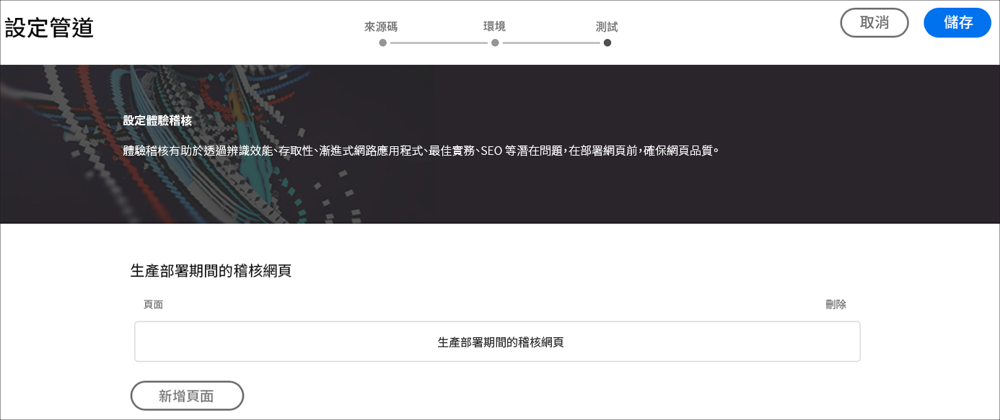
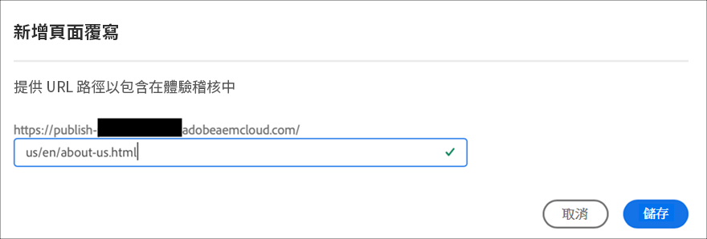
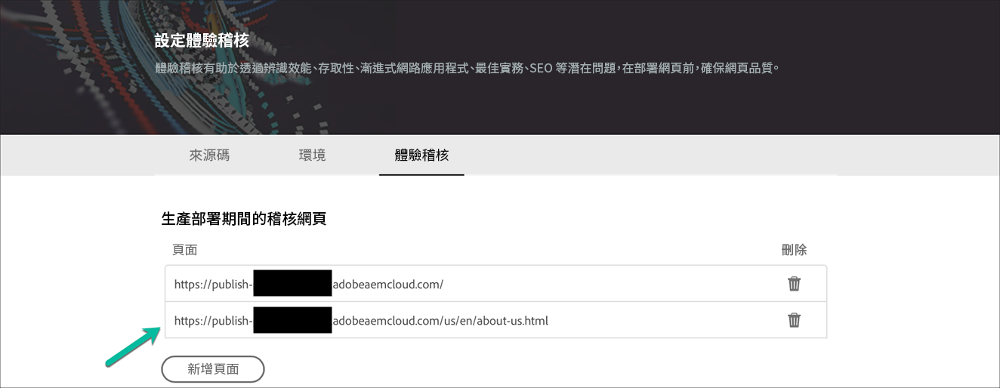
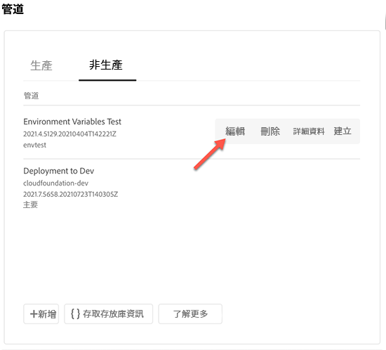
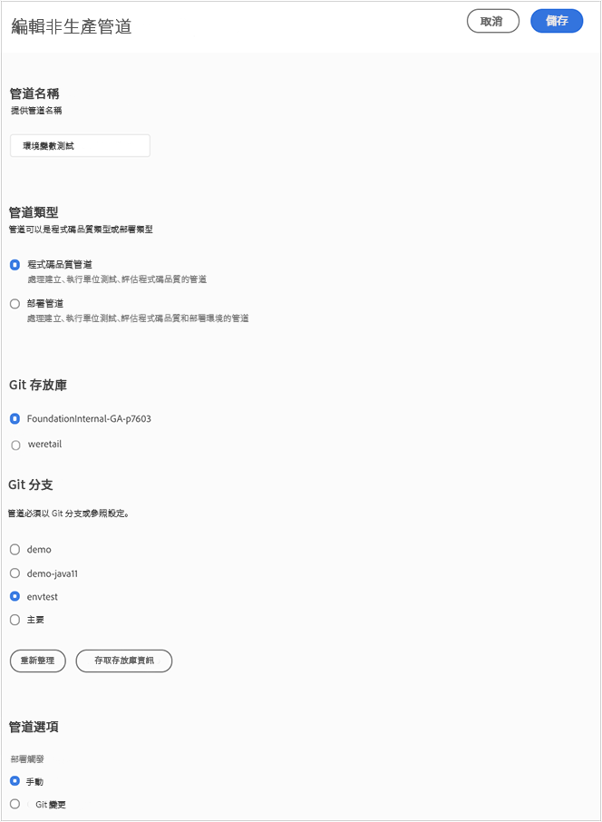

# 設定 CI-CD 管線 {#configure-ci-cd-pipeline}

在Cloud Manager中，有兩種管道：

* **生產管道**:

   只有建立生產和預備環境集後，才能新增生產管道。

   如需詳細資訊，請參閱[設定生產管道](configure-pipeline.md#setting-up-the-pipeline) 。

* **非生產管道**:

   您可以從Cloud Manager使用者介面的&#x200B;**概述**&#x200B;頁面新增非生產管道。

   如需詳細資訊，請參閱[僅限非生產與程式碼品質管道](configure-pipeline.md#non-production-pipelines)。

   >[!NOTE]
   >若要設定管道，您必須：
   > * 定義將啟動管道的觸發器。
   > * 定義控制生產部署的參數。
   > * 配置效能測試參數。

## 設定生產管道 {#setting-up-production-pipeline}

部署管理員負責設定生產管道。

>[!NOTE]
>程式建立完成、Git存放庫至少有一個分支，且已建立生產和預備環境集後，才能設定生產管道。

開始部署代碼之前，必須從[!UICONTROL Cloud Manager]配置管道設定。

>[!NOTE]
>
>可在初始設定後更改管道設定。

## 從[!UICONTROL Cloud Manager]配置管道設定 {#configuring-the-pipeline-settings-from-cloud-manager}

設定程式並使用[!UICONTROL Cloud Manager] UI至少有一個環境後，您就可以設定部署管道。

請依照下列步驟來設定管道的行為和偏好設定：

1. 按一下&#x200B;**設定管道**&#x200B;以設定和設定管道。

   

1. **設定管道**&#x200B;畫面隨即顯示。 選擇分支，然後按一下&#x200B;**Next**。

   

1. 配置部署選項。

   

   您可以定義觸發器以啟動管道：

   * **手動**  — 使用UI手動啟動管道。
   * **On Git Changes**  — 每當有提交項新增至設定的Git分支時，就會啟動CI/CD管道。即使選取此選項，也始終可以手動啟動管道。

   在管道設定或編輯期間，部署管理器可以選擇在任何質量門中遇到重要故障時定義管道的行為。

   這對希望實現更自動化流程的客戶非常有用。 可用選項包括：

   * **每次詢問**  — 此為預設設定，需要手動干預任何「重要」失敗。
   * **立即取消**  — 如果選中此選項，則每當出現「重要」故障時，管道都將被取消。這實質上是模擬用戶手動拒絕每個故障。
   * **立即核准**  — 如果選取此選項，每當發生「重要」故障時，管道就會自動繼續。這實際上是在模擬使用者手動核准每個失敗。

1. 生產管道設定包含標示為&#x200B;**體驗稽核**&#x200B;的第三個標籤。 此選項提供URL路徑的表格，這些路徑應一律包含在「體驗稽核」中。

   >[!NOTE]
   >您必須按一下&#x200B;**新增頁面**&#x200B;以定義您自己的自訂連結。

   

   按一下「**新增頁面**」 ，提供要納入體驗稽核的URL路徑。

   例如，如果您想要在體驗稽核中加入`https://wknd.site/us/en/about-us.html`，請在此欄位中輸入路徑`us/en/about-us.html`，然後按一下&#x200B;**儲存**。

   

   表格中顯示的URL將是：

   `https://publish-p14253-e43686.adobeaemcloud.com/us/en/about-us.html`

   

   最多可包含25列。 如果此區段中沒有使用者提交的頁面，依預設，網站首頁會包含在體驗稽核中。

   如需詳細資訊，請參閱[了解體驗稽核結果](/help/implementing/cloud-manager/experience-audit-testing.md) 。

   >[!NOTE]
   > 系統會將已設定的頁面提交至服務，並根據效能、協助工具、SEO（搜尋引擎最佳化）、最佳實務和PWA（漸進式網頁應用程式）測試來評估。

1. 從&#x200B;**編輯管道**&#x200B;螢幕按一下&#x200B;**儲存**。 **概述**&#x200B;頁面現在顯示&#x200B;**部署程式**&#x200B;卡片。 按一下&#x200B;**Deploy**&#x200B;按鈕以部署程式。

   

### 編輯生產管道 {#editing-prod-pipeline}

您可以從&#x200B;**程式概述**&#x200B;頁面編輯管道設定。

請依照下列步驟編輯已設定的管道：

1. 從&#x200B;**程式概述**&#x200B;頁面導覽至&#x200B;**管道**&#x200B;卡片。

1. 按一下&#x200B;**...**&#x200B;管道&#x200B;**卡上的**，按一下&#x200B;**編輯**，如下圖所示。

   

1. 隨即顯示&#x200B;**編輯生產管道**&#x200B;對話方塊。

   1. **Configuration**&#x200B;標籤允許您更新&#x200B;**Pipeline Name**、**Deployment Trigger**&#x200B;和&#x200B;**Important Metrics Failure Behavior**。

      >[!NOTE]
      >請參閱[新增和管理存放庫](/help/implementing/cloud-manager/managing-code/cloud-manager-repositories.md) ，了解如何在Cloud Manager中新增和管理存放庫。

      

   1. **Source**&#x200B;索引標籤提供選項，讓您忽略管道的Web層配置，並在部署至生產&#x200B;**之前勾選或取消勾選**&#x200B;暫停，以及從&#x200B;**生產部署選項**&#x200B;排程&#x200B;**選項。**

      >[!NOTE]
      >如果未選中&#x200B;**忽略Web層配置** ，管道也將部署Web層配置。

      

   1. **體驗稽核**&#x200B;選項可讓您更新或新增頁面。

      

1. 編輯管道後，按一下&#x200B;**更新**。

## 僅限非生產和代碼品質的管道 {#non-production-pipelines}

除了部署到預備和生產的主管道外，客戶還可以設定其他管道，稱為&#x200B;**非生產管道**。 這些管道一律會執行建置和程式碼品質步驟。 他們也可選擇部署至AEMas a Cloud Service環境。

在主螢幕上，這些管道會列在新卡中：

1. 從Cloud Manager主畫面存取&#x200B;**非生產管道**&#x200B;方塊。

   

1. 按一下&#x200B;**Add**&#x200B;按鈕，以指定管道名稱、管道類型和Git分支。

   此外，您也可以從管道選項設定部署觸發程式和重要失敗行為。

   

1. 按一下「**儲存**」，主畫面的卡片上會顯示管道，包含五個動作，如下所示：

   

   * **編輯**  — 允許編輯管道設定
   * **詳細資訊**  — 提供管道執行的詳細資訊
   * **建置**  — 導覽至執行頁面，可從該頁面執行管道
   * **存取存放庫資訊**  — 可讓使用者取得存取Cloud Manager Git存放庫所需的資訊
   * **了解更多**  — 導覽至了解CI/CD管道檔案資源。

### 編輯非生產管道 {#editing-nonprod-pipeline}

您可以從&#x200B;**程式概述**&#x200B;頁面編輯管道設定。

請依照下列步驟編輯已設定的非生產管道：

1. 從&#x200B;**程式概述**&#x200B;頁面導覽至&#x200B;**管道**&#x200B;卡片。

1. 選擇&#x200B;**非生產**&#x200B;頁簽，並在選擇所需管道後按一下&#x200B;**編輯**。

   

1. 選擇所需的儲存庫和其他必需的更新，然後按一下&#x200B;**Save**。

   

## 後續步驟 {#the-next-steps}

設定管道後，您需要部署程式碼。

如需詳細資訊，請參閱[部署程式碼](deploy-code.md) 。
