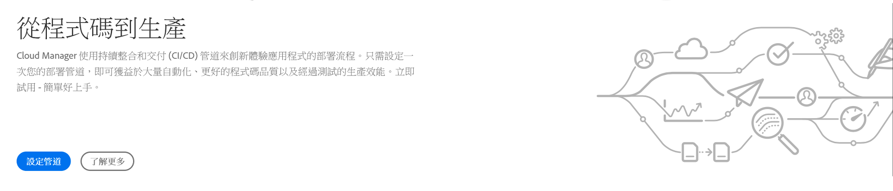
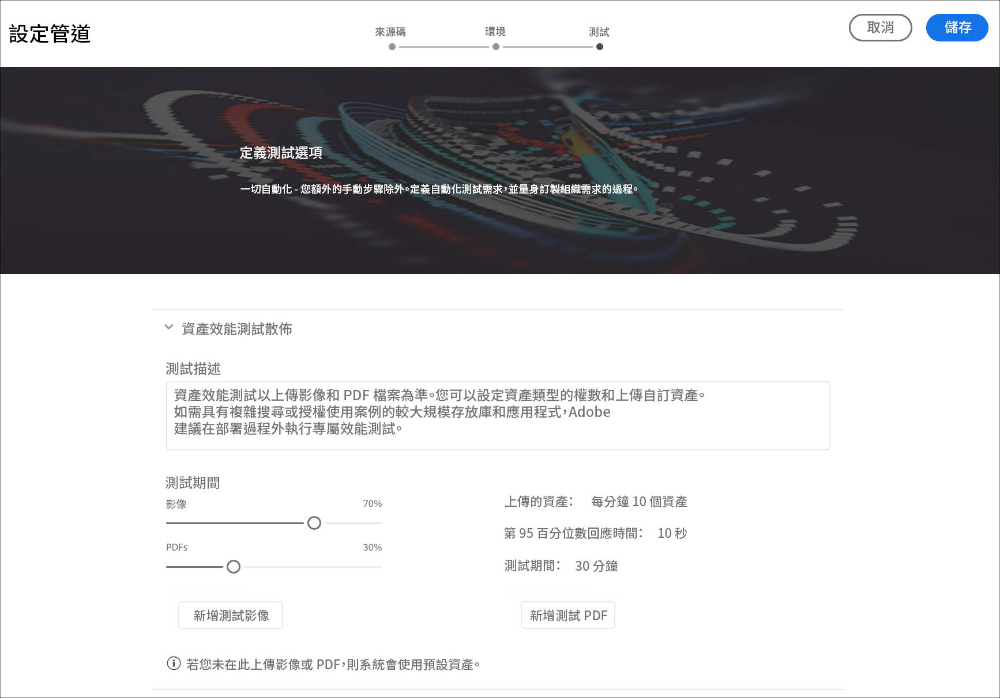
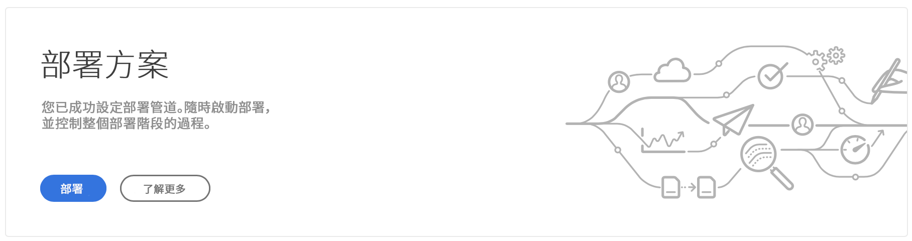
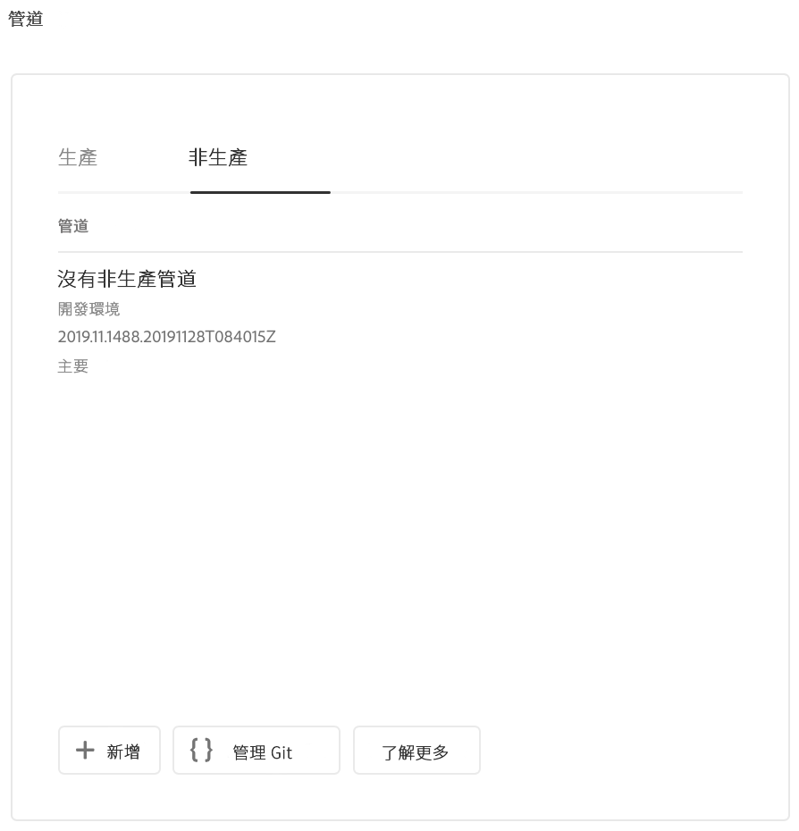
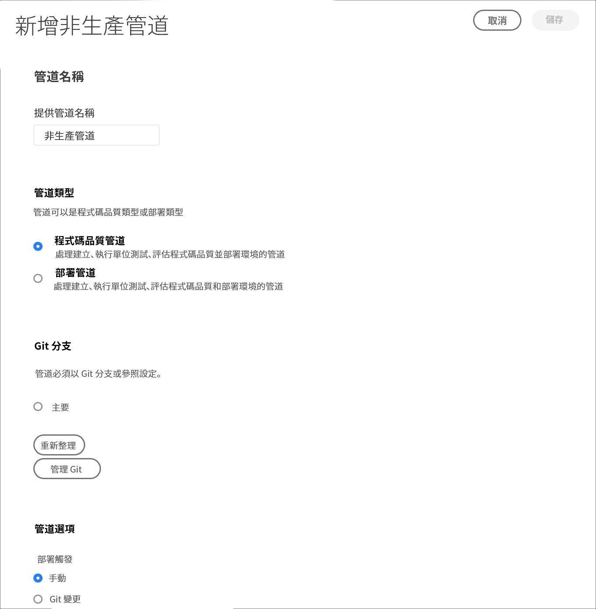

# 配置CI-CD管道 {#configure-ci-cd-pipeline}

## 瞭解流程 {#understanding-the-flow}

您可以從 **Cloud Manager** UI [!UICONTROL 的「Pipeline Settings] 」（管道設定）圖格來設定管道。

部署管理器負責設定管道。 執行此操作時，首先從 **Git Repository中選擇一個分支**。

要配置管線，用戶必須：

* 定義將啟動管線的觸發器。
* 定義控制生產部署的參數。
* 配置效能測試參數。

## 設定管線 {#setting-up-the-pipeline}

>[!CAUTION]
>
>在完成一個程式建立且Git儲存庫至少有一個分支之前，無法設定管線。

在開始部署程式碼之前，您必須從 [!UICONTROL Cloud Manager設定管道設定]。

>[!NOTE]
>
>可在初始設定後更改管線設定。

## 從 [!UICONTROL Cloud Manager配置管線設定]{#configuring-the-pipeline-settings-from-cloud-manager}

一旦您設定了程式，並且使用 [!UICONTROL Cloud Manager] UI至少擁有一個環境，您就可以準備好設定部署管道。

請依照下列步驟來設定管道的行為和偏好設定：

1. 按一下「 **設定管線** 」(Setup Pipeline)以設定和配置管線。

   

1. 將顯 **示「設定管線** 」螢幕。 選擇分支，然後按一下「下 **一步」**。

   

1. 設定您的部署選項。

   

   可定義觸發器以啟動管線：

   * **手動** -使用UI手動啟動管線。
   * **On Git Changes** —— 每當有提交添加到配置的git分支時，啟動CI/CD管線。 即使選取此選項，也始終可以手動啟動管線。
   在管線設定或編輯期間，「部署管理器」(Deployment Manager)可以選擇在任何質量門中遇到重要故障時定義管線的行為。

   這對希望實現更自動化流程的客戶非常有用。 可用的選項包括：

   * **每次詢問** -這是預設設定，需要手動干預任何重要故障。
   * **立即失敗** -如果選中此選項，當出現「重要」(Impertient)故障時，管線將被取消。 這實際上是模擬使用者手動拒絕每個失敗。
   * **立即繼續** -如果選中此選項，則每當出現「重要」(Impertient)故障時，管線將自動繼續。 這實際上是在模擬用戶手動批准每個故障。

1. 按一 **下** 「下一步」 **，存取「測試** 」標籤，以定義您方案的測試准則。

   

1. 按一下&#x200B;**「儲存」**。「概 *述」頁* ，現在會顯示「 **部署您的計畫** 」卡。 按一 **下「部署** 」按鈕以部署您的程式。

   

## 非生產和代碼純質量管道

除了部署到生產階段的主管道外，客戶還可以設定額外的管道，即非生 **產管道**。 這些管線始終執行構建和代碼質量步驟。 他們也可以選擇性地部署至Adobe Managed Services環境。

在主螢幕上，新卡中列出了以下管線：

1. 從Cloud manager **主畫面存取「非生產管道** 」圖格。

   

1. 按一下「添 **加** 」(Add)按鈕，指定「管線名稱」(Pipeline Name)、「管線類型」(Pipeline Type)和「Git分支」(Git Branch)。

   此外，還可以從Pipeline Options中設定部署觸發器和重要故障行為。

   

1. 按一 **下「儲存** 」(Save)，主畫面上的資訊卡上會顯示管線，並有三個動作，如下所示：

   

   * **編輯** -允許編輯管線設定
   * **Build** —— 導航到執行頁，可從中執行管線
   * **管理Git** —— 允許用戶獲取訪問Cloud Manager Git儲存庫所需的資訊

## 後續步驟 {#the-next-steps}

在設定管道後，您需要部署程式碼。

如需詳細 [資訊，請參閱](deploy-code.md) 「部署程式碼」。
