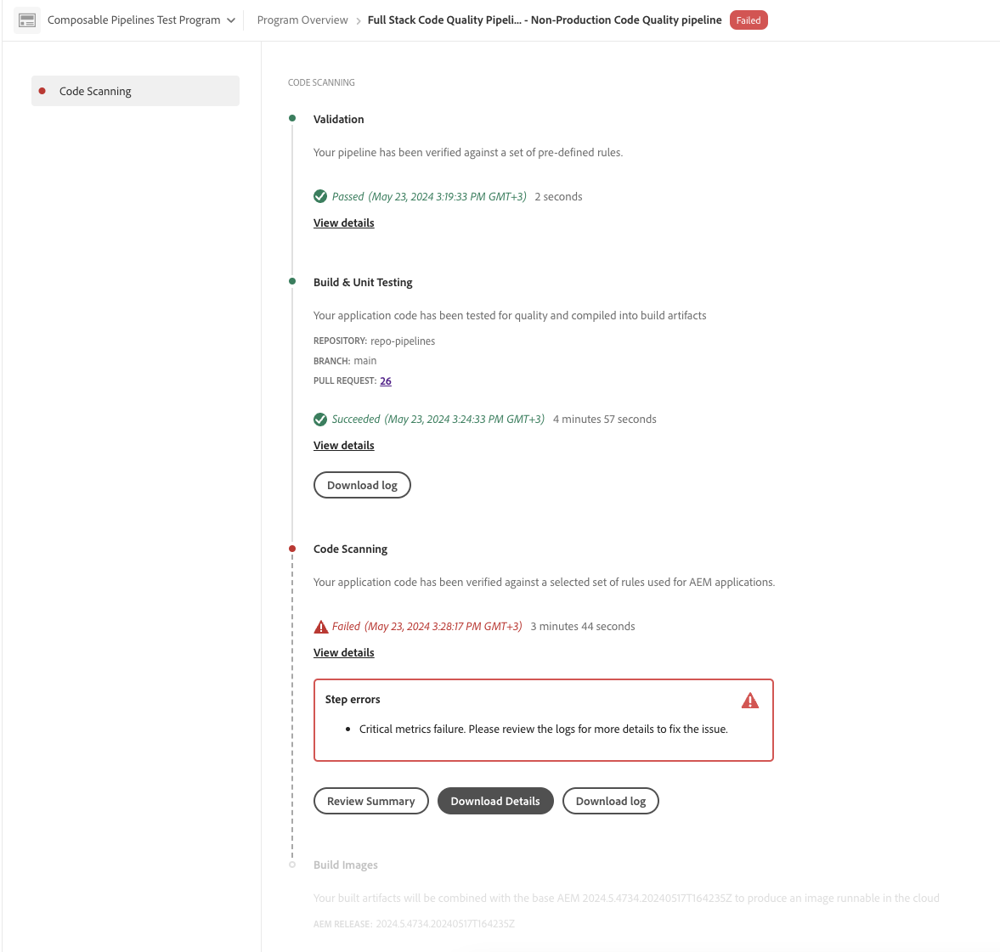

# 管理管道 {#managing-pipelines}

了解如何管理您的現有管道，包括進行編輯、執行和刪除。

## 管道資訊卡 {#pipeline-card}

此&#x200B;**管道**&#x200B;卡位於 Cloud Manager 中的&#x200B;**方案概觀**&#x200B;頁面上，可讓您概觀您所有的管道及其目前狀態。

按一下每個管道旁的，您就可以執行下列動作：

* [執行管道](#running-pipelines)
* [取消管道](#cancel)
* [編輯管道](#editing-pipelines)
* [刪除管道](#deleting-pipelines)
* [檢視管道的上次執行詳細資料](#view-details)

在管道清單底部，您有以下一般選項：

* **新增** — 至[新增生產管道](configuring-production-pipelines.md)或[新增非生產管道](configuring-non-production-pipelines.md)
* **全部顯示** - 將使用者帶到管道畫面，在更詳細的表格中檢視所有管道。
* **存取存放庫資訊** - 顯示要存取 Cloud Manager Git 存放庫所必需的資訊
* **了解更多** - 瀏覽至 CI/CD 管道文件資源。

## 管道頁面 {#pipelines}

**管道**&#x200B;頁面顯示所選方案所有管道的完整清單。此資訊很有用，因為它提供的資訊比[管線卡](#pipeline-card)中可用的資訊更全面。

1. 在 [my.cloudmanager.adobe.com](https://my.cloudmanager.adobe.com/) 登入 Cloud Manager 並選取適當的組織。

1. 在「**[我的程式](/help/implementing/cloud-manager/navigation.md#my-programs)**」控制台中，選取程式。

1. 從&#x200B;**方案總覽**&#x200B;頁面，按一下 **管道**&#x200B;標籤。

1. 在&#x200B;**管道**&#x200B;頁面上，您可以看到此方案的所有管道清單，並像在&#x200B;**管道卡**&#x200B;中一樣啟動和停止管道執行。

如果管道正在執行，請在欄中按一下&#x200B;**資訊 — 媒體圖示**，以顯示包含執行詳細資訊的快顯視窗。 在快顯視窗中，按一下&#x200B;**檢視詳細資料**&#x200B;以檢視管道執行的[詳細資料](#view-details)。

您也可以按一下管道旁的，以採取適合管道狀態的其他動作，例如[編輯](#editing-pipelines)或[取消執行](#cancel)。

### 標示管道我的最愛{#pipeline-favorites}

您可以將特定管道標示為我的最愛，好讓這些管道顯示在&#x200B;**管道**&#x200B;頁面上的清單頂端。 此功能讓經常存取的管道更容易找到和執行。

**若要標示管道我的最愛：**

1. 在 [my.cloudmanager.adobe.com](https://my.cloudmanager.adobe.com/) 登入 Cloud Manager 並選取適當的組織。
1. 在「**[我的程式](/help/implementing/cloud-manager/navigation.md#my-programs)**」控制台中，選取程式。
1. 從&#x200B;**方案總覽**&#x200B;頁面，按一下 **管道**&#x200B;標籤。
1. 在管道頁面上，在管道名稱和型別的左側，按一下取消我的最愛管道的以將其新增到我的最愛清單。
或者，按一下我的最愛管道星形圖示，將該管道從我的最愛清單中移除。

## 活動頁面 {#activity}

**活動**&#x200B;頁面會顯示所選方案和其他重要方案事件的所有管道執行的完整清單。

1. 在 [my.cloudmanager.adobe.com](https://my.cloudmanager.adobe.com/) 登入 Cloud Manager，並選取適當的組織和方案。

1. 從&#x200B;**計畫總覽**&#x200B;頁面，按一下側邊功能表中的 **活動**。

1. 在&#x200B;**活動**&#x200B;頁面中，您可以看到方案的所有管道執行清單，包括目前和歷史執行。

如果管道正在執行，您可以按一下欄中的&#x200B;**資訊 — 媒體圖示**，以顯示快顯視窗，顯示執行的相關資訊。

按一下代表管道執行的資料列，即可檢視管道執行的[詳細資料](#view-details)。

您也可以按一下「，對管道執行採取其他動作，例如檢視其詳細資料或下載記錄檔，將您帶至[管道詳細資料頁面](#view-details)。

## 執行管道 {#running-pipelines}

1. 在 [my.cloudmanager.adobe.com](https://my.cloudmanager.adobe.com/) 登入 Cloud Manager 並選取適當的組織和方案。

1. 瀏覽至「**管道**」卡片 (在「**方案概觀**」頁面)。

1. 按一下您執行的管道旁的。

1. 從下拉式功能表，按一下 **執行**。

   管道執行開始，**狀態**&#x200B;欄會顯示其進度。

您可以按一下再按一下&#x200B;**[檢視詳細資料](#view-details)**&#x200B;來檢視執行的詳細資料。

視管道型別而定，您也許可以取消執行，只要再按一下並按一下&#x200B;**取消**。

## 執行多個管道 {#run-multiple-pipelines}

有了Cloud Manager，您可以同時執行多個管道，為AEM as a Cloud Service客戶提高部署效率。 您可以使用&#x200B;**執行所選**&#x200B;功能選取多個管道，並觸發這些管道立即執行。它減少手動執行個別管道的工作量，並最佳化建置和部署工作流程。

**若要執行多個管道：**

1. 在 [my.cloudmanager.adobe.com](https://my.cloudmanager.adobe.com/) 登入 Cloud Manager，並選取適當的組織和方案。
1. 在左側選單中，按一下「**管道**」。
1. 在「**管道**」頁面的表格中，選取要執行的管道旁邊的核取方塊。
如有必要，按一下「**篩選器**」，根據名稱、環境、部署的程式碼類型或上述三者的組合，對管道進行排序。
1. 在此頁面的右上角附近，按一下「**執行所選 (x)**」。
1. 在「**執行所選管道 (x)**」對話框中，按一下「**執行 (x)**」。

   「**執行**」按鈕會反映可繼續執行的管道數量。例如，您可能已選取四個管道，但其中一個已經在執行中，或者連結至所選管道的環境已不存在。在這類情況下，系統會隨之調整。按鈕會更新為「執行 (3)」，表示三個管道可以繼續執行。

1. 管道開始執行，並且會在「**管道**」清單中更新其狀態。

## 編輯管道 {#editing-pipelines}

如果管道未執行，您可以編輯它。

1. 在 [my.cloudmanager.adobe.com](https://my.cloudmanager.adobe.com/) 登入 Cloud Manager 並選取適當的組織和方案。

1. 瀏覽至「**管道**」卡片 (在「**方案概觀**」頁面)。

1. 按一下您要編輯的管道旁的。

1. 從下拉式功能表，按一下&#x200B;**編輯**。

1. 在&#x200B;**編輯生產管道**&#x200B;或&#x200B;**編輯非生產管道**&#x200B;對話方塊中，編輯您在建立管道時輸入的相同詳細資料。

   如需有關管道可用的欄位和設定選項的詳細資訊，請參閱以下頁面。
   * [設定生產管道](configuring-production-pipelines.md)
   * [設定非生產管道](configuring-non-production-pipelines.md)

1. 完成後，按一下「**更新**」。

>[!NOTE]
>
>私人存放庫不支援 Web 層和設定管道。請參閱[在Cloud Manager中新增私人GitHub存放庫](/help/implementing/cloud-manager/managing-code/private-repositories.md)的詳細資訊和完整限制清單。

## 刪除管道 {#deleting-pipelines}

如果管道未執行，您可以將其刪除。

1. 在 [my.cloudmanager.adobe.com](https://my.cloudmanager.adobe.com/) 登入 Cloud Manager 並選取適當的組織和方案。

1. 瀏覽至「**管道**」卡片 (在「**方案概觀**」頁面)。

1. 按一下您執行的管道旁的。

1. 從下拉式功能表中，按一下&#x200B;**刪除**。

## 檢視管道的上次執行詳細資料 {#view-details}

您可以檢查管道的詳細資訊，以檢視其最近執行的狀態和記錄。 但是，如果管道目前正在執行或已執行至少一次，則您只能存取詳細資訊。

1. 在 [my.cloudmanager.adobe.com](https://my.cloudmanager.adobe.com/) 登入 Cloud Manager 並選取適當的組織和方案。

1. 瀏覽至「**管道**」卡片 (在「**方案概觀**」頁面)。

1. 從下拉式功能表，按一下您執行的管道旁的。

1. 從下拉式功能表，按一下&#x200B;**檢視上一個執行**。

   系統將會帶您前往執行中管道的詳細資訊頁面。

   

   從這裡，您可以查看管道各個步驟的狀態，並擷取建置記錄以進行診斷。如需程式碼部署和測試執行的詳細資訊，請參閱[部署您的程式碼](/help/implementing/cloud-manager/deploy-code.md)。

   管道執行中的所有步驟都會顯示，尚未開始的步驟會顯示為灰色。已完成的步驟會顯示其持續時間。

   管道步驟完成後，會顯示摘要。

   

1. 按一下「**檢視詳細資料**」以展開「**持續時間**」區段，您可以在此根據計畫的歷史趨勢檢視管道的平均持續時間。

   

1. 如果您的管道包含標示問題的&#x200B;**程式碼掃描**&#x200B;步驟，請按一下&#x200B;**下載詳細資料**&#x200B;以存取無法通過的[程式碼品質測試](/help/implementing/cloud-manager/code-quality-testing.md)清單。

   

   CSV檔案包含&#x200B;**專案檔案位置**&#x200B;欄，顯示相對於專案的問題程式碼路徑。 相對地，**檔案位置**&#x200B;欄反映了Maven產生的路徑。

   

## 取消管道 {#cancel}

如果管道執行處於驗證或建置影像階段，您可以安全地取消它。

1. 在 [my.cloudmanager.adobe.com](https://my.cloudmanager.adobe.com/) 登入 Cloud Manager，並選取適當的組織和方案。

1. 從方案總覽頁面，在卡片上按一下您要取消的管道的&#x200B;**省略符號 — 更多圖示**。

   

1. 按一下&#x200B;**取消**。

或者，您可以從配管詳細資訊頁面取消配管。

1. 在 [my.cloudmanager.adobe.com](https://my.cloudmanager.adobe.com/) 登入 Cloud Manager，並選取適當的組織和方案。

1. 從頁面瀏覽至&#x200B;**管道索引標籤 — 工作流程圖示** **管道**&#x200B;索引標籤，並選取您要取消的管道。

   系統將會帶您前往執行中管道的詳細資訊頁面。

   

1. 按一下&#x200B;**取消**。

