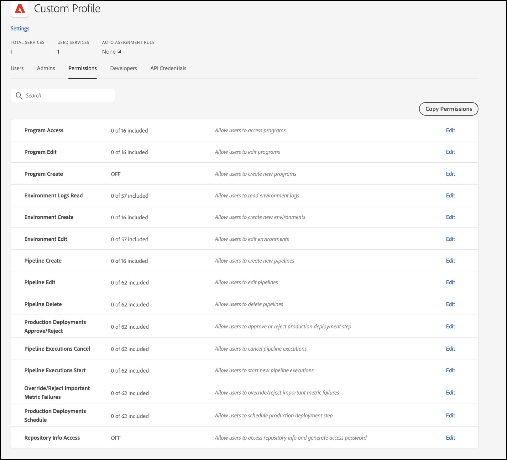

# 自訂權限 {#custom-permissions}

瞭解如何在Cloud Manager中設定量身打造的許可權設定檔。 您可以為程式、管道和環境設定特定的存取控制，讓您精細地控制每個使用者的功能。

## 簡介 {#introduction}

Cloud Manager 有一組預先定義的角色，用於管理 Cloud Manager 各項功能的存取權：

* 企業所有者
* 方案管理員
* 部署管理員
* 開發人員

自訂許可權可讓使用者建立具有可設定許可權的自訂許可權設定檔，以限制Cloud Manager使用者對計畫、管道和環境的存取權。

>[!TIP]
>如需預先定義角色的詳細資訊，請參閱[AEM as a Cloud Service團隊和產品設定檔](/help/onboarding/aem-cs-team-product-profiles.md)。

## 使用自訂權限 {#using}

建立及使用您自己的自訂權限需要進行以下三個步驟：

1. [建立產品設定檔](#create)。
1. [將自訂許可權指派給產品設定檔](#assign-permissions)。
1. [將使用者指派給產品設定檔](#assign-users)。

>[!TIP]
>當您建立自己的自訂許可權時，您可能會發現檢閱[條款](#terms)和[可設定的許可權](#configurable-permissions)區段會很有幫助。

>[!IMPORTANT]
>您必須在Adobe Experience Manager as a Cloud Service的Admin Console中擁有產品管理員許可權，才能建立Cloud Manager的產品設定檔和管理許可權。

### 建立產品設定檔 {#create}

1. 在[my.cloudmanager.adobe.com](https://my.cloudmanager.adobe.com/)登入Cloud Manager。

1. 在Cloud Manager登陸頁面上，按一下&#x200B;**管理存取權**。

   

1. 在Admin Console中，按一下&#x200B;**新增設定檔**。

   

1. 提供設定檔的一般詳細資訊。

   * **產品設定檔名稱**- 設定檔的說明性名稱
   * **顯示名稱** - UI （選項）中顯示的縮寫名稱
   * **說明** - 設定檔用來解釋其用途的資訊性說明 (選用)
   * **透過電子郵件通知使用者** — 當使用者加入此設定檔或從中移除時，使用者會收到電子郵件通知。

1. 按一下「**儲存**」。

新的產品設定檔已儲存並出現在 Admin Console 的產品設定檔清單中。

### 將自訂許可權指派給產品設定檔 {#assign-permissions}

1. 在Admin Console中，按一下您建立的[新產品設定檔](#create)的名稱。

1. 在&#x200B;**自訂設定檔**&#x200B;頁面中，按一下&#x200B;**許可權**&#x200B;標籤。

   

1. 在許可權名稱的列中，按一下&#x200B;**編輯**。

1. 在&#x200B;**編輯自訂設定檔的許可權**&#x200B;對話方塊中，執行下列任一項作業：

   * 在&#x200B;**可用的許可權專案**&#x200B;欄的頂端附近，按一下 **全部新增**&#x200B;以新增所有許可權。
   * 若要將單一許可權新增至&#x200B;**包含的許可權專案**&#x200B;欄，請按一下其相關聯的。

     

1. 按一下&#x200B;**儲存**。

### 將使用者指派給產品設定檔 {#assign-users}

1. 在Admin Console中，按一下您指派自訂許可權的[新產品設定檔名稱](#assign-permissions)。

1. 在開啟的視窗中，按一下&#x200B;**使用者**&#x200B;標籤。

1. 按一下&#x200B;**新增使用者**，並將使用者指派給具有自訂許可權的產品設定檔。

在[管理企業使用者的產品設定檔](https://helpx.adobe.com/tw/enterprise/using/manage-product-profiles.html)中，請參閱&#x200B;**將使用者和使用者群組新增至產品設定檔**，以取得如何使用Admin Console的詳細資訊。

## 可設定的權限 {#configurable-permissions}

建立自訂產品設定檔時，可使用下列許可權。

| 權限 | 說明 |
| --- | --- |
| `Program Create` | 讓使用者建立程式。 |
| `Program Access` | 讓使用者存取程式。 |
| `Program Edit` | 讓使用者編輯程式。 |
| `Environment Create` | 讓使用者建立環境。 |
| `Environment Edit` | 讓使用者更新及編輯環境。 |
| `Environment Logs Read` | 讓使用者讀取環境記錄。 |
| `Environment Variables Manage` | 讓使用者建立/編輯/刪除環境設定。 |
| `Environment Restore Create` | 讓使用者建立環境還原。 |
| `Rapid Development Environment Reset` | 讓使用者重設快速開發環境(RDE)。 |
| `Content Copy Manage` | 讓使用者管理內容復製作業。 |
| `Pipeline Create` | 讓使用者建立管道。 |
| `Pipeline Delete` | 允許使用者刪除管道。 |
| `Pipeline Edit` | 讓使用者編輯管道。 |
| `Production Deployments Approve/Reject` | 讓使用者核准或拒絕生產部署步驟。 |
| `Pipeline Executions Cancel` | 讓使用者取消管道執行。 |
| `Pipeline Executions Start` | 讓使用者啟動新的執行管道。 |
| `Override/Reject Important Metric Failures` | 讓使用者覆寫/拒絕重要量度失敗。 |
| `Production Deployments Schedule` | 讓使用者排程生產部署步驟。 |
| `Repository Info Access` | 讓使用者存取存放庫資訊並產生存取密碼。 |
| `Repository Create` | 讓使用者建立Git存放庫。 |
| `Repository Delete` | 讓使用者刪除Git存放庫。 |
| `Repository Edit` | 可讓使用者編輯Git存放庫。 |
| `Repository Code Generate` | 讓使用者從原型產生專案。 |
| `Domain Name Manage` | 讓使用者建立/編輯/刪除網域名稱。 |
| `IP Allowlist Manage` | 讓使用者建立/編輯/刪除IP允許清單和IP允許清單繫結。 |
| `Network Infrastructure Manage` | 讓使用者建立/刪除/編輯/測試網路基礎結構。 |
| `SSL Certificate Manage` | 讓使用者建立/編輯/刪除SSL憑證。 |
| `New Relic Sub Account User Manage` | 讓使用者讀取/編輯New Relic子帳戶使用者。 |

### 組織層級權限 {#organization-level}

組織層級許可權是指組織中所有方案一律會授與的許可權。

以下權限是組織層級的權限：

* **`Program Create`** — 此許可權可讓使用者在組織中建立方案。
* **存放庫資訊存取** — 此租使用者/組織層級許可權可讓使用者產生使用者名稱、密碼和存放庫URL，以存取和貢獻客戶專案。
   * 存放庫存取的使用者名稱和密碼在組織中的所有存放庫中都通用。 不過，每個方案的存放庫URL都是唯一的。
   * 如需詳細資訊，請參閱[存取存放庫](/help/implementing/cloud-manager/managing-code/accessing-repos.md)。

## 詞彙 {#terms}

以下詞彙用於建立和管理自訂權限和預先定義的角色。

| 術語 | 說明 |
| --- | --- |
| 預先定義的權限 | 預先定義的角色，例如&#x200B;**業務負責人**&#x200B;和&#x200B;**部署管理員**，可管理Cloud Manager的各種功能。 如需預先定義角色的詳細資訊，請參閱[AEM as a Cloud Service團隊和產品設定檔](/help/onboarding/aem-cs-team-product-profiles.md)。 |
| 自訂權限 | Cloud Manager功能可讓使用者建立許可權設定檔來定義角色，以控管Cloud Manager的支援功能。 |
| 產品設定檔 | 在Admin Console中建立，用於管理適用於許可權設定檔中使用者的可設定許可權。 |
| 可設定的權限 | 您可在許可權設定檔中設定的Cloud Manager許可權。 |
| 權限項目 | 可套用許可權的程式、環境或管道資源。 |

權限項目是指權限所適用的範圍。 通常是以下其中一項：

| 權限項目類型 | 範例 | 說明 |
| --- | --- | --- |
| 組織 | 組織:companyA | 組織的所有適用資源。 資源可以是方案、環境或管道。 如果使用者在任何權限中新增一個組織，則該組織中所有新資源也具有該權限。 |
| 方案 | 方案 A | 方案的所有適用資源。 |
| 環境 | 方案 A：環境 | 適用於特定環境。 |
| 管道 | 方案 A：管道 | 適用於特定管道。 |

## 使用說明 {#usage-notes}

* 自訂許可權設定檔在設定許可權時也會列出AMS程式、環境和管道。
* 在Cloud Manager中建立的方案、環境和管道等資源可能需要幾分鐘才能在Admin Console中顯示許可權設定。
* 若發生自訂權限服務無法回應的罕見情境時，預先定義的設定檔仍然可用，且預先定義的設定檔中的使用者仍具有適當存取權。

## 常見問題 {#faq}

### 哪些權限設定檔是預先定義的權限設定檔？

* 企業所有者
* 方案管理員
* 部署管理員
* 開發人員

如需預先定義角色的詳細資訊，請參閱[AEM as a Cloud Service團隊和產品設定檔](/help/onboarding/aem-cs-team-product-profiles.md)。

### 隨著自訂設定檔的推出，預先定義的許可權設定檔會發生什麼事？

預設之產品設定檔和 Cloud Manager 角色的運作方式不會改變。

### 我可以編輯預先定義的權限設定檔嗎？

否。 預設設定檔不可編輯。 您無法從預設許可權設定檔新增或移除許可權。 您只能在預先定義的設定檔中新增或移除使用者。

### 由於現在可以使用自訂設定檔，我是否應該刪除預先定義的權限設定檔？

請勿從Admin Console中刪除預先定義的許可權設定檔。

### 我可以將使用者新增至多個權限設定檔嗎？

可以。 使用者可以屬於多個設定檔，包括預先定義和自訂許可權設定檔。 當使用者被指派至多個設定檔時，該使用者可使用所有被指派權限設定檔的合併權限。

### 如果使用者具有編輯環境/管道的權限，但無權存取包含該環境/管道的方案，會發生什麼情況？

如果使用者沒有包含環境或管道的&#x200B;**方案存取**&#x200B;許可權，則無法存取環境或管道。
