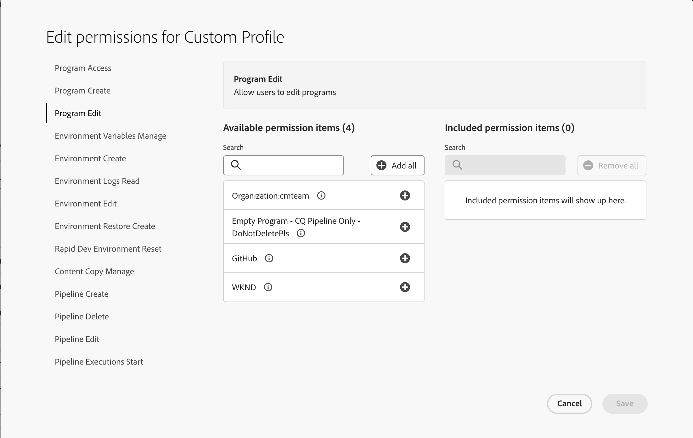

# 自訂權限 {#custom-permissions}

瞭解如何使用自訂許可權建立具有可設定許可權的自訂許可權設定檔，以限制對Cloud Manager使用者的程式、管道和環境的存取權。

## 簡介 {#introduction}

Cloud Manager有一組預先定義的角色，可控管各種Cloud Manager功能的存取權：

* 企業所有者
* 方案管理員
* 部署管理員
* 開發人員

自訂許可權可讓使用者建立具有可設定許可權的自訂許可權設定檔，以限制Cloud Manager使用者對計畫、管道和環境的存取權。

>[!TIP]
>
>如需預先定義角色的詳細資訊，請參閱[AEM as a Cloud Service團隊和產品設定檔](/help/onboarding/aem-cs-team-product-profiles.md)。

## 使用自訂權限 {#using}

若要建立和使用您自己的自訂許可權，需要三個步驟：

1. [建立產品設定檔](#create)。
1. [將自訂許可權指派給產品設定檔](#assign-permissions)。
1. [將使用者指派給產品設定檔](#assign-users)。

本節會詳細介紹這些步驟。在建立自己的自訂權限時，可參考「[詞彙](#terms)」和「[可設定的權限](#configurable-permissions)」小節的實用內容。

>[!NOTE]
>
>您必須在Adobe Experience Manager as a Cloud Service的Admin Console中擁有產品管理員許可權，才能為Cloud Manager建立設定檔和管理許可權。

### 建立新的產品設定檔 {#create}

首先建立您可指派自訂許可權的產品設定檔。

1. 在[my.cloudmanager.adobe.com](https://my.cloudmanager.adobe.com/)登入Cloud Manager。

1. 在Cloud Manager登陸頁面上，選取&#x200B;**管理存取權**&#x200B;按鈕。

1. 您會被重新導向至 Admin Console 的「**產品**」標籤，您可以在那裡管理 Cloud Manager 的使用者和權限。在Admin Console中，選取&#x200B;**新設定檔**&#x200B;按鈕。

1. 提供設定檔的一般詳細資訊。

   * **產品設定檔名稱**- 設定檔的說明性名稱
   * **顯示名稱** - UI （選項）中顯示的縮寫名稱
   * **說明** - 設定檔用來解釋其用途的資訊性說明 (選用)
   * **透過電子郵件通知使用者** — 當使用者加入此設定檔或從中移除時，使用者會收到電子郵件通知。

1. 完成時選取&#x200B;**儲存**。

新的產品設定檔已儲存並出現在 Admin Console 的產品設定檔清單。

### 將自訂權限指派至設定檔 {#assign-permissions}

現在您有了新的產品設定檔，您可以將自訂權限指派至新的產品設定檔。

1. 在Admin Console中，選取您建立的[新產品設定檔](#create)的名稱。

1. 在開啟的視窗中，選取&#x200B;**權限**&#x200B;標籤可檢視可編輯的權限清單。

   

1. 選取許可權的&#x200B;**編輯**&#x200B;連結，以便您進行編輯。

1. **編輯許可權**&#x200B;視窗隨即開啟。
   * 您在上一個步驟中選取的權限將在左側欄中呈現已選取狀態。
   * 標示為「**可用權限項目**」的中間欄包含此權限可指派的權限項目。
   * 標示為&#x200B;**包含的權限項目**&#x200B;的右側欄包含已指派的權限項目。

   

1. 選取許可權專案旁的加號(`+`)圖示，以便將其新增至欄&#x200B;**包含的許可權專案**。

   * 如果您想深入瞭解許可權專案，請選取許可權專案旁的`i`圖示。

1. 選取&#x200B;**可用許可權**&#x200B;欄頂端的&#x200B;**新增全部**&#x200B;按鈕，以便您新增所有許可權。

1. 當您完成定義新產品設定檔的許可權專案時，請選取&#x200B;**儲存**。

您的新產品設定檔現已與其自訂權限一起儲存。

### 將使用者指派至自訂權限 {#assign-users}

現在您可以將使用者指派至您建立的內含自訂權限的新產品設定檔。

1. 在Admin Console中，選取您指派自訂許可權的[新產品設定檔名稱](#assign-permissions)。

1. 在開啟的視窗中，選取&#x200B;**使用者**&#x200B;標籤。

1. 選取「**新增使用者**」按鈕，並將使用者指派給具有自訂許可權的新產品設定檔。

如需深入了解如何使用 Admin Console，請參閱文件[管理企業使用者的產品設定檔](https://helpx.adobe.com/tw/enterprise/using/manage-product-profiles.html)中的&#x200B;**將使用者和使用者群組新增至產品設定檔**&#x200B;部份。

## 可設定的權限 {#configurable-permissions}

以下權限可用於建立自訂設定檔。

| 權限 | 說明 |
| --- | --- |
| 計畫建立 | 讓使用者建立程式。 |
| 方案存取 | 讓使用者存取程式。 |
| 方案編輯 | 讓使用者編輯程式。 |
| 環境建立 | 讓使用者建立環境。 |
| 環境編輯 | 讓使用者更新及編輯環境。 |
| 環境記錄讀取 | 讓使用者讀取環境記錄。 |
| 環境變數管理 | 讓使用者建立/編輯/刪除環境設定。 |
| 環境還原建立 | 讓使用者建立環境還原。 |
| 快速開發環境重設 | 讓使用者重設快速開發環境(RDE)。 |
| 內容複製管理 | 讓使用者管理內容復製作業。 |
| 管道建立 | 讓使用者建立管道。 |
| 管道刪除 | 允許使用者刪除管道。 |
| 管道編輯 | 讓使用者編輯管道。 |
| 生產部署核准/拒絕 | 讓使用者核准或拒絕生產部署步驟。 |
| 管道執行取消 | 讓使用者取消管道執行。 |
| 管道執行啟動 | 讓使用者開始新的管道執行。 |
| 覆寫/拒絕重要量度失敗 | 讓使用者覆寫/拒絕重要量度失敗。 |
| 生產部署排程 | 讓使用者排程生產部署步驟。 |
| 存放庫資訊存取 | 讓使用者存取存放庫資訊並產生存取密碼。 |
| 存放庫建立 | 讓使用者建立Git存放庫。 |
| 存放庫刪除 | 讓使用者刪除Git存放庫。 |
| 存放庫編輯 | 可讓使用者編輯Git存放庫。 |
| 存放庫程式碼產生 | 讓使用者從原型產生專案。 |
| 網域名稱管理 | 讓使用者建立/編輯/刪除網域名稱。 |
| IP允許清單管理 | 讓使用者建立/編輯/刪除IP允許清單和IP允許清單繫結。 |
| 網路基礎架構管理 | 讓使用者建立/編輯/刪除網路基礎結構。 |
| SSL憑證管理 | 讓使用者建立/編輯/刪除SSL憑證。 |
| New Relic子帳戶使用者管理 | 讓使用者讀取/編輯New Relic子帳戶使用者。 |

### 組織層級權限 {#organization-level}

組織層級許可權是指組織中所有方案一律會授與的許可權。

以下權限是組織層級的權限：

* **方案建立** — 此許可權可讓使用者在組織中建立方案。
* **存放庫資訊存取**&#x200B;此租使用者/組織層級許可權可讓使用者產生使用者名稱、密碼和存放庫URL，以存取和貢獻客戶專案。
   * 存放庫存取的使用者名稱和密碼在組織中的所有存放庫中都是通用的。 不過，每個方案的存放庫URL都是唯一的。
   * 如需詳細資訊，請參閱[存取存放庫](/help/implementing/cloud-manager/managing-code/accessing-repos.md)。

## 詞彙 {#terms}

以下詞彙用於建立和管理自訂權限和預先定義的角色。

| 術語 | 說明 |
| --- | --- |
| 預先定義的權限 | 預先定義的角色，例如&#x200B;**業務負責人**&#x200B;和&#x200B;**部署管理員**，可管理Cloud Manager的各種功能。 如需預先定義角色的詳細資訊，請參閱[AEM as a Cloud Service團隊和產品設定檔](/help/onboarding/aem-cs-team-product-profiles.md)。 |
| 自訂權限 | Cloud Manager功能可讓使用者建立許可權設定檔來定義角色，以控管Cloud Manager的支援功能。 |
| 產品設定檔 | 在Admin Console中建立，用於管理適用於許可權設定檔中使用者的可設定許可權。 |
| 可設定的權限 | 您可在許可權設定檔中設定的Cloud Manager許可權。 |
| 權限項目 | 可套用許可權的程式、環境或管道資源。 |

許可權專案是指套用許可權的領域。 通常是以下其中一項：

| 權限項目類型 | 範例 | 說明 |
| --- | --- | --- |
| 組織 | 組織:companyA | 組織的所有適用資源。資源可以是方案、環境或管道。如果使用者在任何權限中新增一個組織，則該組織中所有新資源也具有該權限。 |
| 方案 | 方案 A | 方案的所有適用資源。 |
| 環境 | 方案 A：環境 | 適用於特定環境。 |
| 管道 | 方案 A：管道 | 適用於特定管道。 |

## 使用說明 {#usage-notes}

* 自訂許可權設定檔在設定許可權時也會列出AMS程式、環境和管道。
* 在Cloud Manager中建立的方案、環境和管道等資源，可能需要兩分鐘才能在Admin Console中顯示許可權設定。
* 若發生自訂權限服務無法回應的罕見情境時，預先定義的設定檔仍然可用，且預先定義的設定檔中的使用者仍具有適當存取權。

## 常見問題 {#faq}

### 哪些權限設定檔是預先定義的權限設定檔？

* 企業所有者
* 方案管理員
* 部署管理員
* 開發人員

如需預先定義角色的詳細資訊，請參閱[AEM as a Cloud Service團隊和產品設定檔](/help/onboarding/aem-cs-team-product-profiles.md)。

### 引入自訂設定檔後，預先定義的權限設定檔會發生什麼情況？

預設之產品設定檔和 Cloud Manager 角色的運作方式不會改變。

### 我可以編輯預先定義的權限設定檔嗎？

不可以，預設設定檔不可編輯。您無法在預設的權限設定檔中新增或移除權限。您只能在預先定義的設定檔中新增或移除使用者。

### 由於現在可以使用自訂設定檔，我是否應該刪除預先定義的權限設定檔？

請勿從Admin Console中刪除預先定義的許可權設定檔。

### 我可以將使用者新增至多個權限設定檔嗎？

可以，一個使用者可以屬於多個設定檔，包括預先定義和自訂權限設定檔。當使用者被指派至多個設定檔時，該使用者可使用所有被指派權限設定檔的合併權限。

### 如果使用者具有編輯環境/管道的權限，但無權存取包含該環境/管道的方案，會發生什麼情況？

在此情況下，如果使用者沒有包含環境或管道的&#x200B;**方案存取**&#x200B;許可權，則無法存取環境或管道。
