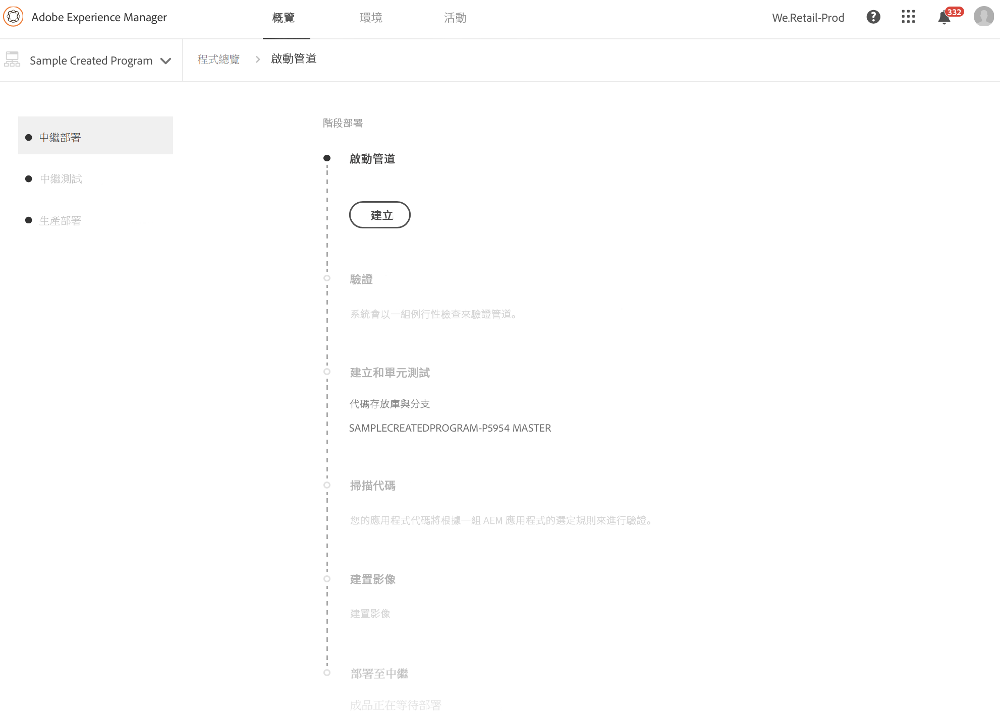
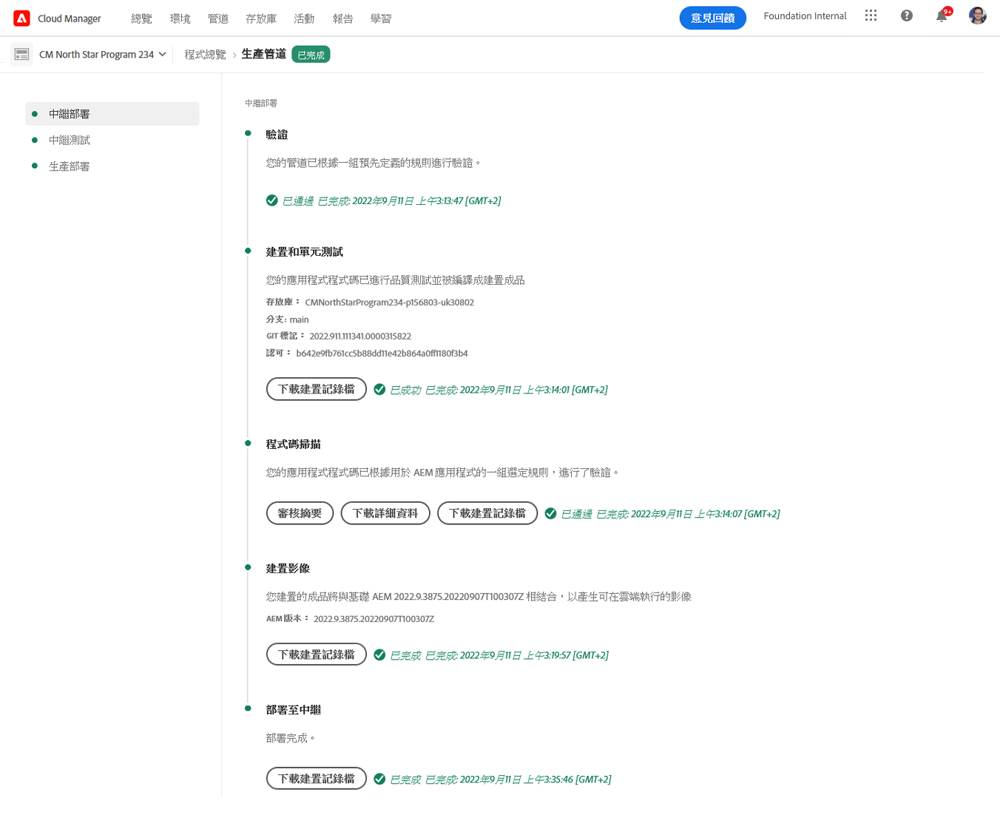
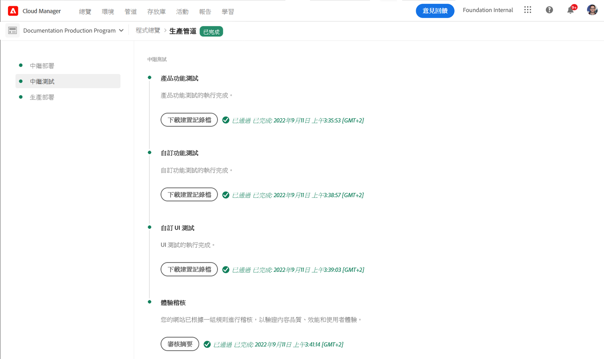

# 部署程式碼 {#deploy-your-code}

## 使用Cloud Manager部署程式碼 {#deploying-code-with-cloud-manager}

在配置了 **Pipeline**  (儲存庫、環境和測試環境) 後，您就可以部署代碼。

1. 按一 **下** 「從雲端管理員部署」，開始部署程式。

   

1. 將顯 **示「管線執行** 」螢幕。

   按一下 **Build** （生成）啟動進程。

   

1. 完整的建立程式會部署您的程式碼。

   構建過程涉及以下階段：

   1. 階段部署
   1. 階段測試
   1. 生產部署
   >[!NOTE]
   >
   >此外，您也可以檢視記錄檔或檢視結果，以檢視各種部署程式中的步驟，以取得測試標準。

   「 **舞台部署**」涉及以下步驟：

   * 驗證： 此步驟確保將管線配置為使用當前可用資源，例如，已配置的分支存在，環境可用。
   * 構建和單元測試： 此步驟會執行容器化的建立程式。 如需 [建立環境的詳細資訊，請參閱「建立AEM應用程式專案](/help/onboarding/getting-access-to-aem-in-cloud/creating-aem-application-project.md) 」。
   * 代碼掃描： 此步驟會評估您的應用程式碼的品質。 如需 [測試程式的詳細資訊](/help/implementing/developing/introduction/understand-test-results.md) ，請參閱瞭解測試結果。
   * 建立影像： 此步驟包含用於構建映像的進程的日誌檔案。 此程式負責將構建步驟生成的內容和調度程式包轉換為Docker映像和Kubernetes配置。
   * 部署至舞台

      
   測試 **階段**，包括下列步驟：

   * 產品功能測試： Cloud Manager管道執行將支援對舞台環境運行的測試的執行。 如需 [測試程式的詳細資訊](/help/implementing/developing/introduction/understand-test-results.md) ，請參閱瞭解測試結果。
   * 自訂功能測試： 管線中的此步驟始終存在，不能跳過。 但是，如果構建版本未生成測試JAR，則預設情況下測試通過。 如需 [測試程式的詳細資訊](/help/implementing/developing/introduction/understand-test-results.md) ，請參閱瞭解測試結果。

      

>注意:
>AEM Cloud Services的Cloud Manager需要更新下列章節，且正在進行中。

## 部署程式 {#deployment-process}

下節說明AEM和Dispatcher套件在階段階段和生產階段的部署方式。

Cloud Manager會將建立程式產生的所有目標/*.zip檔案上傳至儲存位置。  在管線的部署階段，會從此位置檢索這些對象。

當Cloud Manager部署到非生產拓撲時，其目標是盡快完成部署，因此對象將同時部署到所有節點，如下所示：

1. Cloud Manager會決定每個對象是AEM還是分派程式套件。
1. Cloud Manager會從負載平衡器中刪除所有調度程式，以在部署期間隔離環境。

   除非另行配置，否則您可以跳過開發和階段部署中的負載平衡器更改，即分離和附加非生產管線中的步驟，以用於開發環境，以及生產管線中的步驟，用於階段環境。

   >[!NOTE]
   >
   >此功能預期主要由1-1-1客戶使用。

1. 每個AEM物件都會透過Package Manager API部署至每個AEM例項，並依套件而定，以決定部署順序。

   有關如何使用軟體包來安裝新功能、在實例之間傳輸內容以及備份儲存庫內容的詳細資訊，請參閱如何使用軟體包。

   >[!NOTE]
   >
   >所有AEM物件都會部署至作者和發佈者。 當需要特定節點的配置時，應使用運行模式。 若要進一步瞭解執行模式如何讓您針對特定用途調整AEM例項，請參閱「執行模式」。

1. 調度器對象按如下方式部署到每個調度器：

   1. 當前配置將備份並複製到臨時位置
   1. 除不可變檔案外，所有配置都將被刪除。 有關詳細資訊，請參閱管理Dispatcher配置。 這會清除目錄，以確保不會留下孤立的檔案。
   1. 該對象被提取到httpd目錄。  不會覆寫不可變的檔案。 在部署時，您對git儲存庫中不可變檔案所做的任何更改都將被忽略。  這些檔案是AMS調度器框架的核心檔案，不能更改。
   1. Apache會執行組態測試。 如果未找到錯誤，則重新載入服務。 如果發生錯誤，則從備份中恢復配置，重新載入服務，並將錯誤報告回Cloud Manager。
   1. 在流水線配置中指定的每個路徑都無效或從調度器快取中刷新。
   >[!NOTE]
   >
   >Cloud Manager希望調度器對象包含完整檔案集。  所有調度程式配置檔案都必須存在於git儲存庫中。 缺少檔案或資料夾將導致部署失敗。

1. 成功將所有AEM和Dispatcher套件部署至所有節點後，會將Dispatcher新增至負載平衡器，而部署即告完成。

   >[!NOTE]
   >
   >您可以跳過開發和階段部署中的負載平衡器更改，即在非生產流水線、開發人員環境和生產流水線中分離和附加步驟，以用於階段環境。

### 部署至生產階段 {#deployment-production-phase}

部署至生產拓撲的程式略有不同，以盡量降低對AEM網站訪客的影響。

生產部署通常遵循與上述步驟相同的步驟，但是以滾動方式：

1. 部署AEM套件以製作。
1. 從負載平衡器分離dispatcher1。
1. 將AEM封裝部署至publish1，並將dispatcher封裝部署至dispatcher1，以刷新dispatcher快取。
1. 將dispatcher1放回負載平衡器。
1. 在dispatcher1恢復服務後，請從負載平衡器分離dispatcher2。
1. 將AEM套件部署至publish2，將dispatcher套件部署至dispatcher2，以刷新dispatcher快取。
1. 將dispatcher2放回負載平衡器。
此過程將繼續，直到部署到拓撲中所有發佈者和調度程式為止。

