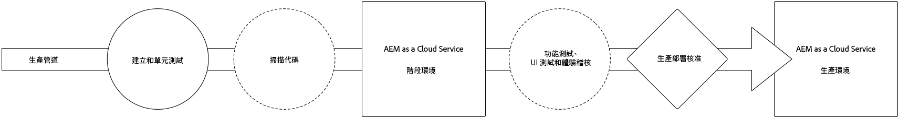
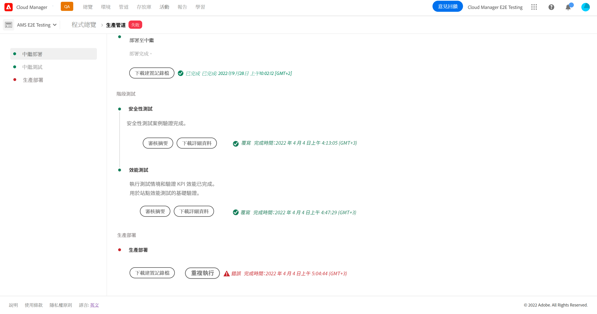

# 部署您的計劃碼 {#deploy-your-code}

了解如何在 AEM as a Cloud Service 中使用 Cloud Manager 管道來將計劃碼部署到生產環境中。



將計劃碼無縫部署到 Stage，然後再部署到生產是透過生產管道完成的。生產管道執行分為兩個邏輯階段。

1. 部署到 Stage 環境
   * 計劃碼構建並部署到 Stage 環境，用於自動化功能測試、UI 測試、體驗稽核和使用者驗收測試 (UAT)。
1. 部署至生產環境
   * 一旦構建在 Stage 上得到驗證，並批准升級到生產，相同的構建工件將部署到生產環境。

_只有 Full Stack Code 流水線類型支援計劃碼掃描、功能測試、UI 測試和體驗稽核。_

## 在 AEM as a Cloud Service 中使用 Cloud Manager 部署程式碼 {#deploying-code-with-cloud-manager}

[在配置了 Pipeline](/help/implementing/cloud-manager/configuring-pipelines/configuring-production-pipelines.md)  (儲存庫、環境和測試環境) 後，您就可以部署計劃碼。

1. 在 [my.cloudmanager.adobe.com](https://my.cloudmanager.adobe.com/) 登入 Cloud Manager 並選取適當的組織。

1. 按一下要部署計劃碼的方案。

1. 點擊&#x200B;**部署**&#x200B;從號召性用語&#x200B;**總覽**&#x200B;畫面開始部署過程。

   

1. 會顯示&#x200B;**管道執行**&#x200B;畫面。按一下&#x200B;**建置**，即可開始流程。

   

構建過程透過三個階段部署您的計劃碼。

1. [中繼部署](#stage-deployment)
1. [階段測試](#stage-testing)
1. [生產部署](#production-deployment)

>[!TIP]
>
>您可以透過檢視紀錄或檢閱測試標準的結果來查看各種部署流程的步驟。

## 中繼部署階段 {#stage-deployment}

**階段部署**&#x200B;階段。涉及這些步驟。

* **驗證**- 此步驟確保管道配置為使用當前可用的資源。例如，測試已配置的分支是否存在以及環境是否可用。
* **建置及單位測試** - 此步驟會執行容器化的建置流程。 
   * 請看文件[構建環境詳細資訊](/help/implementing/cloud-manager/getting-access-to-aem-in-cloud/build-environment-details.md)有關構建環境的詳細資訊。
* **計劃碼掃描** - 此步驟會評估應用計劃計劃碼的品質。
   * 如需有關測試流程的詳細資訊，請參閱文件[計劃碼品質測試](/help/implementing/cloud-manager/code-quality-testing.md)。
* **構建映像**- 此過程負責將構建步驟生成的內容和調度程序包轉換為 Docker 映像和 Kubernetes 配置。
* **部署到階段**- 將映像部署到登台環境以準備[階段測試階段。](#stage-testing)


## 中繼測試階段 {#stage-testing}

這&#x200B;**階段測試**&#x200B;階段涉及這些步驟。

* **產品功能測試**- Cloud Manager 管道執行針對舞台環境執行的測試。
   * 如需更多詳細資訊，請參閱文件：[產品功能測試](/help/implementing/cloud-manager/functional-testing.md#product-functional-testing)。

* **自訂功能測試** - 步驟一律存在且不能跳過。如果構建沒有生成測試 JAR，則測試預設透過。
   * 如需更多詳細資訊，請參閱文件：[自訂功能測試](/help/implementing/cloud-manager/functional-testing.md#custom-functional-testing)。

* **自訂 UI 測試**&#x200B;是一項選擇性功能，可讓您為自訂應用計劃建立和自動執行 UI 測試。
   * UI 測試是封裝在 Docker 影像中的 Selenium 型測試，以便在語言和架構 (例如 Java 和 Maven、Node 和 WebDriver.io 或任何其他根據 Selenium 建置的架構和技術) 中提供廣泛的選擇。
   * 如需更多詳細資訊，請參閱文件：[自訂 UI 測試](/help/implementing/cloud-manager/functional-testing.md#custom-ui-testing)。

* **體驗稽核** - 步驟一律存在且不能跳過。在執行生產管道時，在執行檢查的自訂功能測試之後會包含一個體驗稽核步驟。
   * 配置的頁面將提交給服務並進行評估。
   * 結果是資訊性的，並顯示分數以及當前和以前分數之間的變化。
   * 此深入分析對於判斷是否有將於目前部署引入的迴歸十分有用。
   * 如需更多詳細資訊，請參閱[了解體驗稽核結果](/help/implementing/cloud-manager/experience-audit-testing.md)。


## 生產部署階段 {#deployment-production}

為了對 AEM 網站訪客的影響降至最低，部署到生產拓撲的流程會略有不同。

生產部署通常會遵循和前述相同的步驟，但採用滾動方式。

1. 將 AEM 套件部署給作者。
1. 將 Dispatcher1 和負載平衡器分離。
1. 將 AEM 套件部署到 Publish1 並將 Dispatcher 套件部署到 Dispatcher1，排清 Dispatcher 快取。
1. 將 Dispatcher1 放回負載平衡器中。
1. 一旦 Dispatcher1 重新投入使用，即會將 Dispatcher2 和負載平衡器分離。
1. 將 AEM 套件部署到 Publish2 並將 Dispatcher 套件部署到 Dispatcher2，排清 Dispatcher 快取。
1. 將 Dispatcher2 放回負載平衡器中。

本流程會一直持續到部署已經觸及拓撲中的所有發佈者和 Dispatcher 為止。


## 逾時 {#timeouts}

如果等候使用者回饋意見，以下步驟將逾時：

| 步驟 | 逾時 |
|--- |--- |
| 計劃碼品質測試 | 14 天 |
| 安全測試 | 14 天 |
| 效能測試 | 14 天 |
| 申請核准 | 14 天 |
| 生產部署排程 | 14 天 |
| CSE 支援 | 14 天 |

## 部署流程 {#deployment-process}

所有云服務部署都遵循滾動過程，以確保零停機時間。如需了解詳細資訊，請參閱文件：[滾動部署的工作原理](/help/implementing/deploying/overview.md#how-rolling-deployments-work)。

>[!NOTE]
>
>每個部署上的Dispatcher快取都會消失。 新的發佈節點接受流量前，系統會先加熱此節點。

## 重新執行生產部署 {#Reexecute-Deployment}

生產部署步驟的重新執行可用於生產部署步驟已完成的執行。完成的類型並不重要——部署可能會被取消或不成功。主要使用案例是生產部署步驟由於暫時原因而失敗的情況。重新執行會使用相同的管道建立全新的執行。這個全新執行會包括三個步驟：

1. 驗證步驟 – 這基本上和正常管道執行期間發生的驗證相同。
1. 建置步驟 – 在重新執行的內容中，建置步驟會複製成品，而且實際上並非執行全新的建置流程。
1. 生產部署步驟 – 這會使用和正常管道執行中的生產部署步驟相同的設定和選項。

建置步驟在 UI 中可能有不同的標示，以反映這是在複製成品，而不是重新建置。



限制:

* 重新執行生產部署步驟僅適用於最後執行。
* 重新執行不適用於推送更新執行。如果最後一次執行是推送更新執行，則無法重新執行。
* 如果最後一次執行是推送更新執行，則無法重新執行。
* 如果最後執行在生產部署步驟之前的任何時候失敗，則無法重新執行。

### 重新執行 API {#Reexecute-API}

### 識別重新執行的執行

若要識別是否為重新執行的執行，可檢查觸發計劃欄位。它的價值將是&#x200B;*RE_EXECUTE*.

### 觸發新執行

若要觸發重新執行，需要向生產部署步驟狀態的 HAL 連結 <https://ns.adobe.com/adobecloud/rel/pipeline/reExecute> 發出 PUT 要求。如果此連結存在，則可以從該步驟重新開始執行。如果不存在，則無法從該步驟重新開始執行。在初始版本中，此鏈接只會出現在生產部署步驟中，但未來版本可能支援從其他步驟啟動管道。範例:

```Javascript
 {
  "_links": {
    "https://ns.adobe.com/adobecloud/rel/pipeline/logs": {
      "href": "/api/program/4/pipeline/1/execution/953671/phase/1575676/step/2983530/logs",
      "templated": false
    },
    "https://ns.adobe.com/adobecloud/rel/pipeline/reExecute": {
      "href": "/api/program/4/pipeline/1/execution?stepId=2983530",
      "templated": false
    },
    "https://ns.adobe.com/adobecloud/rel/pipeline/metrics": {
      "href": "/api/program/4/pipeline/1/execution/953671/phase/1575676/step/2983530/metrics",
      "templated": false
    },
    "self": {
      "href": "/api/program/4/pipeline/1/execution/953671/phase/1575676/step/2983530",
      "templated": false
    }
  },
  "id": "6187842",
  "stepId": "2983530",
  "phaseId": "1575676",
  "action": "deploy",
  "environment": "weretail-global-b75-prod",
  "environmentType": "prod",
  "environmentId": "59254",
  "startedAt": "2022-01-20T14:47:41.247+0000",
  "finishedAt": "2022-01-20T15:06:19.885+0000",
  "updatedAt": "2022-01-20T15:06:20.803+0000",
  "details": {
  },
  "status": "FINISHED"
```


_href_ 值的語法並非打算用作參考點。應總是從 HAL 連結讀取實際值，而不是將其產生。

如果成功，則向此端點提交 *PUT* 請求將導致 *201* 回應，而且該回應主體將是新執行的表示方式。這類似於透過 API 啟動常規執行。
