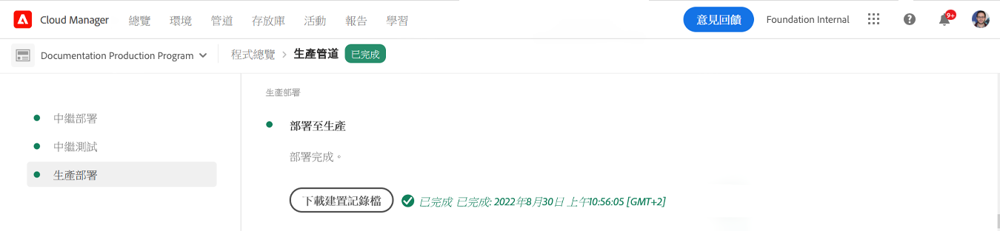

# 部署代碼 {#deploy-your-code}

瞭解如何在as a Cloud Service中使用Cloud Manager管道部署AEM代碼。

## 在as a Cloud Service中使用雲管理器部署代AEM碼 {#deploying-code-with-cloud-manager}

一旦你 [已配置生產管道](/help/implementing/cloud-manager/configuring-pipelines/configuring-production-pipelines.md) 包括儲存庫、環境和測試環境，您已準備好部署代碼。

1. 登錄到Cloud Manager(位於 [my.cloudmanager.adobe.com](https://my.cloudmanager.adobe.com/) 並選擇相應的組織。

1. 按一下要為其部署代碼的程式。

1. 按一下 **部署** 從行動要求開始 **概述** 螢幕以啟動部署過程。

   

1. 的 **管道執行** 螢幕。 按一下 **生成** 以啟動進程。

   

生成過程將通過三個階段部署代碼。

1. [階段部署](#stage-deployment)
1. [階段測試](#stage-testing)
1. [生產部署](#production-deployment)

>[!TIP]
>
>您可以查看日誌或查看結果以查看測試標準中各個部署流程的步驟。

## 階段部署階段 {#stage-deployment}

的 **階段部署** 。 涉及到這些步驟。

* **驗證**   — 此步驟確保管道配置為使用當前可用資源。 例如，測試配置的分支是否存在以及環境是否可用。
* **構建和單元測試**  — 此步驟運行集裝箱化生成過程。
   * 請參閱文檔 [生成環境詳細資訊](/help/implementing/cloud-manager/getting-access-to-aem-in-cloud/build-environment-details.md) 的子菜單。
* **代碼掃描**  — 此步驟將評估應用程式碼的質量。
   * 請參閱文檔 [代碼質量測試](/help/implementing/cloud-manager/code-quality-testing.md) 的子菜單。
* **生成映像**  — 此過程負責將生成步驟生成的內容和分發程式包轉換為Docker映像和Kubernetes配置。
* **部署到階段**  — 映像部署到暫存環境，以準備 [階段測試階段。](#stage-testing)

## 階段測試階段 {#stage-testing}

的 **階段測試** 階段涉及這些步驟。

* **產品功能測試** - Cloud Manager管道執行針對階段環境運行的test。
   * 請參閱文檔 [產品功能測試](/help/implementing/cloud-manager/functional-testing.md#product-functional-testing) 的子菜單。

* **自定義功能測試**  — 管道中的此步驟始終執行，無法跳過。 如果生成未生成testJAR，則預設情況下test會通過。
   * 請參閱文檔 [自定義功能測試](/help/implementing/cloud-manager/functional-testing.md#custom-functional-testing) 的子菜單。

* **自定義UI測試**  — 此步驟是可選功能，可自動運行為自定義應用程式建立的UItest。
   * UItest是基於Selenium的test，打包在Docker映像中，允許在語言和框架（如Java和Maven、Node和WebDriver.io，或基於Selenium構建的任何其它框架和技術）中進行廣泛選擇。
   * 請參閱文檔 [自定義UI測試](/help/implementing/cloud-manager/functional-testing.md#custom-ui-testing) 的子菜單。

* **經驗審計**  — 管道中的此步驟始終執行，無法跳過。 在執行生產管道時，在將運行檢查的定製功能測試之後包括體驗審核步驟。
   * 配置的頁面將提交到服務並進行評估。
   * 這些結果是資訊性的，並顯示當前和以前的分數之間的分數和變化。
   * 這一洞見對於確定當前部署中是否將引入回歸非常重要。
   * 請參閱文檔 [瞭解經驗審計結果](/help/implementing/cloud-manager/experience-audit-testing.md) 的子菜單。

## 生產部署階段 {#deployment-production}

部署到生產拓撲的過程略有不同，以最大限度地減少對站點的AEM影響。

生產部署通常遵循與前面描述相同的步驟，但是採用滾動方式。

1. 部署AEM要創作的包。
1. 從負載平衡器中分離Dispatcher1。
1. 將包部AEM署到publish1，將調度程式包部署到dispatcher1，刷新調度程式快取。
1. 將dispatcher1放回負載平衡器。
1. 一旦dispatcher1恢復服務，將dispatcher2與負載平衡器分離。
1. 將包部AEM署到publish2，將調度程式包部署到dispatcher2，刷新調度程式快取。
1. 將dispatcher2放回負載平衡器中。

此過程一直持續到部署到達拓撲中的所有發佈者和調度程式為止。

## 超時 {#timeouts}

如果留在等待用戶反饋，以下步驟將超時：

| 步驟 | 逾時 |
|--- |--- |
| 代碼質量測試 | 14天 |
| 安全測試 | 14天 |
| 效能測試 | 14天 |
| 申請審批 | 14天 |
| 計畫生產部署 | 14天 |
| CSE支援 | 14天 |

## 部署過程 {#deployment-process}

所有Cloud Service部署都遵循滾動過程以確保零停機。 請參閱文檔 [滾動部署的工作方式](/help/implementing/deploying/overview.md#how-rolling-deployments-work) 來瞭解更多資訊。