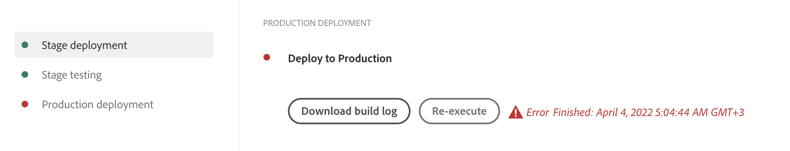

# 部署您的程式碼 {#deploy-your-code}

了解如何在 AEM as a Cloud Service 中使用 Cloud Manager 管道來將程式碼部署到生產環境中。


將程式碼無縫部署到Stage，然後再部署到生產是透過生產管道完成的。 生產管道執行分為兩個邏輯階段：

1. **部署至中繼環境** — 程式碼已建置並部署至中繼環境，以進行自動化功能測試、UI測試、體驗稽核和使用者驗收測試(UAT)。
1. **部署到生產環境** — 一旦組建在Stage上經過驗證，並核准升級至生產環境，相同的組建成品就會部署到生產環境。

_只有 Full Stack Code 管道類型支援程式碼掃描、功能測試、UI 測試和體驗稽核。_

## 部署流程 {#deployment-process}

所有云服務部署都遵循滾動過程，以確保零停機時間。如需更多資訊，請參閱[滾動部署的工作原理](/help/implementing/deploying/overview.md#how-rolling-deployments-work)。

>[!NOTE]
>
>每次部署都會清除 Dispatcher 快取。它隨後會在新發佈節點接受流量之前「熱身」。

## 在AEM as a Cloud Service中使用Cloud Manager部署您的程式碼 {#deploying-code-with-cloud-manager}

在[設定了生產管道](/help/implementing/cloud-manager/configuring-pipelines/configuring-production-pipelines.md)  (儲存庫、環境和測試環境) 後，您就可以部署程式碼。

1. 在 [my.cloudmanager.adobe.com](https://my.cloudmanager.adobe.com/) 登入 Cloud Manager 並選取適當的組織。

1. 在&#x200B;**[我的程式](/help/implementing/cloud-manager/navigation.md#my-programs)**&#x200B;主控台上，按一下您要部署程式碼的程式。

1. 在&#x200B;**總覽**&#x200B;頁面的call-to-action區域中，按一下&#x200B;**部署**。

   

1. 在&#x200B;**部署到生產**&#x200B;頁面上，按一下&#x200B;**建置**。

   

建置流程會透過下列三個有序階段部署您的程式碼：

1. [中繼部署階段](#stage-deployment)
1. [中繼測試階段](#stage-testing)
1. [生產部署階段](#production-deployment)

>[!TIP]
>
>您可以透過檢視記錄或檢閱測試標準的結果來查看各種部署流程的步驟。

### 中繼部署階段 {#stage-deployment}

**階段部署**&#x200B;階段涉及下列步驟：

| 中繼部署步驟 | 說明 |
| --- | --- |
| 驗證 | 確保管道設定為使用目前可用的資源。 例如，測試設定的分支是否存在並且環境是否可用。 |
| 建置和單元測試 | 執行容器化的建置流程。<br>如需組建環境的詳細資訊，請參閱[組建環境詳細資料](/help/implementing/cloud-manager/getting-access-to-aem-in-cloud/build-environment-details.md)。 |
| 程式碼掃描 | 評估應用程式程式碼的品質。<br>如需有關測試流程的詳細資訊，請參閱[程式碼品質測試](/help/implementing/cloud-manager/code-quality-testing.md)。 |
| 建置影像 | 此過程會將內容和Dispatcher包從構建步驟轉換為Docker影象。 它也會根據這些套件產生Kubernetes設定。 |
| 部署至中繼 | 將映像部署到中繼環境，以準備[中繼測試階段](#stage-testing)。 |


### 中繼測試階段 {#stage-testing}

**中繼測試**&#x200B;階段涉及下列步驟：

| 中繼測試步驟 | 說明 |
| --- | --- |
| 產品功能測試 | Cloud Manager管道會執行針對預備環境執行的測試。<br>另請參閱[產品功能測試](/help/implementing/cloud-manager/functional-testing.md#product-functional-testing)。 |
| 自訂功能測試 | 步驟一律存在且不能跳過。 如果建置未產生測試JAR，則測試會自動通過。<br>另請參閱[自訂功能測試](/help/implementing/cloud-manager/functional-testing.md#custom-functional-testing)。 |
| 自訂 UI 測試 | 此選用功能可自動執行為自訂應用程式建立的UI測試。<br>UI測試以Selenium為基礎，並封裝在Docker影像中，以在語言和架構中提供靈活性。 此方法可讓您使用Java和Maven、Node和WebDriver.io，或任何以Selenium為基礎的架構或技術。<br>另請參閱[自訂使用者介面測試](/help/implementing/cloud-manager/functional-testing.md#custom-ui-testing)。 |
| 體驗稽核 | 步驟一律存在且不能跳過。 在執行生產管道時，在執行檢查的自訂功能測試之後會包含體驗稽核步驟。<ul><li>配置的頁面將提交給服務並進行評估。</li><li>結果是資訊性的，並顯示分數以及當前和以前分數之間的變化。</li><li>此深入分析對於判斷是否有會於目前部署引入的迴歸十分有用。</li></ul>請參閱[瞭解體驗稽核結果](/help/implementing/cloud-manager/reports/report-experience-audit.md)。</li></ul> |


### 生產部署階段 {#production-deployment}

部署到生產拓撲的流程會略有不同，以將對造訪AEM網站的訪客的影響降至最低。

生產部署通常會遵循和前述相同的步驟，但採用滾動方式。 這些步驟包括下列各項：

1. 將 AEM 套件部署給作者。
1. 從負載平衡器中斷連結`dispatcher1`。
1. 將AEM套件部署到`publish1`，並將Dispatcher套件部署到`dispatcher1`，排清Dispatcher快取。
1. 將`dispatcher1`放回負載平衡器中。
1. 當`dispatcher1`重新使用時，從負載平衡器分離`dispatcher2`。
1. 將AEM套件部署到`publish2`，並將Dispatcher套件部署到`dispatcher2`，排清Dispatcher快取。
1. 將`dispatcher2`放回負載平衡器中。

此程式會持續進行，直到部署觸及拓撲中的所有發佈者和Dispatcher為止。


## 部署期間逾時 {#timeouts}

如果下列步驟在部署期間等候使用者意見反應，則會逾時：

| 步驟 | 逾時 |
|--- |--- |
| 程式碼品質測試 | 14 天 |
| 安全測試 | 14 天 |
| 效能測試 | 14 天 |
| 申請核准 | 14 天 |
| 生產部署排程 | 14 天 |
| CSE 支援 | 14 天 |

## 重新執行生產部署 {#reexecute-deployment}

在極少數情況下，生產部署步驟可能會因暫時的原因而失敗。在這種情況下，只要生產部署步驟已完成，即支援重新執行生產部署步驟，無論完成的型別為何（例如，已取消或不成功）。 重新執行會使用包含以下三個步驟的相同管道來建立新的執行：

1. **驗證** — 與正常管道執行期間發生的驗證相同。
1. **建置** — 在重新執行的內容中，建置步驟會復製成品，而且實際上不會執行新的建置程式。
1. **生產部署** — 使用與正常管道執行中的生產部署步驟相同的設定和選項。

在可以重新執行的情況下，生產管道狀態頁會提供「**重新執行**」選項 (在一般「**下載建置記錄**」選項旁)。



>[!NOTE]
>
>在重新執行中，UI 會標示建置步驟，以反映這是在複製成品，而不是重新建置。

### 使用說明 {#usage-notes}

* 重新執行生產部署步驟僅適用於最後執行。
* 重新執行不適用於推送更新執行。 如果最後一次執行是推送更新執行，則無法重新執行。
* 如果最後執行在生產部署步驟之前的任何時候失敗，則無法重新執行。

### 重新執行 API {#reexecute-API}

除了可在 UI 中使用之外，您還可以使用 [Cloud Manager API](https://developer.adobe.com/experience-cloud/cloud-manager/reference/api/#tag/Pipeline-Execution) 觸發重新執行，並識別視為重新執行所觸發的執行。

#### 觸發重新執行 {#reexecute-deployment-api}

若要觸發重新執行，請向生產部署步驟狀態的 HAL 連結 `https://ns.adobe.com/adobecloud/rel/pipeline/reExecute` 發出 PUT 要求。

* 如果此連結存在，則可以從該步驟重新開始執行。
* 如果不存在，則無法從該步驟重新開始執行。

此連結僅適用於生產部署步驟。

```JavaScript
 {
  "_links": {
    "https://ns.adobe.com/adobecloud/rel/pipeline/logs": {
      "href": "/api/program/4/pipeline/1/execution/953671/phase/1575676/step/2983530/logs",
      "templated": false
    },
    "https://ns.adobe.com/adobecloud/rel/pipeline/reExecute": {
      "href": "/api/program/4/pipeline/1/execution?stepId=2983530",
      "templated": false
    },
    "https://ns.adobe.com/adobecloud/rel/pipeline/metrics": {
      "href": "/api/program/4/pipeline/1/execution/953671/phase/1575676/step/2983530/metrics",
      "templated": false
    },
    "self": {
      "href": "/api/program/4/pipeline/1/execution/953671/phase/1575676/step/2983530",
      "templated": false
    }
  },
  "id": "6187842",
  "stepId": "2983530",
  "phaseId": "1575676",
  "action": "deploy",
  "environment": "weretail-global-b75-prod",
  "environmentType": "prod",
  "environmentId": "59254",
  "startedAt": "2022-01-20T14:47:41.247+0000",
  "finishedAt": "2022-01-20T15:06:19.885+0000",
  "updatedAt": "2022-01-20T15:06:20.803+0000",
  "details": {
  },
  "status": "FINISHED"
```

HAL 連結的 href 值的語法僅為參考範例。應總是從 HAL 連結讀取實際值，而不是將其產生。

如果成功，則向此端點提交PUT請求會導致201回應，而且該回應主體是新執行的表示方式。 此工作流程類似於透過API開始定期執行。

#### 識別重新執行的執行 {#identify-reexecution}

系統將`trigger`欄位設定為值`RE_EXECUTE`以識別重新執行。
