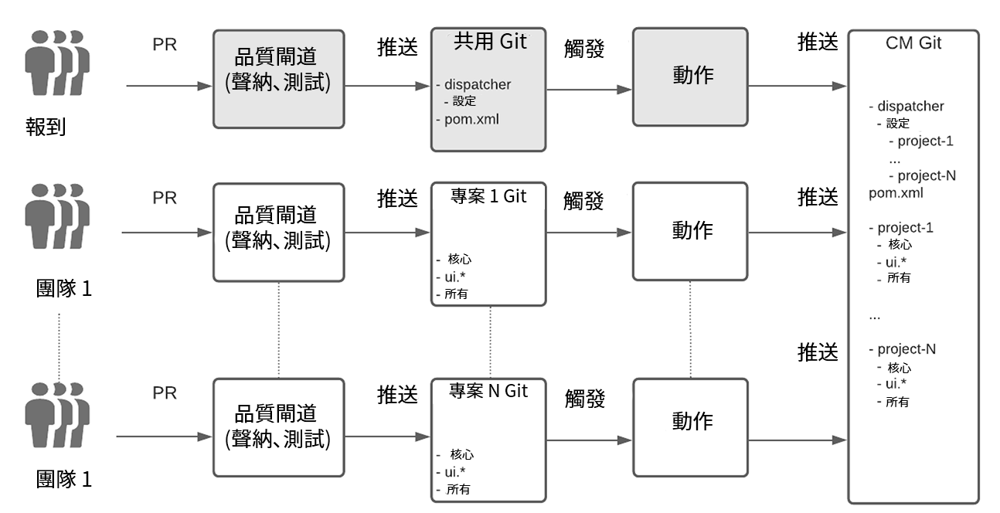
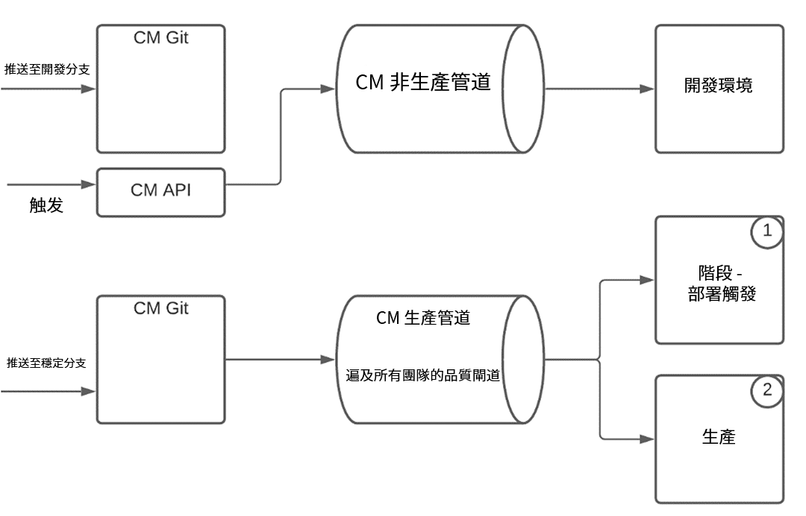
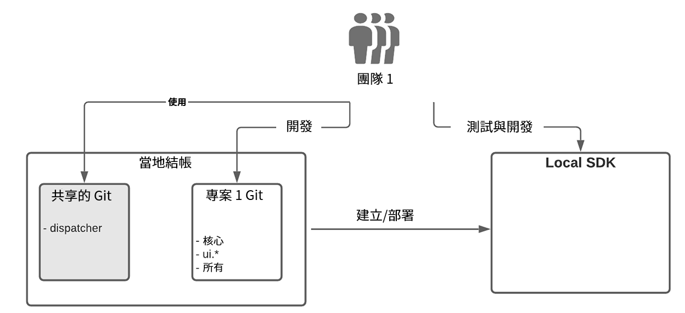

# 作為Cloud Service的AEM企業團隊開發設定{#enterprise-setup}

## 簡介 {#introduction}

作AEM為Cloud Service，雲端原生服務AEM是專為享受10年以上（含特定需求）的企業團隊提供企業軟體而設計。 雖然它可AEM以像永遠開啟、永遠最新、永遠安全且永遠規模化等新價值，但它仍保有主要價值主張，可做為客戶可自訂的平台，並讓企業級團隊整合在其開發與交付程式中。

為了支援客戶的企業開發設定，作為一個Cloud Service，它與Cloud Manager及其專門建立的CI/CD管道完全整合，這些管道具備最佳實務，並從企業級開發與部署的多年經驗中汲取經驗教訓——確保完全測試和最高的程式碼品質，以提供卓越的體驗。

## Cloud Manager在企業團隊開發設定中的支援{#cloud-manager}

為確保客戶快速上線，Cloud Manager提供了立即開始開發體驗所需的一切，包括一個Git儲存庫，用於儲存自定義項目，然後由Cloud Manager構建、驗證和部署。
使用Cloud Manager，開發團隊可以經常致力於提交變更，而不需依賴Adobe人員。

Cloud Manager提供三種環境類型：

* 開發
* 分段
* 生產

程式碼可使用非生產管道部署至開發環境。 對於Stage和Production，在部署生產之前，通常會先進行驗證，以便確保進行最佳實務，生產管道會使用質量門來驗證應用程式碼和配置更改。

生產管線會先將程式碼和組態部署至測試環境、測試應用程式，最後部署至生產環境。
Cloud ServiceSDK隨時更新，提供最新的Cloud Service改良功能，讓您直接使用開發人員的本機硬體進行本機開發。 如此，就可以以以極短的週轉時間快速開發。 因此，開發人員可以留在熟悉的本端環境中，從多種開發工具中選擇，並視需要推展開發環境或生產。

Cloud Manager支援靈活的多組設定，可根據企業需求進行調整。 這適用於Cloud Service和AMS。 為確保多個團隊的部署穩定，並避免一個團隊影響所有團隊的生產，Cloud Managers確信的管道始終會一起驗證和測試所有團隊的代碼。

## 真實世界範例{#real-world-example}

每個企業都有不同的需求，包括不同的團隊設定、流程和開發工作流程。 以下所述的設定是Adobe用於數個專案，以Cloud Service的形式提供體AEM驗。

例如，Adobe Creative Cloud應用程式(例如Adobe Photoshop或Adobe Illustrator)包含教學課程、範例和指南等內容資源，供其使用者使用。 用戶端應用程式會以&#x200B;*無頭*&#x200B;的方式使用此內容作為Cloud ServiceAEM，透過對AEMCloud發佈層進行API呼叫以擷取結構化內容作為JSON串流，並運用[內容放送網路(CDN)作為Cloud ServiceAEM](https://experienceleague.adobe.com/docs/experience-manager-cloud-service/implementing/content-delivery/cdn.html?lang=en#content-delivery)以最佳效能同時提供結構化和非結構化內容。

為此項目作出貢獻的團隊遵循以下所述的流程。

>[!NOTE]
>請參閱[使用多源Git儲存庫](https://experienceleague.adobe.com/docs/experience-manager-cloud-manager/using/managing-code/working-with-multiple-source-git-repos.html#managing-code)以瞭解有關設定的詳細資訊。

每個團隊都使用自己的開發工作流程，並有個別的Git儲存庫。 另一個共用的Git儲存庫可用來上線專案。 此Git儲存庫包含Cloud Manager的git儲存庫的根結構，包括共用的分派器設定。 登入新專案時，需要在共用git儲存庫的根目錄中列出Reactor Maven專案檔案。 對於Dispatcher配置，將在Dispatcher項目內建立新的配置檔案。 然後，主調度器配置將包含此檔案。 每個團隊負責自己的調度程式配置檔案。 對共用Git儲存庫的更改很少見，而且通常只有在新項目已登錄時才需要。 主要工作由每個專案團隊在其專屬的git儲存庫中完成。

每個團隊的Git儲存庫已使用Maven原型AEM進行設定，因此會遵循設定專案的最佳AEM範例。 唯一的例外是處理在共用Git儲存庫中完成的調度程式配置，如上所述。
每個團隊使用簡化的git工作流程，其中有兩個+ N個分支，遵循Git流程模型：

* 穩定的發行分支包含生產代碼

* 開發部門包含最新的開發

* 對於每個特徵，都建立一個新分支

開發是在特徵分支中完成的，當特徵成熟時，它將合併到開發分支中。 已完成和已驗證的功能會從開發分支中挑選出來並合併到穩定分支中。 所有變更都是透過拉式要求(PR)完成。 每個PR都由質量門自動驗證。 聲納用來檢查程式碼的品質，並執行一組測試套件，以確保新程式碼不會引入任何回歸。

Cloud Manager的git儲存庫中的設定有兩個分支：

* A *穩定的發行分支*，包含所有團隊的生產代碼
* A *開發分支*，包含所有團隊的開發代碼

在開發或穩定分支中，每次推送至團隊的git儲存庫，都會觸發[github動作](https://experienceleague.adobe.com/docs/experience-manager-cloud-manager/using/managing-code/working-with-multiple-source-git-repos.html?lang=en#managing-code)。 所有項目都遵循穩定分支的相同設定。 推送至專案的穩定分支會自動推送至Cloud Manager的git儲存庫中的穩定分支。 Cloud Manager中的生產管道配置為通過推送到穩定分支來觸發。 因此，生產流水線由任何團隊的每個推入到穩定的分支中來執行，並且如果所有質量門都通過，生產部署會更新。

推送至開發分支的處理方式不同。 推送至團隊Git儲存庫中的開發人員分支也會觸發github動作，而程式碼會自動推送至Cloud Manager的git儲存庫中的開發分支，但非生產管道不會由程式碼推送自動觸發。 它是由呼叫Cloud Manager的api所觸發。
執行生產管道包括透過提供的品質閘道檢查所有團隊的程式碼。 在將程式碼部署至舞台後，會執行測試和稽核，以確保一切正常運作。 一旦所有門都通過，這些更改就可以在不中斷或停機的情況下向生產部門推廣。
對於本端開發，會使用[SDKAEM作為Cloud Service](https://experienceleague.adobe.com/docs/experience-manager-cloud-service/implementing/developing/aem-as-a-cloud-service-sdk.html?lang=en#developing)。 SDK可讓本機作者、發佈和分派程式進行設定。 這可讓離線開發和快速週轉。 有時只有作者用於開發，但快速設定分發程式和發佈可讓您在推送至Git儲存庫之前，先在本機測試所有內容。 每個團隊成員通常會從共用的Git結帳程式碼，以及自己的專案程式碼。 由於專案是獨立的，因此不需要結帳其他專案。

這個實際的設定可當做藍圖使用，然後根據企業的需求加以自訂。 Git的彈性分支與合併概念可讓您根據每個團隊的需求，自訂上述工作流程的變化。 作AEM為Cloud Service支援所有這些變化，而不會犧牲固執己見的Cloud Manager管道的核心價值。

### 多組設定的注意事項{#considerations}

>[!NOTE]
>對於任何多團隊設定，定義治理模式和一套所有團隊都必須遵循的標準至關重要。 上述多團隊設定的藍圖可讓更多團隊進行縮放，而您可以從這個藍圖開始。

有了Cloud Manager的git儲存庫和生產管道，所有品質的關口都會執行完整的生產代碼，將其視為一個部署單元。 這樣，生產系統始終保持&#x200B;*處於*狀態，而不會中斷或停機。
相反地，沒有這樣的系統，因為每個團隊都可以單獨部署，因此單一團隊的更新可能會導致生產穩定性問題。 此外，推出更新需要協調和計畫內停機。 隨著團隊數量的增加，協調工作將變得複雜得多，而且很快將無法控制。

如果在質量門中檢測到問題，則不影響生產，並且可以檢測並修復問題，而無需Adobe人員介入。 如果不進行Cloud Service，而且不總是測試整個部署，部分部署可能會導致中斷，需要請求回滾，甚至從備份進行完全恢復。 部分測試也可能導致其他問題，在事實發生後，需要Adobe人員的協調與支援，才需要解決。