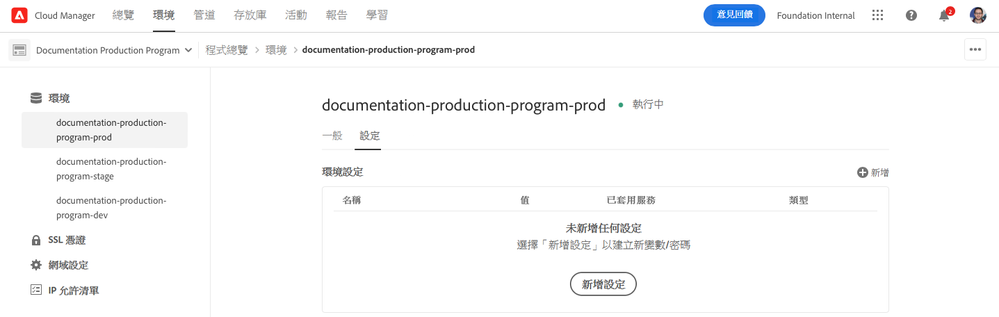
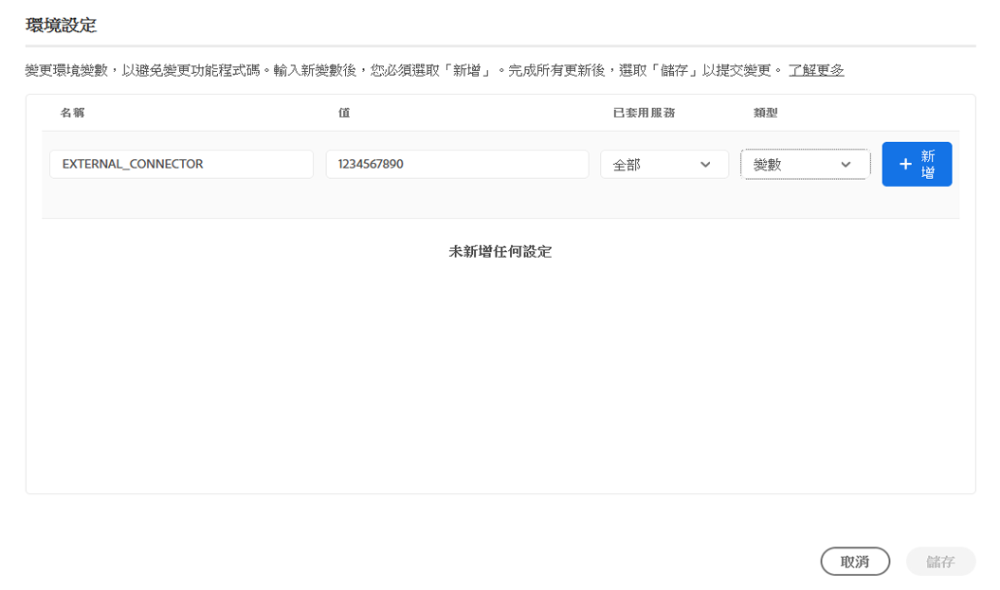
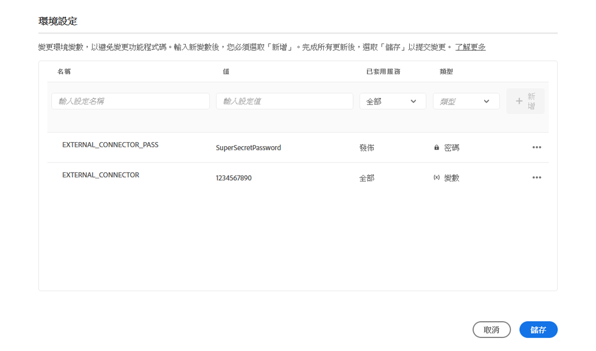
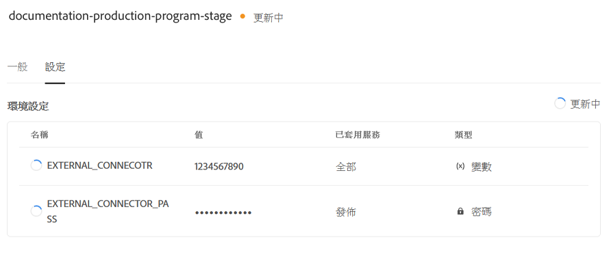
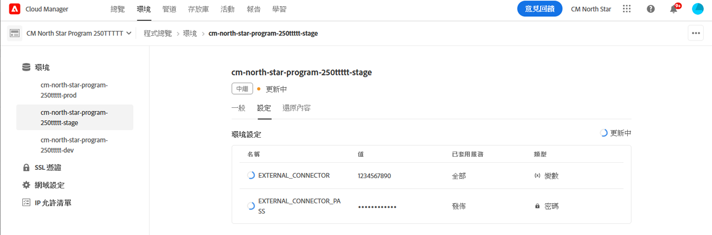
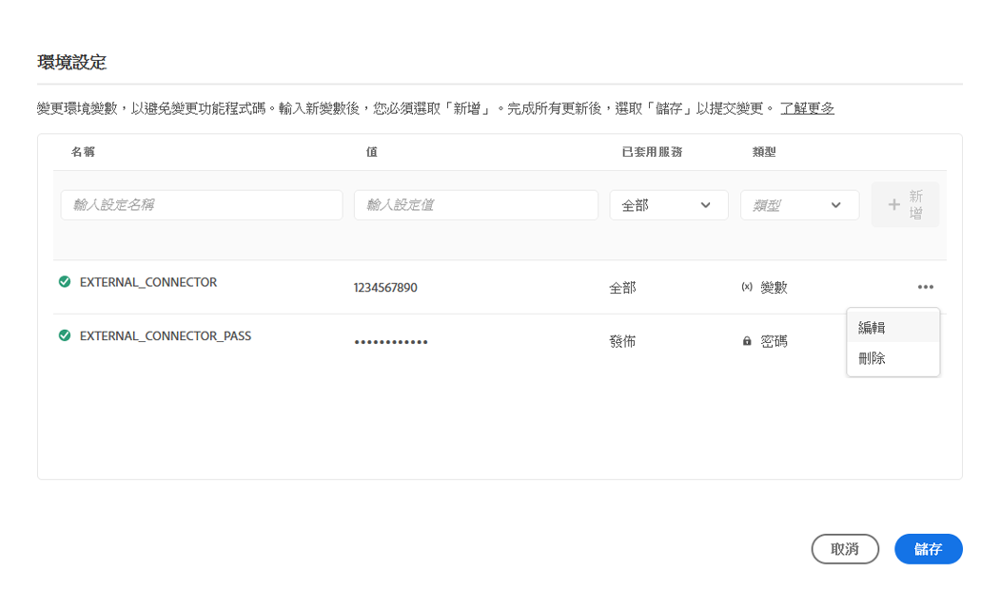
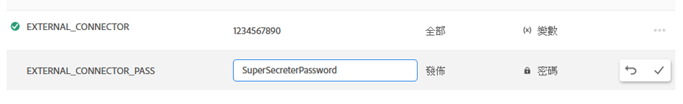

# Cloud Manager環境變數 {#environment-variables}

標準環境變數可以通過雲管理器進行配置和管理。 它們被提供給運行時間環境，並可用於OSGi配置。 環境變數可以是特定於環境的值，也可以是基於正在更改的內容的環境機密。

## 總覽 {#overview}

環境變數為as a Cloud Service用戶提供了許多AEM好處：

* 它們允許代碼和應用程式的行為根據上下文和環境而有所不同。 例如，它們可用於在開發環境中啟用與生產環境或階段環境相比的不同配置，以避免代價高昂的錯誤。
* 只需配置和設定一次，並可在必要時更新和刪除。
* 它們的值可以在任何時間點更新，並立即生效，而無需任何代碼更改或部署。
* 它們可以將代碼與配置分開，並消除在版本控制中包含敏感資訊的需要。
* 它們提高了as a Cloud Service應用AEM程式的安全性，因為它們位於代碼之外。

使用環境變數的典型使用案例包括：

* 將應用程AEM序與不同的外部終結點連接
* 在儲存密碼時使用引用，而不是直接在代碼庫中使用
* 當程式中存在多個開發環境，並且某些配置不同於一個環境時，

## 添加環境變數 {#add-variables}

>[!NOTE]
>
>您必須是 [**部署管理器** 角色](/help/onboarding/cloud-manager-introduction.md#role-based-premissions) 以添加或修改環境變數。

1. 登錄到Adobe雲管理器，位於 [my.cloudmanager.adobe.com](https://my.cloudmanager.adobe.com/)。
1. 雲管理器列出了各種可用程式。 選擇要管理的。
1. 選擇 **環境** 頁籤，然後在左側導航面板中選擇要為其建立環境變數的環境。
1. 在環境的詳細資訊中，選擇 **配置** 選項 **添加** 開啟 **環境配置** 對話框。
   * 如果是首次添加環境變數，則將看到 **添加配置** 按鈕。 您可以使用此按鈕或 **添加** 開啟 **環境配置** 對話框。

   

1. 輸入變數詳細資訊。
   * **名稱**
   * **值**
   * **已應用服務**  — 定義變數應用於哪項服務（作者/發佈/預覽），或變數應用於所有服務
   * **類型**  — 定義變數是普通變數還是機密變數

   

1. 輸入新變數後，必須選擇 **添加** 列中。
   * 通過輸入新行並選擇 **添加**。

   

1. 選擇 **保存** 來保留變數。

狀態為 **更新** 顯示在表的頂部和新添加的變數旁邊，以指示正在使用配置更新環境。 完成後，新環境變數將在表中可見。

>[!TIP]
>
>如果要添加多個變數，建議添加第一個變數，然後使用 **添加** 按鈕 **環境配置** 對話框，以添加附加變數。 這樣，您就可以通過一次更新將它們添加到環境中。

## 更新環境變數 {#update-variables}

建立環境變數後，可以使用 **添加/更新** 按鈕啟動 **環境配置** 對話框。

1. 登錄到Adobe雲管理器，位於 [my.cloudmanager.adobe.com](https://my.cloudmanager.adobe.com/)。
1. 雲管理器列出了各種可用程式。 選擇要管理的。
1. 選擇 **環境** 頁籤，然後在左側導航面板中選擇要為其建立環境變數的環境。
1. 在環境的詳細資訊中，選擇 **配置** 選項 **添加/更新** 在右上角開啟 **環境配置** 對話框。

   

1. 使用要修改的變數行的最後一列中的省略號按鈕，選擇 **編輯** 或 **刪除**。

   

1. 根據需要編輯環境變數。
   * 編輯時，省略號按鈕將更改為選項，以還原為原始值或確認更改。
   * 編輯機密時，只能更新值，而不能查看。

   

1. 完成所有必需的配置更改後，選擇 **保存**。

[與添加變數時一樣，](#add-variables) 狀態指示器 **更新** 顯示在表的頂部和新更新的變數旁邊，以指示正在使用配置更新環境。 完成後，更新的環境變數將在表中可見。

>[!TIP]
>
>如果要更新多個變數，建議使用 **環境配置** 對話框，在按一下或按一下之前立即更新所有必需的變數 **保存**。 這樣，您就可以通過一次更新將它們添加到環境中。

## 使用環境變數 {#using}

環境變數可以 `pom.xml` 更安全、更靈活的配置。 例如，密碼無需硬編碼，您的配置可以根據環境變數中的值進行調整。

您可以通過XML訪問環境變數和機密，如下所示。

* `${env.VARIABLE_NAME}`

查看文檔 [設定項目](/help/implementing/cloud-manager/getting-access-to-aem-in-cloud/setting-up-project.md#password-protected-maven-repository-support-password-protected-maven-repositories) 例如，如何在 `pom.xml` 的子菜單。

查看 [正式Maven檔案](https://maven.apache.org/settings.html#quick-overview) 的子菜單。
