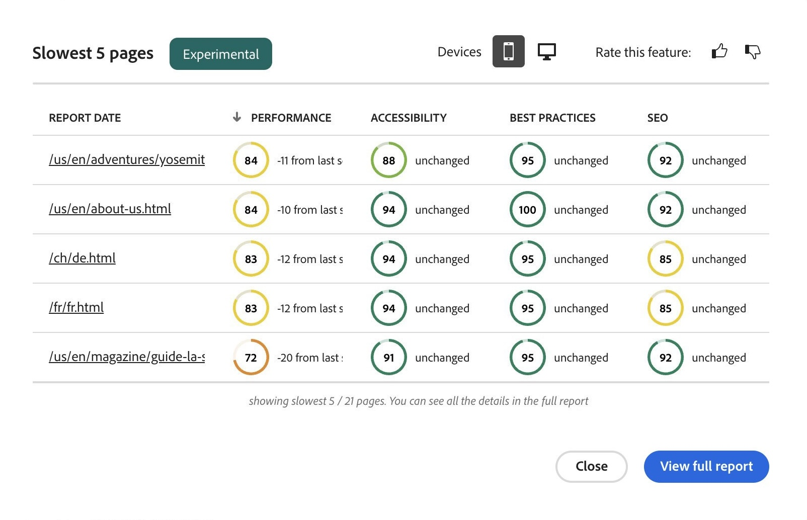
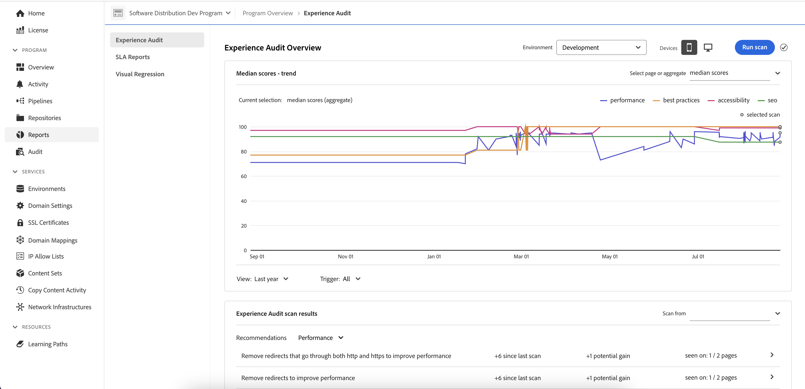

# 體驗稽核儀表板 {#experience-audit-dashboard}

瞭解體驗稽核如何驗證您的部署流程，並透過清晰、資訊豐富的儀表板介面，協助確保部署的變更符合效能、協助工具、最佳實務和SEO的基準標準。

>[!NOTE]
>
>此功能僅適用於[早期採用者方案。](/help/implementing/cloud-manager/release-notes/current.md#early-adoption)
>
>如需AEM as a Cloud Service現有體驗稽核功能的詳細資訊，請參閱檔案： [體驗稽核測試](/help/implementing/cloud-manager/experience-audit-testing.md)

## 概觀 {#overview}

體驗稽核會驗證部署流程，並幫助確保已部署變更：

1. 符合效能、協助工具、最佳實務、SEO (搜尋引擎最佳化) 和 PWA (漸進式 Web 應用程式) 的基線標準。

1. 不要引入迴歸。

Cloud Manager中的體驗稽核可確保使用者在網站上的體驗達到最高標準。

稽核結果會提供資訊，可讓部署管理員查看目前和先前分數之間的分數和變更。此深入分析對於判斷是否有會於目前部署引入的迴歸十分有用。

體驗稽核由[Google Lighthouse](https://developer.chrome.com/docs/lighthouse/overview/) (Google的開放原始碼工具)提供技術支援，並在所有Cloud Manager生產管道中啟用。

## 可用性 {#availability}

體驗稽核適用於Cloud Manager：

* 網站生產管道，預設為
* 開發完整棧疊管道（可選）
* 開發前端管道（可選）

請參閱[設定區段](#configuration)，以取得如何為選擇性環境設定稽核的詳細資訊。

稽核會在管道中執行。 稽核也可以是[在管道外部隨選執行](#on-demand)。

## 設定 {#configuration}

生產管道預設會提供體驗稽核。 您可以選擇啟用它來開發完整棧疊和前端管道。 在所有情況下，您需要定義在管道執行期間評估哪些內容路徑。

1. 根據您要設定的管線型別，請遵循以下指示：

   * 若要定義要由稽核評估的路徑，請新增新的[生產管道](/help/implementing/cloud-manager/configuring-pipelines/configuring-production-pipelines.md)。
   * 若要在前端或開發完整棧疊管道上啟用稽核，請新增新的[非生產管道](/help/implementing/cloud-manager/configuring-pipelines/configuring-non-production-pipelines.md)。
   * 或者，您可以[編輯現有管道，](/help/implementing/cloud-manager/configuring-pipelines/managing-pipelines.md)並更新現有選項。

1. 如果您要新增或編輯要使用體驗稽核的非生產管道，則必須在「**Source程式碼**」索引標籤上選取「**體驗稽核**」核取方塊。

   

   * 這僅對非生產管道是必要的。
   * 選取核取方塊時，**體驗稽核**&#x200B;索引標籤就會顯示。

1. 對於生產和非生產管道，您定義應包含在&#x200B;**體驗稽核**&#x200B;標籤上的體驗稽核中的路徑。

   * 頁面路徑必須以`/`開頭，且相對於您的網站。
   * 例如，如果您的網站是`wknd.site`且想要在體驗稽核中包含`https://wknd.site/us/en/about-us.html`，請輸入路徑`/us/en/about-us.html`。

   

1. 點選或按一下「**新增頁面**」，路徑將使用您的環境位址自動完成並新增到路徑表中。

   

1. 重複前兩個步驟根據需要繼續新增路徑。

   * 您最多可以新增 25 個路徑。
   * 如果您未定義任何路徑，則預設情況下該網站的首頁會包含在體驗稽核中。

1. 按一下&#x200B;**儲存**，即可儲存您的管道。

## 體驗稽核結果 {#results}

體驗稽核的結果會顯示在生產管道的&#x200B;**中繼測試**&#x200B;階段中 (經由[生產管道執行頁面)。](/help/implementing/cloud-manager/deploy-code.md)

體驗稽核提供[已設定頁面](#configuration)的Google Lighthouse分數中位數，以及與上次掃描的分數差異。

從管道的&#x200B;**階段測試**&#x200B;階段的這個摘要檢視中，您有兩個選項：

* **[檢視最慢的頁面](#view-slowest-pages)**
* **[檢視完整報告](#view-full-report)**

除了在管道執行的詳細資訊中顯示的摘要之外，您還可以使用Cloud Manager儀表板的&#x200B;**報告**&#x200B;索引標籤，直接存取[完整報告](#view-full-report)來直接存取稽核的完整結果。

>[!TIP]
>
>以下各節將說明如何檢視體驗稽核的結果。
>
>* 如果您想瞭解稽核運作方式的詳細資訊，請參閱[體驗稽核評估詳細資訊。](#details)
>* 如果您想知道如何隨選執行體驗稽核，請參閱[隨選稽核報表](#on-demand)小節。
>* 如果您遇到稽核的問題，請參閱[體驗稽核遇到問題](#issues)小節。
>* 如需一般效能提示，請參閱[一般效能提示](#performance-tips)一節

### 檢視最慢的頁面 {#view-slowest-pages}

點選或按一下&#x200B;**檢視最慢的頁面**&#x200B;會開啟&#x200B;**最慢的5個頁面**&#x200B;對話方塊，顯示您[設定為稽核的五個效能最低的頁面。](#configuration)

分數會依&#x200B;**效能**、**協助工具**、**最佳實務**&#x200B;及&#x200B;**SEO**&#x200B;以及每個量度與上次稽核的偏差來劃分。

預設情況下，對話方塊會開啟，其中包含行動裝置的分數。 您可以使用對話方塊頂端的&#x200B;**裝置**&#x200B;切換功能，將此專案變更為案頭分數。

此對話方塊旨在提供快速概覽。 如需完整詳細資訊，請點選或按一下「**檢視完整報表**」。

### 檢視完整報告 {#view-full-report}

您可以透過以下方式檢視完整的體驗稽核報表：

* 在&#x200B;**[最慢的5頁](#view-slowest-pages)**&#x200B;對話方塊中，點選或按一下&#x200B;**檢視完整報告**。
* 檢視管道的[執行時，點選或按一下&#x200B;**檢視完整報告**。](#results)
* 點選或按一下Cloud Manager中的&#x200B;**報表**&#x200B;索引標籤。

Cloud Manager的&#x200B;**報告**&#x200B;標籤已開啟，顯示&#x200B;**體驗稽核**。

報告分為兩個區域：

* **[頁面分數 — 趨勢](#trend)**
* **[體驗稽核掃描結果](#results)**

#### 頁面分數 - 趨勢 {#trend}

根據預設，**頁面分數 — 趨勢**&#x200B;的選取檢視是&#x200B;**過去6個月**&#x200B;的&#x200B;**中位數分數**。

使用圖表按鈕頂端和底部的&#x200B;**選取**&#x200B;和&#x200B;**檢視**&#x200B;下拉式清單，分別選取特定頁面的詳細資訊和不同的時間範圍。 點選或按一下圖表頂端的和&#x200B;**更新趨勢**&#x200B;按鈕，以套用選取專案並重新整理圖表。

將滑鼠移到圖表上時，工具提示會在特定時間點顯示Google Lighthouse類別的值。

如果您在某個時間點點選或按一下圖表，則會開啟彈出視窗，其中包含該掃描的詳細資訊。 點選或按一下&#x200B;**開啟體驗稽核掃描**，將該掃描結果載入到&#x200B;**[體驗稽核掃描結果](#scan-results)**&#x200B;區段中。

#### 體驗稽核掃描結果 {#scan-results}

**體驗稽核掃描結果**&#x200B;區段提供如何改善評分的建議，以及所有已掃描頁面的詳細資料。 它分為兩個部分：

* **[Recommendations](#recommendations)**
* **[掃描的頁面](#scanned-pages)**

##### 建議 {#recommendations}

**Recommendations**&#x200B;區段會顯示一組彙總的深入分析。 依預設，會顯示&#x200B;**效能**&#x200B;的建議。 使用&#x200B;**Recommendations**&#x200B;標題旁的下拉式清單，以變更為其他類別。

點選或按一下任何建議的>形箭號，即可顯示相關詳細資訊。

可用時，擴充的建議詳細資料也包含建議影響的百分比，以協助聚焦於最具影響力的變更。

在詳細資料檢視中，點選或按一下&#x200B;**檢視頁面**&#x200B;連結，以檢視套用建議的頁面。

建議詳細資料的

##### 掃描的頁面 {#scanned-pages}

**掃描的頁面**&#x200B;區段會提供所有掃描頁面的詳細資訊分數。 您可以使用&#x200B;**上一頁**&#x200B;和&#x200B;**下一頁**&#x200B;按鈕來逐頁瀏覽結果，並選擇顯示應分頁的數量。

點選或按一下特定頁面的連結，會更新&#x200B;[**頁面分數 — 趨勢**&#x200B;區段](#trend)的&#x200B;**選取**&#x200B;篩選器，並顯示所選頁面的&#x200B;**分數和建議**&#x200B;索引標籤。

**原始報表**&#x200B;索引標籤會提供您每次稽核頁面的分數。 點選或按一下&#x200B;**下載**&#x200B;圖示以擷取原始資料的JSON檔案。

這會在您的瀏覽器中開啟新標籤，指向`https://googlechrome.github.io/lighthouse/viewer/`，其中含有所選頁面的Lighthouse原始JavaScript物件標籤法(JSON)報告的已簽署URL，此報告會自動開啟供您詳細檢查

## 隨選稽核報表 {#on-demand}

除了在管道執行期間執行外，還可以隨選產生體驗稽核報表。 這是快速掃描頁面的好解決方案，不必執行管道。

若要執行隨選掃描，請瀏覽至&#x200B;**報表**&#x200B;標籤以檢視完整的稽核報表，然後點選或按一下&#x200B;**執行掃描**&#x200B;按鈕。

隨選掃描會觸發針對最新25個[已設定頁面](#configuration)的體驗稽核，通常會在幾分鐘內完成。

完成時，分數圖表將自動更新，您可以檢查與管道執行掃描完全相同的結果。

您可以使用&#x200B;**觸發器**&#x200B;選擇器，根據觸發器型別篩選分數圖表。

>[!NOTE]
>
>只有在未刪除環境且相同環境中沒有其他擱置掃描時，才能啟動隨選掃描。

## 體驗稽核遇到的問題 {#issues}

如果您設定要稽核的[頁面](#configuration)無法使用，體驗稽核會反映這一點。

管道會顯示可展開的錯誤區段，以檢視它無法存取的相對URL路徑。

如果檢視完整報告，詳細資訊會顯示在&#x200B;**[體驗稽核掃描結果](#results)**&#x200B;區段中。

無法使用頁面的部分原因包括：

* 設定會封鎖存取。
* 頁面不存在。
* 頁面重新導向，需要基本驗證以外的驗證。
* 發生內部問題。
* 等等

>[!TIP]
>
>[存取頁面的原始報告](#scanned-pages)可提供無法稽核頁面的詳細資訊。

## 一般效能提示 {#performance-tips}

容易修正的兩個最常見具影響力問題與「累積版面位移(CLS)」和「最大內容繪製(LCP)」有關。

這些可透過以下方式改善：

* 請勿延遲載入摺頁上方的影像（瀏覽器中顯示的內容，不需要向下捲動）。
* 適當地排定載入資源的優先順序（例如，在檔案載入後，以非同步方式載入摺頁下方的影像）。
* 預先擷取JavaScript和用來呈現摺疊上方內容的CSS檔案（如有必要）。
* 將外觀比例指定給緩慢載入或稍後呈現的容器，以保留垂直空間。
* 將影像轉換為WebP格式以縮小其大小。
* 針對不同的檢視區大小使用具有不同影像大小的`<picture>`和影像`srcset` （並確保調整大小有效）。

## 體驗稽核評估詳細資料 {#details}

下列詳細資料提供體驗稽核如何評估您的網站的其他資訊。 這些不是功能一般使用的必要專案，此處提供這些專案是為了完整起見。

* 雖然[設定的體驗稽核頁面路徑](#configuration)會顯示發佈者的`.com`網域，但稽核會掃描來源(`.net`)網域，以確保偵測到開發期間發生的問題。
   * `.com`網域使用CDN，可能會產生更好的分數或包含快取的結果。
* 在生產完整棧疊管道中，會掃描中繼環境。
   * 為確保稽核在稽核期間提供相關詳細資訊，中繼環境的內容應儘可能接近生產環境。
* 在&#x200B;[**頁面分數 — 趨勢**&#x200B;區段](#trend)的&#x200B;**選取**&#x200B;下拉式清單中顯示的頁面，都是過去由體驗稽核掃描的已知頁面。
* [建議](#recommendations)可能與先前的掃描有增益和差異。
   * 體驗稽核會藉由處理每個頁面的原始報表，並將浪費的位元組或毫秒與對效能分數具有加權影響的分析建立關聯，來估計潛在的增益。
   * 稽核會提供這項資訊（以及受影響的頁面），協助您決定要遵循哪個建議。
   * 如需詳細資訊，請參閱[一般效能提示區段](#performance-tips)
* 鑑於前端管道可部署到現有環境（或可能有多個前端管道以相同環境為目標），並且掃描結果會在環境層級彙總，無論觸發掃描的管道執行為何操作，分數、趨勢和建議都會顯示在相同的選定環境中。
