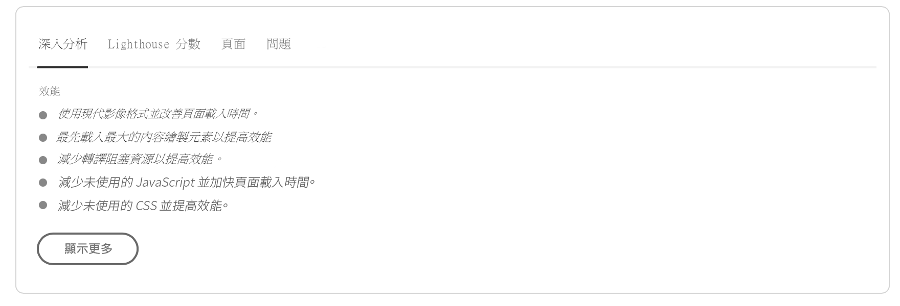
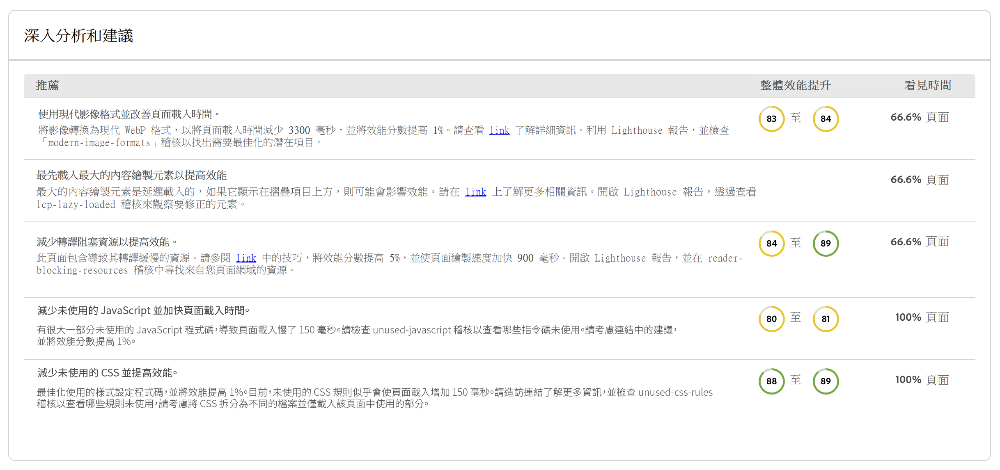
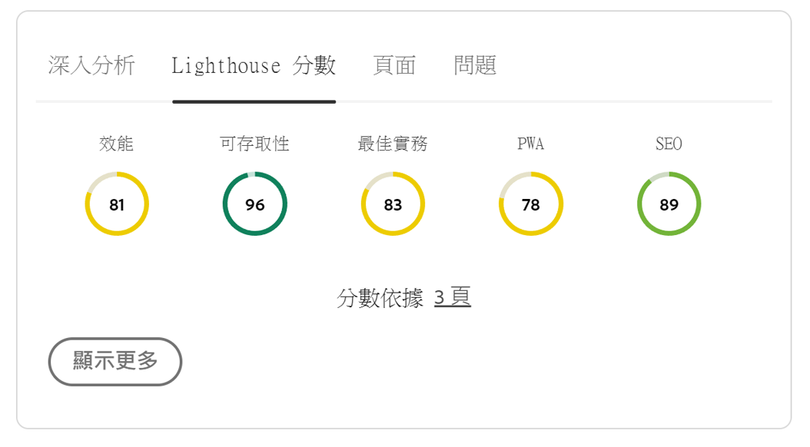
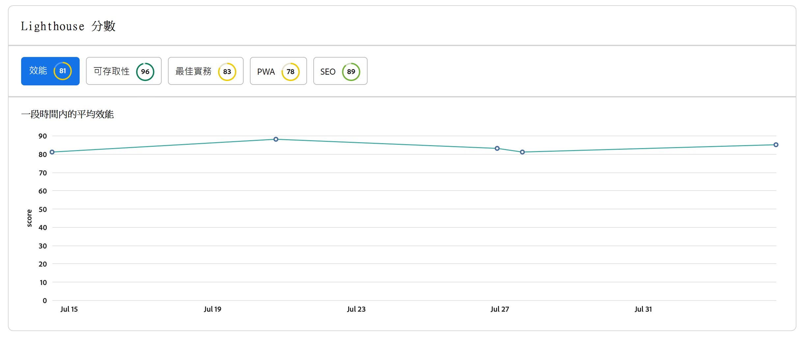
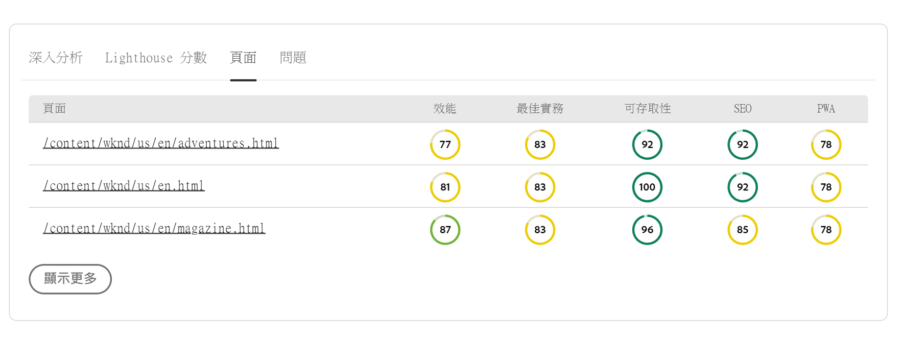
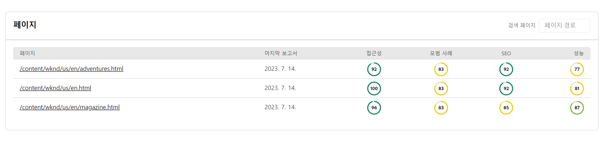
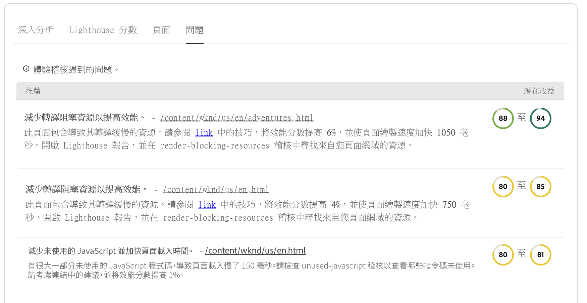
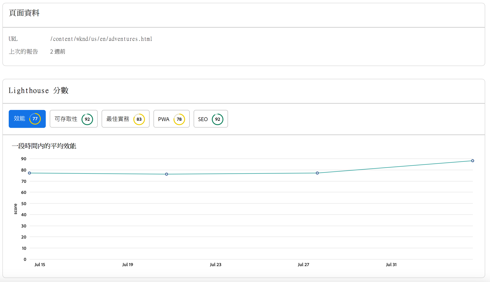

# 體驗稽核儀表板 {#experience-audit-dashboard}

了解體驗稽核如何驗證您的部署流程，並透過清楚、資訊豐富的儀表板介面協助確保部署的變更符合效能、協助工具、最佳做法和 SEO 的基線標準。

>[!NOTE]
>
>此功能僅適用於[早期採用者計劃。](/help/implementing/cloud-manager/release-notes/current.md#early-adoption)
>
>如需AEMas a Cloud Service現有體驗稽核功能的詳細資訊，請參閱 [體驗稽核測試](/help/implementing/cloud-manager/experience-audit-testing.md).

## 概觀 {#overview}

體驗稽核是 Cloud Manager Sites 生產管道中提供的功能，可驗證部署過程並幫助確保已部署變更：

1. 符合效能、協助工具、最佳實務、SEO (搜尋引擎最佳化) 和 PWA (漸進式 Web 應用程式) 的基線標準。

1. 不要引入迴歸。

Cloud Manager 中的體驗稽核可確保一般使用者的網站體驗達到最高標準。

稽核結果會提供資訊，可讓部署管理員查看目前和先前分數之間的分數和變更。此深入分析對於判斷是否有會於目前部署引入的迴歸十分有用。

體驗稽核由提供技術支援 [Google燈塔](https://developer.chrome.com/docs/lighthouse/overview/)，這是Google中的開放原始碼工具，在所有Cloud Manager生產管道中都已啟用。

>[!TIP]
>
>當您[設定您的管道](/help/implementing/cloud-manager/configuring-pipelines/configuring-production-pipelines.md#full-stack-code)時，您可以設定要將哪些頁面包含在體驗稽核中。

## 體驗稽核儀表板 {#dashboard}

體驗稽核的結果會顯示在中 **中繼測試** 透過的生產管道階段 [生產管道執行頁面](/help/implementing/cloud-manager/deploy-code.md).

體驗稽核會提供彙總的詳細頁面層級測試結果，在四個索引標籤上摘要說明：

* **[Insights](#insights)** 會提供可採取動作之建議的簡要說明，以提高網站的效能。
* **[Lighthouse 分數](#lighthouse)**&#x200B;是在此管道執行中部署的程式碼的 Lighthouse 分數摘要。
* **[頁面](#pages)**&#x200B;是專門設定用於分析的頁面效能的摘要。
* **[問題](#issues)**&#x200B;會總結在此管道執行的程式碼中偵測到的任何效能問題。

### Insights {#insights}

**Insights** 索引標籤會提供可採取動作之建議的簡要說明，以提高網站的效能。

選取 **顯示更多** 按鈕以開啟完整儀表板。

在 **Insights 和建議**&#x200B;章節中，您會找到可採取行動之建議的詳細清單，其中會包含和效能中可預期的效益緊密相連的明確價值指標，以及受影響的頁面百分比。這可讓您輕鬆地為您的團隊確定這些建議的優先順序。

若要瀏覽回生產管道執行頁面，只需選取瀏覽器上的返回箭頭即可。

### Lighthouse 分數 {#lighthouse}

**Lighthouse 分數**&#x200B;索引標籤是在此管道執行中部署的程式碼的 Lighthouse 分數摘要。

選取 **顯示更多** 按鈕以開啟完整儀表板。

在 **Lighthouse 分數**&#x200B;章節中，您會發現各種分數的趨勢檢視。請選取&#x200B;**效能**、**協助工具**、**PWA** 或者 **SEO**，以查看這些值的每月趨勢檢視。

請注意，圖表上的每個點都是相關月份中所有部署的平均值。

若要瀏覽回生產管道執行頁面，只需選取瀏覽器上的返回箭頭即可。

### 頁面 {#pages}

**頁面**&#x200B;索引標籤是專門設定用於分析的頁面效能的摘要。

選取 **顯示更多** 按鈕以開啟完整儀表板。

**頁面**&#x200B;章節會提供已經過測試的頁面清單及其最新的 Lighthouse 效能分數和劃分。

當您[設定您的管道](/help/implementing/cloud-manager/configuring-pipelines/configuring-production-pipelines.md#full-stack-code)時，您可以設定要將哪些頁面包含在體驗稽核中。

若要瀏覽回生產管道執行頁面，只需選取瀏覽器上的返回箭頭即可。

### 問題 {#issues}

**問題**&#x200B;索引標籤會總結在此管道執行的程式碼中偵測到的任何效能問題。

選取 **顯示更多** 按鈕以開啟完整儀表板。

在 **Insights 和建議**&#x200B;章節中，您會找到更多可採取行動之建議的詳細清單，其中會包含和效能中可預期的效益緊密相連的明確價值指標，以及受影響的頁面百分比。這可讓您輕鬆地為您的團隊確定這些建議的優先順序。

若要瀏覽回生產管道執行頁面，只需選取瀏覽器上的返回箭頭即可。

### 頁面詳細資料 {#page-detail}

如果您在的任一標籤上選取頁面的連結 **體驗稽核** 管道執行頁面索引標籤或中的區段 **頁面** 體驗稽核控制面板的區段，您可以檢視特定頁面的詳細資訊。

您可以查看各個頁面在特定測試中的得分情況以及與上一次測試執行相比的變化。

按一下任何單個頁面的詳細資訊，可獲得已評估頁面元素的相關資訊，以及在偵測到改善機會時修正問題的指引。

若要瀏覽回生產管道執行頁面，只需選取瀏覽器上的返回箭頭即可。
