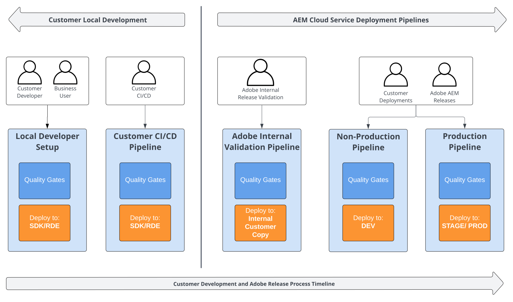

# 簡介 {#functional-testing-introduction}

>[!CONTEXTUALHELP]
>id="aemcloud_nonbpa_functionaltesting"
>title="功能測試"
>abstract="瞭解內建在AEM as a Cloud Service部署流程中的三種不同型別的功能測試。 測試可確保計畫碼的品質和可靠性。"

探索[AEM as a Cloud Service部署程式](/help/implementing/cloud-manager/deploy-code.md)中可用的品質閘道以及各種型別的內建功能測試。 瞭解如何在全方位的測試策略架構中，貢獻並最佳化其使用。

## 關於功能測試

下列圖表提供整體測試策略和[AEM as a Cloud Service部署程式](/help/implementing/cloud-manager/deploy-code.md)內容中可用管道的整體概觀。

## 功能測試的用途

AEM Cloud Service部署管道的用途是在開發和AEM產品發行生命週期的各個階段促進穩定且安全的部署。 這些管道會整合不同層級的多個品質閘道，以確保部署AEM應用程式變更和AEM產品更新的完整性和安全性。

Adobe提供數個內建品質閘道，而其他閘道則需要您的介入以進行實作和設定。 這些品質門檻是通用的，可在不同的生命週期階段套用，並直接整合到您的開發設定和CI/CD流程中。

內建品質門檻主要在AEM應用程式內容中驗證AEM產品的功能。 相較之下，您設定的自訂品質閘道則可驗證應用程式的關鍵功能和使用者互動是否如預期般執行。 這兩組品質閘道共同運作，確保程式碼修改和AEM產品更新的自動化部署既強大又安全。

請務必注意，這些品質閘道並非旨在作為您整個測試策略的全面測試架構。 AEM產品在進入AEM雲端服務部署程式前會接受大量測試。 同樣地，您的應用程式在到達部署階段之前應該已經是高品質的。 此方法可確保品質門檻專注於維護部署流程的主要目標，而不是取代完整的測試制度。

## 測試中的品質閘道

下圖提供可用的品質閘道的詳細檢視，及其在整體測試策略和[AEM as a Cloud Service部署程式](/help/implementing/cloud-manager/deploy-code.md)中的使用情形。

### 摘要客戶提供的品質閘道

|                               | 單元測試 | 自訂 功能測試 | 自訂  UI測試 | 客戶 驗證 | 手動 測試 |
|:------------------------------|:---------------------:|:-----------------------------------:|:-----------------------------------:|:-------------------------:|:-------------------:|
| **生產管道** | 是 封鎖  | 是 封鎖 60m逾時 | 是 封鎖 30m逾時 | 否 | 否 |
| **非生產管道** | 是 封鎖  | 選擇加入 封鎖 60m逾時 | 選擇加入 封鎖 30m逾時 | 否 | 否 |
| **Adobe內部驗證** | 是 封鎖  | 是 封鎖 60m逾時 | 是 封鎖 30m逾時 | 否 | 否 |
| **客戶CI/CD** | 是 | 是 | 是 | 是 | 是 |
| **客戶本機開發人員** | 是 | 是 | 是 | 是 | 是 |

### 單元測試

建議您為AEM應用程式提供單元測試，這是每個測試策略的基礎。 這些設定旨在快速且經常地執行，並提供早期且快速的意見反應。 這些管道已緊密整合至開發人員工作流程、您自己的CI/CD和AEM雲端服務部署管道。

它們會使用JUnit實作，並使用Maven執行。 請參閱AEM專案原型[的](https://experienceleague.adobe.com/en/docs/experience-manager-core-components/using/developing/archetype/using#unit-tests)核心模組，以取得AEM的範例單元測試及快速入門。

### 程式碼品質

此品質閘道是現成可用的設定，且會對AEM應用程式程式碼執行靜態程式碼分析。

如需詳細資訊，請參閱[程式碼品質測試](/help/implementing/cloud-manager/code-quality-testing.md)和[自訂程式碼品質規則](/help/implementing/cloud-manager/custom-code-quality-rules.md)。

### 產品測試

產品功能測試是核心AEM功能的穩定HTTP整合測試(IT)，包括製作和復寫工作。 Adobe提供和維護這些功能，且立即可用。 它們旨在防止自訂應用程式程式碼變更而中斷AEM產品中的核心功能時進行部署。

他們使用JUnit來實作、使用Maven執行，並依賴官方[AEM測試使用者端](https://github.com/adobe/aem-testing-clients)。 產品測試套件維護為
[開放原始碼專案](https://github.com/adobe/aem-test-samples/tree/aem-cloud/smoke)遵循最佳實務，可以視為實施測試的良好起點。

### 自訂功能測試

與產品測試類似，客戶功能測試是使用JUnit實作的HTTP整合測試(IT)、使用Maven執行，以及建置在官方[AEM測試使用者端](https://github.com/adobe/aem-testing-clients)之上。

>[!NOTE]
>
>自訂功能測試會在生產和非生產（選擇加入）管道中執行，用於AEM應用程式變更部署和AEM產品推播更新。 它們在確保您的應用程式正常運作並增強發行安全性方面扮演著關鍵角色。 客戶功能測試也會在每個客戶的內部發行前驗證管道中執行，這有助於提供早期意見反應。

為了維持有效的管道執行，Adobe建議專注於關鍵功能和主要使用者互動流程，目標為大約15分鐘或更短時間的功能測試執行時間。 超過此時間的完整功能測試套裝應在開發過程中作為一般客戶驗證管道的一部分執行。

如需範例，請參閱[開放來源產品測試](https://github.com/adobe/aem-test-samples/tree/aem-cloud/smoke)或AEM專案原型[的](https://github.com/adobe/aem-project-archetype/tree/develop/src/main/archetype/it.tests)it.tests模組。

如需詳細資訊，請參閱 [Java 功能測試](/help/implementing/cloud-manager/java-functional-testing.md)。

### 自訂UI測試

為了最大化客戶特定開發的風險控制，Adobe鼓勵您將關鍵UI測試擷取到AEM as a Cloud Service中。 限制使用量，但著重於最大化其對客戶體驗的影響。

測試封裝在Docker影像中 — 設計為儘可能易變(支援Cypress、Playwright、Selenium、Java和JavaScript)。 它們遵循與自訂功能測試相同的特性和目的。

>[!NOTE]
>
>自訂UI測試會在用於AEM應用程式變更部署和AEM產品推送更新的生產和非生產（選擇加入）管道中執行。 它們對於確保應用程式的正常運作以及增強發行安全性至關重要。 客戶UI測試也會在每個客戶的內部發行前驗證管道中執行，這有助於提供早期意見反應。
>
>非Selenium容器應該根據[UI測試區段](/help/implementing/cloud-manager/ui-testing.md#custom-ui-testing)中的環境變數，使用HTTP Proxy執行測試。

為了保持管道執行效率，Adobe建議專注於關鍵功能和主要使用者互動流程。 超出此品質閘道的完整UI測試套裝應該作為一般客戶驗證管道的一部分執行。 將其整合至客戶的開發流程中。

如需範例，請參閱[開放來源範例測試](https://github.com/adobe/aem-test-samples/tree/aem-cloud/)或AEM專案原型[的](/help/implementing/cloud-manager/ui-testing.md)ui.tests模組。

如需詳細資訊，請參閱[自訂 UI 測試](/help/implementing/cloud-manager/ui-testing.md#custom-ui-testing)。

### 體驗稽核

體驗稽核品質閘道正在針對客戶的網頁執行[Google Lighthouse](https://developer.chrome.com/docs/lighthouse/overview/)稽核。

此品質閘道由AEM現成提供，但不會封鎖部署管道。 依預設，會針對發佈執行個體的根頁面(`/`)執行稽核。 您可以設定最多25個要納入稽核考量的自訂路徑，以便協助撰寫。

如需詳細資訊，請參閱[體驗稽核測試](/help/implementing/cloud-manager/reports/report-experience-audit.md)。

### 客戶驗證

客戶驗證品質閘道是客戶自身測試策略與工作的預留位置，在客戶的應用程式變更送達AEM雲端部署管道之前執行。

您可以在此處選擇您偏好的工具和架構。 相較於客戶功能測試和自訂UI測試，沒有與AEM as a Cloud Service相關的限制。 因此，Adobe建議您在這裡執行長期執行的功能和UI測試。

您可以選擇任何工具和架構，Adobe則建議將HTTP型整合和UI測試與自訂功能和UI測試品質閘道中使用的工具和架構保持一致。 此外，Adobe建議將[快速開發環境(RDE)](/help/implementing/developing/introduction/rapid-development-environments.md)併入您的本機測試策略中，以密切映象AEM雲端環境。

### 手動測試

手動測試品質閘道是進行手動測試之客戶的預留位置。 由於AEM雲端管道不支援手動測試，因此必須將其納入您的本機測試策略中。

若是手動測試，將其與其他AEM雲端服務開發環境整合可能會很有用。
