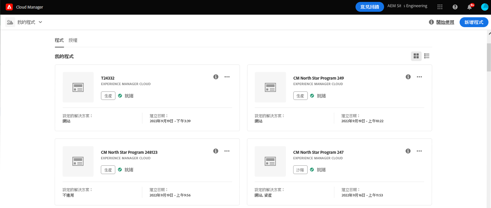
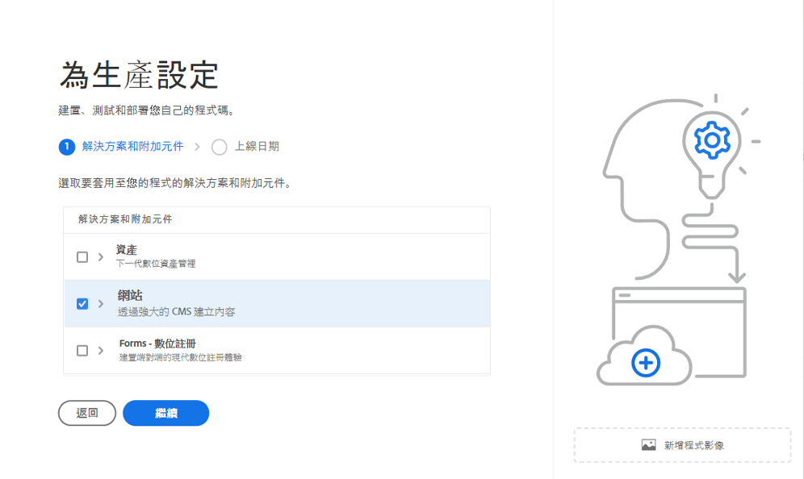
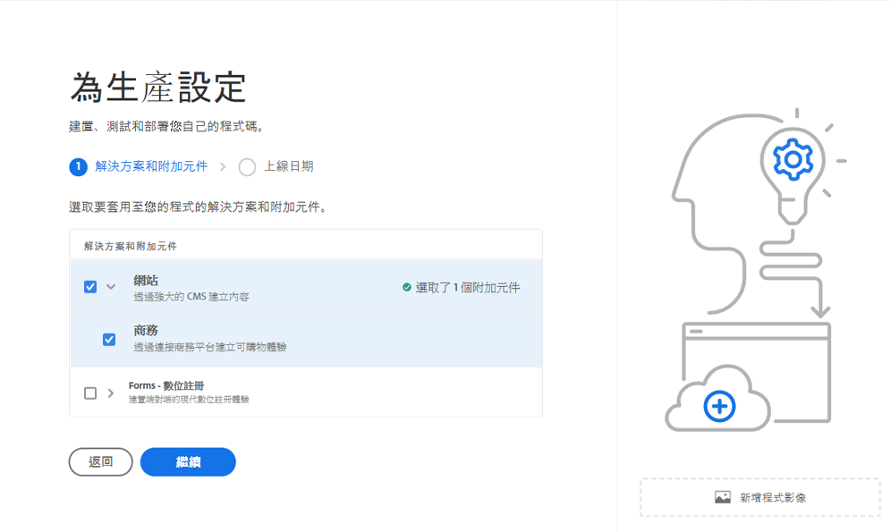
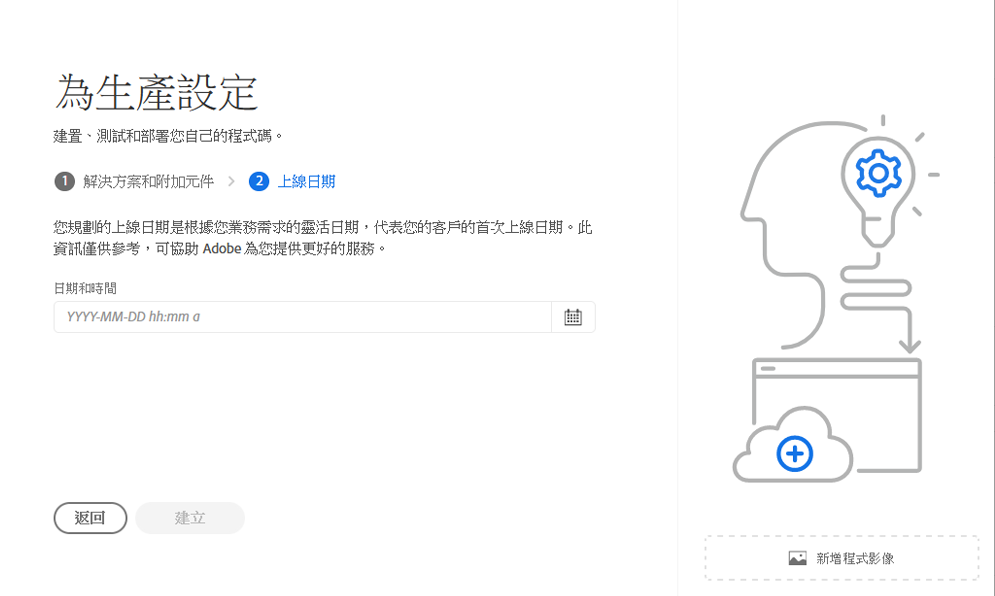
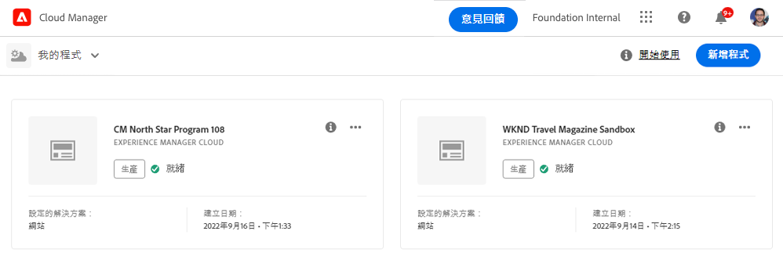
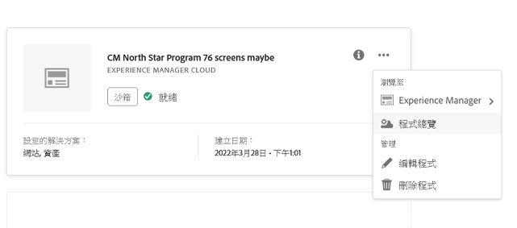
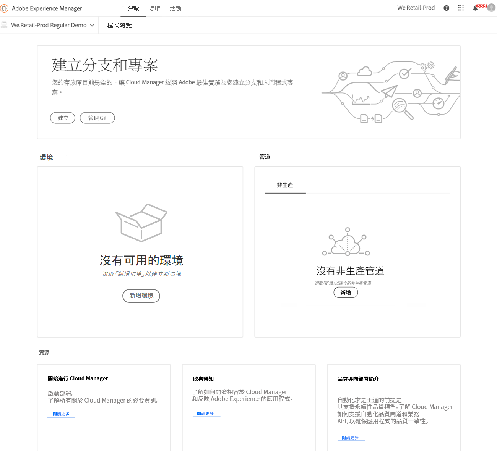
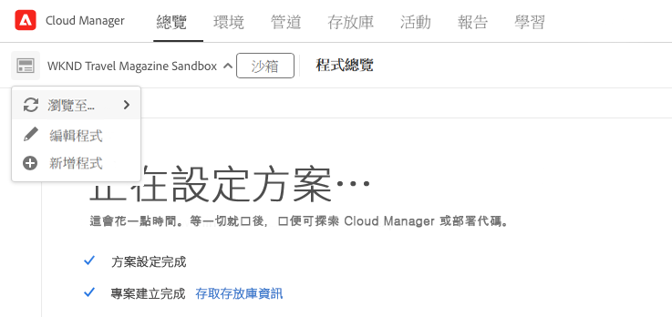

# 建立生產計劃 {#create-production-program}

生產計劃適用於熟悉 AEM 和 Cloud Manager 並準備開始編寫、建構和測試計劃碼以將其部署為託管即時流量的使用者。

在文件中了解有關程序類型的更多資訊[了解程序和程序類型。](program-types.md)

## 教學影片 {#video-tutorials}

您可以觀看這兩個教程影片，了解如何在 Cloud Manager 中建立計劃或[遵循我們的書面說明。](#create)

>[!VIDEO](https://video.tv.adobe.com/v/334953)

>[!VIDEO](https://video.tv.adobe.com/v/334954)

## 建立生產計劃 {#create}

請依照以下步驟建立生產計畫。

1. 在 [my.cloudmanager.adobe.com](https://my.cloudmanager.adobe.com/) 登入 Cloud Manager 並選取適當的組織。

1. 從畫面的右上角，點擊&#x200B;**新增計劃**。

   

1. 選擇&#x200B;**為生產設定**&#x200B;在建立程序嚮導中建立生產計劃。您可以接受預設程序名稱或在單擊之前對其進行編輯&#x200B;**繼續**。

   

1. 在&#x200B;**解決方案和附加元件**&#x200B;索引標籤，選擇計畫的解決方案。

   

1. 按一下解決方案名稱前的 > 形圖示，即可顯示選用的附加元件，例如選擇&#x200B;**商務**&#x200B;下的附加選項 **Sites**。

   

1. 選擇您的解決方案和附加組件後，點擊&#x200B;**繼續**。

1. 在&#x200B;**上線日期**&#x200B;索引標籤，輸入您計劃上線的生產計劃的日期。

   

   * 這個日期可以隨時修改。
   * 此日期僅供參考，並會觸發計畫總覽頁面上的上線小工具，即時提供產品內連結至 AEM as a Cloud Service 最佳實務文件，以符合您的歷程，最終達成成功且順暢的上線體驗。

1. 按一下&#x200B;**建立**。

您的程序由 Cloud Manager 建立，並在登陸頁面上顯示和選擇。

## 存取你的計劃 {#acessing}

1. 在登陸頁面上看到您的計劃卡後，選擇省略符號按鈕以查看可供您使用的選單選項。

   

1. 選取&#x200B;**計劃概覽**&#x200B;導覽至 Cloud Manager 的&#x200B;**概覽**&#x200B;頁面。

1. 概覽頁面上的主要號召性用語卡片將指導您建立環境、非生產管道，最後是生產管道。

   

如果您在任何時候需要切換到另一個計劃或返回概覽頁面來建立另一個計劃，請點擊畫面左上角的程序名稱以顯示&#x200B;**瀏覽**&#x200B;選項。

>[!NOTE]
>
>不像一個[沙箱計劃](introduction-sandbox-programs.md#auto-creation)，生產計劃將要求具有相應 Cloud Manager 角色的使用者建立項目並透過自助服務 UI 新增環境。
