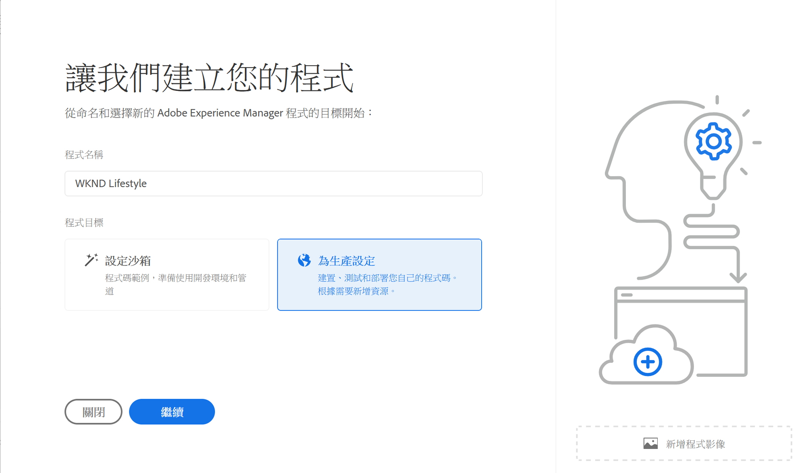
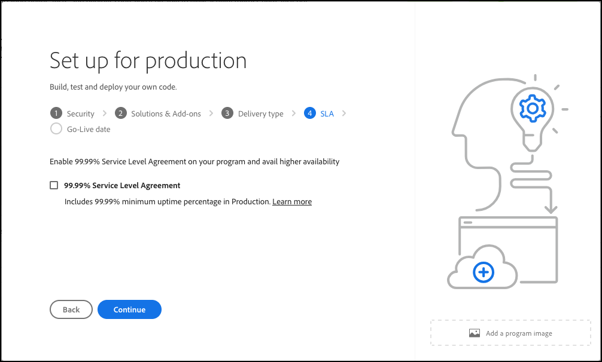

# 建立生產計畫 {#create-production-program}

生產計畫適用於熟悉AEM和Cloud Manager、準備好編寫、建置和測試計畫碼的使用者，目標是將其部署以處理即時流量。

在檔案[瞭解計畫和計畫型別](program-types.md)中瞭解有關計畫型別的更多資訊。

## 建立生產計畫 {#create}

根據您組織的權益，新增您的方案時可能會看到[其他選項](#options)。

**若要建立生產計畫：**

1. 在 [my.cloudmanager.adobe.com](https://my.cloudmanager.adobe.com/) 登入 Cloud Manager 並選取適當的組織。

1. 在&#x200B;**[我的程式](/help/implementing/cloud-manager/navigation.md#my-programs)**&#x200B;主控台的右上角，按一下&#x200B;**新增程式**。

   

1. 在&#x200B;*讓我們建立您的程式*&#x200B;精靈，在&#x200B;**程式名稱**&#x200B;文字欄位中，輸入您要程式的名稱。

1. 在&#x200B;**方案目標**&#x200B;下，選取**為生產設定**。

   

1. （選擇性）在精靈對話方塊的右下角，執行下列任一項作業：

   * 將影像檔案拖放到 **新增程式影像**&#x200B;目標上。
   * 按一下 **新增程式影像**，然後從檔案瀏覽器中選取影像。
   * 按一下以移除您新增的影像。

1. 按一下「**繼續**」。

1. 在&#x200B;**解決方案和附加元件**&#x200B;清單方塊中，選取一或多個要包含在計畫中的解決方案。

   * 如果您不確定是否需要一個或多個計畫以使用各種您可用的解決方案，請選取您最感興趣的一個。您之後可以[編輯計畫](/help/implementing/cloud-manager/getting-access-to-aem-in-cloud/editing-programs.md)來啟用其他解決方案。如需更多計畫設定建議，請參閱[生產計畫簡介文件](/help/implementing/cloud-manager/getting-access-to-aem-in-cloud/introduction-production-programs.md)。
   * 程式建立至少需要一個解決方案。
   * 針對最佳化數位體驗的完整受管理CDN解決方案，選取&#x200B;**Edge Deliver Services**。 請參閱[關於使用Edge Delivery Services傳遞您的Cloud Manager專案](#edge-overview)
   * 如果您選取了&#x200B;**[啟用增強式安全性](#security)**&#x200B;選項，您只能選取可使用HIPAA許可權的解決方案。

     

   * 按一下解決方案名稱左邊的，即可顯示任何選用的附加元件，例如&#x200B;**Sites**&#x200B;下的&#x200B;**Commerce**&#x200B;附加選項。

   

1. 選取完解決方案和附加元件後，請按一下[繼續]。****

1. 在&#x200B;**上線日期**&#x200B;索引標籤上，輸入您計畫讓生產計畫上線的日期。

   

   * 您可以隨時編輯此日期。
   * 日期僅供參考，並會在&#x200B;[**計畫總覽**&#x200B;頁面](/help/implementing/cloud-manager/getting-access-to-aem-in-cloud/editing-programs.md#program-overview)上觸發「上線」Widget。 此功能會提供產品內及時的AEM as a Cloud Service最佳實務連結，以支援順暢的上線體驗。

1. 按一下「**建立**」。Cloud Manager會建立您的程式，並將其顯示在登陸頁面上以供選取。

   

## 其他生產計畫選項 {#options}

根據您的組織可用的權益，當您建立生產計畫時，可能有其他選項可供您使用。

### 安全性 {#security}

如果您有必要的許可權，**安全性**&#x200B;標籤會顯示為&#x200B;**`Set up for production`**&#x200B;對話方塊中的第一個標籤。

**安全性**&#x200B;索引標籤提供選項來啟用您的生產程式的&#x200B;**HIPAA**&#x200B;或&#x200B;**WAF-DDOS保護**，或兩者皆啟用。

符合HIPAA規範的Adobe和WAF-DDOS （Web應用程式防火牆 — 分散式拒絕服務）有助於雲端式安全性，是防範漏洞的多層方法的一部分。

* **HIPAA** — 此選項會啟用Adobe的HIPPA就緒解決方案實作。
   * [深入了解](https://www.adobe.com/trust/compliance/hipaa-ready.html) Adobe 的 HIPAA 就緒解決方案實作方式。
   * HIPAA無法在方案建立後啟用或停用。
* **WAF-DDOS保護** — 此選項會透過規則啟用Web應用程式防火牆，以保護您的應用程式。
   * 啟動後，可透過設定[非生產管道](/help/implementing/cloud-manager/configuring-pipelines/configuring-non-production-pipelines.md)來設定WAF-DDOS保護。
   * 請參閱[流量篩選規則(包括WAF規則)](/help/security/traffic-filter-rules-including-waf.md)，瞭解如何管理存放庫中的流量篩選規則，以便正確部署。

### SLA {#sla}

如果您有必要的權益，**SLA**&#x200B;標籤會顯示為&#x200B;**`Set up for production`**&#x200B;對話方塊中的第二個或第三個標籤。

AEM Sites和Forms提供標準的99.9% service level agreement (SLA)。 **99.99% Service level agreement**&#x200B;選項可為您的網站和/或Forms生產環境啟用99.99%的最低運作時間百分比。

99.99%的SLA提供更高的可用性和較低的延遲，並需要將[額外的發佈區域](/help/implementing/cloud-manager/manage-environments.md#multiple-regions)套用至方案中的生產環境。

當符合啟用99.99% SLA的[需求](#sla-requirements)時，您必須執行[完整棧疊管道](/help/implementing/cloud-manager/configuring-pipelines/configuring-production-pipelines.md)才能啟用它。

#### SLA 99.99%的需求 {#sla-requirements}

除了必要的權益之外，99.99%的SLA還有額外的使用需求。

* 組織必須擁有99.99%的SLA，以及在將99.99%的SLA套用至方案時，可用的其他發佈區域權益。
* Cloud Manager在將99.99%的SLA套用至方案之前，會驗證是否有未使用的[額外發佈區域](/help/implementing/cloud-manager/manage-environments.md#multiple-regions)權益可用。
* 編輯方案時，如果方案已包含具有至少一個額外發佈區域的生產環境，則Cloud Manager僅會檢查99.99%SLA軟體權利檔案的可用性。
* 為了啟用99.99%的SLA和報表，必須已建立[生產/中繼環境](/help/implementing/cloud-manager/manage-environments.md#adding-environments)，而且必須在生產/中繼環境中套用至少一個額外的發佈區域。
   * 如果使用[進階網路](/help/security/configuring-advanced-networking.md)，請務必檢視[新增多個Publish區域至新環境](/help/implementing/cloud-manager/manage-environments.md#adding-regions)檔案以取得建議，以便在區域失敗時維持連線。
* 您的99.99% SLA程式中必須至少保留一個額外的發佈區域。 不允許使用者從99.99%的SLA程式中刪除最後一個額外發佈區域。
* 99.99% SLA支援用於已啟用Sites或Forms解決方案的生產計畫。
* 執行[完整棧疊管道](/help/implementing/cloud-manager/configuring-pipelines/configuring-production-pipelines.md)以啟動或在編輯程式時停用99.99%的SLA。

## 存取您的程式 {#accessing}

1. 當您在登陸頁面上看到您的計畫卡時，請按一下https://spectrum.adobe.com/static/icons/workflow_18/Smock_More_18_N.svg以檢視可用的功能表選項。

   

1. 選取&#x200B;**計畫概覽**&#x200B;導覽至 Cloud Manager 的&#x200B;**概覽**&#x200B;頁面。

1. 概覽頁面上的主要號召性用語卡片會引導您建立環境、非生產管道，最後是生產管道。

   

>[!TIP]
>
>請參閱[瀏覽Cloud Manager UI](/help/implementing/cloud-manager/navigation.md)，以取得如何瀏覽Cloud Manager及瞭解&#x200B;**我的程式**&#x200B;主控台的詳細資料。

>[!NOTE]
>
>不像[沙箱計畫](introduction-sandbox-programs.md#auto-creation)，生產計畫需要具有相應Cloud Manager角色的使用者建立專案並透過自助服務UI新增環境。

