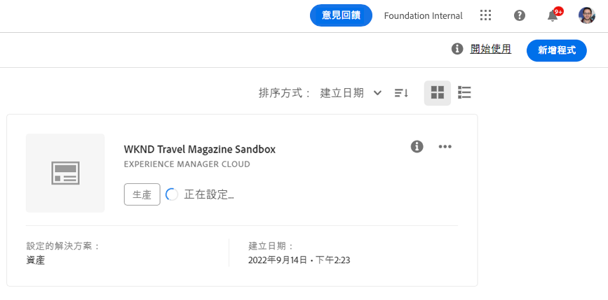

# 建立沙箱方案 {#create-sandbox-program}

請依照下列步驟建立沙箱方案：

1. 啟動Cloud Manager的登陸頁面，然後按一下畫面右上角的&#x200B;**新增方案**。

   

   >[!NOTE]
   >若要了解如何存取Cloud Manager，請參閱[Cloud Manager登陸頁面](/help/onboarding/what-is-required/navigate-to-cloud-manager.md)以取得詳細資訊。

1. 在建立程式嚮導中，選擇&#x200B;**設定沙箱**。 用戶在選擇&#x200B;**Create**&#x200B;之前提交程式名。

   

1. 使用者會在登陸頁面上看到新的沙箱方案卡片，並可將滑鼠移到該卡片上，以選取Cloud Manager圖示來導覽至Cloud Manager概觀頁面。 卡片會通知使用者新建立沙箱方案的自動設定狀態。 使用者會看到進展。

   

1. 程式設定和專案建立步驟完成後，使用者可以存取&#x200B;**管理Git**&#x200B;連結，如下圖所示：

   

   >[!NOTE]
   >
   >若要進一步了解如何使用Cloud Manager UI的自助服務Git帳戶管理來存取和管理您的Git存放庫，請參閱[存取Git](/help/implementing/cloud-manager/accessing-git.md)。

1. 建立開發環境後，使用者就可以&#x200B;**存取AEM**&#x200B;連結，如下圖所示：

   

1. 完成部署至開發的非生產管道後，精靈會引導使用者存取AEM（開發時），或將程式碼部署至開發環境：

   

   >[!NOTE]
   >您也可以從Cloud Manager綜覽頁面編輯、切換或新增程式，如下所示：

   
