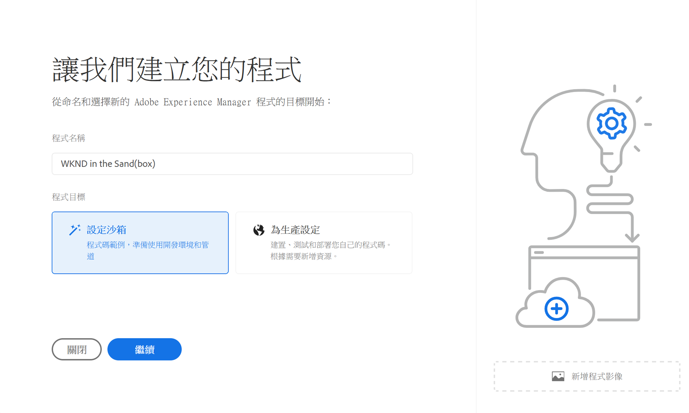
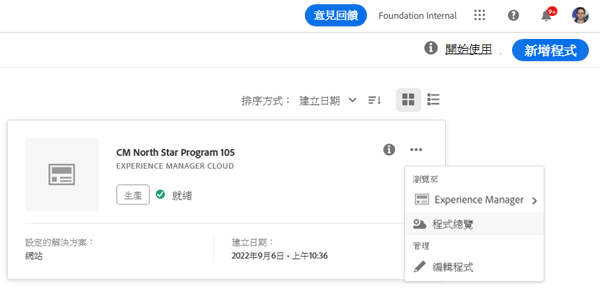
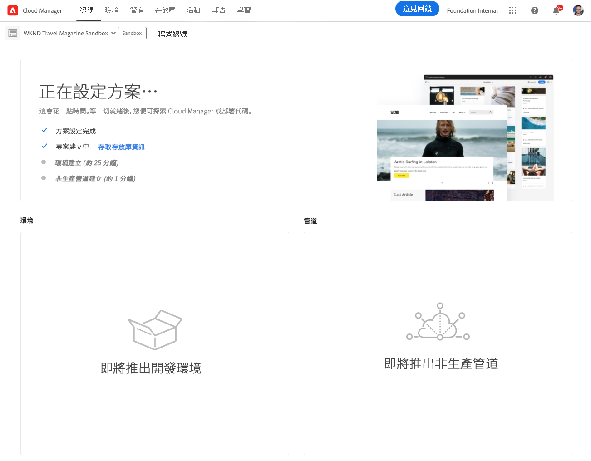
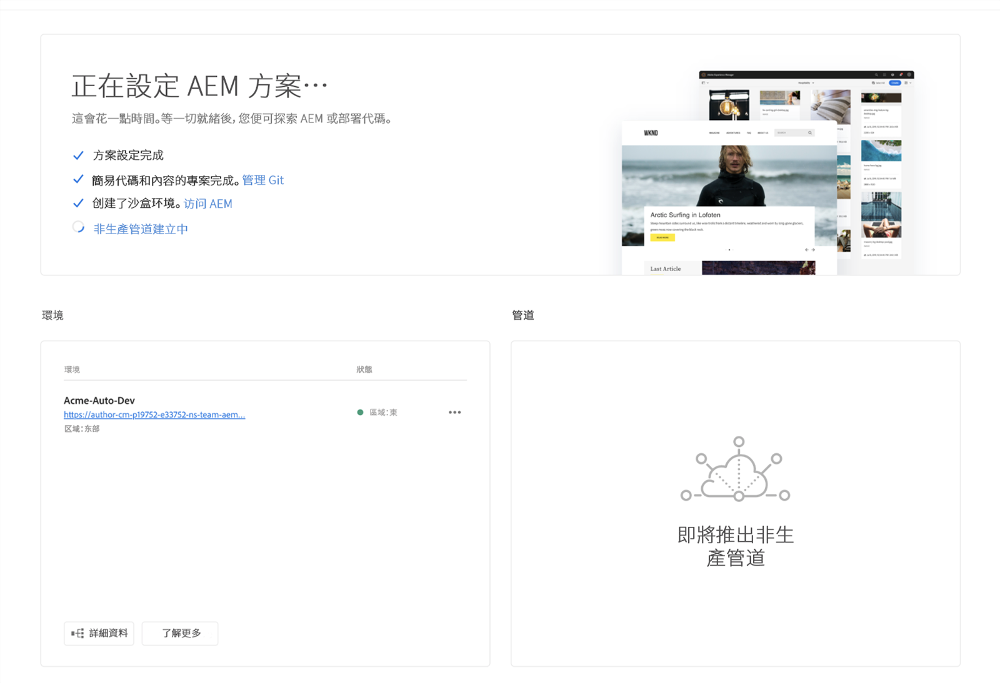
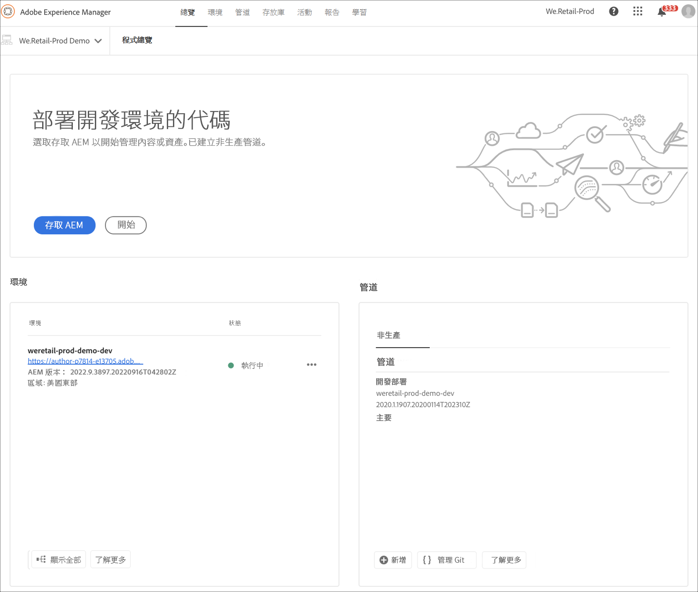

# 建立沙箱計畫 {#create-sandbox-program}

沙箱計畫通常建立的目的是提供訓練、執行範例、啟用、POC 或文件，而不是承載即時流量。

在[了解計劃和計劃類型](program-types.md)，文件中了解有關計劃類型的更多資訊

## 建立沙箱計畫 {#create}

請依照以下步驟建立沙箱計畫。

1. 在 [my.cloudmanager.adobe.com](https://my.cloudmanager.adobe.com/) 登入 Cloud Manager 並選取適當的組織。

1. 從 Cloud Manager 的登入頁面單擊&#x200B;**新增程序**&#x200B;在畫面的右上角。

   

1. 從建立程序嚮導中，選擇&#x200B;**設定沙箱**，提供程序名稱，然後單擊&#x200B;**創造**.

   

隨著設定過程的進行，您將在登入頁面上看到一個帶有狀態指示器的新沙箱程序卡。

## 存取您的沙箱 {#access}

您可以透過查看計劃概覽頁面查看沙箱設定的詳細資訊以及存取環境 (一旦可用)。

1. 在 Cloud Manager 登入頁面中，單擊新建立程序上的省略符號按鈕。

   

1. 專案建立步驟完成後，您可以存取&#x200B;**Access 回購資訊**&#x200B;連結，以便能夠使用您的 git repo。

   

   >[!TIP]
   >
   >要了解有關存取和管理 git 存放庫的更多資訊，請參閱文件[存取 Git](/help/implementing/cloud-manager/managing-code/accessing-repos.md)

1. 建立開發環境後，您可以使用&#x200B;**存取 AEM**&#x200B;連結來登入 AEM。

   

1. 部署到開發的非生產管道完成後，安裝精靈將引導您存取 AEM 開發環境或將計劃碼部署到開發環境。

   

如果您在任何時候需要切換到另一個計劃或返回概覽頁面來建立另一個計劃，請點擊畫面左上角的計劃名稱以顯示&#x200B;**瀏覽**&#x200B;選項。

