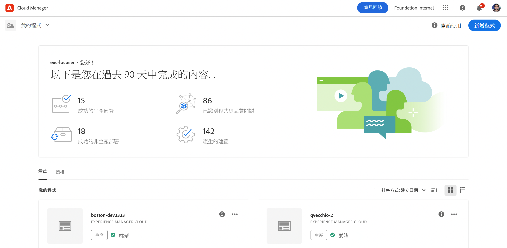
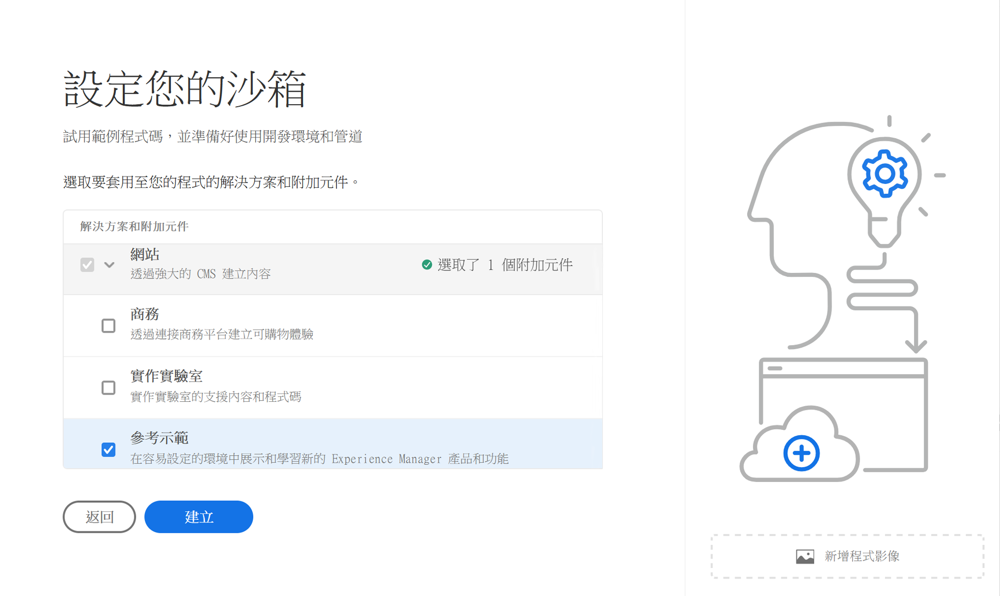
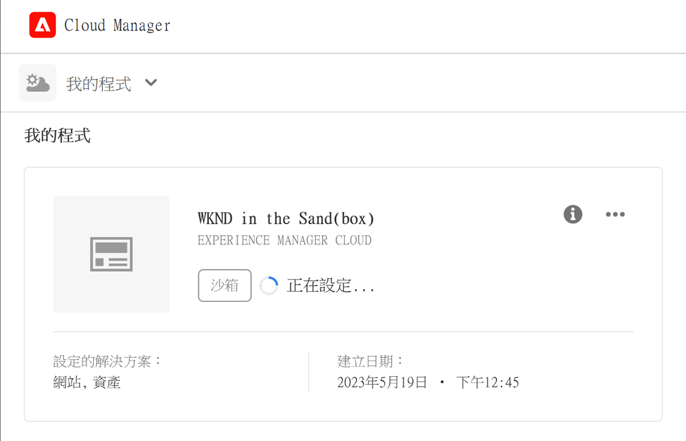
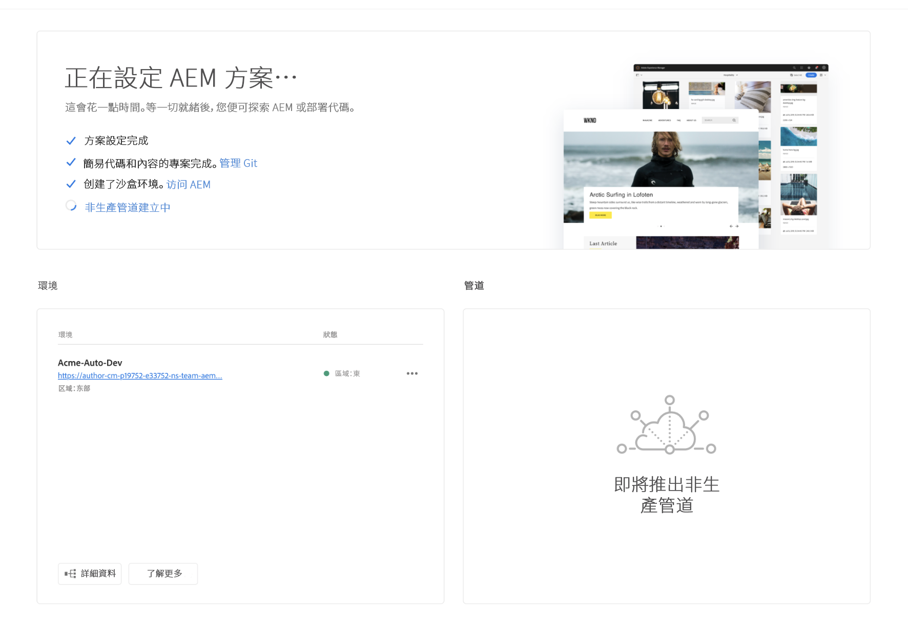

# 建立沙箱計畫 {#create-sandbox-program}

沙箱計畫通常建立的目的是提供培訓、執行示範、培訓、POC或檔案，而不是承載即時流量。 請參閱[沙箱計畫簡介](/help/implementing/cloud-manager/getting-access-to-aem-in-cloud/introduction-sandbox-programs.md)。

在檔案[瞭解計畫和計畫型別](program-types.md)中瞭解有關計畫型別的更多資訊。

## 建立沙箱計畫 {#create}

1. 在 [my.cloudmanager.adobe.com](https://my.cloudmanager.adobe.com/) 登入 Cloud Manager 並選取適當的組織。

1. 在&#x200B;**[我的程式](/help/implementing/cloud-manager/navigation.md#my-programs)**&#x200B;主控台的右上角，按一下&#x200B;**新增程式**。

   

1. 在&#x200B;*讓我們建立您的程式*&#x200B;精靈，在&#x200B;**程式名稱**&#x200B;文字欄位中，輸入您想要的程式名稱。

1. 在&#x200B;**方案目標**&#x200B;下，選取 **設定沙箱**。

   

1. （選擇性）在精靈對話方塊的右下角，執行下列任一項作業：

   * 將影像檔案拖放到 **新增程式影像**&#x200B;目標上。
   * 按一下 **新增程式影像**，然後從檔案瀏覽器中選取影像。
   * 按一下以移除您新增的影像。

1. 按一下「**繼續**」。

1. 在&#x200B;**解決方案和附加元件**&#x200B;清單方塊中，選取一或多個要包含在計畫中的解決方案。

   * 按一下解決方案名稱左側的>形箭號，即可顯示任何您想納入選取解決方案的可用附加元件。
   * 建立沙箱程式時，**網站**、**Assets**&#x200B;和&#x200B;**Edge Delivery Services**&#x200B;解決方案一律預設為選取。 您無法取消選取它們。

   

1. 按一下「**建立**」。Cloud Manager會建立您的沙箱程式，並將其顯示在登陸頁面上以供選擇。

## 沙箱存取 {#access}

新沙箱計畫建立完成後，您可以檢視沙箱設定的詳細資訊，並透過檢視計畫概觀頁面存取環境。

1. 從Cloud Manager登陸頁面，在沙箱計畫中，在您的建立的沙箱計畫上按一下。

   

1. 專案建立步驟完成時，您可以按一下&#x200B;**存取存放庫資訊**&#x200B;連結，以便能夠使用您的Git存放庫。

   

   >[!TIP]
   >
   >若要進一步瞭解存取和管理Git存放庫，請參閱[存取Git](/help/implementing/cloud-manager/managing-code/accessing-repos.md)。

1. 建立開發環境後，您可以按一下&#x200B;**存取AEM**&#x200B;並登入AEM。

   

1. 部署到開發的非生產管道完成時，call-to-action中的精靈會引導您存取AEM開發環境或將計畫碼部署到開發環境。

   

>[!TIP]
>
>請參閱[瀏覽Cloud Manager UI](/help/implementing/cloud-manager/navigation.md)，以取得如何瀏覽Cloud Manager及瞭解&#x200B;**我的程式**&#x200B;主控台的詳細資訊。
