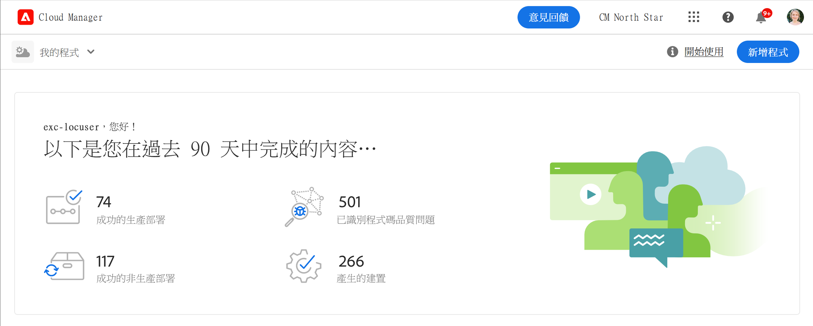

# 建立沙箱計畫 {#create-sandbox-program}

沙箱計畫通常建立的目的是提供訓練、執行範例、啟用、POC 或文件，而不是承載即時流量。

在[了解計劃和計劃類型](program-types.md)，文件中了解有關計劃類型的更多資訊

## 建立沙箱計畫 {#create}

1. 在 [my.cloudmanager.adobe.com](https://my.cloudmanager.adobe.com/) 登入 Cloud Manager 並選取適當的組織。

1. 從Cloud Manager的登陸頁面，在畫面的右上角附近，按一下 **新增計畫**.

   

1. 從建立計畫精靈中，選擇 **設定沙箱**，並提供計畫名稱。

   

1. 或者，您可以將影像檔拖放到&#x200B;**新增程序影像**&#x200B;目標或按一下它從檔案瀏覽器選取影像，藉此新增影像到程序。點選或按一下&#x200B;**繼續**。

   * 該影像僅做為程序概觀視窗的圖磚，有助於識別程序。

1. 在 **設定您的沙箱** 對話方塊中，勾選「 」選項中的「 」，選擇您希望在沙箱程式中啟用的解決方案。 **解決方案和附加元件** 表格。

   * 請使用解決方案名稱旁的>形箭號，以便檢視解決方案的其他選用附加元件。

   * 此 **網站** 和 **資產** 解決方案一律包含在沙箱程式中，且無法取消選取。

   

1. 為您的沙箱計畫選取解決方案和附加元件後，按一下 **建立**.

隨著設定過程的進行，您在登陸頁面上看到一個帶有狀態指示器的新沙箱計畫卡。

## 沙箱存取 {#access}

您可以檢視沙箱設定的詳細資訊，並透過檢視計畫概觀頁面來存取環境（一旦可用）。

1. 從Cloud Manager登陸頁面，按一下新建立程式上的省略符號按鈕。

   

1. 專案建立步驟完成後，您可以存取 **存取存放庫資訊** 連結以使用您的Git存放庫。

   

   >[!TIP]
   >
   >若要進一步瞭解存取和管理Git存放庫，請參閱 [存取Git](/help/implementing/cloud-manager/managing-code/accessing-repos.md).

1. 建立開發環境後，您可以使用&#x200B;**存取 AEM**&#x200B;連結來登入 AEM。

   

1. 部署到開發的非生產管道完成後，安裝精靈將引導您存取 AEM 開發環境或將計劃碼部署到開發環境。

   

如果您必須切換到另一個計畫，或返回概覽頁面來建立另一個計畫，請按一下畫面左上角的計畫名稱以顯示 **導覽至** 選項。

