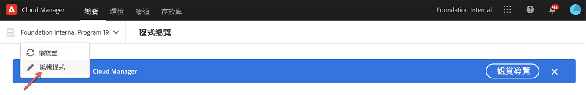
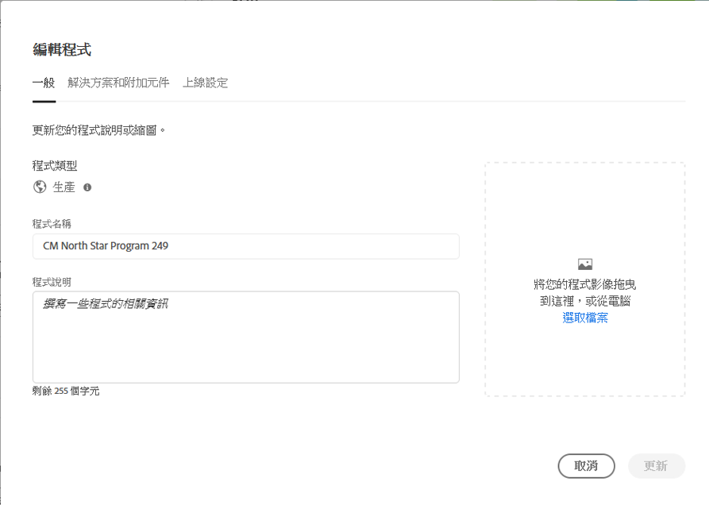
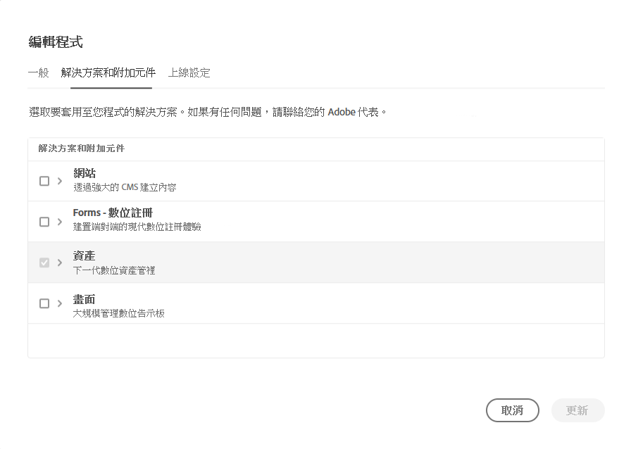

# 編輯生產程式 {#create-production-program}

擁有必要權限的使用者現在可以編輯生產程式，讓他們能以自助方式執行下列作業：

* 使用資產將Sites解決方案新增至現有計畫（反之亦然）。
* 從同時具有Sites和Assets的現有程式中移除Sites（或Assets）。
* 將第二個未使用的解決方案權利添加到現有程式或作為新程式添加。

   >[!NOTE]
   >必須登錄業務所有者角色中的用戶才能成功編輯程式。

請依照下列步驟編輯生產程式：

1. 從Cloud Manager的&#x200B;*概述*&#x200B;頁面按一下&#x200B;**編輯程式**&#x200B;選項

   

1. 「**編輯程式**」頁顯示兩個頁簽&#x200B;**General**&#x200B;和&#x200B;**Solutions &amp; Add-ons**。

   導航到&#x200B;**General**&#x200B;頁簽以編輯程式說明。

   

   **Solutions &amp; Add-ons**&#x200B;標籤顯示兩個選項，例如：**Sites**&#x200B;和&#x200B;**Assets**（適用於生產和沙箱方案）。 您也可以選取&#x200B;**Commerce**&#x200B;附加元件選項，該選項可在&#x200B;**Sites**&#x200B;下使用，如下圖所示。

   

   >[!NOTE]
   >必須為程式至少選擇一個解決方案，即在編輯程式工作流程期間，不允許用戶取消選擇所有解決方案。

1. 按一下&#x200B;**更新**&#x200B;以完成編輯程式工作流。

## 編輯方案時的考量事項 {#considerations-editing}

編輯方案時，應審閱的考量很少：

* 必須為程式至少選擇一個解決方案，即在編輯程式工作流程期間，不允許用戶取消選擇所有解決方案。

* 按一下&#x200B;**儲存**&#x200B;按鈕，如果所選解決方案已變更，則環境的解決方案更新將在下次部署後生效。
