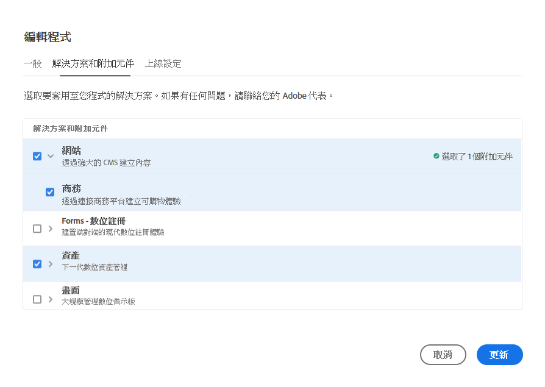
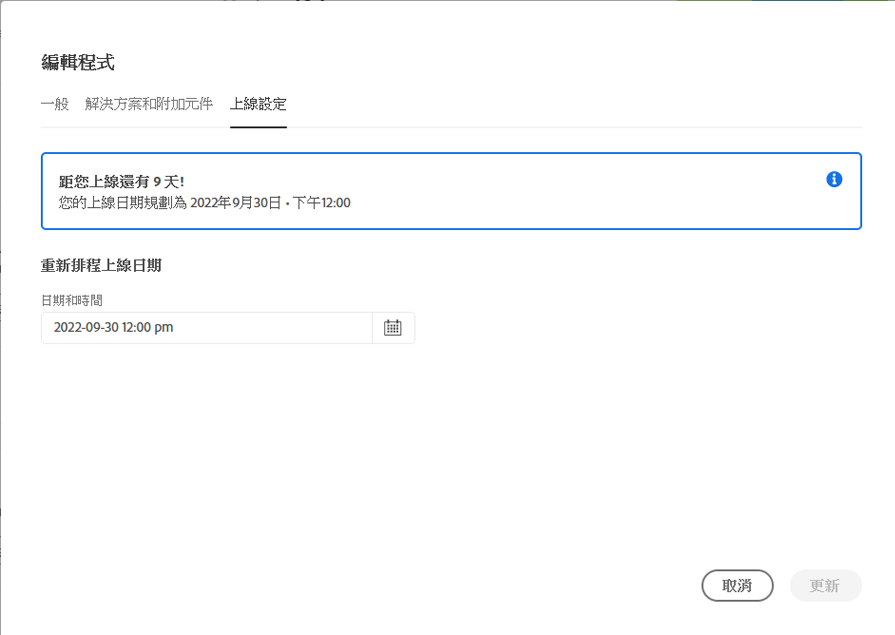
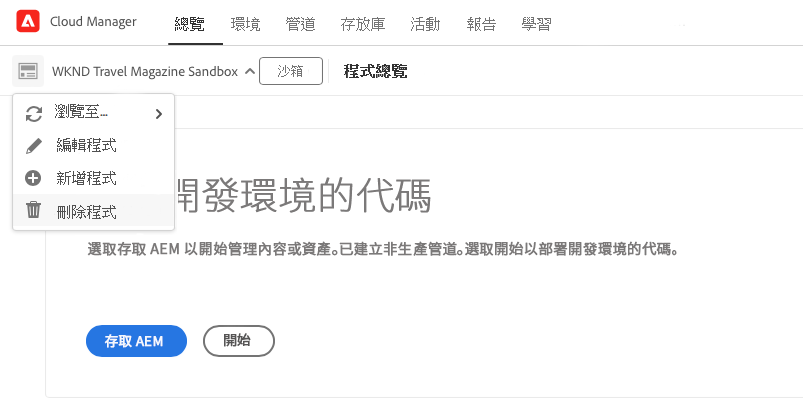
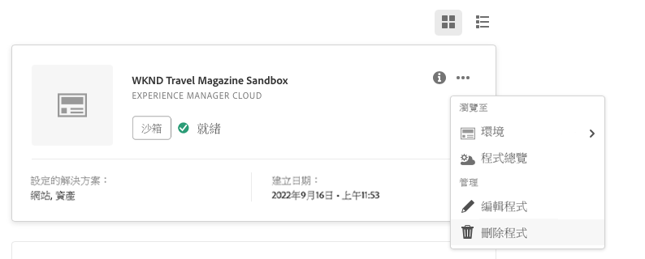

# 編輯計畫 {#editing-programs}

具有必要權限的使用者可以編輯[在您組織中建立的生產計畫](creating-production-programs.md)和[在您組織中建立的沙箱計畫。](creating-sandbox-programs.md)透過編輯計畫，您可以：

* 使用 Assets 將 Sites 解決方案新增現有計畫中，反之亦然。
* 從包含 Sites 和 Assets 的現有計畫中移除 Sites 和 Assets。
* 將第二個未使用的解決方案權利新增到現有計畫，或作為新計畫。
* 刪除沙箱計畫。

>[!NOTE]
>
>您必須擁有&#x200B;**業務負責人**&#x200B;角色才能編輯計畫或刪除沙箱計畫。

請依照以下步驟編輯計畫。

1. 在 [my.cloudmanager.adobe.com](https://my.cloudmanager.adobe.com/) 登入 Cloud Manager 並選取適當的組織。

1. 按一下要編輯的計畫以顯示其詳細資訊。

1. 按一下頁面左上角的計畫名稱，然後選擇&#x200B;**編輯計畫**。

   

1. **編輯計畫**&#x200B;頁面隨即開啟。在&#x200B;**一般**&#x200B;索引標籤，編輯計畫名稱和描述。

   * 必須為計畫選擇至少一種解決方案。

   

1. 在&#x200B;**解決方案和附加元件**&#x200B;索引標籤，修改計畫的解決方案。

   

1. 按一下解決方案名稱前的 > 形圖示，即可顯示選用的附加元件，例如選擇&#x200B;**商務**&#x200B;下的附加選項 **Sites**。

   

1. 在&#x200B;**上線設定**&#x200B;索引標籤，修改計畫的上線日期。

   

   * 此日期僅供參考，並會觸發計畫總覽頁面上的上線小工具，即時提供產品內連結至 AEM as a Cloud Service 最佳實務文件，以符合您的歷程，最終達成成功且順暢的上線體驗。

1. 按一下&#x200B;**更新**&#x200B;以儲存對計畫的變更。

只要編輯計畫 (包括新增或移除解決方案或附加元件)，這些變更就會在下次部署後生效。

## 刪除沙箱計畫 {#delete-sandbox-program}

刪除沙箱計畫會移除與其關聯的所有環境和管道。

>[!TIP]
>
>具有&#x200B;**業務負責人**&#x200B;或&#x200B;**部署管理員**&#x200B;角色也可以刪除其生產和測試環境，而非整個沙箱計畫。

請依照以下步驟刪除沙箱計畫。

1. 在 [my.cloudmanager.adobe.com](https://my.cloudmanager.adobe.com/) 登入 Cloud Manager 並選取適當的組織。

1. 按一下要編輯的計畫以顯示其詳細資訊。

1. 按一下頁面左上角的計畫名稱，然後選擇&#x200B;**刪除計畫**。

   

您也可以在 Cloud Manager 總覽頁面按一下計畫卡上的省略符號按鈕，然後選擇&#x200B;**刪除計畫**。

>[!NOTE]
>
>只能刪除沙箱計畫。不能刪除生產計畫。
