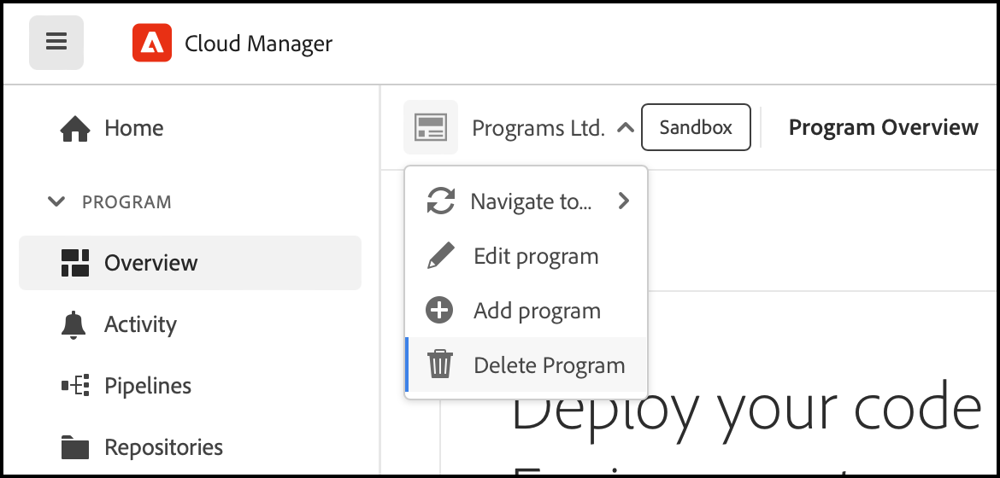

# 編輯計畫 {#editing-programs}

若要管理和編輯程式，請從&#x200B;[**我的程式**&#x200B;主控台](/help/implementing/cloud-manager/navigation.md)開始。 「**我的程式**」頁面提供您有權存取之所有程式的概觀。 選取個別方案時，**方案總覽**&#x200B;頁面會提供方案的詳細資訊總覽。

從&#x200B;**計畫總覽**，具有必要許可權的使用者可以編輯在您組織中建立的[生產計畫](creating-production-programs.md)以及在您的組織中建立的[沙箱計畫](creating-sandbox-programs.md)。 透過編輯方案，您可以執行以下操作：

* 將 Sites 解決方案新增到有 Assets 現有方案中，反之亦然。
* 從包含Sites和Assets的現有方案中移除Sites或Assets。
* 將未使用的解決方案權利新增到現有計畫或建立新計畫。
* 將生產計畫標籤為刪除。
* 刪除沙箱計畫。

## 權限 {#permissions}

您必須擁有&#x200B;**業務負責人**&#x200B;角色才能編輯計畫、刪除沙箱計畫、將生產計畫標籤為刪除，以及存取授權儀表板。

## 編輯方案 {#editing}

只要編輯計畫 (包括新增或移除解決方案或附加元件)，這些變更就會在下次部署後生效。

**若要編輯程式：**

1. 在[experience.adobe.com](https://experience.adobe.com)登入Cloud Manager。
1. 在「**快速存取**」區段中，按一下「**Experience Manager**」。
1. 在左側面板中，按一下「**Cloud Manager**」。
1. 選取適當的組織。
1. 在&#x200B;**我的程式**&#x200B;頁面上，按一下您要編輯的程式。
1. 在頁面的左上角附近，按一下程式名稱，然後選取&#x200B;**編輯程式**。

   

1. 在&#x200B;**編輯程式**&#x200B;對話方塊中，使用索引標籤來設定您想要的各種選項。

   

   可用來編輯程式的選項與用來建立程式的選項相同。
   * 您可以設定是否針對新環境(Beta)布建發佈層級。 請參閱[彈性發佈階層(Beta)](/help/implementing/cloud-manager/getting-access-to-aem-in-cloud/creating-production-programs.md#flexible-publish-tier)。
   * 如需個別選項的詳細資訊，請參閱[建立生產計畫](/help/implementing/cloud-manager/getting-access-to-aem-in-cloud/creating-production-programs.md)和[建立沙箱計畫](/help/implementing/cloud-manager/getting-access-to-aem-in-cloud/creating-sandbox-programs.md)。
   * 根據您組織的權益，您的生產計畫可能有[其他選項](/help/implementing/cloud-manager/getting-access-to-aem-in-cloud/creating-production-programs.md#options)可用。

1. 按一下「**更新**」儲存變更。

## 將生產計畫標籤為刪除 {#delete-production-program}

刪除生產計畫是一個兩階段過程。 業務負責人會標籤要刪除的程式，這會觸發驗證和結束期間。 然後，程式會在下載期間結束後永久移除。

當生產計畫標籤為刪除時，會發生以下情況：

* 與生產計畫相關的銷退折讓會傳回給客戶。
* 屬於生產計畫的所有環境都會被刪除。

在啟動標籤為刪除之前，系統會驗證生產計畫是否符合刪除的條件。 如果標籤失敗，生產程式會改成`Failed to mark for deletion`狀態。

>[!NOTE]
>
>沙箱程式不受此程式的影響。 若要刪除沙箱計畫，請參閱[刪除沙箱計畫](#delete-sandbox-program)。

**若要將生產程式標示為刪除：**

1. 在[experience.adobe.com](https://experience.adobe.com)登入Cloud Manager。
1. 在「**快速存取**」區段中，按一下「**Experience Manager**」。
1. 在左側面板中，按一下「**Cloud Manager**」。
1. 選取適當的組織。
1. 在&#x200B;**我的程式**&#x200B;頁面上，針對您要標示刪除的生產程式，按一下，然後按一下&#x200B;**刪除程式**。

   *以上所示的範例生產計畫僅供說明之用。*

1. 在&#x200B;**標示要刪除的生產程式**&#x200B;對話方塊中，檢閱列出連線到您的程式的資源的警告，包括生產、中繼和開發環境。

   

   >[!NOTE]
   >
   >如果生產程式有封鎖資源，例如目前正在更新的環境，則會停用&#x200B;**標籤為刪除**&#x200B;按鈕。 等到所有程式資源都解除鎖定，您才能將程式標示為刪除。
   >
   >

1. 若要確認，請輸入對話方塊中顯示的程式名稱，然後按一下&#x200B;**標籤為刪除**。

   確認後，生產程式會在處理序執行時顯示&#x200B;**標籤為刪除**&#x200B;狀態。

   

   完成時，生產計畫卡片將更新為&#x200B;**已標籤為刪除**，並帶有關聯的警報徽章。

   

1. 按一下生產計畫卡上的警報徽章，以顯示排程的永久移除日期。

   

   在架設期間過後，程式將會永久移除且無法還原。

### 取消標示生產計畫為刪除 {#unmark-from-deletion}

只要永久移除尚未發生，您就可以還原已&#x200B;*標示為*&#x200B;要刪除的生產程式。

>[!IMPORTANT]
>
>若要還原標示為刪除的生產程式，客戶必須具備可用的積分。

**若要取消標示生產程式，不刪除：**

1. 在&#x200B;**我的程式**&#x200B;頁面上，找到顯示&#x200B;**標示為刪除**&#x200B;的生產程式卡。

1. 在生產程式卡上，按一下，然後按一下&#x200B;**取消標籤為刪除**。

   

   生產計畫未標籤為刪除。

## 刪除沙箱計畫 {#delete-sandbox-program}

刪除沙箱計畫會移除與其關聯的所有環境和管道。

>[!TIP]
>
>具有&#x200B;**業務負責人**&#x200B;或&#x200B;**部署管理員**&#x200B;角色也可以刪除其生產和中繼環境，而非整個沙箱計畫。

**若要刪除沙箱程式：**

1. 在[experience.adobe.com](https://experience.adobe.com)登入Cloud Manager。
1. 在「**快速存取**」區段中，按一下「**Experience Manager**」。
1. 在左側面板中，按一下「**Cloud Manager**」。
1. 選取適當的組織。

1. 在&#x200B;**[我的程式](#my-programs)**&#x200B;頁面上，按一下您要編輯的沙箱程式，以顯示其詳細資料。

1. 按一下頁面左上角的沙箱計畫名稱，然後選擇&#x200B;**刪除計畫**。

   

或者，您可以從Cloud Manager總覽頁面按一下沙箱計畫卡上的，然後選擇&#x200B;**刪除計畫**。

