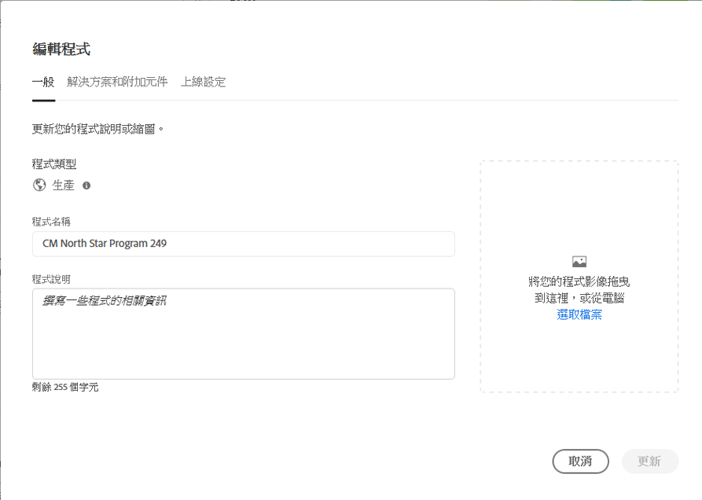

# 編輯計畫 {#editing-programs}

若要管理和編輯程式，請從&#x200B;[**我的程式**&#x200B;主控台](/help/implementing/cloud-manager/navigation.md)開始。 「**我的程式**」頁面提供您有權存取之所有程式的概觀。 選取個別方案時，**方案總覽**&#x200B;頁面會提供方案的詳細資訊。

從&#x200B;**計畫總覽**，具有必要許可權的使用者可以編輯在您組織中建立的[生產計畫](creating-production-programs.md)以及在您的組織中建立的[沙箱計畫](creating-sandbox-programs.md)。 透過編輯方案，您可以：

* 將 Sites 解決方案新增到有 Assets 現有方案中，反之亦然。
* 從包含 Sites 和 Assets 的現有計畫中移除 Sites 或 Assets。
* 將未使用的解決方案權利新增到現有計畫或建立新計畫。
* 刪除沙箱計畫。

## 權限 {#permissions}

您必須擁有&#x200B;**業務負責人**&#x200B;角色才能編輯計畫、刪除沙箱計畫和存取授權儀表板。

## 編輯方案 {#editing}

只要編輯計畫 (包括新增或移除解決方案或附加元件)，這些變更就會在下次部署後生效。

**若要編輯程式：**

1. 在 [my.cloudmanager.adobe.com](https://my.cloudmanager.adobe.com/) 登入 Cloud Manager 並選取適當的組織。

1. 在&#x200B;**[我的程式](#my-programs)**&#x200B;頁面上，按一下您要編輯的程式，以顯示其詳細資料。

1. 按一下頁面左上角的計畫名稱，然後選擇&#x200B;**編輯計畫**。

   

1. **編輯程式**&#x200B;頁面會開啟至&#x200B;**一般**&#x200B;標籤。

   

1. 可用來編輯程式的選項與用來建立程式的選項相同。
   * 如需個別選項的詳細資訊，請參閱[建立生產計畫](/help/implementing/cloud-manager/getting-access-to-aem-in-cloud/creating-production-programs.md)和[建立沙箱計畫](/help/implementing/cloud-manager/getting-access-to-aem-in-cloud/creating-sandbox-programs.md)。
   * 根據您組織的權益，您的生產計畫可能有[其他選項](/help/implementing/cloud-manager/getting-access-to-aem-in-cloud/creating-production-programs.md#options)可用。

1. 按一下「**更新**」，儲存計畫的變更。

## 刪除沙箱計畫 {#delete-sandbox-program}

刪除沙箱計畫會移除與其關聯的所有環境和管道。

>[!TIP]
>
>具有&#x200B;**業務負責人**&#x200B;或&#x200B;**部署管理員**&#x200B;角色也可以刪除其生產和中繼環境，而非整個沙箱計畫。

**若要刪除沙箱程式：**

1. 在 [my.cloudmanager.adobe.com](https://my.cloudmanager.adobe.com/) 登入 Cloud Manager 並選取適當的組織。

1. 在&#x200B;**[我的程式](#my-programs)**&#x200B;頁面上，按一下您要編輯的程式，以顯示其詳細資料。

1. 按一下頁面左上角的程式名稱，然後選取&#x200B;**刪除程式**。

   

或者，您可以從Cloud Manager概觀頁面按一下計畫卡上的，然後選取&#x200B;**刪除計畫**。

>[!NOTE]
>
>只能刪除沙箱計畫。不能刪除生產計畫。
