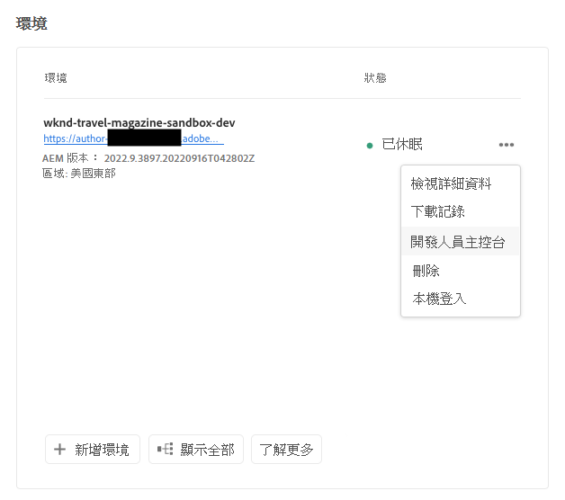

# 冬眠和冬眠沙盒環境 {#hibernating-introduction}

沙盒程式的環境在八小時內未檢測到任何活動時進入休眠模式。休眠是沙盒程式環境所獨有的。 生產程式環境不休眠。

## 冬眠 {#hibernation-introduction}

休眠可以自動或手動進行。

* **自動**  — 沙盒程式環境在不活動8小時後自動休眠。 不活動定義為作者服務或預覽或發佈服務均未接收請求。
* **手動**  — 作為用戶，您可以手動休眠沙盒程式環境。 無需執行此操作，因為休眠將如前所述自動發生。

沙盒程式環境進入休眠模式可能需要幾分鐘時間。 資料在休眠期間被保留。

### 使用手動休眠 {#using-manual-hibernation}

您可以從開發人員控制台手動休眠沙盒程式。 Cloud Manager的任何用戶都可以訪問沙盒程式的開發人員控制台。

按照以下步驟手動休眠沙盒程式環境。

1. 登錄到Cloud Manager(位於 [my.cloudmanager.adobe.com](https://my.cloudmanager.adobe.com/) 並選擇相應的組織。

1. 按一下要休眠的程式以顯示其詳細資訊。

1. 在 **環境** 卡，按一下省略號按鈕並選擇 **開發人員控制台**。

   * 請參閱文檔 [訪問開發人員控制台](/help/implementing/cloud-manager/manage-environments.md#accessing-developer-console) 有關Developer Console的其他詳細資訊。

   

1. 在「Developer Console（開發人員控制台）」中，按一下 **休眠**。

   

1. 按一下 **休眠** 確認步驟。

   

休眠成功後，您將在中看到您的環境的休眠進程完成通知 **開發人員控制台** 的上界。

在「開發人員控制台」中，您還可以按一下 **環境** 連結在上面的麵包屑中 **莢** 下拉清單，查看要休眠的環境清單。

## 脫休眠 {#de-hibernation-introduction}

您可以從開發人員控制台手動休眠沙盒程式。

>[!IMPORTANT]
>
>具有 **開發人員** 角色可以解除沙盒程式環境的休眠。

1. 登錄到Cloud Manager(位於 [my.cloudmanager.adobe.com](https://my.cloudmanager.adobe.com/) 並選擇相應的組織。

1. 按一下要休眠的程式以顯示其詳細資訊。

1. 在 **環境** 卡，按一下省略號按鈕並選擇 **開發人員控制台**。

   * 請參閱文檔 [訪問開發人員控制台](/help/implementing/cloud-manager/manage-environments.md#accessing-developer-console) 有關Developer Console的其他詳細資訊。

1. 按一下 **去休眠**。

   

1. 按一下 **去休眠** 確認步驟。

   

1. 您會收到通知，通知已啟動解除休眠進程並且已隨進程更新。

   

1. 進程完成後，沙盒程式環境將再次處於活動狀態。

   

在「開發人員控制台」中，您還可以按一下 **環境** 連結在上面的麵包屑中 **莢** 下拉清單，查看要解除休眠的環境清單。

### 對De-Hibernate的權限 {#permissions-de-hibernate}

任何具有產品配置檔案(允許其訪問AEMas a Cloud Service)的用戶都應能夠訪問 **開發人員控制台**，允許他們去休眠環境。

## 訪問休眠環境 {#accessing-hibernated-environment}

當對休眠環境的作者、預覽或發佈服務發出任何瀏覽器請求時，用戶將遇到一個登錄頁，其中描述了該環境的休眠狀態以及指向開發人員控制台的連結，在該控制台中可以取消休眠服務。

## 部署和更AEM新 {#deployments-updates}

休眠環境仍允許部署和手動AEM升級。

* 用戶可以使用管道將自定義代碼部署到休眠環境。 該環境將保持休眠狀態，並且一旦脫除休眠狀態，新代碼將出現在該環境中。

* 升AEM級可應用於休眠環境，並可從Cloud Manager手動觸發。 環境將保持休眠狀態，新版本將在脫除休眠狀態後出現在環境中。

## 休眠和刪除 {#hibernation-deletion}

* 沙盒程式中的環境在不活動8小時後自動休眠。
   * 不活動定義為作者服務或預覽或發佈服務均未接收請求。
   * 冬眠後，可以手動去冬眠。
* 沙盒程式在進入連續休眠模式六個月後被刪除，之後可以重新建立它們。
