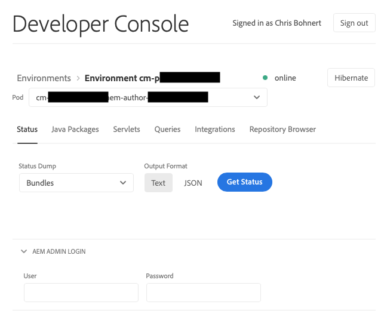

# 休眠和去休眠沙箱環境 {#hibernating-introduction}

如果八小時內未檢測到任何活動，沙箱程式的環境將進入休眠模式。 休眠是沙箱計畫環境所特有的。 生產計畫環境無法休眠。

## 休眠 {#hibernation-introduction}

休眠可以自動或手動發生。

* **自動的**- 沙箱計畫環境在八小時不活動後自動休眠。閒置是指沒有向作者、預覽和發佈服務發出要求。
* **手動**- 作為使用者，您可以手動休眠沙箱計畫環境。不需要這樣做，因為如前所述，休眠會自動發生。

沙箱計畫環境最多可能需要幾分鐘才能進入休眠模式。資料在休眠期間被保留。

### 手動休眠沙箱計畫環境 {#using-manual-hibernation}

您可以從 Developer Console 手動休眠您的沙箱計畫。Cloud Manager的任何使用者都可以存取沙箱程式的Developer Console。

**手動休眠沙箱計畫環境：**

1. 在 [my.cloudmanager.adobe.com](https://my.cloudmanager.adobe.com/) 登入 Cloud Manager 並選取適當的組織。

1. 在&#x200B;**[我的程式](/help/implementing/cloud-manager/navigation.md#my-programs)**&#x200B;主控台上，按一下您要休眠的&#x200B;*沙箱程式*&#x200B;以顯示其詳細資料。

1. 在&#x200B;**環境**&#x200B;卡片上，按一下，然後按一下&#x200B;**Developer Console**。

   * 如需 Developer Console 的更多詳細資訊，請參閱[存取 Developer Console &#x200B;](/help/implementing/cloud-manager/manage-environments.md#accessing-developer-console)。

   

1. 在&#x200B;**Developer Console**&#x200B;頁面上按一下&#x200B;**休眠**。

<!-- UPDATE THESE SCREENSHOTS WHEN NEW AEM DEVELOPER CONSOLE UI IS RELEASED. AS OF OCTOBER 14, 2024, NEW UI IS STILL IN PRIVATE BETA -->

1. 按一下&#x200B;**休眠**&#x200B;以確認步驟。

   

休眠成功後，您會在&#x200B;**Developer Console**&#x200B;畫面中看到您環境的休眠程式完成通知。

在Developer Console中，按一下&#x200B;**Pod**&#x200B;下拉式清單上方的階層連結中的&#x200B;**環境**&#x200B;連結，以檢視可供休眠的環境。

## 手動從Developer Console解除沙箱計畫休眠 {#de-hibernation-introduction}

您可以從Developer Console手動休眠沙箱計畫。

>[!IMPORTANT]
>
>一個使用者&#x200B;**開發人員**&#x200B;角色可以解除沙箱計畫環境的休眠。

**若要手動從Developer Console解除沙箱方案的休眠：**

1. 在 [my.cloudmanager.adobe.com](https://my.cloudmanager.adobe.com/) 登入 Cloud Manager 並選取適當的組織。

1. 在&#x200B;**[我的程式](/help/implementing/cloud-manager/navigation.md#my-programs)**&#x200B;主控台上，按一下您要解除休眠的程式以顯示其詳細資料。

1. 在&#x200B;**環境**&#x200B;卡片上，按一下，然後按一下&#x200B;**Developer Console**。

   * 如需 Developer Console 的更多詳細資訊，請參閱[存取 Developer Console &#x200B;](/help/implementing/cloud-manager/manage-environments.md#accessing-developer-console)。

1. 按一下&#x200B;**解除休眠**。

   

1. 按一下&#x200B;**取消休眠**&#x200B;以確認步驟。

   

1. 您會收到解除休眠過程已開始並隨進度更新的通知。

   

1. 該過程完成後，沙箱計畫環境將再次處於活動狀態。

   

在Developer Console中，按一下&#x200B;**Pod**&#x200B;下拉式清單上方的階層連結中的&#x200B;**環境**&#x200B;連結，以存取可用於解除休眠的環境。

### 解除休眠的許可權 {#permissions-de-hibernate}

任何擁有可以存取 AEM as a Cloud Service 產品設定檔的使用者，都應該能夠存取&#x200B;**Developer Console**，以可讓他們解除環境休眠。

## 存取休眠環境 {#accessing-hibernated-environment}

當使用者向休眠環境的作者、預覽或發佈服務發出瀏覽器請求時，他們會遇到登陸頁面。 此頁面說明環境的休眠狀態，並提供用於解除休眠的Developer Console連結。

## 部署和AEM更新 {#deployments-updates}

休眠環境仍允許部署和手動 AEM 升級。

* 使用者可以使用管道將自訂程式碼部署到休眠環境。環境會保持休眠狀態，一旦解除休眠，新計畫碼就會出現在環境中。

* AEM 升級可應用於休眠環境，並可從 Cloud Manager 手動觸發。環境會保持休眠狀態，一旦解除休眠，新版本就會出現在環境中。

## 休眠和刪除 {#hibernation-deletion}

* 沙箱計畫內的環境在八小時不活動後自動休眠。
   * 閒置是指沒有向作者、預覽和發佈服務發出要求。
   * 一旦休眠，它們可以[手動解除休眠](#de-hibernation-introduction)。
* 沙箱程式在處於連續休眠模式六個月後被刪除，之後可以重新建立它們。

>[!NOTE]
>
>只有沙箱環境會在連續休眠六個月後自動刪除。保留沙箱程式及其存放庫和程式碼。
