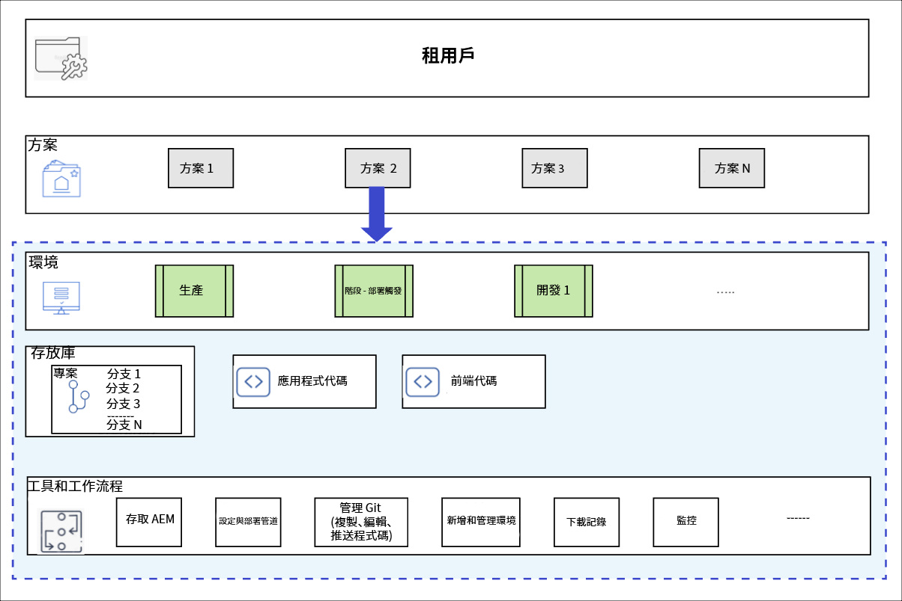

# 方案和方案類型 {#understanding-programs}

Cloud Manager是以實體階層為基礎而建置。 這些詳細資訊對於您在Cloud Manager中的日常工作並不重要，但概述這些資訊將有助於您了解計畫並設定自己的計畫。



* **租用戶**  — 這是階層的頂端。 每個客戶都布建了租用戶。
* **計畫。**  — 每個租戶都有一或多個方案， [這通常反映客戶的授權解決方案。](introduction-production-programs.md)
* **環境**  — 每個方案有多個環境，例如針對即時內容的生產、一個用於測試，以及一個用於開發用途。
   * 每個程式只能有一個生產環境，但有多個非生產環境。
* **存放庫**  — 程式具有Git存放庫，可為環境維護應用程式和前端程式碼。
* **工具與工作流程**  — 管道管理從儲存庫到環境的代碼部署，而其他工具則允許訪問日誌、監視和環境管理。

範例通常有助於將此階層與情境結合。

* WKND Travel and Adventure Enterprises可能是 **用戶** 以旅行相關媒體為主。
* WKND Travel and Adventure Enterprises租戶可能有兩個 **方案**:WKND雜誌的一個網站計畫和WKND媒體的一個資產計畫。
* WKND雜誌和WKND Media節目都有開發、預備和製作 **環境**.

## 原始碼存放庫 {#source-code-repository}

Cloud Manager計畫會自動布建其專屬的Git存放庫。

若要存取Cloud Manager Git存放庫，使用者需使用Git用戶端及命令列工具、獨立的視覺化Git用戶端，或使用者選擇的IDE，例如Eclipse、IntelliJ或NetBeans。

設定Git用戶端後，您就可以從Cloud Manager UI管理Git存放庫。 若要了解如何使用Cloud Manager UI管理Git，請參閱本檔案 [存取Git。](/help/implementing/cloud-manager/managing-code/accessing-repos.md)

若要開始開發AEM雲端應用程式，必須從Cloud Manager存放庫簽出應用程式程式碼的本機副本，並存放至本機電腦上的某個位置。

```java
$ git clone {URL}
```

因此，工作流程是標準的Git工作流程。

1. 使用者可複製Git存放庫的本機副本。
1. 使用者會在本機程式碼存放庫中進行變更。
1. 準備就緒後，使用者會將變更提交回遠端Git存放庫。

唯一的差異在於，遠端的Git存放庫屬於Cloud Manager的一部分，對開發人員而言是透明的。

## 方案類型 {#program-types}

使用者可以建立 **生產** 方案或 **沙箱** 程式。

* A **生產計畫** 是為啟用網站的即時流量而建立的。
   * 請參閱該文檔 [生產計畫簡介](/help/implementing/cloud-manager/getting-access-to-aem-in-cloud/introduction-production-programs.md) 以取得更多詳細資訊。
* A **沙箱方案** 通常建立的目的是提供培訓、運行演示、培訓、POC或文檔。
   * 沙箱環境不能承載即時流量，且會有生產計畫不能的限制。
   * 其中包含Sites和Assets，且會透過Git分支自動填入，分支中包含范常式式碼、開發環境及非生產管道。
   * 請參閱該文檔 [沙箱方案簡介](/help/implementing/cloud-manager/getting-access-to-aem-in-cloud/introduction-sandbox-programs.md) 以取得更多詳細資訊。
