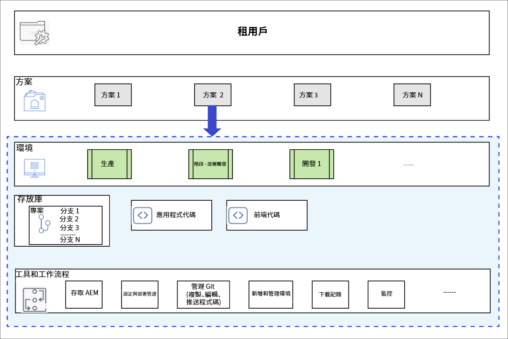

# 了解方案和方案類型 {#understanding-programs}

在Cloud Manager中，最上方是「租用戶」實體，其中可包含多個方案。 每個方案只能包含一個以上的生產環境以及多個非生產環境。

下圖顯示Cloud Manager中的實體階層。



## 原始碼存放庫 {#source-code-repository}

Cloud Manager程式會自動布建並隨附自己的Git存放庫。

若要讓使用者存取Cloud Manager Git存放庫，使用者需使用Git用戶端及命令列工具、獨立的視覺化Git用戶端，或使用者的IDE（例如Eclipse、IntelliJ、NetBeans）。

設定Git用戶端後，您就可以從Cloud Manager UI管理Git存放庫。 若要了解如何使用Cloud Manager UI管理Git，請參閱[存取Git](/help/implementing/cloud-manager/managing-code/accessing-repos.md)。

若要開始開發AEM雲端應用程式，必須從Cloud Manager存放庫簽出應用程式程式碼的本機副本，並存放至其本機電腦上要建立存放庫的位置。

```java
$ git clone {URL}
```

>[!NOTE]
>使用者可以簽出其程式碼的復本，並在本機程式碼存放庫中進行變更。 準備就緒後，使用者可將其程式碼變更提交回Cloud Manager的遠端程式碼存放庫。

## 方案類型 {#program-types}

使用者可以建立&#x200B;**沙箱**&#x200B;或&#x200B;**生產**&#x200B;程式。

* 建立&#x200B;*生產程式*以在將來的適當時間啟用即時流量。
如需詳細資訊，請參閱生產計畫簡介。


* *沙箱方案*通常建立以用於培訓、執行示範、啟用、POC或檔案。 其用途不是攜帶即時流量，且生產計畫不會受到限制。 其中包含Sites和Assets，且會透過Git分支自動填入，該分支包含范常式式碼、開發環境及非生產管道。
如需詳細資訊，請參閱沙箱方案簡介。
